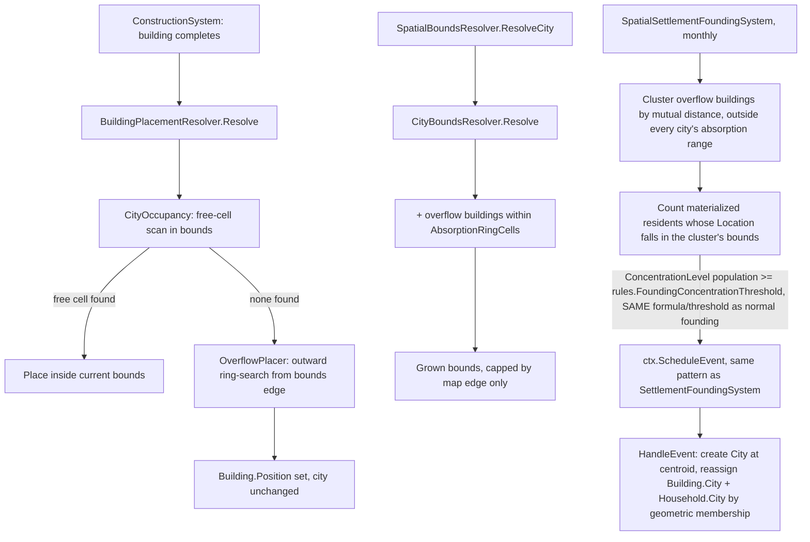

# Dynamic City Growth Design

**Spec**: `.specs/features/dynamic-city-growth/spec.md`
**Status**: Approved

---

## Architecture Overview

Occupancy is always **derived on-demand** from `WorldState.Buildings` + the existing
`BuildingFootprintGenerator` — no new persisted grid, matching the codebase's existing
"bounds/position are computed, never stored" convention (`City.cs`'s own doc comments,
`CityBoundsResolver`). Two independent extension points hang off that:



---

## Approach Considered

| Approach | Trade-off |
| -------- | --------- |
| **On-demand occupancy derive (chosen, user-confirmed)** | No new stored state, cheap at current city-size caps (≤ map/2 side); recomputed every placement, matches `CityBoundsResolver`'s existing "always derived" philosophy. |
| Cached per-city occupancy grid | Faster at large scale, but introduces stored state that must stay in sync with `world.Buildings` — a drift failure mode the codebase doesn't have anywhere else today. Rejected. |

---

## Code Reuse Analysis

### Existing Components to Leverage

| Component | Location | How to Use |
| --------- | -------- | ---------- |
| `BuildingFootprintGenerator` | `src/LivingWorld.Domain/Cities/*` (used today by `SpatialBoundsResolver.ResolveBuilding`) | Reused as-is to compute each existing building's occupied cells for the free-cell scan. |
| `BuildingPlacementResolver.Resolve` | `src/LivingWorld.Domain/Cities/BuildingPlacementResolver.cs` | Extended: consults the new `CityOccupancy` scan before falling back to hash-ring; hash-ring order becomes the deterministic scan/search order (no new randomness introduced). |
| `CityBoundsResolver.Resolve` / `SpatialBoundsResolver.ResolveCity` | `src/LivingWorld.Domain/Cities/CityBoundsResolver.cs` | Extended to union the population-derived box with the bounding box of the city's own overflow buildings within `AbsorptionRingCells`, still capped by the existing hard map-edge limit (`MaxSize` population cap no longer applies once overflow buildings are present). |
| `SettlementFoundingSystem` event-scheduling pattern | `src/LivingWorld.Simulation/Cities/SettlementFoundingSystem.cs` | Same `ctx.ScheduleEvent` / `HandleEvent` / monthly `ISimulationSystem` shape reused for the new spatial trigger — not modified, a sibling system alongside it. |
| `NpcScopeResolver` geometric-membership pattern (`bounds.Contains(location)`) | `src/LivingWorld.Domain/Cities/NpcScopeResolver.cs` | Same technique reused to reassign `Household.City`/`Npc.City` after a new city founds from a building cluster — no new building→household mapping needed. |
| `StableHash.Mix` deterministic ordering | `src/LivingWorld.Domain/*` (used by `BuildingPlacementResolver.DerivedPosition`) | Reused for tie-breaking when multiple free cells/candidates are equally near. |

### Integration Points

| System | Integration Method |
| ------ | ------------------- |
| `ConstructionSystem` (T10, in-flight sibling task) | No direct coupling — T10 decides *whether/when* a building is queued; this feature only changes what `BuildingPlacementResolver.Resolve` returns once a building exists. Orthogonal, confirmed in spec Assumptions. |
| `CityRules` | Gains two new fields: `AbsorptionRingCells` (default 3) and `FoundingOverflowBuildingCount` (value TBD below). Same validation pattern as existing threshold fields (`FoundingConcentrationThreshold` etc., validated in `PeriodDefinitionValidator`/`CityRules.Create`). |
| Visual/API layer (`LivingScopeState.cs`, `BuildingVisual`) | No change needed — buildings already carry `Position`; the already-shipped frontend fix (separate bugfix session) renders whatever position the domain resolves, inside or outside current bounds. |
| `MigrationSystem.ScoreOf` (existing, `src/LivingWorld.Simulation/Cities/MigrationSystem.cs`) | New "land scarcity" term added to the existing weighted score alongside employment/food/security/family-ties — no new decision point, no synchronous call from `BuildingPlacementResolver`; land scarcity is just read by `MigrationSystem`'s own next daily tick, same as every other factor it already weighs. |

---

## Components

### `CityOccupancy` (new)

- **Purpose**: Given a city and its currently-resolved bounds, answer "is this candidate footprint free?" by scanning `world.Buildings` filtered by `Building.City`.
- **Location**: `src/LivingWorld.Domain/Cities/CityOccupancy.cs`
- **Interfaces**:
  - `static bool IsFree(WorldState world, City city, IReadOnlyList<CellCoord> candidateFootprint): bool` — true if no existing building's footprint (via `BuildingFootprintGenerator`) in the same city overlaps any cell of the candidate.
  - `static CellCoord? FindFreeCellInBounds(WorldState world, City city, CityBounds bounds, IReadOnlyList<CellCoord> footprintShape): CellCoord?` — scans bounds in the existing deterministic hash-ring order, returns the first origin whose footprint is free, or `null` if none.
- **Dependencies**: `WorldState.Buildings`, `BuildingFootprintGenerator`.
- **Reuses**: `BuildingFootprintGenerator` (footprint shape/overlap math already exists).

### `OverflowPlacer` (new)

- **Purpose**: When `CityOccupancy.FindFreeCellInBounds` returns `null`, ring-search outward from the city bounds edge (not the center) for the nearest free cell.
- **Location**: `src/LivingWorld.Domain/Cities/OverflowPlacer.cs`
- **Interfaces**:
  - `static CellCoord ResolveOverflowPosition(WorldState world, City city, CityBounds bounds, BuildingId id, IReadOnlyList<CellCoord> footprintShape): CellCoord` — increasing-radius ring search starting at `bounds` edge, deterministic angle order seeded by `StableHash.Mix(id.Value)` (same style as today's `DerivedPosition`), first free cell (via `CityOccupancy.IsFree`) wins. Search radius is unbounded in practice but yields to the Edge Case fallback (see below) if the whole map is exhausted.
- **Dependencies**: `CityOccupancy`, `StableHash`.
- **Reuses**: `BuildingPlacementResolver.DerivedPosition`'s hashing approach, generalized to a growing radius instead of a fixed one.

### `BuildingPlacementResolver.Resolve` (extended, existing file)

- **Purpose**: Same public contract, new internal decision: try inside-bounds free cell first, fall back to `OverflowPlacer`.
- **Interfaces** (unchanged signature): `static (CellCoord Position, int Orientation, bool IsDerived) Resolve(Building building, City city)` — needs `WorldState` and resolved `CityBounds` added as parameters (breaking change to the signature; all call sites updated — see Risks).
- **Reuses**: `CityOccupancy`, `OverflowPlacer`.

### `CityBoundsResolver.Resolve` (extended, existing file)

- **Purpose**: Bounds = population-derived box **∪** bounding box of the city's own buildings positioned within `AbsorptionRingCells` of the population-derived box's edge, both still capped by the existing hard map-edge limit. The population-only `MaxSize=12` cap stops applying once overflow buildings push growth past it (map-edge cap is the only remaining ceiling).
- **Interfaces**: `Resolve` gains a `WorldState world` (or `IReadOnlyList<Building> cityBuildings`) parameter to inspect overflow buildings; same return shape `(CityBounds, bool IsDerived)`.
- **Reuses**: Existing `SideFor`/map-limit math for the population-derived half of the union.

### `SpatialSettlementFoundingSystem` (new, sibling to `SettlementFoundingSystem`)

- **Purpose**: Monthly tick — cluster a city's overflow buildings (mutual distance ≤
  `AbsorptionRingCells`) that sit outside every existing city's absorption range, then gate
  founding on the **same real-society bar a normal city already needs**, not a raw building
  count. A handful of houses is not a society (user's explicit correction) — a lone building or a
  single resident never founds anything, exactly like today a single materialized NPC alone
  doesn't found a city.
  - Compute the cluster's own population: count of materialized `Npc` (alive, real identity, not
    aggregate pool) whose `Location` falls within the cluster's bounding box.
  - Reuse `SettlementFoundingSystem`'s **exact same formula and threshold** —
    `ConcentrationLevel = population / (population + 1)` compared against
    `rules.FoundingConcentrationThreshold` — computed over the cluster's population instead of an
    existing city's. No second, weaker, building-count-based threshold invented; a spatial cluster
    has to clear the identical bar a normal settlement does before it's eligible.
  - A cluster with buildings but no (or too few) actual residents living in them never triggers —
    matches "1 house doesn't make a city, 1 person doesn't make a city, a society does."
  - When eligible, schedule a founding event (same `ctx.ScheduleEvent`/`OrganizationTicks` delay/
    monthly cadence as `SettlementFoundingSystem` — the existing system doesn't found instantly
    either, it schedules and waits), guarded by a new `Building.ClusterFoundingScheduledAtTick`
    marker (mirrors `City.FoundingScheduledAtTick`) on every building in the captured cluster, set
    at schedule time so the same cluster is never scheduled twice.
- **Location**: `src/LivingWorld.Simulation/Cities/SpatialSettlementFoundingSystem.cs`
- **Interfaces**: `ISimulationSystem.Tick` / `.HandleEvent`, same shape as `SettlementFoundingSystem`.
- **HandleEvent behavior**: re-verifies the concentration threshold still holds at fire time (the
  cluster could have thinned out during the `OrganizationTicks` wait — if it no longer clears the
  bar, the founding is silently dropped instead of forcing a now-unjustified city into existence);
  otherwise creates a new `City` at the cluster's centroid (reusing `CityNameGenerator`,
  `world.NextCityId()` — same as `SettlementFoundingSystem.HandleEvent`, no pool to extract here
  since these are already-materialized buildings/households, not aggregate pool); reassigns
  `Building.City` for every building in the captured cluster payload; reassigns `Household.City`
  (and cascades to member `Npc.City` via existing `JoinCity`) for every household whose `Location`
  falls inside the new city's initial resolved bounds — same geometric-membership technique as
  `NpcScopeResolver.Resolve`, no new building↔household link needed.
- **Dependencies**: `CityRules.FoundingConcentrationThreshold` (reused, not duplicated), `CityRules.AbsorptionRingCells`, a centroid calc (same idea as `FoundingSitePicker`), `CityNameGenerator`.
- **Reuses**: `SettlementFoundingSystem`'s scheduling pattern AND its concentration threshold/formula; `NpcScopeResolver`'s geometric-membership pattern; `CityNameGenerator`.

### `CityOccupancy.IsLandScarce` (new interface on the existing `CityOccupancy` component)

- **Purpose**: Pure derived check — true when `OverflowPlacer`'s ring search would exhaust the
  entire map (no free cell anywhere reachable) for a given city. Feeds `MigrationSystem.ScoreOf`'s
  new land-scarcity term; never called synchronously from placement itself (placement just leaves
  the building unresolved for that tick when this is true and there's nowhere to migrate to).
- **Interfaces**: `static bool IsLandScarce(WorldState world, City city, IReadOnlyList<CellCoord> footprintShape): bool`
- **Reuses**: Same free-cell scan as `CityOccupancy.FindFreeCellInBounds`/`OverflowPlacer`, just bounded to the whole map instead of city bounds.

### `CityRules` (extended, existing file)

- New field: `int AbsorptionRingCells = 3`. `FoundingConcentrationThreshold` (existing field) is
  reused as-is for the spatial trigger — no second, parallel threshold added.
- Validated the same way existing threshold fields are (range/positivity check in whatever validator already guards `CityRules.Create`/`PeriodDefinitionValidator`).

---

## Data Models

```csharp
// CityRules — one new field; FoundingConcentrationThreshold (existing) is reused, not duplicated.
public sealed record CityRules(
    // ...existing fields, including FoundingConcentrationThreshold...
    int AbsorptionRingCells = 3
);

// Building — one new nullable marker, same shape as City.FoundingScheduledAtTick
public sealed class Building(...)
{
    // ...existing fields...
    public long? ClusterFoundingScheduledAtTick { get; private set; }
    public void MarkClusterFoundingScheduled(long tick) => ClusterFoundingScheduledAtTick = tick;
}
```

**Relationships**: `Building.City` unchanged in shape (still a `CityId`), just reassignable post-founding. No new relationship types — reuses `CityId`/`CellCoord`/`BuildingId` as everywhere else.

---

## Error Handling Strategy

| Error Scenario | Handling | User Impact |
| --------------- | -------- | ------------ |
| Whole map has no free cell reachable by the ring search (fully built world) | No queue. Treated as real land scarcity, fed into the **existing** `MigrationSystem` daily scoring instead of a new mechanism: `MigrationSystem.ScoreOf` already computes a "stay in current city" score vs. every other city's score (employment/food/security/family-ties weights, see file header). When a city has zero free cells anywhere on the map, its own "stay" score for every household there is forced to the theoretical minimum (below any other city's, using the same score scale already in place) — the household's *existing* daily migration decision naturally picks a candidate city over staying, no new decision point invented. If `world.Cities.Count < 2` (nowhere to go), `MigrationSystem.Tick` already no-ops (see its guard clause) — the household stays and the building placement simply stays unresolved for that tick, retried automatically next time a building needs placing (no persisted queue, no special-cased retry logic — same "try again next call" nature as `BuildingPlacementResolver.Resolve` already has today for every building). | Household relocates to an existing city with room, exactly like any other migration — no visible new mechanic, no stuck backlog. In the single-city degenerate case (extremely unlikely given bounds caps relative to map size, and not reachable by any current test scenario) the building simply doesn't get placed this tick — a real, honestly-represented "no room anywhere" state, not a silent failure. |
| Overflow cluster equidistant between two cities' absorption ranges | Building always resolves to its own `Building.City`'s absorption range check only — never a foreign city's, per spec Edge Cases. | Deterministic, no ambiguity. |
| Cluster within absorption range of an existing city AND its own resident count already clears the concentration threshold | Absorption check runs first; if true, founding is skipped for that cluster this tick (per spec Edge Cases: absorption takes precedence). | Cluster extends the existing city instead of splitting off — matches spec. |
| Cluster has buildings but few/no materialized residents (1 house, 1 person) | Concentration formula (`population / (population + 1)`) stays below `FoundingConcentrationThreshold` for any small population — same math that already keeps a lone `Npc` from founding a normal city — so founding never schedules. | No premature/instant city; matches "a society founds a city, not a house or a person" (user's explicit correction). |

---

## Risks & Concerns

| Concern | Location | Impact | Mitigation |
| ------- | -------- | ------ | ---------- |
| `BuildingPlacementResolver.Resolve` signature change (needs `WorldState`/bounds) | `src/LivingWorld.Domain/Cities/BuildingPlacementResolver.cs:13` | Breaking change ripples to every call site (`ConstructionSystem`, visual projectors, tests) | Tasks phase enumerates call sites via grep before touching the signature; existing tests already exercise this path (`BuildingFootprintAndPlacementTests.cs`) and will catch missed sites at compile time (C# — not a silent runtime gap). |
| `CityBoundsResolver.Resolve` no longer takes just `(city, population, mapWidth, mapHeight)` | `src/LivingWorld.Domain/Cities/CityBoundsResolver.cs:36` | Same ripple as above — `GlobalProjector.cs`, `LivingScopeState.cs`, `PopulationSeeder` (documented as a consumer of `SideFor`) all call this today | `SideFor` (population-only, no buildings) stays untouched for `PopulationSeeder`'s spread-radius use case; only `Resolve` (the full-bounds call) gains the parameter, limiting the ripple to actual bounds consumers. |
| No existing test coverage for "building placement fails/overlaps" today | `tests/LivingWorld.Tests/Cities/BuildingFootprintAndPlacementTests.cs` (existing) | Overlap bugs in the new occupancy scan could ship undetected without new tests | Tasks phase adds dedicated occupancy/overflow/absorption/founding tests before considering any task done (per Execute's test-derives-from-AC contract). |
| `SpatialSettlementFoundingSystem` and `SettlementFoundingSystem` both run monthly and both call `world.AddCity` | Both files, `src/LivingWorld.Simulation/Cities/*` | Possible double-founding if a city satisfies both triggers in the same month | Independent — each guards its own idempotency marker (`City.FoundingScheduledAtTick` vs new `Building.ClusterFoundingScheduledAtTick` per-building); no shared state to corrupt. Two cities founding in the same month from unrelated triggers is a valid, not-a-bug outcome. |

---

## Tech Decisions

| Decision | Choice | Rationale |
| -------- | ------ | --------- |
| Spatial founding threshold | Reuse `CityRules.FoundingConcentrationThreshold` against the cluster's own materialized-resident count, instead of a new flat building-count constant | User explicitly rejected a raw building/count threshold as too weak — "1 house doesn't found a city, 1 person doesn't found a city, a society does." Reusing the exact formula/threshold a normal city already needs to found means a spatial cluster clears the identical real bar, no second weaker path, and no new magic number to tune. |
| `AbsorptionRingCells` default | 3 | Matches `BuildingPlacementResolver.DerivedRingRadius` (already 3) — same "how far is still basically at the city" intuition already encoded in the codebase, reused rather than inventing a new magnitude. |
| Cluster membership check | Mutual distance ≤ `AbsorptionRingCells` (chain/transitive, not all-pairs) | Cheap (`O(k²)` only within a city's own overflow buildings, which are few by construction — cities that aren't overflowing have zero), avoids requiring every building in a cluster to be within range of every other. |
| No new project-level `AD-NNN` needed yet | Deferred to after Execute | This design doesn't override any existing `active` `AD-NNN`; if `FoundingOverflowBuildingCount`'s default gets contested during real testing, that becomes the `AD-NNN`-worthy decision, not the architecture itself. |
