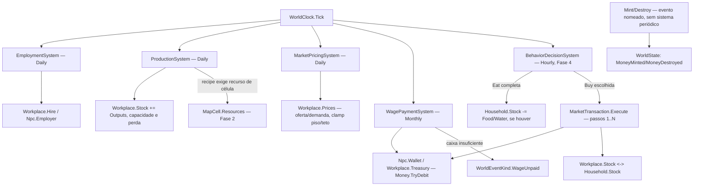

# Fase 5 — Economia — Design

**Spec**: `.specs/features/phase-05-economy/spec.md`
**Context**: `.specs/features/phase-05-economy/context.md`
**Status**: Draft

---

## Approach exploration

**A — `Workplace` como entidade nova única (Domain), mesmo padrão de `Household`/`Npc`; dois
sistemas novos (`ProductionSystem` Daily, `WagePaymentSystem` Monthly) + extensão do
`BehaviorDecisionSystem` existente para `Eat`/`Buy` (recomendado).**
Recursos (`ResourceType`) já existem desde a Fase 2 (`GeographyCatalog.ResourceIds`,
`MapCell.Resources`); `Money` já existe desde a Fase 0 com `TryDebit` atômico. `Workplace`
ganha `Stock`, `Treasury`, `Employees`, mesmo molde de `Household` (lista + coleção em
`WorldState`, `[Canonical]`). Transação de compra/venda é um tipo novo (`MarketTransaction`)
com passos enumerados explicitamente.
*Prós*: reaproveita 100% do padrão canônico/volátil, do sweep referencial (só precisa
registrar `WorkplaceId`) e do hash por reflexão; `Money`/`ResourceType` não são reinventados.
*Contras*: mais um tipo de coleção em `WorldState` (aceitável — mesmo trade-off de
`Households`).

**B — Emprego/produção/preço embutidos em `Household` (tratar casa como também workplace).**
*Rejeitado*: mistura residência (Fase 4, já testada) com negócio; um `Household` sem ninguém
trabalhando ali (a maioria) carregaria campos de produção/estoque de mercado inertes; viola
"uma unidade = um comportamento" (rules/implementation.md) e complica o sweep de integridade
(dois papéis, um tipo).

**C — Estoque/dinheiro como saldo recomputado do event log (nunca guardado em `WorldState`).**
*Rejeitado*: mesmo argumento já usado e rejeitado na Fase 4 (design.md, opção C) —
`time-and-ticks.md` reserva o log para o que é raro/datável; estoque e saldo mudam todo tick
de produção/consumo, recomputar do zero cresceria com o tempo. A Fase 4 já pagou esse
trade-off a favor de estado mutável; ser consistente evita dois modelos de persistência no
mesmo motor.

**Escolha: A.**



---

## Code Reuse Analysis

### Existing Components to Leverage

| Component | Location | How to Use |
| --- | --- | --- |
| `Money` (`TryDebit` atômico, nunca negativo) | `src/LivingWorld.Domain/Money.cs` | Reusado sem alteração para `Npc.Wallet`/`Workplace.Treasury`; `TryDebit` já devolve `Result<Money>` no padrão exigido por ECON-11/22 |
| `ResourceType`/`GeographyCatalog.ResourceIds` | `src/LivingWorld.Domain/Geography/GeographyIds.cs`, `GeographyCatalog.cs` | Catálogo de recursos válidos já existe (Fase 2) — `EconomyCatalog` só acrescenta o que falta (capacidade/perda/recipe), não redeclara ids |
| `MapCell.Resources` | `src/LivingWorld.Domain/Geography/MapCell.cs` | Fonte do recurso natural que uma recipe de produção pode exigir (ECON-08) — sem campo novo de geografia |
| `LocationType`/`PopulationCatalog.LocationTypeIds` | `src/LivingWorld.Domain/Population/PopulationIds.cs`, `PopulationCatalog.cs` | Reusado tal qual para decidir o papel de um `Workplace` (AD-025 já previu isso desde a Fase 3) |
| `Household` (molde de entidade "lista + dono + membros") | `src/LivingWorld.Domain/Population/Household.cs` | Mesmo molde para `Workplace` (`Employees` no lugar de `Members`) |
| `Result<T>` | `src/LivingWorld.Domain/Result.cs` | Toda operação de negócio nova (`Hire`, `MarketTransaction.Execute`, `EconomyRules.Create`) |
| `ISimulationSystem` + `WorldClock` | `src/LivingWorld.Simulation/ISimulationSystem.cs`, `WorldClock.cs` | Quatro sistemas novos (`EmploymentSystem`/`ProductionSystem`/`MarketPricingSystem` Daily, `WagePaymentSystem` Monthly), inseridos depois de `BehaviorDecisionSystem` na lista, nessa ordem (emprego antes de produção — quem contratou hoje já pode produzir no mesmo dia) |
| `ActionCatalog`/`BehaviorDecisionSystem` (Fase 4) | `src/LivingWorld.Domain/Behavior/ActionCatalog.cs`, `src/LivingWorld.Simulation/Behavior/BehaviorDecisionSystem.cs` | `ActionType.Buy` novo entra na mesma validação de `Create` (todas as ações precisam de duração); `ApplyActionEffect(Eat)` ganha a checagem de estoque; `UtilityBaseOf`/`RoutineOf` ganham entrada para `Buy` |
| `WorldRngRegistry`/`ctx.Rng(streamKey)` | `src/LivingWorld.Domain/WorldRngRegistry.cs` | Nenhuma decisão econômica é aleatória nesta fase (produção/preço/salário são determinísticos por fórmula) — não introduz stream novo, exceto se um evento de teste (cunhagem) precisar de sorteio, o que reusa o padrão de chave por sistema/entidade |
| `TickBudgetExceededException` | `src/LivingWorld.Simulation/TickBudgetExceededException.cs` | Não reusado nesta fase — não há laço de convergência iterativa como o de `BehaviorDecisionSystem.ResolveWithStepCap` |
| `ReferentialIntegritySweep.ValidIdResolvers` | `src/LivingWorld.Simulation/ReferentialIntegritySweep.cs` | Ganha entrada para `WorkplaceId` (`w.Workplaces.Select(wp => wp.Id)`) |
| `WorldSnapshot` (hash por reflexão canônico/volátil) | `src/LivingWorld.Simulation/WorldSnapshot.cs` | Nenhuma mudança de mecanismo — só novas propriedades `[Canonical]` em `WorldState` (`Workplaces`, `EconomyRules`, `EconomyCatalog`, `MoneyMinted`, `MoneyDestroyed`) |
| `WorldEvent`/`IWorldEventSink` | `src/LivingWorld.Simulation/WorldEvent.cs` | Novos valores de `WorldEventKind`: `Hired`, `Fired`, `WageUnpaid`, `ResourceLost`, `Minted`, `Destroyed` |
| Padrão base/tratamento (Fase 3) | `docs/roadmap/phase-03-*` (harness já usado por testes de Fase 3/4) | `ScenarioRunner`/harness de teste ganha `ProductionMultiplier` como parâmetro de execução, não como segundo cenário C# |

### Integration Points

| System | Integration Method |
| --- | --- |
| `WorldClock` (Fase 1) | Quatro `ISimulationSystem` novos, registrados depois de `BehaviorDecisionSystem` em `ScenarioRunner.DefaultSystems()`, ordem: `EmploymentSystem` → `ProductionSystem` → `MarketPricingSystem` → `WagePaymentSystem` |
| `WorldState`/`WorldSnapshot` (Fase 3) | Novas propriedades `[Canonical]`: `Workplaces`, `NextWorkplaceId`, `EconomyRules`, `EconomyCatalog`, `MoneyMinted`, `MoneyDestroyed` |
| `ActionCatalog`/`BehaviorDecisionSystem` (Fase 4) | `ActionType.Buy` novo; `ApplyActionEffect(Eat)` ganha checagem de estoque; rotina/utilidade de `Buy` decidida na Design (ver Tech Decisions) |
| `MapCell.Resources`/`GeographyCatalog` (Fase 2) | Consumidos sem alteração por `ProductionSystem` para decidir se uma recipe pode produzir naquela célula |
| `ReferentialIntegritySweep` (Fase 3) | Ganha `WorkplaceId` em `ValidIdResolvers` — sem isso o teste de cobertura reprova sozinho |
| `IWorldEventSink`/`WorldEventKind` (Fase 3) | 6 valores novos de evento (ver acima) |
| Harness de teste base/tratamento (Fase 3) | Extensão para aceitar `ProductionMultiplier` sem duplicar `ScenarioRunner.Create` |

---

## Components

### `Workplace` — `src/LivingWorld.Domain/Economy/Workplace.cs`

- **Purpose**: local de produção/estoque/mercado — cobre casa de trabalho, celeiro, loja,
  mercado, oficina, todos sob o mesmo tipo (AD-043); papel decidido por `LocationType`.
- **Propriedades**: `Id : WorkplaceId`; `LocationType : LocationType`; `Location : CellCoord`;
  `MaxVacancies : int`; `Employees : IReadOnlyList<NpcId>` (privado + `Hire`/`Fire`, mesmo
  molde de `Household.Members`); `Stock : IReadOnlyDictionary<ResourceType,long>` (privado +
  `Deposit`/`Withdraw` com clamp de capacidade); `Treasury : Money`; `Prices :
  IReadOnlyDictionary<ResourceType,long>` (só relevante se `LocationType` estiver em
  `EconomyCatalog.MarketLocationTypeIds` — vazio caso contrário).
- **Métodos**: `Hire(NpcId) : Result<Unit>` (falha se `Employees.Count >= MaxVacancies`);
  `Fire(NpcId)`; `Deposit(ResourceType, long amount, EconomyRules rules) : long` (devolve
  unidades perdidas por excesso de capacidade — ECON-02); `Withdraw(ResourceType, long) :
  Result<long>` (falha se insuficiente); `CreditTreasury(Money)`;
  `TryDebitTreasury(Money) : Result<Money>` (delega a `Money.TryDebit`).
- **Dependencies**: `ResourceType`, `LocationType`, `Money` (Domain, todos já existentes).
- **Reuses**: construtor único de reidratação (mesmo motivo de `Npc`/`Household`);
  `[JsonIgnore]` em qualquer propriedade computada.

### `WorkplaceId` — `src/LivingWorld.Domain/Ids.cs` (extensão do arquivo existente)

- **Purpose**: id determinístico novo (AD-039); `readonly record struct WorkplaceId(long
  Value)`, mesmo molde de `NpcId`/`HouseholdId`. `WorldState.NextWorkplaceIdAndAdvance()`
  emite o próximo valor.

### `EconomyRules` — `src/LivingWorld.Domain/Economy/EconomyRules.cs`

- **Purpose**: todo parâmetro numérico da economia, cenário-driven (R3), mesmo padrão de
  `NeedsRules`.
- **Campos**: `Enabled : bool` (ECON-05 — desligar muda o hash); `FoodResourceId`,
  `WaterResourceId : int` (AD-045); `CapacityByResourceLocation :
  IReadOnlyDictionary<(int ResourceId, int LocationTypeId), long>`; `SpoilagePerDayByResource
  : IReadOnlyDictionary<int, double>`; `WageByProfession : IReadOnlyDictionary<int, long>`;
  `PriceFloor`, `PriceCeiling : IReadOnlyDictionary<int, long>` (por recurso);
  `PriceSensitivity : double`; `DemandBaselinePerNpc : IReadOnlyDictionary<int, double>` (para
  a fórmula de oferta/demanda).
- **`Create`**: `Result<EconomyRules>`, valida faixas (mesmo padrão de
  `NeedsRules.Create`/`ActionCatalog.Create` — reprova nomeando o campo que falta/está fora de
  faixa).

### `EconomyCatalog` — `src/LivingWorld.Domain/Economy/EconomyCatalog.cs`

- **Purpose**: recipe de produção declarada por `LocationType` + quais `LocationType` atuam
  como mercado.
- **Campos**: `Recipes : IReadOnlyDictionary<int LocationTypeId, ProductionRecipe>` (ausência
  de entrada = local sem produção física, ex.: guarda/curandeiro/professor/comerciante —
  ECON-07 não se aplica, produção é sempre 0 por ausência de recipe, não por trabalhador
  ausente); `MarketLocationTypeIds : HashSet<int>`; `LocationTypeByProfession :
  IReadOnlyDictionary<int ProfessionId, int LocationTypeId>` (que `Workplace` aceita qual
  profissão — usado por `EmploymentSystem`; profissão sem entrada nunca é contratada, fica
  desempregada por design de cenário).
- **`ProductionRecipe`** (record): `Inputs : IReadOnlyDictionary<int ResourceId,long>` (por
  trabalhador por ciclo; vazio = sem insumo, ex.: agricultor/lenhador); `Outputs :
  IReadOnlyDictionary<int ResourceId,long>`; `RequiresCellResource : int?` (id do recurso
  natural de célula exigido, `null` = não exige, ECON-08); `MaxWorkersPerCycle : int`.

### `MarketTransaction` — `src/LivingWorld.Domain/Economy/MarketTransaction.cs`

- **Purpose**: transação atômica dinheiro↔recurso com passos enumerados (ECON-09/10/12/13).
- **Interfaces**:
  - `record TransactionStep(string Name, Func<TransactionContext, Result<Unit>> Apply)`.
  - `static IReadOnlyList<TransactionStep> Steps` — array público, ordem fixa: `[1] Debitar
    Money do comprador`, `[2] Debitar recurso do estoque do vendedor`, `[3] Creditar Money ao
    vendedor`, `[4] Creditar recurso ao estoque do comprador` (ordem escolhida para que um
    fracasso de saldo/estoque aconteça o quanto antes — ver Tech Decisions).
  - `static Result<TransactionContext> Execute(TransactionContext ctx, int? failAtStep =
    null)` — aplica `Steps` em ordem sobre uma **cópia** de `TransactionContext` (ver Tech
    Decisions: cópia vs. rollback); se `failAtStep == i`, força `Result.Fail` no passo `i`
    (hook de teste, ECON-12) antes de aplicar; qualquer falha descarta a cópia inteira e
    devolve `Result.Fail`, deixando o mundo real intocado.
- **`TransactionContext`** (record, imutável): `BuyerWallet`, `SellerWallet : Money` (por
  valor — `readonly record struct`); `SellerStock : long`; `BuyerStock : long`; `Resource :
  ResourceType`; `UnitPrice : long`; `Quantity : long`. Como todos os campos são structs
  imutáveis, "aplicar sobre uma cópia" é literalmente construir um novo `TransactionContext` a
  cada passo — nenhuma referência ao `Npc`/`Workplace` real é mutada até o commit final.
- **Dependencies**: `Money`, `ResourceType`, `Result<T>`.
- **Reuses**: `Money.TryDebit` (Fase 0) dentro dos passos 1 e (equivalente) 2.

### `ProductionSystem` — `src/LivingWorld.Simulation/Economy/ProductionSystem.cs`

- **Purpose**: converte trabalho + recipe em saída de estoque por `Workplace` (ECON-06/07/08),
  `Daily` (AD-042).
- **`Tick`**: para cada `Workplace` com recipe declarada em `EconomyCatalog`, conta empregados
  vivos e presentes (`CurrentLocation == Workplace.Location`); se 0, produção 0 (ECON-07); se
  `RequiresCellResource` declarado e a célula não o possui (`MapCell.Resources`), produção 0
  (ECON-08); senão, debita `Inputs × min(trabalhadores, MaxWorkersPerCycle)` do próprio
  estoque (se insuficiente, escala para baixo pelo insumo mais escasso) e credita `Outputs`
  proporcional via `Workplace.Deposit` (que já aplica capacidade/perda, ECON-02) e aplica
  `EconomyRules.SpoilagePerDayByResource` a todo o estoque do `Workplace` no mesmo tick
  (ECON-03).
- **Reuses**: `Workplace.Deposit/Withdraw`, `MapCell.Resources`.

### `EmploymentSystem` — `src/LivingWorld.Simulation/Economy/EmploymentSystem.cs`

- **Purpose**: liga NPC desempregado a `Workplace` com vaga livre (ECON-18/19/20), `Daily`
  (mesma frequência de produção — vagas não precisam reagir por hora).
- **`Tick`**: para cada NPC adulto vivo sem `Employer`, ordenado por `NpcId.Value`, procura o
  primeiro `Workplace` (ordenado por `WorkplaceId.Value`) cujo `LocationType` aceite a
  `Profession` do NPC (mapeamento declarado em `EconomyCatalog`, ex.: profissão 1 → apenas
  `LocationType` de fazenda) **e** tenha vaga livre; sucesso chama `Workplace.Hire` +
  `Npc.Employer = id` + `WorldEventKind.Hired`. NPC cujo `Workplace` deixou de existir ou está
  morto é desligado (`Fire` + `WorldEventKind.Fired`) no mesmo tick, antes de tentar nova
  contratação — nunca um `Npc.Employer` órfão sobrevive um tick inteiro.
- **Reuses**: `Workplace.Hire/Fire`, mesma disciplina de ordenação por id de
  `NatalitySystem`/`Household.RemoveMember`.

### `MarketPricingSystem` — `src/LivingWorld.Simulation/Economy/MarketPricingSystem.cs`

- **Purpose**: recalcula `Workplace.Prices` por oferta/demanda (ECON-23/24), `Daily`.
- **`Tick`**: para cada `Workplace` cujo `LocationType` está em
  `EconomyCatalog.MarketLocationTypeIds`, para cada recurso com preço declarado,
  `novoPreço = clamp(preçoAtual × f(EstoqueOfertado / DemandaEstimada, PriceSensitivity),
  PriceFloor, PriceCeiling)` — `DemandaEstimada` deriva de
  `EconomyRules.DemandBaselinePerNpc × população residente na região` (nunca literal).
- **Reuses**: `EconomyRules` para todos os parâmetros; nenhuma decisão de NPC lida aqui.

### `WagePaymentSystem` — `src/LivingWorld.Simulation/Economy/WagePaymentSystem.cs`

- **Purpose**: paga salário mensal (ECON-21/22), `Monthly`.
- **`Tick`**: para cada `Workplace`, para cada empregado (ordenado por `NpcId.Value`),
  `Workplace.TryDebitTreasury(wage)`; sucesso credita `Npc.Wallet`; falha emite
  `WorldEventKind.WageUnpaid` sem alterar nenhum saldo (ECON-22 — mesmo padrão de
  `Money.TryDebit`).
- **Reuses**: `Workplace.TryDebitTreasury`, `Npc.Wallet` (novo campo, ver abaixo).

### `Npc` (extensão) — `src/LivingWorld.Domain/Population/Npc.cs`

- **Novas propriedades**: `Wallet : Money` (private set, `CreditWallet`/`TryDebitWallet`);
  `Employer : WorkplaceId?` (private set, `Hire`/`Fire` espelhando
  `JoinHousehold`/`LeaveHousehold`).
- **Reuses**: mesmo construtor único de reidratação, `Money.TryDebit`.

### `ActionType` (extensão) — `src/LivingWorld.Domain/Behavior/ActionType.cs`

- **Purpose**: ganha `Buy = 6` (AD-040) — viagem a um `Workplace` de mercado + execução de
  `MarketTransaction`.

### `BehaviorDecisionSystem` (extensão, Fase 4) — `src/LivingWorld.Simulation/Behavior/BehaviorDecisionSystem.cs`

- **Mudanças**: `ApplyActionEffect(Eat)` passa a checar
  `Household.Stock[FoodResourceId]`/`[WaterResourceId]` antes de restaurar
  `Hunger`/`Thirst` (ECON-16/17) — se ausente, a ação completa sem restaurar (nenhuma exceção,
  nenhum clamp fora de faixa); `UtilityBaseOf`/`RoutineOf` ganham entrada para `Buy` (nota
  cresce com o déficit projetado de comida/água do `Household`, mesmo espírito de
  `Deficit(Hunger)`); `RefineForLocation` ganha `Buy` → viaja ao `Workplace` de mercado mais
  próximo, mesmo mecanismo de `Sleep` → `Travel` já existente (NEEDS-14).

### `EconomyScenarioLoader` — `src/LivingWorld.Simulation/Economy/EconomyScenarioLoader.cs`

- **Purpose**: parse de `EconomyRules`/`EconomyCatalog`/`Workplaces` iniciais do JSON de
  cenário — mesmo padrão de `BehaviorScenarioLoader`/`PopulationScenarioLoader`.
- **Reuses**: `Result<T>`, convenção de campo obrigatório nomeado no erro.

### Harness base/tratamento (extensão de teste) — `tests/.../EconomyScenarioHarness.cs` (novo, só em `LivingWorld.Tests`)

- **Purpose**: aceita `ProductionMultiplier` (por `ResourceType`, a partir de um tick `t0`)
  como parâmetro de execução sobre o `ScenarioRunner.Create` existente — nunca um segundo
  cenário C# hardcoded (ECON-28).
- **Reuses**: `ScenarioRunner.DefaultSystems()`/`Create` sem alteração de assinatura pública;
  o multiplicador é aplicado como um wrapper de `ProductionSystem` só usado em teste (decorator
  que escala `Outputs` antes de `Workplace.Deposit`).

---

## Data Models

### `Workplace` (Domain, mutável)
```
Id : WorkplaceId
LocationType : LocationType
Location : CellCoord
MaxVacancies : int
Employees : IReadOnlyList<NpcId>
Stock : IReadOnlyDictionary<ResourceType, long>
Treasury : Money
Prices : IReadOnlyDictionary<ResourceType, long>   // vazio se não é mercado
```

### `EconomyRules` (Domain, cenário)
```
Enabled : bool
FoodResourceId, WaterResourceId : int
CapacityByResourceLocation : IReadOnlyDictionary<(int,int), long>
SpoilagePerDayByResource   : IReadOnlyDictionary<int, double>
WageByProfession           : IReadOnlyDictionary<int, long>
PriceFloor, PriceCeiling   : IReadOnlyDictionary<int, long>
PriceSensitivity           : double
DemandBaselinePerNpc       : IReadOnlyDictionary<int, double>
```

### `EconomyCatalog` (Domain, cenário)
```
Recipes : IReadOnlyDictionary<int, ProductionRecipe>   // key = LocationTypeId
MarketLocationTypeIds : HashSet<int>
```
```
record ProductionRecipe(
    IReadOnlyDictionary<int,long> Inputs,
    IReadOnlyDictionary<int,long> Outputs,
    int? RequiresCellResource,
    int MaxWorkersPerCycle)
```

### `MarketTransaction.TransactionContext` (Domain, imutável)
```
BuyerWallet, SellerWallet : Money
SellerStock, BuyerStock   : long
Resource                  : ResourceType
UnitPrice, Quantity       : long
```

**Relationships**: `Workplace.LocationType` referencia `PopulationCatalog.LocationTypeIds`
(já existente); `EconomyCatalog.Recipes`/`MarketLocationTypeIds` chaveiam pelo mesmo
`LocationTypeId`; `Npc.Employer` referencia `Workplace.Id`; `Workplace`/`EconomyRules`/
`EconomyCatalog` entram em `WorldState` como novas propriedades `[Canonical]`.

---

## Error Handling Strategy

| Error Scenario | Handling | User Impact |
| --- | --- | --- |
| Comprador sem saldo suficiente (`MarketTransaction`) | `Execute` retorna `Result.Fail` no passo do débito; nenhuma cópia é commitada | Estado byte-idêntico ao anterior (ECON-11) |
| Vendedor sem estoque suficiente | Mesmo mecanismo — falha no passo de débito de estoque | Estado byte-idêntico |
| `Workplace` sem caixa para salário | `TryDebitTreasury` falha; `WorldEventKind.WageUnpaid` gravado | Saldo de ninguém muda (ECON-22) |
| Estoque recebido além da capacidade | `Deposit` aplica clamp e devolve unidades perdidas; evento `ResourceLost` gravado | Nunca desaparece do total contábil (ECON-02) |
| Recipe exige recurso de célula ausente | Produção do `Workplace` naquele tick é 0 | Sem exceção, sem produção "de fundo" (ECON-08) |
| `Workplace`/`EconomyRules`/`EconomyCatalog` malformado no cenário | `Create`/`EconomyScenarioLoader` retorna `Result.Fail` nomeando o campo | Carga do cenário falha na borda, nunca em runtime |

---

## Risks & Concerns

| Concern | Location | Impact | Mitigation |
| --- | --- | --- | --- |
| `MarketTransaction.Execute` precisa aplicar 4 efeitos em objetos mutáveis reais (`Npc.Wallet`, `Workplace.Treasury`/`Stock`) sem deixar estado parcial visível se um passo tardio falhar | `src/LivingWorld.Domain/Economy/MarketTransaction.cs` | Se implementado mutando direto os objetos reais passo a passo, uma falha no passo 3/4 deixaria os efeitos 1/2 já aplicados — quebra ECON-09/11/12 | `TransactionContext` imutável (structs) computa o resultado final **antes** de tocar qualquer objeto real; só depois de todos os passos succeederem em memória o commit escreve nos objetos reais em uma única passada — ver Tech Decisions |
| `ProductionSystem`/`MarketPricingSystem`/`WagePaymentSystem` não podem iterar `Dictionary`/`HashSet` para produzir efeito determinístico | `rules/simulation-determinism.md` | Ordem de iteração não determinística quebraria "mesma seed → mesmo hash" | Toda iteração sobre `Workplaces`/`Employees` ordena por `Id.Value` antes de aplicar efeito — mesma disciplina já usada por `NatalitySystem`/`Household.RemoveMember` |
| `ReferentialIntegritySweep` precisa cobrir `WorkplaceId` desde o primeiro commit que o introduz, senão o teste de cobertura (que já existe) passaria a falhar sozinho — é o comportamento esperado, não um risco novo, mas fácil de esquecer na ordem dos commits | `src/LivingWorld.Simulation/ReferentialIntegritySweep.cs` | Cobertura incompleta detectada tarde custaria retrabalho de commit | Tasks.md ordena a entrada do resolver na mesma task que introduz `WorkplaceId` |
| `Npc` já tem ~13 parâmetros de construtor (Fase 4); mais 2 (`Wallet`, `Employer`) aumenta o risco de troca de posição no round-trip do snapshot | `src/LivingWorld.Domain/Population/Npc.cs` | Bug silencioso de parâmetro trocado | `WorldSnapshotTests` (já existente, Fase 3) ganha um caso por campo novo antes de mexer no construtor — mesma mitigação já usada na Fase 4 |

> Nenhuma dívida técnica nova além da extensão natural de `Npc`/`WorldState`, já um padrão
> aceito desde a Fase 3.

---

## Tech Decisions

| Decision | Choice | Rationale |
| --- | --- | --- |
| Atomicidade de `MarketTransaction` | Computa o resultado completo sobre um `TransactionContext` imutável (structs) e só then commita nos objetos reais numa passada final, sem passo intermediário observável | Structs imutáveis tornam "aplicar sobre uma cópia" trivial (nenhuma referência de objeto real é tocada até o fim) — mais simples que rollback compensatório e mais barato que clonar `Npc`/`Workplace` inteiros |
| Ordem dos 4 passos da transação | Débito do comprador → débito do estoque do vendedor → crédito ao vendedor → crédito ao comprador | Falhas de saldo/estoque (os dois casos que o critério de teste explicitamente cobre) acontecem nos dois primeiros passos — o fault-injection hook (ECON-12) cobre também os passos 3/4 (puramente de crédito, que na prática não falham, mas entram na enumeração igual, provando a cobertura por construção) |
| Cunhagem/destruição de dinheiro sem sistema periódico | Só via evento nomeado (chamado por cenário de teste ou por um evento agendado específico, ex.: saque) | Task 10 do roadmap chama isso de "raro" — um sistema `Daily`/`Monthly` rodando sempre para um evento raro violaria "registre na frequência mais barata" e criaria ruído no hash sem necessidade |
| `Buy` como ação do catálogo fechado da Fase 4, em vez de sistema de compra separado | Reusa `BehaviorDecisionSystem`/`ActionCatalog` | Consistente com AD-040; evita um segundo motor de decisão só para "quando comprar" |
| `EconomyRules.Enabled` como flag única que desliga toda a fase | Um bool cobre produção+preço+salário+consumo (a `Buy`/checagem de estoque em `Eat` também respeitam a flag) | ECON-05 exige "desligar a economia muda o hash" — uma única flag central evita ter que desligar 4 flags separadas para o mesmo teste, mesmo padrão de simplicidade de `NeedsRules.HysteresisEnabled` |

> **Project-level**: nenhuma decisão aqui supera constraint ativa em `STATE.md`/
> `docs/decisions-log.md` além das que já viraram `AD-039..AD-045` (documentadas no `spec.md`).
> As decisões desta tabela ficam só localmente na Fase 5.

---

## Tips
- `EconomyRules`/`EconomyCatalog` seguem exatamente o molde de `NeedsRules`/`ActionCatalog` —
  ao implementar, comparar lado a lado evita reinventar a validação.
- O maior risco de execução é a atomicidade da transação — escrever o teste de fault-injection
  (ECON-12/13) **antes** da implementação de `MarketTransaction.Execute` é o jeito mais barato
  de garantir que o commit final realmente não tem passo intermediário observável.
