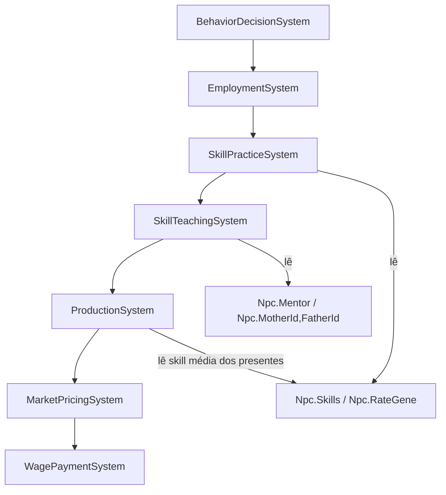

# Fase 6 — Habilidades e Aprendizado — Design

**Spec**: `.specs/features/phase-06-skills/spec.md`
**Status**: Draft

---

## Architecture Overview

Duas responsabilidades separadas, mesma frequência (`Daily`), mesmo espírito de
`ProductionSystem`/`MarketPricingSystem`/`WagePaymentSystem` (um sistema, uma
responsabilidade, ordem documentada em `ScenarioRunner.DefaultSystems()`):

- **`SkillPracticeSystem`** — ganho passivo por trabalhar na própria profissão; único
  ponto que lê `RateGene` e a curva de retornos decrescentes; roda logo depois de
  `EmploymentSystem` e antes de `ProductionSystem` (produção do mesmo dia já lê a
  habilidade atualizada, mesmo raciocínio já documentado de "quem contratou hoje já
  produz hoje").
- **`SkillTeachingSystem`** — as 5 fontes "sociais" do roadmap: treino deliberado, escola,
  aprendizado parental, observação, tutoria mestre→aprendiz. Roda logo depois de
  `SkillPracticeSystem`, ainda antes de `ProductionSystem`.



**Aprovado com o usuário**: opção "2 sistemas: prática + social" (rejeitadas: 1 sistema
único mistura economia com aprendizado social; ganho embutido em hooks existentes
espalharia 6 fontes por vários sistemas sem lugar coeso).

---

## Code Reuse Analysis

### Existing Components to Leverage

| Component | Location | How to Use |
|---|---|---|
| `Personality` (record, `RollFrom(WorldRng)`) | `src/LivingWorld.Domain/Population/Personality.cs` | Padrão espelhado por `RateGene`: roll por stream de RNG próprio do NPC no nascimento, nunca herdado por reflexão. |
| `PersonalityWeighting.WeightOf`/`TraitValueOf` (switch, sem reflexão no hot path) | `src/LivingWorld.Domain/Behavior/PersonalityWeighting.cs` | Mesmo padrão para `SkillSet` (ver Tech Decisions) — acesso por switch, não `Dictionary<SkillType,double>` nem reflexão. |
| `NeedsRules`/`EconomyRules` (record `Create` com `Result<T>`, cenário-driven) | `src/LivingWorld.Domain/Behavior/NeedsRules.cs`, `src/LivingWorld.Domain/Economy/EconomyRules.cs` | `SkillsRules` segue o mesmo formato: `Create` validando faixas, nenhum literal em C# (R3). |
| `ActionCatalog.Create` (catálogo fechado, reprova estaticamente ação sem duração declarada) | `src/LivingWorld.Domain/Behavior/ActionCatalog.cs` | Novos `ActionType` (se necessários — ver Tech Decisions) entram sob a mesma rede de segurança, sem teste de cobertura novo. |
| `Npc.Hire`/`Npc.Fire`/`Npc.JoinHousehold`/`Npc.LeaveHousehold` (mutador simétrico par) | `src/LivingWorld.Domain/Population/Npc.cs:168-184` | `Npc.SwitchProfession(ProfessionType)` segue o mesmo padrão par. |
| `ProductionSystem.Produce` (scale por trabalhador, clamp por insumo escasso) | `src/LivingWorld.Simulation/Economy/ProductionSystem.cs:33-68` | Ganha um fator de habilidade multiplicando `produced` (ver Data Models) — não duplica a lógica de scale/clamp existente. |
| `EconomyCatalog.LocationTypeByProfession` | `src/LivingWorld.Domain/Economy/EconomyCatalog.cs` | Reusado para descobrir qual `Workplace`/profissão o NPC pratica; `SkillsCatalog.SkillByProfession` é o análogo para "qual habilidade essa profissão treina". |
| `WorldRngRegistry` (stream por NPC, derivado uma vez de raiz imutável) | Fase 1 (AD-022) | `RateGene.RollFrom` e qualquer roll de mutação genética usam stream próprio do NPC, nunca a raiz. |

### Integration Points

| System | Integration Method |
|---|---|
| `ScenarioRunner.DefaultSystems()` | Insere `SkillPracticeSystem` e `SkillTeachingSystem` entre `EmploymentSystem` e `ProductionSystem`; comentário de ordem (linhas 18-26) ganha um parágrafo novo. |
| `PopulationSeeder`/`Personality.RollFrom` (criação de NPC) | Ponto onde `Npc.Skills` (valores iniciais do cenário) e `Npc.RateGene` (roll sem pais, ver Assunção A1 da spec) são atribuídos. |
| `NatalitySystem` (nascimento com pais conhecidos) | Ponto onde `RateGene` do recém-nascido é calculado por `geneMãe*0,5 + genePai*0,5 + mutação`, em vez do roll sem pais. |
| `BehaviorDecisionSystem` (escolha de ação/profissão) | Consome `Npc.Skills` + `Personality` (mesmo padrão de `PersonalityWeighting`) para pontuar troca de profissão (SKILL-13). |
| `WorldSnapshot` (canônico/volátil, reflexão) | `Npc.Skills`/`Npc.RateGene`/`Npc.Mentor` são campos novos — o teste gerado por reflexão (ADR-0001) força classificá-los; ambos são canônicos (afetam decisão/produção determinística). |

---

## Components

### `SkillType` (enum)

- **Purpose**: catálogo fechado dos 13 ids do domínio — modelo de decisão do motor, não
  conteúdo de cenário (mesmo motivo de `ActionType`).
- **Location**: `src/LivingWorld.Domain/Population/SkillType.cs`
- **Interfaces**: `enum SkillType { Agriculture, Hunting, Trade, Construction, Medicine, Combat, Teaching, Craft, Politics, Leadership, Research, Technology, Magic }`
- **Dependencies**: nenhuma
- **Reuses**: padrão de `ActionType` (enum com valor estável, comentário `<c>`)

### `SkillSet` (classe imutável de leitura + mutador dedicado)

- **Purpose**: guarda as 13 habilidades de um `Npc`, cada uma `double` em `[0, cap]`.
- **Location**: `src/LivingWorld.Domain/Population/SkillSet.cs`
- **Interfaces**:
  - `double Get(SkillType type)` — leitura por switch (mesmo padrão de `PersonalityWeighting.TraitValueOf`, sem reflexão no hot path)
  - `SkillSet WithGain(SkillType type, double delta, double cap)` — retorna novo `SkillSet` com o valor clampado em `[0, cap]` (imutável, mesmo espírito de `Personality`)
  - `static SkillSet Initial(double startingValue)` — todas as 13 no mesmo valor inicial do cenário
- **Dependencies**: `SkillType`
- **Reuses**: `Personality` como modelo de "conjunto de traços imutável com fábrica validada"

### `RateGene` (record)

- **Purpose**: multiplicador de **taxa** de ganho de habilidade — nunca de valor inicial;
  campo único por NPC (Assunção A1 da spec: modelo simplificado, Fase 7 pode expandir).
- **Location**: `src/LivingWorld.Domain/Population/RateGene.cs`
- **Interfaces**:
  - `record RateGene(double Value)` — `Value > 0`, validado em `Create`
  - `static RateGene RollInitial(WorldRng rng)` — sem pais (população seed inicial), distribuição em torno de 1.0
  - `static RateGene Inherit(RateGene mother, RateGene father, WorldRng rng)` — `mother.Value*0.5 + father.Value*0.5 + mutação`, clampado > 0
- **Dependencies**: `WorldRng`
- **Reuses**: `Personality.RollFrom` (stream próprio do NPC) como padrão de roll determinístico

### `SkillsRules` (record, cenário-driven)

- **Purpose**: parâmetros que hoje seriam literais em C# — teto único (compartilhado pelas
  13 habilidades, task 1 do roadmap), parâmetros da curva de retornos decrescentes,
  taxa-base por fonte de ganho (prática, treino, escola, parental, observação, tutoria).
- **Location**: `src/LivingWorld.Domain/Population/SkillsRules.cs`
- **Interfaces**:
  - `static Result<SkillsRules> Create(double cap, double curveBaseRate, IReadOnlyDictionary<SkillGainSource, double> baseRateBySource, IReadOnlyDictionary<int, SkillType> skillByProfession)`
  - `double Gain(double currentSkill, SkillGainSource source, double rateGene)` — chama a curva pura (ver `SkillCurve`) com `baseRateBySource[source]` e `rateGene` como multiplicador
- **Dependencies**: `SkillType`, `SkillGainSource` (enum das 6 fontes)
- **Reuses**: padrão `NeedsRules.Create`/`EconomyRules.Create` (validação de faixa, `Result<T>`, nenhum literal em C#)

### `SkillCurve` (função pura, sem estado)

- **Purpose**: retornos decrescentes — SKILL-02, testável isolada sem `ScenarioRunner`.
- **Location**: `src/LivingWorld.Domain/Population/SkillCurve.cs`
- **Interfaces**: `static double Gain(double currentSkill, double cap, double baseRate)` →
  `baseRate * (1.0 - currentSkill / cap)`, clampado a `>= 0` (defesa de fronteira do
  Edge Case "nível 0/negativo").
- **Dependencies**: nenhuma — função estática pura, mesma classe de garantia de
  `NeedsRules`/curvas puras já existentes no projeto.
- **Reuses**: nada — é a peça nova mais isolada da fase, de propósito (roadmap task 2 já
  pede isolamento).

### `SkillPracticeSystem` (`ISimulationSystem`, `Daily`)

- **Purpose**: ganho por prática no trabalho — a fonte principal (SKILL-03).
- **Location**: `src/LivingWorld.Simulation/Population/SkillPracticeSystem.cs`
- **Interfaces**: `void Tick(WorldState world, TickContext ctx)` — para cada `Npc` vivo,
  empregado, com `CurrentAction == Work` no dia e presente no `Workplace`: resolve
  `SkillType` via `SkillsRules.SkillByProfession[npc.Profession.Id]`, aplica
  `npc.Skills = npc.Skills.WithGain(type, SkillsRules.Gain(current, Practice, npc.RateGene.Value), cap)`.
- **Dependencies**: `SkillsRules`, `SkillCurve`, `EconomyCatalog.LocationTypeByProfession` (achar o `Workplace`)
- **Reuses**: mesmo padrão de iteração de `ProductionSystem` (`world.Workplaces.OrderBy(w => w.Id.Value)` para determinismo de ordem)

### `SkillTeachingSystem` (`ISimulationSystem`, `Daily`)

- **Purpose**: as 5 fontes sociais — treino deliberado, escola, parental, observação,
  tutoria mestre→aprendiz (SKILL-04..08).
- **Location**: `src/LivingWorld.Simulation/Population/SkillTeachingSystem.cs`
- **Interfaces**: `void Tick(WorldState world, TickContext ctx)` — cinco métodos privados,
  um por fonte, cada um lendo o requisito próprio (tempo+dinheiro para treino; vaga para
  escola — sem prédio, Assunção fora-de-escopo; `MotherId`/`FatherId` para parental;
  `CurrentLocation` compartilhado para observação; `Npc.Mentor` para tutoria).
- **Dependencies**: `SkillsRules`, `SkillCurve`, `Npc.Mentor` (campo novo)
- **Reuses**: mesma convenção de iteração ordenada por `Id.Value` para determinismo

### `Npc` — extensões (mesmo arquivo, `Npc.cs`)

- **Purpose**: novos campos/mutadores para habilidade, gene de taxa, tutoria e troca de
  profissão.
- **Location**: `src/LivingWorld.Domain/Population/Npc.cs`
- **Interfaces**:
  - `SkillSet Skills { get; private set; }`
  - `RateGene RateGene { get; }` (imutável após nascimento, mesmo padrão de `Personality`)
  - `NpcId? Mentor { get; private set; }` + `void AssignMentor(NpcId mentor)` / `void ClearMentor()`
  - `void SwitchProfession(ProfessionType newProfession)` — troca `Profession`; habilidade
    antiga não é tocada (estagnação é *ausência* de ganho, não um campo separado — a
    profissão antiga só para de aparecer em `SkillByProfession` como a corrente do NPC)
- **Dependencies**: `SkillSet`, `RateGene`, `ProfessionType`
- **Reuses**: construtor único existente ganha os 3 parâmetros novos (mesmo padrão de
  round-trip de `System.Text.Json` já usado por todos os campos mutáveis)

---

## Data Models

```csharp
public enum SkillType
{
    Agriculture, Hunting, Trade, Construction, Medicine, Combat,
    Teaching, Craft, Politics, Leadership, Research, Technology, Magic
}

public enum SkillGainSource { Practice, DeliberateTraining, School, Parental, Observation, Tutoring }

public sealed class SkillSet
{
    // 13 doubles, um por SkillType — leitura via switch (Get), nunca reflexão.
}

public sealed record RateGene(double Value); // > 0, mutação garante variação (mesmo espírito de genetics-and-family.md)

public sealed record SkillsRules(
    double Cap,
    IReadOnlyDictionary<SkillGainSource, double> BaseRateBySource,
    IReadOnlyDictionary<int, SkillType> SkillByProfession);
```

**Relationships**: `Npc.Skills` (1 `SkillSet` por NPC) · `Npc.RateGene` (1 valor, imutável,
herdado ou sorteado) · `Npc.Mentor` (0..1 `NpcId`, vínculo de tutoria) · `SkillsRules`
(cenário, compartilhado por todos os NPCs, mesmo padrão de `NeedsRules`/`EconomyRules`).

---

## Error Handling Strategy

| Error Scenario | Handling | User Impact |
|---|---|---|
| `SkillsRules.SkillByProfession` sem entrada para a profissão do NPC | `SkillPracticeSystem` pula o NPC nesse tick (sem exceção) — mesmo padrão de `ProductionSystem` pulando `Workplace` sem recipe declarada | Nenhum — profissão sem habilidade mapeada simplesmente não pratica; cenário de teste deve declarar mapeamento completo (mesmo princípio de `ActionCatalog` reprovar estaticamente cobertura incompleta, aplicado aqui como responsabilidade do cenário) |
| Mentor (`Npc.Mentor`) morre ou é removido | `SkillTeachingSystem` verifica `IsAlive` antes de aplicar tutoria; se morto, `ClearMentor()` é chamado no mesmo tick (Edge Case da spec) — mesmo padrão de `LeaveHousehold` | Aprendiz simplesmente para de receber o bônus de tutoria até (se aplicável) receber outro mentor |
| Ganho levaria habilidade acima do `Cap` | `SkillSet.WithGain` clampa em `[0, Cap]` antes de retornar — nunca lança, nunca ultrapassa | Nenhum — SKILL-01/SKILL-12 |
| `RateGene.Inherit` produziria valor `<= 0` (mutação extrema) | Clamp a um piso positivo pequeno (> 0) declarado em `SkillsRules` ou constante de domínio — nunca zero/negativo (spec AC "nunca 0 nem negativo") | Nenhum — taxa de ganho fica muito lenta, nunca trava/lança |

---

## Risks & Concerns

| Concern | Location (file:line) | Impact | Mitigation |
|---|---|---|---|
| `ProductionSystem.Produce` hoje não tem gancho para um multiplicador externo — `produced = perWorker * scale` é `long`, calculado inline | `src/LivingWorld.Simulation/Economy/ProductionSystem.cs:62` | Introduzir o fator de habilidade exige tocar essa linha (não é aditivo isolado); risco de regressão nas invariantes de conservação de recurso (ECON-14/15) já testadas na Fase 5 | Tasks deve incluir explicitamente rodar `ResourceConservationTests`/`MoneyConservationTests` existentes após a mudança — o multiplicador entra como fator sobre `produced` antes de `RecordResourceProduced`, preservando a contabilidade (bruto continua sendo o que de fato saiu, só que agora maior/menor por skill) |
| Acumulação de ganho fracionário (`double`) pode não ser percebida em `Hash(world)` se o campo não for serializado com precisão suficiente ou se dois braços da mesma seed divergirem por arredondamento de ponto flutuante entre plataformas | Novo — `SkillSet` | Testes de determinismo entre dois processos (Fase 1) já cobrem NPC/mundo inteiro; `double` já é usado em `EconomyRules.PriceSensitivity`/`NeedsRules` sem esse problema aparecer — risco baixo, mas fica registrado | Nenhuma ação nova: reusar o teste de determinismo entre processos já existente cobre isso por construção, sem sensor dedicado |
| `SkillTeachingSystem` com 5 fontes num único `Tick` pode crescer além do "componente faz só uma coisa" se cada fonte tiver muita lógica própria | Novo — `src/LivingWorld.Simulation/Population/SkillTeachingSystem.cs` (arquivo ainda não existe) | Método `Tick` grande, difícil de testar fonte a fonte | Tasks quebra em um método privado testável por fonte (`GainFromTraining`, `GainFromSchool`, etc.) — não split em 5 classes, porque todas compartilham a mesma passada `Daily` sobre `world.Npcs` e splitar viraria 5 iterações completas do mundo por dia sem ganho real |
| Nenhum teste de cobertura hoje força `SkillsRules.SkillByProfession` a mapear toda profissão do catálogo (diferente de `ActionCatalog`, que reprova estaticamente ação sem duração) | Novo — `SkillsRules.cs` | Cenário podia esquecer de mapear uma profissão nova e o NPC simplesmente nunca progredir, silenciosamente | Tasks inclui teste de cobertura por reflexão/enumeração sobre `PopulationCatalog.ProfessionIds` vs `SkillsRules.SkillByProfession.Keys` (mesmo padrão já usado por `PersonalityWeighting.AllTraitNames`) |

---

## Tech Decisions (only non-obvious ones)

| Decision | Choice | Rationale |
|---|---|---|
| Tipo interno de habilidade | `double`, não `int` | Ganho por retornos decrescentes em taxas pequenas (ex. 0,3/dia) truncaria pra 0 com `int` durante anos de simulação — mesmo problema que preço-em-inteiro já forçou a calibrar em ECON (AD-048), evitado aqui por escolha de tipo em vez de calibração de magnitude |
| `RateGene` é um único escalar por NPC (não um gene por habilidade) | Um valor, aplicado a todas as 13 habilidades igualmente | Roadmap task 4 fala em "o gene" no singular; treze genes independentes é complexidade sem requisito que peça — accordo com Ponytail (não construir além do pedido); se o balanceamento pedir depois, expandir é aditivo, não breaking change |
| Estagnação de profissão trocada não é campo separado | `SwitchProfession` não zera nem marca a habilidade antiga — ela só para de subir por prática porque `SkillPracticeSystem` só treina a habilidade da profissão **corrente** | Nenhum estado novo pra "profissão antiga"; a garantia "não zera" vem de won't-touch, não de um mecanismo de preservação explícito — mais simples e sem superfície nova pra sweep referencial |
| `SkillsRules.SkillByProfession` mapeia `int` (id de profissão), não `ProfessionType` | Mesma convenção de `EconomyCatalog.LocationTypeByProfession` (já usa `int`) | Consistência com o catálogo irmão já existente na Fase 5 |
| Novos `ActionType` (treino deliberado, escola) | Nenhum por enquanto — `SkillTeachingSystem` lê `CurrentAction == Work` num `Workplace` cujo `LocationType` mapeia pra habilidade "escola"/"treino" (reaproveita o slot de rotina existente), em vez de crescer o enum fechado | Reduz superfície nova; se Design de Tasks achar que a distinção comportamental exige um `ActionType` próprio (ex.: duração diferente de `Work`), essa é uma decisão de Tasks, não bloqueia Design agora |

> **Nenhuma decisão aqui define convenção nova de projeto** — todas seguem padrão já
> estabelecido (`NeedsRules`/`EconomyRules`/`Personality`/`ActionCatalog`). Nenhum `AD-NNN`
> novo necessário em `STATE.md`.

---

## Confirmação de escopo

Aprovado com o usuário: separação em 2 sistemas (`SkillPracticeSystem` +
`SkillTeachingSystem`). Segue para Tasks.
