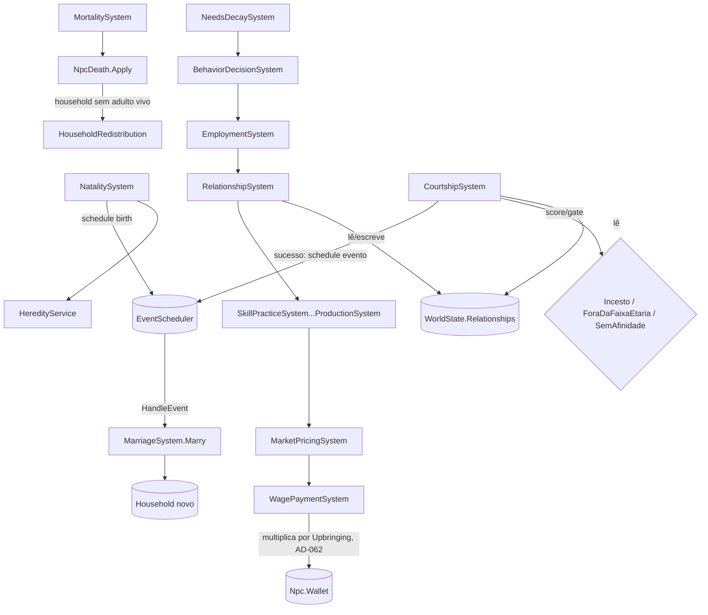

# Fase 7 — Relações e Famílias — Design

**Spec**: `.specs/features/phase-07-family/spec.md`
**Status**: Draft

---

## Architecture Overview

Cinco responsabilidades novas + duas reescritas, mesmo espírito de "um sistema, uma
responsabilidade, ordem documentada em `ScenarioRunner.DefaultSystems()`" (Fase 5/6):

- **`RelationshipSystem`** (`Daily`) — substrato assimétrico (P1 #1): cria/evolui os 4 eixos
  para pares que convivem (mesmo `Household` ou `Workplace` no dia), decai pares existentes
  sem contato recente. Único sistema que escreve em `WorldState.Relationships`.
- **`CourtshipSystem`** (`Yearly`, mesma cadência de `NatalitySystem`) — score de atração,
  gate de incesto/idade/afinidade (P1 #2), agenda conclusão de cortejo via evento (AD-063).
  `HandleEvent` finaliza: sucesso chama `MarriageSystem.Marry`; qualquer condição que
  invalidou o cortejo no meio do caminho (morte, cônjuge de terceiro) é falha silenciosa
  (mesmo padrão de `NatalitySystem.HandleEvent`).
- **`MarriageSystem`** (helper estático, não é `ISimulationSystem` — não tem tick próprio,
  mesmo molde de `NpcDeath`) — cria household novo, mudança de residência, marca cônjuges.
- **`NatalitySystem`** (reescrito, mesmo nome de classe e `SystemName`, `Yearly`) — concepção
  agora lida a partir do casal casado (`Npc.Spouse`), não mais "qualquer homem do household";
  aplica risco de parto (P1 #3) e chama `HeredityService` para `Vitality`/`Upbringing` do
  recém-nascido (P1 #4).
- **`HeredityService`** (funções puras, sem estado, mesmo molde de `SkillCurve`) — herança de
  `Vitality` (genético) e derivação de `Upbringing` (ambiental) a partir da riqueza do
  household na concepção.
- **`FamilyRules`** (record cenário-driven, mesmo molde de `NeedsRules`/`EconomyRules`/
  `SkillsRules`) — todo peso/limiar/duração/flag desta fase.
- **`HouseholdRedistribution`** (helper estático) — chamado de dentro de `NpcDeath.Apply`
  (não é sistema novo — reusa o único ponto que já processa toda morte de NPC): dissolve e
  redistribui household órfão (P1 #3, FAM-17).



Ordem em `DefaultSystems()`: `RelationshipSystem` entra logo depois de `EmploymentSystem`
(convivência de trabalho do dia já conta) e antes de `SkillPracticeSystem` (não depende de
habilidade); `CourtshipSystem` entra na mesma vizinhança de `NatalitySystem` (ambos `Yearly`,
população/família); `NatalitySystem` mantém a posição atual. `MortalitySystem` não muda de
posição — só ganha o hook de redistribuição dentro de `NpcDeath.Apply`, chamado por quem já
chama `NpcDeath.Apply` hoje (`MortalitySystem`, `NeedsDecaySystem`, e agora o risco de parto
em `NatalitySystem`).

---

## Code Reuse Analysis

### Existing Components to Leverage

| Component | Location | How to Use |
|---|---|---|
| `NeedsRules`/`EconomyRules`/`SkillsRules` (`Create` com `Result<T>`, cenário-driven) | `src/LivingWorld.Domain/Behavior/NeedsRules.cs`, `src/LivingWorld.Domain/Economy/EconomyRules.cs`, `src/LivingWorld.Domain/Population/SkillsRules.cs` | `FamilyRules` segue o mesmo formato (AD-053). |
| `RateGene`/`Personality.RollFrom` (roll por stream próprio do NPC, herança por mãe/pai + mutação) | `src/LivingWorld.Domain/Population/RateGene.cs` | `HeredityService.InheritVitality` espelha `RateGene.Inherit` byte a byte (mesma assinatura de stream). |
| `Household`/`Workplace` (lista + dict canônico em `WorldState`, `AddX`/`RemoveX`/`FindX`) | `src/LivingWorld.Simulation/WorldState.cs` | `Relationships` (novo) segue o mesmo padrão — dict canônico, exposto `IReadOnlyDictionary`. |
| `NpcDeath.Apply` (único ponto que mata NPC + limpa household) | `src/LivingWorld.Simulation/Population/NpcDeath.cs` | Ganha a chamada a `HouseholdRedistribution` — nenhum sistema precisa saber mexer nisso, todo caminho de morte já converge aqui. |
| `NatalitySystem` (agendamento de nascimento via `ctx.ScheduleEvent`, streams por NPC) | `src/LivingWorld.Simulation/Population/NatalitySystem.cs` | Mesmo mecanismo reusado por `CourtshipSystem` para agendar conclusão de cortejo (AD-063). |
| `LifeTable.AnnualMortality(ageYears, health)` | `src/LivingWorld.Domain/Population/LifeTable.cs:47` | Ganha parâmetro opcional `vitalityMultiplier = 1.0` (default preserva os 2 call-sites/testes existentes) — AD-050. |
| `WagePaymentSystem` (Fase 5, `Monthly`) | `src/LivingWorld.Simulation/Economy/WagePaymentSystem.cs` | Ganha 1 linha: multiplica `wage` pelo fator de `Upbringing` antes de creditar (AD-062). |
| `PopulationGenerator.PairIntoHouseholds` (fallback "cada um vira Head sozinho" quando não há adulto) | `src/LivingWorld.Domain/Population/PopulationGenerator.cs:99-103` | Mesmo fallback reusado por `HouseholdRedistribution` quando não há parente disponível (AD-057). |
| `WorldRngRegistry`/`ctx.Rng(streamKey)` (stream determinístico por chave) | Fase 1 (AD-022) | Toda rolagem nova (atração, risco de parto, mutação de `Vitality`) usa stream próprio, nunca a raiz. |
| `EconomyRules.FoodResourceId`/`WaterResourceId`, `Household.Stock` | `src/LivingWorld.Domain/Economy/EconomyRules.cs`, `Household.cs` | Piso de recursos da concepção (FAM-13) reusa os mesmos ids já declarados — não inventa um "recurso de fertilidade" novo. |

### Integration Points

| System | Integration Method |
|---|---|
| `ScenarioRunner.DefaultSystems()` | Insere `RelationshipSystem` depois de `EmploymentSystem`; insere `CourtshipSystem` antes de `NatalitySystem` (cortejo decide o casal que a natalidade consome). Comentário de ordem (linhas 18-29) ganha um parágrafo Fase 7. |
| `ScenarioRunner.Create` | Ganha parâmetro opcional `familyRules` (default `DefaultFamilyRules`), mesmo padrão de `economyRules` (AD-047/AD-059) — cenário de deriva neutra e contrafactual variam só esse parâmetro. |
| `WorldState` | Ganho: coleção canônica `Relationships` (dict `(NpcId From, NpcId To) → Relationship`, AD-052) + `FamilyRules` (canônico, mesmo grupo de `NeedsRules`/`EconomyRules`). |
| `Npc` | Ganha `Vitality`(double, imutável), `Upbringing`(double, imutável), `Spouse`(`NpcId?`), `CourtingWith`(`NpcId?`) — mesmo padrão de campo mutável único-construtor (round-trip JSON). |
| `WorldSnapshot` (canônico/volátil, reflexão) | Todos os campos novos de `Npc`/`WorldState` são canônicos (afetam decisão/hash) — o teste gerado por reflexão (ADR-0001) força classificá-los. |
| `NpcDeath.Apply` | Ganha chamada a `HouseholdRedistribution.HandleOrphaned` depois da limpeza de membro existente, antes/depois de checar `IsEmpty` (household pode não estar vazio mas sem adulto). |
| `WagePaymentSystem` | Ganha 1 linha: `wage = FamilyRules.ApplyUpbringingWeight(wage, npc.Upbringing)` (AD-062), sem-op (`wage` inalterado) se `FamilyRules.EnvironmentalWealthChannelEnabled == false`. |

---

## Components

### `FamilyRules` (record, cenário-driven)

- **Purpose**: todo peso/limiar/duração/flag desta fase — nenhum literal em C# (R3), mesmo
  padrão de `NeedsRules`/`EconomyRules`/`SkillsRules`.
- **Location**: `src/LivingWorld.Domain/Population/FamilyRules.cs`
- **Interfaces** (validado em `Create`, `Result<FamilyRules>`):
  - Relação: `RelationshipEventDelta(RelationshipEventType type, RelationshipAxis axis)`,
    `DecayPerDay`, `ContactLossThresholdDays`, `NeutralAxisValue`
  - Atração/cortejo: `AttractionWeight(AttractionFactor factor)`, `CourtshipThreshold`,
    `CourtshipDurationDays`
  - Casamento: `MarriageInitialStock` (`IReadOnlyDictionary<int, long>`, mesmo espírito de
    `SeedInitialEconomyBuffer`/AD-046)
  - Concepção: `ConceptionHealthFloor`, `ConceptionRelationshipFloor`,
    `ConceptionResourceFloor` (piso sobre `Household.Stock[FoodResourceId/WaterResourceId]`)
  - Parto: `MaternalDeathRisk`, `InfantDeathRisk`
  - Hereditariedade: `VitalityMotherWeight`, `VitalityFatherWeight`, `VitalityMutationStdDev`,
    `VitalityMortalityWeight` (multiplicador de `LifeTable.AnnualMortality`),
    `UpbringingWealthWeight`, `EnvironmentalWealthChannelEnabled` (AD-062)
  - Cenários de controle: `NeutralDriftEnabled` (AD-059/A11), método
    `double ApplyUpbringingWeight(double wage, double upbringing)`
  - `double EffectiveVitalityMultiplier(double vitality)` — clamp e fórmula únicos, chamados
    tanto por `SchedulePlannedDeath` quanto pelo cenário de deriva neutra (que passa `1.0`
    direto, nunca chama este método)
- **Dependencies**: `RelationshipAxis`, `RelationshipEventType`, `AttractionFactor` (enums
  fechados, mesmo padrão de `SkillGainSource`)
- **Reuses**: `NeedsRules.Create`/`EconomyRules.Create` (validação de faixa, `Result<T>`)

### `Relationship` (classe mutável, par ordenado)

- **Purpose**: os 4 eixos (Confiança, Afeto, Respeito, Dívida) de A→B — nunca o mesmo objeto
  para B→A (P1 #1).
- **Location**: `src/LivingWorld.Domain/Population/Relationship.cs`
- **Interfaces**:
  - `double Get(RelationshipAxis axis)` — leitura por switch (mesmo padrão de `SkillSet.Get`)
  - `void ApplyEvent(RelationshipEventType type, FamilyRules rules)` — aplica o delta
    declarado ao(s) eixo(s) do evento nomeado (FAM-03), clamped a `[0, 100]`
  - `void DecayTowardNeutral(FamilyRules rules)` — 1 chamada/dia sem contato, nunca ultrapassa
    o neutro (FAM-04)
  - `long LastContactTick { get; private set; }` + `void MarkContact(long tick)`
  - `static Relationship Initial(long firstContactTick)` — eixos no piso mínimo declarado
    (nunca salta para valor alto num único encontro, Edge Case)
- **Dependencies**: `FamilyRules`, `RelationshipAxis`, `RelationshipEventType`
- **Reuses**: `SkillSet` como modelo de "conjunto de eixos mutável, leitura por switch"

### `RelationshipKey` (struct, par ordenado)

- **Purpose**: chave `(NpcId From, NpcId To)` — `A→B` e `B→A` são chaves distintas por
  construção (nunca normalizadas/ordenadas, isso quebraria a assimetria FAM-05).
- **Location**: `src/LivingWorld.Domain/Population/RelationshipKey.cs`
- **Interfaces**: `readonly record struct RelationshipKey(NpcId From, NpcId To)`
- **Dependencies**: `NpcId`
- **Reuses**: nenhum — par ordenado é o próprio propósito do tipo

### `RelationshipSystem` (`ISimulationSystem`, `Daily`)

- **Purpose**: forma e evolui relação por convivência (FAM-01/02/03), decai sem contato
  (FAM-04).
- **Location**: `src/LivingWorld.Simulation/Population/RelationshipSystem.cs`
- **Interfaces**: `void Tick(WorldState world, TickContext ctx)` — para cada `Household` e
  cada `Workplace`, todo par ordenado de membros/empregados vivos presentes hoje
  (`OrderBy(id => id.Value)` nas duas pontas, mesma convenção de determinismo de
  `ProductionSystem`) ganha/atualiza `A→B` e `B→A` (`GetOrAdd` + `ApplyEvent(Cohabitation)` +
  `MarkContact`); depois, para toda entrada existente em `world.Relationships` cujo
  `LastContactTick` excede `ContactLossThresholdDays` em horas, chama `DecayTowardNeutral`.
- **Dependencies**: `Relationship`, `FamilyRules`, `RelationshipKey`
- **Reuses**: mesma convenção de iteração ordenada de `SkillPracticeSystem`/`ProductionSystem`

> **Ponytail — custo O(membros²) por local**: household é pequeno (família), mas
> `Workplace` no cenário default tem até 80 empregados (~3160 pares/dia/local). Aceitável no
> cenário default; se a Fase 9 (Escala) achar isso caro, o teto vira sensor lá — não construir
> paralelização/particionamento aqui sem medição (mesmo raciocínio de AD-038, "só medir revela
> qual hipótese é certa").

### `CourtshipRejectionReason` (enum fechado)

- **Purpose**: motivo auditável de rejeição — nunca string livre (AD-054).
- **Location**: `src/LivingWorld.Domain/Population/CourtshipRejectionReason.cs`
- **Interfaces**: `enum CourtshipRejectionReason { Incesto, ForaDaFaixaEtaria, SemAfinidade }`
- **Dependencies**: nenhuma
- **Reuses**: padrão de `ActionType`/`SkillType` (enum fechado, comentário `<c>`)

### `CourtshipSystem` (`ISimulationSystem`, `Yearly`)

- **Purpose**: score de atração + gate de elegibilidade (P1 #2); agenda conclusão do cortejo.
- **Location**: `src/LivingWorld.Simulation/Population/CourtshipSystem.cs`
- **Interfaces**:
  - `void Tick(WorldState world, TickContext ctx)` — para cada NPC vivo, adulto, solteiro
    (`Spouse` nulo ou cônjuge morto — A9) e sem `CourtingWith` ativo (ordenado por
    `Id.Value`), busca o melhor candidato entre `world.Relationships` (AD-061: só quem já tem
    entrada, qualquer direção, com o candidato) que também esteja solteiro/livre; calcula o
    score (`AttractionScore`); aplica os 3 gates na ordem do critério do roadmap
    (Incesto → ForaDaFaixaEtaria → SemAfinidade — AC3 exige que incesto reprove **mesmo com**
    score compatível, então o gate de parentesco roda antes do teste de limiar); sucesso
    marca `CourtingWith` nos dois, loga `WorldEventKind.CourtshipStarted` e agenda
    `ctx.ScheduleEvent(now + CourtshipDurationDays, SystemName, "a|b")`; rejeição loga
    `WorldEventKind.CourtshipRejected` com o motivo no payload (nunca lança, nunca bloqueia
    cortejo futuro com terceiro — Edge Case).
  - `void HandleEvent(WorldState world, TickContext ctx, ScheduledEvent evt)` — revalida
    (ambos vivos, ainda `CourtingWith` um do outro, ainda solteiros); sucesso chama
    `MarriageSystem.Marry` e loga `WorldEventKind.CourtshipSucceeded` (FAM-11, antes do
    casamento); falha é sem-op silencioso (mesmo padrão de `mother is not { IsAlive: true }`
    em `NatalitySystem.HandleEvent`), limpando `CourtingWith` dos dois.
  - `static double AttractionScore(Npc a, Npc b, Relationship? aToB, Relationship? bToA,
    FamilyRules rules, PopulationRules populationRules)` — função pura, testável isolada
    (mesmo espírito de `SkillCurve.Gain`): combina idade, saúde, status (`Wallet`+`Profession`),
    habilidade (`Skills`), afinidade cultural (`Culture` igual/diferente), e a média dos dois
    sentidos da relação existente, pesos de `FamilyRules`.
  - `static CourtshipRejectionReason? Reject(Npc a, Npc b, WorldDate now, PopulationRules
    populationRules)` — checa parentesco (AD-055) e janela de fertilidade (AC4) antes de
    qualquer score.
- **Dependencies**: `FamilyRules`, `PopulationRules`, `Relationship`, `MarriageSystem`
- **Reuses**: mecanismo de evento agendado de `NatalitySystem` (AD-063); streams por par
  (`ctx.Rng($"courtship-{a.Id.Value}-{b.Id.Value}")`) se algum fator precisar de rolagem —
  score em si é determinístico puro (sem RNG), só o agendamento usa o tick já determinístico.

### `MarriageSystem` (helper estático, não é `ISimulationSystem`)

- **Purpose**: casamento cria household novo (P1 #3, AD-056).
- **Location**: `src/LivingWorld.Simulation/Population/MarriageSystem.cs`
- **Interfaces**: `static void Marry(WorldState world, TickContext ctx, Npc spouseA, Npc spouseB)`
  — remove ambos dos households anteriores (`LeaveHousehold`, dissolvendo o antigo se ficar
  vazio — mesma limpeza de `NpcDeath.Apply`, reusada via `HouseholdCleanup` extraído — ver
  Tech Decisions), cria `Household` novo com `FamilyRules.MarriageInitialStock` (mesmo
  espírito de `SeedInitialEconomyBuffer`/AD-046), `JoinHousehold` nos dois, `Npc.Marry(spouse)`
  nos dois, loga `WorldEventKind.Marriage`.
- **Dependencies**: `FamilyRules`, `WorldState.AddHousehold`/`NextHouseholdIdAndAdvance`
- **Reuses**: `Household`/`AddHousehold` já existentes; mesmo padrão de dissolução de
  `NpcDeath.Apply` (extraído para `HouseholdCleanup.DissolveIfEmpty` — ver Tech Decisions)

### `HouseholdRedistribution` (helper estático)

- **Purpose**: household órfão (ambos os pais mortos) dissolve e redistribui filhos vivos
  (P1 #3, AD-057).
- **Location**: `src/LivingWorld.Simulation/Population/HouseholdRedistribution.cs`
- **Interfaces**: `static void HandleOrphaned(WorldState world, TickContext ctx, Household
  household, LifeStageRules lifeStageRules, WorldDate now)` — chamado de `NpcDeath.Apply`
  quando o household não está vazio mas não tem membro vivo com `LifeStage.Adult`/`Elder`
  (`LifeStageRules.StageOf`); para cada filho vivo remanescente, busca avô/avó vivo com
  household (via `MotherId`/`FatherId` do pai/mãe morto, ainda resolvível como referência
  histórica — AD-031) ou irmão adulto vivo já com household; sem candidato, `JoinHousehold`
  num household unitário novo próprio (mesmo fallback de
  `PopulationGenerator.PairIntoHouseholds:99-103`); dissolve o household original.
- **Dependencies**: `LifeStageRules`, `Household`, `NpcId` (busca por ponteiro já existente)
- **Reuses**: fallback de `PopulationGenerator` (AD-057), `WorldState.RemoveHousehold`

### `HeredityService` (funções puras, sem estado)

- **Purpose**: `Vitality` genético herdado + `Upbringing` ambiental derivado — origens
  distintas por construção (P1 #4, FAM-18/19/20).
- **Location**: `src/LivingWorld.Domain/Population/HeredityService.cs`
- **Interfaces**:
  - `static double RollInitialVitality(WorldRng rng)` — população seed sem pais (Edge Case),
    mesmo padrão de `RateGene.RollInitial`
  - `static double InheritVitality(double motherVitality, double fatherVitality, FamilyRules
    rules, WorldRng rng)` — `mãe*pesoMãe + pai*pesoPai + mutação(rng, stdDev)`, clamp `[0,100]`
    (FAM-18) — stream do RNG já vem semeado por chave que inclui o `NpcId` do filho, quem
    chama (`NatalitySystem.HandleEvent`) é responsável por derivar o stream com essa chave
    (mesmo padrão de `RateGene.Inherit`/`rategene-{babyId}`)
  - `static double DeriveUpbringing(Household conceptionHousehold, FamilyRules rules)` —
    função determinística pura da riqueza do household na concepção (soma de
    `Household.Stock` valorizado a preço de mercado + `Wallet` dos membros, normalizado
    `[0,100]`) — **nunca lê `Vitality`/genes dos pais** (FAM-19/20)
- **Dependencies**: `FamilyRules`, `Household`, `WorldRng`
- **Reuses**: `RateGene.Inherit` como modelo formal ("fórmula + mutação semeada por `NpcId`")

### `Npc` — extensões (mesmo arquivo, `Npc.cs`)

- **Purpose**: campos novos de genética, cônjuge e cortejo.
- **Location**: `src/LivingWorld.Domain/Population/Npc.cs`
- **Interfaces**:
  - `double Vitality { get; }` (imutável após nascimento, mesmo padrão de `RateGene`)
  - `double Upbringing { get; }` (imutável após nascimento)
  - `NpcId? Spouse { get; private set; }` + `void Marry(NpcId spouse)` — nunca um mutador de
    "divorciar" (AD-060); viuvez é lida (`Spouse` aponta a alguém com `IsAlive == false`),
    nunca limpa (mesmo espírito de `MotherId`/`FatherId`, AD-031: referência histórica válida)
  - `NpcId? CourtingWith { get; private set; }` + `void StartCourtship(NpcId partner)` /
    `void EndCourtship()` (espelha `AssignMentor`/`ClearMentor`)
- **Dependencies**: nenhuma nova
- **Reuses**: construtor único existente ganha os 4 parâmetros novos (mesmo padrão de
  round-trip de `System.Text.Json`)

### `WorldState` — extensões

- **Purpose**: coleção canônica de relações + `FamilyRules` do cenário.
- **Location**: `src/LivingWorld.Simulation/WorldState.cs`
- **Interfaces**:
  - `[Canonical] IReadOnlyDictionary<RelationshipKey, Relationship> Relationships`
  - `internal Relationship GetOrCreateRelationship(RelationshipKey key, long now)` — só ponto
    de criação (AD-052: nunca populado antecipadamente)
  - `[Canonical] FamilyRules FamilyRules { get; }` (parâmetro construtor, default
    `FamilyRules.Disabled`-equivalente só se algum cenário de teste minimalista precisar —
    ver Tech Decisions)
- **Dependencies**: `Relationship`, `RelationshipKey`, `FamilyRules`
- **Reuses**: mesmo padrão de `_households`/`Households` (lista + dict, exceto que aqui o
  "dict" **é** a coleção canônica — não há lista paralela, porque não existe iteração
  ordenada por id sequencial fazendo sentido para um par; iteração ordena por
  `(From.Value, To.Value)` quando precisar de determinismo, ex. `RelationshipSystem`/hash)

---

## Data Models

```csharp
public enum RelationshipAxis { Trust, Affection, Respect, Debt }
public enum RelationshipEventType { Cohabitation, Betrayal, Help, Trade }
public enum AttractionFactor { Age, Health, Status, Skill, CulturalAffinity, ExistingRelationship }
public enum CourtshipRejectionReason { Incesto, ForaDaFaixaEtaria, SemAfinidade }

public readonly record struct RelationshipKey(NpcId From, NpcId To);

public sealed class Relationship
{
    // 4 doubles [0,100] — leitura via switch (Get), nunca reflexão; LastContactTick para decay.
}

public sealed record FamilyRules(
    IReadOnlyDictionary<(RelationshipEventType, RelationshipAxis), double> RelationshipDeltas,
    double DecayPerDay, int ContactLossThresholdDays, double NeutralAxisValue,
    IReadOnlyDictionary<AttractionFactor, double> AttractionWeights,
    double CourtshipThreshold, int CourtshipDurationDays,
    IReadOnlyDictionary<int, long> MarriageInitialStock,
    int ConceptionHealthFloor, double ConceptionRelationshipFloor,
    IReadOnlyDictionary<int, long> ConceptionResourceFloor,
    double MaternalDeathRisk, double InfantDeathRisk,
    double VitalityMotherWeight, double VitalityFatherWeight, double VitalityMutationStdDev,
    double VitalityMortalityWeight,
    double UpbringingWealthWeight, bool EnvironmentalWealthChannelEnabled,
    bool NeutralDriftEnabled);
```

**Relationships**: `WorldState.Relationships` (1 `Relationship` por par ordenado, criado sob
demanda) · `Npc.Vitality`/`Npc.Upbringing` (1 valor cada, imutável, herdado/derivado ou
sorteado) · `Npc.Spouse`/`Npc.CourtingWith` (0..1 `NpcId`, vínculo conjugal/cortejo em
andamento) · `FamilyRules` (cenário, compartilhado por todos os NPCs, mesmo padrão de
`NeedsRules`/`EconomyRules`/`SkillsRules`).

---

## Error Handling Strategy

| Error Scenario | Handling | User Impact |
|---|---|---|
| Cortejo agendado onde um dos dois morre/casa com terceiro antes da conclusão | `CourtshipSystem.HandleEvent` revalida e é sem-op silencioso se inválido (mesmo padrão de `NatalitySystem.HandleEvent`) — `CourtingWith` do sobrevivente é limpo | Nenhum — NPC volta a ficar disponível para novo cortejo no ano seguinte |
| Mãe morre entre concepção e parto | Já coberto pelo comportamento existente (`mother is not { IsAlive: true }`) — FAM-15 só confirma que continua valendo com os campos novos | Nenhum |
| `HouseholdRedistribution` não acha parente adulto disponível | Fallback: filho remanescente vira `Head` de household unitário próprio (mesmo de `PopulationGenerator`) — nunca lança, nunca deixa `Npc.Household` nulo permanentemente sem `HomelessSince` setado | Nenhum — mesma garantia de NEEDS-16 |
| `HeredityService.InheritVitality` produziria valor fora de `[0,100]` (mutação extrema) | Clamp explícito no próprio método — nunca lança | Nenhum — mesma garantia de `RateGene.Inherit` |
| `CourtshipSystem` não acha nenhum candidato elegível para um NPC (Edge Case) | `Tick` pula o NPC nesse ano, sem log de erro — mesmo espírito do NPC sem-teto (AD-036) | Nenhum — NPC permanece solteiro/sem filhos até a vida acabar |
| `WagePaymentSystem` recebe `Upbringing` fora de `[0,100]` (não deveria acontecer, mas defensivo) | `FamilyRules.ApplyUpbringingWeight` clampa a entrada antes de aplicar o peso | Nenhum |

---

## Risks & Concerns

| Concern | Location (file:line) | Impact | Mitigation |
|---|---|---|---|
| `RelationshipSystem` itera pares de `Workplace.Employees` (até 80 no cenário default) — O(n²) por local, todo dia | Novo — `src/LivingWorld.Simulation/Population/RelationshipSystem.cs` (ainda não existe) | ~3160 pares/dia/workplace × 2 workplaces × 36.500 dias (100 anos) é um custo real, ainda não medido | Ponytail: aceitar no cenário default (100 NPCs), documentar como candidato a sensor/otimização da Fase 9 (Escala) se a medição achar caro — não otimizar sem medir (AD-038) |
| `WagePaymentSystem` (Fase 5, já testado com `ResourceConservationTests`/`MoneyConservationTests`) ganha uma linha nova que multiplica `wage` | `src/LivingWorld.Simulation/Economy/WagePaymentSystem.cs:29` | Risco de regressão na invariante de conservação de dinheiro (o multiplicador ainda debita de `Treasury` e credita em `Wallet` na mesma quantia — se a linha multiplicar só o lado creditado sem multiplicar o débito, quebra conservação) | Tasks deve garantir que o valor multiplicado seja debitado E creditado igual (mesma `Money`, não dois valores diferentes) — reusar `MoneyConservationTests` existentes como gate depois da mudança |
| `NpcDeath.Apply` ganha uma responsabilidade nova (checar household órfão) além de dissolver-quando-vazio | `src/LivingWorld.Simulation/Population/NpcDeath.cs:22` (nova chamada) | Função cresce; dois motivos de dissolução (vazio vs órfão-com-filhos) no mesmo método pode ficar difícil de testar em isolado | Tasks extrai a checagem de órfão para `HouseholdRedistribution.HandleOrphaned` (já assim no Design) — `NpcDeath.Apply` só chama, não implementa a lógica de redistribuição |
| `CourtshipSystem.AttractionScore` combina 6 fatores heterogêneos (idade, saúde, `Wallet`, `Skills`, `Culture`, relação) em um único double | Novo — `src/LivingWorld.Simulation/Population/CourtshipSystem.cs` (ainda não existe) | Sem normalização declarada, um fator com magnitude maior (ex. `Wallet` em milhares) domina o score silenciosamente | Tasks normaliza cada fator para `[0,1]` antes de aplicar o peso declarado (`FamilyRules.AttractionWeights`) — mesmo cuidado que `PersonalityWeighting` já toma com traços em escalas diferentes |
| Nenhum teste hoje força `FamilyRules.MarriageInitialStock`/`ConceptionResourceFloor` a usar ids de recurso que existem no `EconomyCatalog` do cenário | Novo — `FamilyRules.cs` | Cenário podia declarar um id de recurso inexistente e o casamento simplesmente nunca depositar nada, silenciosamente | Tasks inclui teste de cobertura cruzando `FamilyRules` com `EconomyCatalog`/`EconomyRules` do cenário default (mesmo padrão já usado para `SkillsRules.SkillByProfession` vs `PopulationCatalog.ProfessionIds`) |

---

## Tech Decisions (only non-obvious ones)

| Decision | Choice | Rationale |
|---|---|---|
| `MarriageSystem`/`HouseholdRedistribution` não são `ISimulationSystem` | Helpers estáticos chamados por outros sistemas (`CourtshipSystem.HandleEvent`, `NpcDeath.Apply`) | Mesmo molde de `NpcDeath` — não tem tick próprio, é uma operação nomeada reusada por quem precisa, evita registrar um sistema "vazio" em `DefaultSystems()` |
| Extrair `HouseholdCleanup.DissolveIfEmpty` de dentro de `NpcDeath.Apply` (lógica hoje inline: linhas 22-31) | Vira helper compartilhado por `NpcDeath.Apply` (saída de membro por morte) e `MarriageSystem.Marry` (saída de membro por casamento) | Os dois casos dissolvem o household anterior da mesma forma (registra `ResourceLost`, remove household, limpa referência de quem ficou); duplicar essa lógica em `MarriageSystem` seria o mesmo bug que `NpcDeath` já corrigiu uma vez (achado na Fase 3/4) |
| `CourtshipSystem.AttractionScore` é função pura sem RNG | Score determinístico; só o agendamento do evento usa o relógio (já determinístico) | Testável isolada sem `ScenarioRunner` (mesmo padrão de `SkillCurve.Gain`); se o roadmap pedir "sorte" no cortejo depois, é aditivo (um fator `Random` a mais na lista, não uma reescrita) |
| `HeredityService.DeriveUpbringing` usa riqueza do household **na concepção**, não no nascimento | `NatalitySystem.Tick` (concepção) captura o household já; `HandleEvent` (nascimento, ~270 dias depois) reusa o valor capturado no payload do evento agendado, nunca relê o household no nascimento | FAM-19 exige "origem ambiental" clara — se a riqueza fosse lida no nascimento, uma família que enriqueceu/empobreceu durante a gestação mudaria retroativamente a origem declarada; capturar na concepção é a leitura mais literal de "berço" |
| `Relationship` não é `record` (como `RateGene`), é classe mutável | 4 eixos + `LastContactTick` mudam com frequência alta (`Daily`) para até milhares de pares | Um `record with` a cada dia por par seria alocação desnecessária — mesmo raciocínio de `SkillSet` (classe mutável) vs `Personality`/`RateGene` (record imutável, muda raríssimo) |

> **Novos `AD-NNN` registrados em `docs/decisions-log.md`**: AD-061 (candidatos de cortejo
> restritos a quem já tem `Relationship`), AD-062 (`Upbringing` afeta salário via
> `WagePaymentSystem` + flag de canal ambiental), AD-063 (cortejo como evento agendado, campos
> `Spouse`/`CourtingWith`). As 11 assunções já registradas como AD-050..060 na spec continuam
> valendo sem alteração — este Design só detalha *onde no código* cada uma aterrissa.

---

## Confirmação de escopo

Sem interação humana neste turno (auto-mode, instrução explícita do usuário: "não pare pra
perguntar salvo bloqueio genuíno"). Nenhuma ambiguidade encontrada exigiu bloqueio — as 3
decisões novas (AD-061/062/063) foram resolvidas como extensão direta de padrões já
estabelecidos em fases anteriores (agendamento de evento, cenário-driven, helper estático
único-ponto-de-mutação) e registradas no log para o usuário revisar antes de Tasks.

**Tasks formal é necessário**: sim — 7 componentes novos (`FamilyRules`, `Relationship`,
`RelationshipSystem`, `CourtshipSystem`, `MarriageSystem`, `NatalitySystem` reescrito,
`HeredityService`, `HouseholdRedistribution`) mais 2 sistemas existentes tocados
(`WagePaymentSystem`, `NpcDeath.Apply`/`LifeTable`), 36 requisitos `FAM-01..36`, e os 2
cenários de controle (P2) exigem harness de teste dedicado (deriva neutra + contrafactual de
household) — bem acima do teto "≤3 passos óbvios" que dispensaria Tasks.
