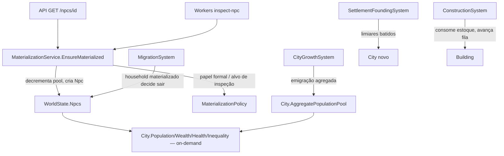

# Fase 8 — Cidades Design

**Spec**: `.specs/features/phase-08-cities/spec.md`
**Status**: Approved — approach A confirmado pelo usuário

---

## 1. Architecture Overview — conservação da LOD (decisão central)

O ponto mais arriscado da fase é a Simulation LOD (CITY-04): agregado e materializado
precisam bater contra **fonte independente** (CITY-09), sobreviver a round-trip de hash, e
não regredir pra "inflação silenciosa" (roadmap chama isso pelo nome). Três approaches:

### A — Pool agregado por contador + somas, NPC materializado é `Npc` real (recomendado)

`City` guarda um valor agregado (`AggregatePopulationPool`: contagem + somas de riqueza/saúde)
e a população materializada já existe como `Npc` real em `WorldState.Npcs` (mesmo tipo de
sempre, com `CityId` novo). Materializar = decrementar o pool, criar `Npc`; desmaterializar =
inverso. `City.Population` é **sempre computado on-demand** (`COUNT` de `Npcs` vivos com este
`CityId` + `AggregatePool.Count`) — nunca cacheado, nunca incremental. Contagem de auditoria
(CITY-09) lê os dois lados sem passar por `City.Population`: `COUNT(*)` direto sobre
`world.Npcs` e `city.AggregatePool.Count` lido cru.

- ✅ Mesmo padrão já usado e testado em `MoneyMinted`/`MoneyDestroyed` e
  `ResourceProduced`/`ResourceConsumed` (Fase 5, T24) — dois contadores independentes que uma
  invariante de conservação soma. Nada novo a inventar.
- ✅ "Recomputado do zero" (critério do roadmap) é trivial: como não há cache, todo read já é
  do zero. Não existe divergência incremental-vs-recompute possível.
- ⚠️ Custo de `City.Population` é O(NPCs vivos do mundo) por leitura — aceitável nesta fase
  (Fase 9 é quem fixa o teto de custo; Fase 8 não otimiza).

### B — Pool agregado como amostra de "fantasmas" (histograma de NPCs não materializados)

Guardar o agregado como uma distribuição (buckets de idade/riqueza) em vez de só soma/count,
pra que a materialização seja "amostragem condicionada" fiel ao ideal descrito em
`simulation-lod.md` (§ Materialização de NPC).

- ❌ Nenhum critério do roadmap exige amostragem condicionada — só "coerente com as
  estatísticas agregadas", que a soma simples de A já satisfaz. Buckets são complexidade sem
  requisito que a puxe nesta fase (over-engineering); ficam candidatos quando Fase 10 quiser
  amostragem por evento histórico específico.

### C — Todo NPC sempre existe como `Npc` real; "materializado" é só uma flag de profundidade

Sem pool agregado separado — todo mundo é uma linha completa, "agregado" só significa "sistemas
caros não rodam nele".

- ❌ Contradiz o critério explícito "materializar 10 NPCs tira 10 do pool agregado" (não há
  pool a decrementar) e torna round-trip/conservação um teste vazio (nada é criado ou
  destruído, então nunca há o que conservar) — não discrimina a implementação, viola R1
  (eval-criteria.md).

**Recomendação: A.** Reaproveita padrão já provado (Fase 5), satisfaz os critérios sem
inventar mecanismo novo, e não otimiza prematuramente o que a Fase 9 já é dona de otimizar.



**Confirmar approach A antes de eu detalhar componentes e ir pra Tasks.**

---

## Code Reuse Analysis

### Existing Components to Leverage

| Component | Location | How to Use |
|---|---|---|
| `Household`/`Workplace` (lista + dict + construtor único de reidratação) | `src/LivingWorld.Domain/Population/Household.cs`, `Economy/Workplace.cs` | Mesmo molde para `City`/`Building` |
| `EconomyRules`/`FamilyRules` (`Create` validador + `Disabled` default, cenário-driven) | `src/LivingWorld.Domain/Economy/EconomyRules.cs`, `Population/FamilyRules.cs` | Mesmo molde para `CityRules` |
| `MoneyMinted`/`MoneyDestroyed`, `ResourceProduced`/`ResourceConsumed` (par de contadores independentes) | `src/LivingWorld.Simulation/WorldState.cs:98-129` | Modelo direto pra `AggregatePopulationPool` + contagem de auditoria (CITY-09) |
| `ResourceStock.Deposit/Withdraw` | `src/LivingWorld.Domain/Economy/ResourceStock.cs` | Estoque de `Building`/fila de obra (CITY-03), sem reinventar não-negatividade |
| `ProductionRecipe.Create` (Inputs/Outputs/validação) | `src/LivingWorld.Domain/Economy/EconomyCatalog.cs` | Molde de `BuildingRecipe` (CITY-03) |
| `EconomyScenarioLoader` (parse manual + `Result<T>`, campo nomeado no erro) | `src/LivingWorld.Simulation/Economy/EconomyScenarioLoader.cs` | Molde de `CityScenarioLoader` |
| `MortalitySystem.SchedulePlannedDeath` + `ctx.ScheduleEvent` (evento único, nunca varredura) | `src/LivingWorld.Simulation/Population/MortalitySystem.cs` | Fundação de assentamento (CITY-08): agenda evento único no tick `now + OrganizationTicks` |
| `ReferentialIntegritySweep.ValidIdResolvers` | `src/LivingWorld.Simulation/ReferentialIntegritySweep.cs:24-25` | `CityId`/`LocationId` já têm entrada (vazia); troca para resolver de verdade — nenhuma entrada nova, só editar 2 linhas |
| `CityId`/`LocationId` (`Guid`, já declarados) | `src/LivingWorld.Domain/Ids.cs:26-34` | Reusar como estão — não migrar para `long` (ver Tech Decisions) |
| AD-020: `LivingWorld.Workers` como host CLI (`hash <seed> <ticks>`) | `src/LivingWorld.Workers/Program.cs` | Novo subcomando `inspect-npc <id>`, sem projeto novo |
| `PairedScenarioTests`/harness base-tratamento (R4) | `tests/LivingWorld.Tests/Population/PairedScenarioTests.cs` | Molde do par fome base/tratamento (CITY-02 critério "fome derruba população") |

### Integration Points

| System | Integration Method |
|---|---|
| `LivingWorld.Api` (hoje só `GET /`) | Ganha `GET /npcs/{id}`; precisa referenciar `Infrastructure` pra carregar o snapshot mais recente (hoje não referencia nada) |
| `LivingWorld.Workers` | Ganha branch de args `inspect-npc <id>`; reusa o mesmo carregamento de snapshot que a API |
| `rules/database-entities.md` | `City`/`Building` seguem a mesma disciplina: entidade de domínio sem EF, mapeamento em `Infrastructure`, migração versionada nova |

---

## Components

### `City` (entidade de domínio)

- **Purpose**: cidade como entidade — população/riqueza/saúde/desigualdade sempre derivados,
  nunca campo escrito à mão.
- **Location**: `src/LivingWorld.Domain/Cities/City.cs`
- **Interfaces**:
  - `CityId Id`, `CellCoord Location`, `long FoundedAtTick`, `CityId? FoundedFromCityId`
  - `AggregatePopulationPool AggregatePool { get; }` — `{ long Count, long WealthSum, long HealthSum }`
  - `IReadOnlyList<BuildingId> BuildingIds`, `IReadOnlyList<ConstructionProject> ConstructionQueue`
  - `Result<Unit> Materialize(NpcId npc)` / `Result<Unit> Dematerialize(NpcId npc, ...stats)` — move contagem+somas entre pool e o NPC real (chamador já criou/removeu o `Npc`)
- **Dependencies**: `CellCoord` (Fase 2), `Money`/agregados de riqueza vêm de `Npc.Wallet`
- **Reuses**: molde de `Household`/`Workplace` (lista+dict em `WorldState`, construtor único)

### `CityPopulationQuery` (serviço estático, sem estado)

- **Purpose**: único ponto que computa `Population`/`Wealth`/`Health`/`Inequality` de uma
  cidade — nunca cacheado (approach A), sempre om-demand a partir de `WorldState.Npcs` + `AggregatePool`.
- **Location**: `src/LivingWorld.Domain/Cities/CityPopulationQuery.cs`
- **Interfaces**:
  - `long Population(WorldState world, CityId city)`
  - `long Wealth(WorldState world, CityId city)` — soma `Npc.Wallet` materializado + `AggregatePool.WealthSum`
  - `double Inequality(WorldState world, CityId city)` — Gini sobre `Wallet` dos materializados (Tech Decision: pool agregado entra só pela soma, não pela distribuição — Gini de amostra parcial é a aproximação aceita nesta fase)
- **Dependencies**: `WorldState`
- **Reuses**: nada — é o componente novo central da fase

### `CityRules` (cenário-driven, mesmo molde de `FamilyRules`/`EconomyRules`)

- **Purpose**: todo limiar de crescimento/migração/fundação/materialização, nunca literal em C#.
- **Location**: `src/LivingWorld.Domain/Cities/CityRules.cs`
- **Interfaces**: `Create(...)` validador + `Disabled` default (mesmo contrato de `EconomyRules.Create`)
  - Limiares de emigração (comida/moradia/segurança → taxa)
  - Pesos de migração (emprego, comida, segurança, laços familiares)
  - Limiares de fundação (concentração, recurso, rota, defensabilidade, liderança) + `OrganizationTicks`
  - `MaterializationIdleTicksBeforeEligible`
- **Reuses**: `EconomyRules.Create` como template de validação

### `CityCatalog` + `Building` + `ConstructionProject`

- **Purpose**: catálogo de tipo de edifício por período (id-only, AD-023) e a obra em progresso.
- **Location**: `src/LivingWorld.Domain/Cities/{CityCatalog,Building,ConstructionProject}.cs`
- **Interfaces**:
  - `CityCatalog.BuildingRecipes: IReadOnlyDictionary<int, BuildingRecipe>` — `BuildingRecipe(Inputs, TicksToBuild, HousingCapacityProvided)`
  - `Building(BuildingId Id, CityId City, int BuildingTypeId, long CompletedAtTick)`
  - `ConstructionProject(CityId City, int BuildingTypeId, IReadOnlyDictionary<ResourceType,long> Consumed, long TicksRemaining)`
- **Reuses**: `ProductionRecipe.Create` como template; `ResourceStock` pro consumo

### Sistemas (`src/LivingWorld.Simulation/Cities/`)

| Sistema | Frequência | Papel |
|---|---|---|
| `ConstructionSystem` | Daily | Avança `ConstructionQueue` em ordem FIFO; consome de `City` stock; falha sem insumo (`Result.Fail`, hash intacto); conclui → `AddBuilding` |
| `CityGrowthSystem` | Daily | Emigração agregada do pool quando comida/moradia/segurança < limiar do cenário (CITY-02) |
| `MigrationSystem` | Daily | NPC/household **materializado** decide migrar (pesos de `CityRules`); move `CityId` no mesmo tick, nunca perde no caminho (CITY-07, P2) |
| `MaterializationSystem` | Daily + on-demand | Materializa por papel formal/alvo de inspeção; desmaterializa por ociosidade (`MaterializationIdleTicksBeforeEligible`) |
| `SettlementFoundingSystem` | Monthly | Checa limiares de fundação; agenda evento único em `now + OrganizationTicks` (mesmo padrão de `MortalitySystem.SchedulePlannedDeath`); ao disparar, cria `City` novo e move o grupo (CITY-08, P2) |

### `NpcInspectionQuery` (compartilhado entre API e CLI)

- **Purpose**: única fonte da consulta de inspeção — API e CLI chamam o mesmo método,
  nenhuma lógica duplicada (AC #2 da story P1 de inspeção).
- **Location**: `src/LivingWorld.Simulation/Cities/NpcInspectionQuery.cs`
- **Interfaces**: `Result<NpcInspectionDto> Inspect(WorldState world, NpcId id)` — materializa
  sob demanda (`MaterializationSystem.EnsureMaterialized`) antes de montar o DTO; `Fail` se
  `id` não existe ou está morto.
- **Reuses**: `MaterializationSystem`, `Result<T>`

### `LivingWorld.Api` — `GET /npcs/{id}`

- **Location**: `src/LivingWorld.Api/Program.cs` (+ novo `Endpoints/NpcEndpoints.cs` se crescer)
- **Dependências novas**: referência a `Infrastructure` (carregar snapshot mais recente) e a
  `Simulation` (rodar `NpcInspectionQuery`) — hoje `Api` não referencia nenhum dos dois.
- 404 quando `Inspect` falha.

### `LivingWorld.Workers` — `inspect-npc <id>`

- **Location**: `src/LivingWorld.Workers/Program.cs` (branch de `args[0]`, mesmo padrão do
  `hash <seed> <ticks>` de AD-020)
- Chama o mesmo `NpcInspectionQuery.Inspect`; imprime DTO serializado; código de saída 1 se `Fail`.

---

## Data Models

```csharp
public readonly record struct BuildingId(long Value); // monotônico, mesmo molde de WorkplaceId

public readonly record struct AggregatePopulationPool(long Count, long WealthSum, long HealthSum)
{
    public static readonly AggregatePopulationPool Empty = new(0, 0, 0);
}

public sealed record BuildingRecipe(
    IReadOnlyDictionary<ResourceType, long> Inputs, long TicksToBuild, long HousingCapacityProvided);

public sealed class Building(BuildingId id, CityId city, int buildingTypeId, long completedAtTick)
{
    public BuildingId Id { get; } = id;
    public CityId City { get; } = city;
    public int BuildingTypeId { get; } = buildingTypeId;
    public long CompletedAtTick { get; } = completedAtTick;
}

public sealed class ConstructionProject(
    CityId city, int buildingTypeId, IReadOnlyDictionary<ResourceType, long> consumed, long ticksRemaining)
{
    public CityId City { get; } = city;
    public int BuildingTypeId { get; } = buildingTypeId;
    public IReadOnlyDictionary<ResourceType, long> Consumed { get; } = consumed;
    public long TicksRemaining { get; private set; } = ticksRemaining;
    public void Advance() => TicksRemaining--;
}
```

**Relationships**: `Npc.CityId` (novo campo, não-nulo pra todo NPC vivo — CITY-09 edge case) →
`City`; `Building.City` → `City`; `ConstructionProject` vive em `City.ConstructionQueue`
(lista ordenada, FIFO).

`Npc` e `Household` ganham `CityId City { get; private set; }` (mutável só por
`MigrationSystem`/`SettlementFoundingSystem`, mesmo padrão de `JoinHousehold`/`LeaveHousehold`).

---

## Error Handling Strategy

| Error Scenario | Handling | Impact |
|---|---|---|
| Obra sem insumo declarado | `ConstructionSystem` retorna `Result.Fail`, não inicia projeto, `Hash(world)` intacto | Sem obra na fila; cenário decide retry |
| `GET /npcs/{id}` com id morto/inexistente | `NpcInspectionQuery.Inspect` → `Fail` → 404 | Cliente recebe 404, nunca 500 |
| `inspect-npc` com id inválido | `Fail` → stderr + exit code 1 | Script CLI detecta falha por exit code |
| Fundação com limiares parcialmente batidos | `SettlementFoundingSystem` não agenda nada (checagem é AND de todos os limiares do cenário) | Cidade segue crescendo normalmente |

---

## Risks & Concerns

| Concern | Location | Impact | Mitigation |
|---|---|---|---|
| `LivingWorld.Api` hoje não referencia `Infrastructure` nem `Simulation` | `src/LivingWorld.Api/Program.cs:1-6` | Sem essa referência, `GET /npcs/{id}` não tem como carregar o mundo | Task de Design adiciona `ProjectReference` — decisão de dependência, mas dentro do padrão já usado por `Workers` (que já referencia tudo, `rules/implementation.md`) |
| `City.Population` on-demand é O(NPCs vivos) | `CityPopulationQuery` | Cenário de 100 NPCs é barato; escala maior é problema da Fase 9, não desta | Nenhuma — decisão consciente (Tech Decisions), Fase 9 é dona do teto de custo |
| `CityId`/`LocationId` são `Guid` (não determinístico de olho nu) | `src/LivingWorld.Domain/Ids.cs:26-34` | Snapshot/hash exige que a criação do Guid venha de RNG semeado, não `Guid.NewGuid()` | `City`/`Building` novos nascem via `ctx.Rng("city-founding")`/stream dedicado — nunca `Guid.NewGuid()` direto (mesma regra de `rules/simulation-determinism.md`) |
| Nenhum teste hoje cobre `LivingWorld.Api` (projeto "Hello World") | `src/LivingWorld.Api/` | Endpoint novo sem harness de teste de integração ainda | Tasks incluem teste de integração via `WebApplicationFactory` (xUnit), mesmo padrão dos demais projetos |

> Nenhum outro tech debt/fragilidade encontrado nas áreas tocadas (Population/Economy/Geography
> já são estáveis e cobertas desde Fases 3-7).

---

## Tech Decisions

| Decision | Choice | Rationale |
|---|---|---|
| `City.Population`/`Wealth`/`Health`/`Inequality` cacheados ou on-demand | On-demand, sempre recomputado (approach A) | Elimina por construção a classe de bug "incremental diverge de recompute"; custo aceitável até a Fase 9 |
| `CityId`/`LocationId` continuam `Guid` ou migram para `long` monotônico | Continuam `Guid`, gerados via RNG semeado de stream dedicado | `Ids.cs` já reservou `Guid` pra Fase 8 (comentário existente); migrar pra `long` seria descartar uma decisão já tomada sem motivo novo |
| Governo/Cultura/Tecnologia da cidade (task 1 pede que "existam") | Records vazios/stub (`CityGovernment`, sem campos comportamentais) | Nenhum critério de verificação da Fase 8 testa comportamento de governo/cultura — behavior real é `society.md`/Fase 13+; campo existe sem inventar mecanismo não pedido |
| Segurança/Educação/Infraestrutura/Habitação da cidade | Derivados de contagem de `Building` por tipo (ex.: `Housing = buildings de tipo residencial × HousingCapacityProvided`) | Reusa o mesmo catálogo/estoque em vez de um segundo sistema; nenhum critério exige mais que isso na Fase 8 |
| "Memórias" no DTO de inspeção (task 8 pede o campo) | Campo presente, sempre lista vazia nesta fase | Sistema de memória individual é `docs/domain/memory.md`, ligado a Fase 10/11; DTO expõe o campo (contrato futuro-compatível) sem inventar dado que o motor ainda não produz — teste de reflexão (CITY-06 AC4) compara contra o estado do motor, que também não tem memória, então bate trivialmente |
| Inequality: fórmula | Coeficiente de Gini sobre `Wallet` dos NPCs materializados | Métrica padrão, não é limiar mágico (R3 é sobre threshold, não sobre escolha de algoritmo); aproxima com o pool só pela soma (não pela distribuição, approach A) |
| Projeto novo pra CLI? | Não — `LivingWorld.Workers` ganha subcomando | AD-020 (precedente já registrado) |

> **Vira `AD-NNN` em `STATE.md`** se aprovado: approach A da LOD, `City.Population` on-demand
> sem cache, `CityId`/`LocationId` seguem `Guid`.

---

## Requirement Traceability (atualização)

| Requirement ID | Componente principal |
|---|---|
| CITY-01 | `City`, `CityPopulationQuery` |
| CITY-02 | `CityGrowthSystem` |
| CITY-03 | `ConstructionSystem`, `Building`, `ConstructionProject`, `CityCatalog` |
| CITY-04 | `City.AggregatePopulationPool`, `MaterializationSystem` |
| CITY-05 | `MaterializationSystem` |
| CITY-06 | `NpcInspectionQuery`, `LivingWorld.Api`, `LivingWorld.Workers` |
| CITY-07 | `MigrationSystem` |
| CITY-08 | `SettlementFoundingSystem` |
| CITY-09 | `AggregatePopulationPool` + `COUNT(*)` direto (auditoria independente) |
