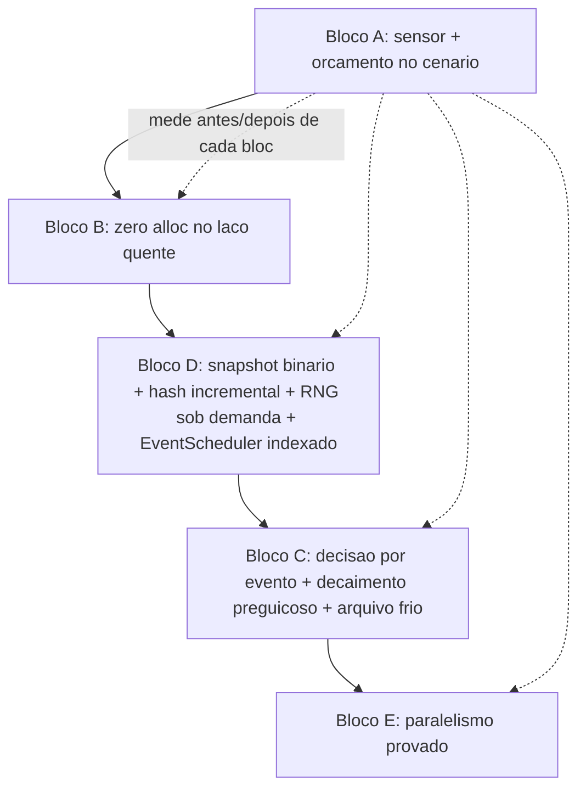

# Fase 9 (Escala e armazenamento) Design

**Spec**: `.specs/features/phase-09-scale/spec.md`
**Status**: Draft

---

## Architecture Overview

Sem mudar a forma do mundo (nenhum ECS novo), o tick para de custar `O(NPCs que já existiram)`
e passa a custar `O(decisões tomadas)`. Três eixos, na ordem em que a spec exige (A → B → D → C
→ E, sensor primeiro por ser o único jeito de provar ganho):



**Por que essa ordem, não a do enunciado (A-B-C-D-E-F):** Bloco C muda o mundo (novo golden
hash) — fazer B e D primeiro estabiliza o formato de storage e remove alocação antes de mexer em
semântica de decisão, isolando o diff que precisa de AD + golden novo. Bloco F (disciplina) não é
uma fase — é a regra "sensor roda antes/depois de cada task", aplicada a todas as outras.

**O que NÃO muda:** `Npc` continua array-of-structs (classe), sem ECS/SoA (PERF-17: só entra se
A-E não fecharem o teto, decisão medida no fim, não antecipada). Nenhum provider novo, nenhum
round-trip de DB no tick (invariante da Fase 3 preservado).

---

## Code Reuse Analysis

### Existing Components to Leverage

| Component | Location | How to Use |
|---|---|---|
| `EventScheduler` (`_byTick: SortedDictionary<long, List<ScheduledEvent>>`) | `src/LivingWorld.Simulation/EventScheduler.cs` | Bloco C agenda "acordar NPC" nele em vez de criar mecanismo novo; Bloco D só troca `Cancel` de scan-all-buckets para índice por id |
| `WorldRngRegistry` (`SortedDictionary<string, WorldRng>`, `StableHash`) | `src/LivingWorld.Domain/WorldRngRegistry.cs` | Já deriva stream de `(seed, propósito)` via FNV-1a — Bloco D estende a mesma derivação para incluir `id` e descarta streams de rolagem única em vez de reter todas |
| `WorldSnapshot.CanonicalHash`/`VolatileHash` (reflection sobre `[Canonical]`/`[Volatile]`) | `src/LivingWorld.Simulation/WorldSnapshot.cs` | Bloco D não troca o particionamento canônico/volátil (ADR-0014) — só troca *como* o canônico é serializado (binário posicional) e *como* o hash é computado (incremental por entidade suja, mesmo resultado) |
| Padrão `record` + `static Result<T> Create(...)` (`EconomyRules`, `FamilyRules`, `NeedsRules`) | `src/LivingWorld.Domain/Economy/EconomyRules.cs` | Novo `PerfRules` (Bloco A/F) segue o mesmo padrão — nenhum teto literal em C# |
| `ScenarioRunner.Create(seed, maxIterationsPerTick, initialPopulation, economyRules?, familyRules?)` | `src/LivingWorld.Simulation/ScenarioRunner.cs` | Ganha `perfRules?` opcional, mesmo padrão dos overrides já existentes; novo cenário de escala com demografia estável é um `Default*` a mais, não assembly nova |
| `tests/baselines/*.json` + `BaselineFixture` | `tests/LivingWorld.Tests/Baselines/` | Bloco A registra os tetos (µs/NPC-tick, bytes/tick, bytes/NPC-vivo/ano) como baseline versionado, mesmo mecanismo já usado para população/skills |
| Determinismo em dois processos (já existe como invariante de gate) | `scripts/verify.sh` | Toda task dos Blocos B/D/E roda esse teste sem modificação — índice novo é o risco nomeado no PERF-07/PERF-14 |

### Integration Points

| System | Integration Method |
|---|---|
| `Hourly` systems (`BehaviorDecisionSystem`, needs decay) | Passam a iterar um índice de vivos derivado de `WorldState`, não `world.Npcs` inteiro |
| `MarketPricingSystem`/`EmploymentSystem`/`ProductionSystem` (Daily) | Ganham cache por-tick (população por região, `NearestMarket` por célula) calculado uma vez no início do tick, lido N vezes |
| `WorldClock`/tick loop | Dispara o sensor (Bloco A) como teste de gate, não como sistema em produção |
| API/CLI de inspeção (`GET /npcs/{id}`, `inspect-npc`, Fase 8) | Precisa saber ler NPC arquivado em tier-2 frio (Bloco C, PERF-10) — mesma `NpcInspectionQuery` (AD-020), ramo novo para "frio" |

---

## Components

### `PerfRules` (novo)

- **Purpose**: Declarar tetos de custo (µs/NPC-vivo-tick, bytes/NPC-tick, bytes/NPC-vivo/ano,
  janela `N` de arquivamento frio) como dado de cenário, nunca constante de teste (PERF-03).
- **Location**: `src/LivingWorld.Domain/Performance/PerfRules.cs`
- **Interfaces**:
  - `static Result<PerfRules> Create(double maxMicrosPerAliveNpcTick, long maxBytesAllocPerTick, long maxBytesPerAliveNpcPerYear, int coldArchiveAfterYears): Result<PerfRules>`
- **Dependencies**: `Result<T>` (padrão já usado por `EconomyRules`/`FamilyRules`)
- **Reuses**: Padrão record+factory de `EconomyRules.cs`

### `AliveNpcIndex` (novo)

- **Purpose**: Índice derivado (fora do hash canônico) da lista de NPCs vivos, mantido
  incrementalmente em nascimento/morte, consumido por todo sistema `Hourly`.
- **Location**: `src/LivingWorld.Simulation/AliveNpcIndex.cs`
- **Interfaces**:
  - `IReadOnlyList<Npc> Alive` — vivos em ordem de id (determinismo)
  - `void OnBorn(Npc npc)` / `void OnDied(Npc npc)` — chamado por `NatalitySystem`/`MortalitySystem`
  - `static AliveNpcIndex RebuildFrom(WorldState world)` — reconstrução na rehidratação (índice nunca é serializado)
- **Dependencies**: `WorldState.Npcs` (fonte da reconstrução)
- **Reuses**: Mesmo princípio de "derivado, fora do hash" que os índices de mercado/vaga abaixo

### `MarketIndex` / `VacancyIndex` / `RegionPopulationIndex` (novos, mesma família)

- **Purpose**: Substituir as cadeias LINQ per-NPC-tick (`NearestMarket`, `Workplaces.Where(...)`
  em `EmploymentSystem`/`ProductionSystem`) por uma estrutura recomputada **uma vez por tick**
  (ou por dia, conforme a cadência do sistema) e consultada por lookup O(1)/O(log n).
- **Location**: `src/LivingWorld.Simulation/Economy/MarketIndex.cs` (e irmãos no mesmo diretório)
- **Interfaces**:
  - `MarketIndex.BuildForTick(WorldState world, EconomyCatalog catalog): MarketIndex`
  - `Workplace? NearestTo(CellId origin)` — substitui `NearestMarket` (PERF-05)
- **Dependencies**: `EconomyCatalog.MarketLocationTypeIds`
- **Reuses**: Mesma ideia de índice-derivado-reconstruído-na-rehidratação do `AliveNpcIndex`

### `NpcWakeScheduler` (novo, sobre `EventScheduler` existente)

- **Purpose**: Agenda o próximo tick em que cada NPC precisa de decisão — fim da ação corrente ou
  cruzamento de limiar de necessidade (fórmula fechada, PERF-08/PERF-09) — em vez de o `Hourly`
  varrer todo mundo.
- **Location**: `src/LivingWorld.Simulation/Behavior/NpcWakeScheduler.cs`
- **Interfaces**:
  - `void ScheduleWake(long npcId, long targetTick)` — delega para `EventScheduler.Schedule`
  - `long NextThresholdCrossing(NeedState need, long nowTick)` — fórmula fechada do decaimento linear
- **Dependencies**: `EventScheduler` (Bloco D já indexado por id, PERF-14), `NeedsRules` (taxa de decaimento)
- **Reuses**: `EventScheduler` — não cria fila paralela

### `LazyNeed` (substitui os 4 campos escritos por hora)

- **Purpose**: Necessidade representada por `(valorNaUltimaMudanca, tickDaUltimaMudanca, taxa)`;
  valor materializado só quando lido (`ValueAt(tick)`), nunca escrito por tick.
- **Location**: `src/LivingWorld.Domain/Population/LazyNeed.cs`
- **Interfaces**:
  - `double ValueAt(long tick)` — `valorNaUltimaMudanca - taxa * (tick - tickDaUltimaMudanca)`, clamp em `[0, max]`
  - `LazyNeed WithEvent(double delta, long tick)` — nova escrita só em evento (comer, dormir, etc.)
- **Dependencies**: Nenhuma nova — mesma semântica hoje escrita eager
- **Reuses**: Substitui campo existente em `Npc.Needs`, mesmo contrato de leitura externo

### `ColdTierArchive` (novo, tier-2)

- **Purpose**: NPC morto há mais de `PerfRules.ColdArchiveAfterYears` sai do estado quente
  (`WorldState.Npcs`) para uma tabela/estrutura separada; log de eventos vira resumo periódico.
  Id referenciado por vivo nunca é arquivado (guard de integridade referencial, reusa o sweep
  já existente desde a Fase 3).
- **Location**: `src/LivingWorld.Simulation/Population/ColdTierArchive.cs`
- **Interfaces**:
  - `bool TryArchive(Npc deadNpc, long nowTick, PerfRules rules): bool` — recusa se ainda referenciado
  - `NpcSummary? Lookup(long npcId)` — leitura fria para inspeção (API/CLI)
- **Dependencies**: Sweep referencial genérico (Fase 3) para checar "ainda referenciado por vivo"
- **Reuses**: Mesmo compromisso do ADR-0007 (cânone limitado), aplicado a NPC em vez de relato

### `BinarySnapshotWriter`/`IncrementalHasher` (novos)

- **Purpose**: Formato posicional próprio substitui JSON no snapshot canônico; grava só entidade
  suja desde o snapshot anterior (delta) + full periódico declarado no cenário; hash combina hash
  por entidade (ordem de id), byte-idêntico ao hash recomputado do zero.
- **Location**: `src/LivingWorld.Simulation/Snapshot/BinarySnapshotWriter.cs`, `IncrementalHasher.cs`
- **Interfaces**:
  - `void WriteDelta(WorldState world, IReadOnlySet<long> dirtyIds, Stream output)`
  - `WorldState ReadAndApply(Stream input, WorldState baseline)` — round-trip
  - `string CombineIncremental(IReadOnlyDictionary<long, string> perEntityHash)` — ordem de id, mesmo algoritmo de combinação usado em `CanonicalHash` hoje
- **Dependencies**: `WorldSnapshot` existente (reaproveita a classificação `[Canonical]`/`[Volatile]`, só troca serialização)
- **Reuses**: `WorldSnapshot.CanonicalHash` como referência de "hash do zero" no teste de equivalência (PERF-12)

### `WorldRngRegistry` (estendido, não novo)

- **Purpose**: PERF-13 — stream de rolagem única (`mortality-{npcId}`, `personality-{npcId}`,
  `profession-{npcId}`) passa a ser derivado sob demanda de `(seed raiz, propósito, id)` e
  descartado após uso; só stream consumido repetidamente (ex.: RNG de tick geral) persiste no
  snapshot.
- **Location**: `src/LivingWorld.Domain/WorldRngRegistry.cs` (modificação, não arquivo novo)
- **Interfaces**: `WorldRng StreamFor(string purpose, long npcId)` — novo método sobre a mesma `StableHash`, sem registrar no `_byTick`/`SortedDictionary` persistido
- **Dependencies**: Nenhuma nova
- **Reuses**: `StableHash` já existente — mesma sequência de números, garantida por teste de replay

---

## Data Models

### `PerfRules`

```csharp
public sealed record PerfRules(
    double MaxMicrosPerAliveNpcTick,
    long MaxBytesAllocPerTick,
    long MaxBytesPerAliveNpcPerYear,
    int ColdArchiveAfterYears)
{
    public static Result<PerfRules> Create(...) // valida > 0 em todos os campos
}
```

**Relationships**: Consumido pelo sensor de gate (Bloco A) e por `ColdTierArchive` (Bloco C).
Declarado por cenário via `ScenarioRunner.Create(..., perfRules: ...)`, mesmo padrão de
`economyRules`/`familyRules`.

### `LazyNeed`

```csharp
public readonly record struct LazyNeed(double ValueAtLastEvent, long TickOfLastEvent, double DecayRatePerTick)
{
    public double ValueAt(long tick) => Math.Clamp(ValueAtLastEvent - DecayRatePerTick * (tick - TickOfLastEvent), 0, 100);
}
```

**Relationships**: Substitui o campo de necessidade hoje escrito por hora em `Npc`. `[Canonical]`
— os três campos (`ValueAtLastEvent`, `TickOfLastEvent`, `DecayRatePerTick`) entram no hash no
lugar do valor decaído; o valor materializado (`ValueAt`) é derivado, não persistido.

### `AliveNpcIndex` / `MarketIndex` / etc.

Todos `[Volatile]` por convenção (ADR-0014) — não entram no hash canônico, são reconstruídos do
`WorldState` na rehidratação. Nenhum tipo novo entra no snapshot canônico além de `PerfRules`
(dado de cenário, já seria persistido como as outras `*Rules`).

---

## Error Handling Strategy

| Error Scenario | Handling | User Impact (aqui: impacto no gate/CI) |
|---|---|---|
| Sensor (Bloco A) mede acima do teto declarado | Task reprovada no gate, PR não fecha | Nenhum — é o próprio propósito do sensor |
| `EventScheduler.Cancel` chamado para id já processado/inexistente | No-op idempotente (comportamento hoje já é `RemoveAll`, preservado) | Nenhum |
| Round-trip binário não bate byte-a-byte | Teste de round-trip falha antes de qualquer merge | Nenhum (nunca chega a produção) |
| `ColdTierArchive.TryArchive` chamado para NPC ainda referenciado por vivo | Retorna `false`, NPC continua quente; sweep referencial (Fase 3) detecta e falha se arquivado incorretamente | Nenhum — é o guard, não uma falha silenciosa |
| Hash incremental diverge do hash do zero | Teste de equivalência (PERF-12) falha, task não fecha | Nenhum |
| Task cujo ganho medido não justifica o diff (PERF-17) | Revertida — decisão registrada em `STATE.md`/AD | Nenhum (custo evitado é o ponto) |

---

## Risks & Concerns

| Concern | Location (file:line) | Impact | Mitigation |
|---|---|---|---|
| `ResolveWithStepCap` aloca `Func<ActionType,ActionType>` por NPC por tick Hourly | `src/LivingWorld.Simulation/Behavior/BehaviorDecisionSystem.cs:63,380` | ~1,2 GB/ano a 1.000 NPCs (medido no Problem Statement) | PERF-04: reescrever para laço explícito sem closure — coberto por T-B1 |
| `VacancyWeightOf`/`NearestMarket` fazem `Where(...).ToList()`/`OrderBy` sobre `Workplaces` por chamada | `BehaviorDecisionSystem.cs:223` e adjacências | O(NPCs × Workplaces) por tick | PERF-05/PERF-06: `MarketIndex`/`VacancyIndex` recomputados 1x/tick — T-B2..T-B4 |
| `EmploymentSystem` materializa `Npcs.OrderBy(...)` duas vezes por dia + varre `Workplaces` por NPC | `src/LivingWorld.Simulation/Economy/EmploymentSystem.cs` | O(NPCs × Workplaces)/dia | PERF-06: cache de vagas por `LocationType` — T-B4 |
| `ProductionSystem` copia `Stock`/`Employees.Select(FindNpc)` por workplace por dia | `src/LivingWorld.Simulation/Economy/ProductionSystem.cs` | Alocação evitável por dia | PERF-06: mesma task T-B4 endereça os três sistemas Daily juntos |
| `EventScheduler.Cancel` varre todos os buckets (`RemoveAll`) | `src/LivingWorld.Simulation/EventScheduler.cs` | O(eventos pendentes) por cancelamento — cresce com PERF-08, que passa a agendar por NPC | PERF-14: índice id→(tick, posição) — T-D4 |
| `WorldRngRegistry` retém toda stream de rolagem única no snapshot, mesmo após uso | `src/LivingWorld.Domain/WorldRngRegistry.cs` | Snapshot cresce O(NPCs já nascidos), não O(vivos) | PERF-13: `StreamFor` on-demand sem registrar — T-D3 |
| Nenhum teste de determinismo cobre hoje "índice derivado reconstruído bate entre rehidratação e execução contínua" | Ausente | Índice novo é a forma mais fácil de reintroduzir ordem de `Dictionary` no caminho quente (risco já nomeado no ROADMAP) | Toda task de índice (T-B2..B4, T-C-index) inclui teste de determinismo em dois processos como parte do "Done when", não como task separada |

> Nenhum concern de segurança identificado — fase é motor/storage interno, sem superfície de
> input externo novo.

---

## Tech Decisions

| Decision | Choice | Rationale |
|---|---|---|
| Ordem dos blocos | A → B → D → C → E (não a ordem alfabética do enunciado) | C muda hash; estabilizar storage/alocação antes reduz o diff que precisa de golden novo |
| Formato binário | Posicional próprio, sem dependência nova; JSON sobrevive só como export de debug | Spec já assume isso (Assumptions row); evita dependência externa (Protobuf/MessagePack) para um formato interno cujo único consumidor é o próprio motor |
| Tier-2 frio | Mesma base, tabela/estrutura separada — não arquivo à parte | Spec já assume isso; reaproveita infraestrutura de persistência existente (zero round-trip no tick permanece invariante) |
| Alive-index e Market/Vacancy-index são `[Volatile]`, reconstruídos, nunca serializados | Confirmado | Consistente com ADR-0014 (canônico vs volátil) — índice é otimização, não estado do mundo |
| `LazyNeed` é um `readonly record struct`, não `class` | Evita alocação por NPC ao trocar de valor decaído para lazy | Coerente com PERF-09/"alocação ≈ 0 por NPC-tick em regime permanente" |
| Paralelismo (Bloco E) só sobre decaimento puro, partição estável de id | Confirma o Out of Scope da spec ("paralelizar behavior-decision" fica fora — lê/escreve estoque de Household/Workplace, não é livre de ordem) | Qualquer sistema que toque estado compartilhado exige o padrão duas-fases com prova de equivalência, não entra por atalho |

> **Project-level**: nenhuma decisão aqui supera um `AD-NNN` ativo — todas conformam
> (ADR-0014 canônico/volátil, R3 nenhum literal em C#, AD-020 consulta única API/CLI). Registrar
> como AD novo no `STATE.md` só quando a task do Bloco C mudar o golden hash (regra já prevista na
> spec, não uma decisão nova de design).

---

## Tips

Ver seção `## Tips` do template do skill `tlc-spec-driven` — aplicado integralmente.
