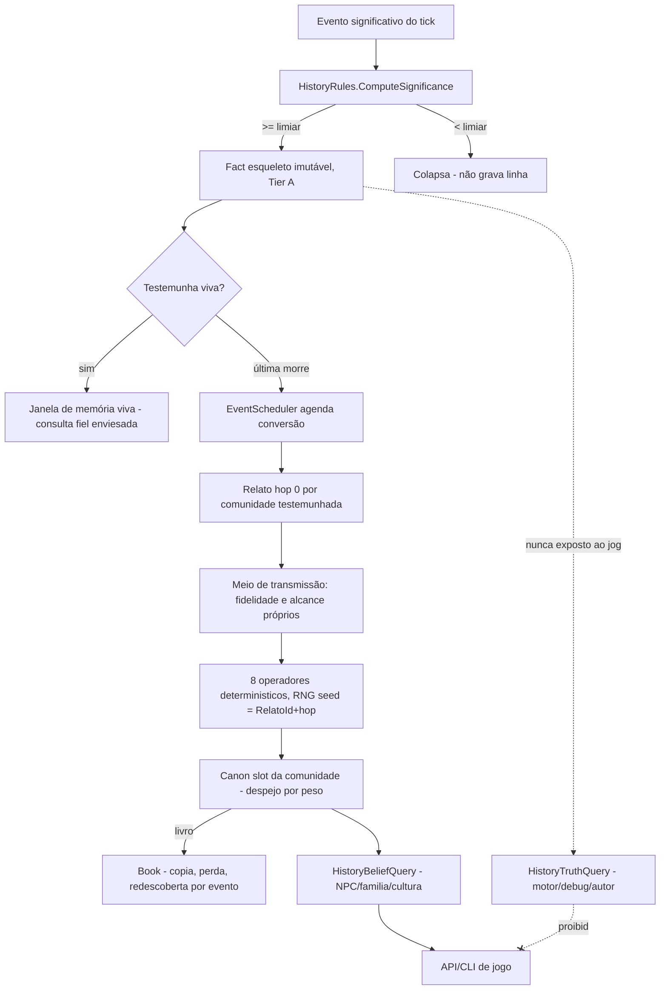

# Fase 10 (História degradável) Design

**Spec**: `.specs/features/phase-10-history/spec.md`
**Status**: Draft

---

## Contexto carregado (`.specs/STATE.md` `## Decisões`)

Decisões ativas que restringem este design, todas **conformadas** (nenhuma superada):

- **ADR-0006** (snapshot + event log append-only) — o esqueleto do fato é o Tier A do log já
  previsto; corrigir passado é sempre evento novo, nunca `UPDATE`.
- **ADR-0007** (história como relato degradável) — o ADR que esta fase implementa
  literalmente: fato → memória viva → relato, cânone limitado, duas consultas separadas,
  LLM nunca distorce. Este design não redesenha o ADR, só decide a representação interna.
- **ADR-0014** (canônico vs. volátil, `rules/simulation-determinism.md`) — todo campo novo
  precisa passar pelo teste "alguma decisão lê isto?": esqueleto do fato e estado compacto do
  relato são canônicos; conteúdo distorcido materializado é volátil (ver Tech Decisions).
- **AD-020** (consulta única compartilhada API/CLI, `NpcInspectionQuery`) — a consulta de
  Crença segue o mesmo molde: um método estático único, consumido por API e CLI, nenhuma
  lógica duplicada.
- **AD-068** (LOD pool agregado, Fase 8) — NPC não materializado não paga estado individual.
  A consulta de Crença para um NPC do pool resolve direto para o cânone da comunidade/cultura
  (ver Assumptions do spec) — nenhuma tabela de "crença por NPC agregado" é criada.
- **AD-049** (Fase 9 antes da renumeração de fases 10-27) — Fase 9 (Escala) é pré-requisito
  imediato: os índices desta fase (por ano/entidade/tipo, cânone por comunidade) seguem a
  mesma disciplina de "índice derivado, reconstruído na rehidratação, testado em dois
  processos" que a Fase 9 estabeleceu para `AliveNpcIndex`/`MarketIndex`.

Nenhuma decisão ativa conflita com o que é melhor para esta fase — todas conformadas, nenhuma
superação necessária.

---

## Architecture Overview

O fluxo central: um fato nasce no esqueleto, vive na janela de memória enquanto há
testemunha, e vira relato quando a última testemunha morre. Daí em diante o relato só
existe distorcido, transmitido por um meio, e competindo por espaço no cânone limitado da
comunidade.



**O que não muda:** nenhum ECS novo, nenhum provider de LLM (não existe ainda — Fase 11), o
log em dois tiers já decidido na Fase 3 continua sendo a fonte do esqueleto — esta fase
refina *o que* entra no Tier A (significância calculada, não só `WorldEventKind` fixo) e
adiciona o que acontece *depois* que o Tier A existe.

---

## Approach Exploration — representação do Relato e local do despejo de cânone

Decisão mais estrutural da fase: como o `Relato` é representado e onde vive o despejo de
cânone. Três opções avaliadas, todas entregam o mesmo escopo (spec não muda entre elas).

### Opção A — Relato como aggregate root completo, mutado in-place por hop

Cada hop de transmissão sobrescreve os campos distorcidos do próprio `Relato` (mesmo molde
mutável do `City`: estado agregado, atualizado por método, sem re-emitir uma linha de
histórico por hop). Um `HopLog` append-only ao lado guarda só `(RelatoId, hop, seedUsado,
operadoresAplicados)` para reprodutibilidade.

- **Prós**: leitura da Crença é O(1) — já é o estado atual, sem replay. Simples de entender.
- **Contras**: o conteúdo distorgido materializado (texto/campos derivados) vira estado
  canônico se não for cuidadosamente separado — risco de inflar o hash com dado
  recomputável, o mesmo erro que a Fase 9 corrigiu para necessidade (`LazyNeed`). Snapshot
  cresce com o número de relatos vivos × tamanho do payload distorcido.

### Opção B — Relato inteiramente derivado, recomputado a cada consulta

O cânone guarda só um registro compacto — `(RelatoId, FactId, CommunityId, Medium, HopCount,
Weight, primeiro seed)`. A consulta de Crença recomputa o conteúdo distorcido do zero,
substituindo o replay dos `HopCount` operadores sobre o payload do `Fact` a cada leitura.

- **Prós**: estado persistido é mínimo — só a metadata, nunca o payload distorcido. Cânone
  cresce estritamente com `N × comunidades`, nunca com o conteúdo.
  Casa perfeitamente com "o motor distorce" — não há nada para corromper fora do fato e da
  metadata.
- **Contras**: toda leitura de Crença paga `HopCount` aplicações de operador — barato (são
  transformações determinísticas sobre campos estruturados, não geração de texto), mas é
  custo repetido por leitura em vez de pago uma vez.

### Opção C (recomendada) — Metadata compacta canônica + payload distorcido volátil, materializado sob demanda

Combina A e B pelo mesmo princípio que a Fase 9 já aplicou a `LazyNeed`/`AliveNpcIndex`: o
que **decide** (metadata do relato: fato de origem, meio, contagem de hops, peso de cânone,
seed) é **canônico** e pequeno; o que é **recomputável** (o payload distorcido em si) é
**volátil**, materializado sob demanda e nunca serializado no snapshot canônico.

```csharp
// [Canonical] — decide o despejo de cânone, decide a consulta de Crença
public sealed record ReportState(
    ReportId Id, FactId OriginFactId, CityId CommunityId,
    TransmissionMediumType Medium, int HopCount, double Weight, long CreatedAtTick);

// volátil — recomputado por HistoryDistortionEngine.Materialize(ReportState, Fact),
// nunca persistido, mesmo espírito de LazyNeed.ValueAt(tick)
public sealed record DistortedReport(...);
```

- **Prós**: snapshot cresce só com `N × comunidades × sizeof(ReportState)` — a propriedade
  central do ADR-0007 (~130 MB de esqueleto amostrado + cânone, não 58 TB). Nenhum payload
  redundante no hash. Reaproveita literalmente o padrão já provado na Fase 9
  (`LazyNeed`/índices `[Volatile]` reconstruídos).
- **Contras**: exige que `Materialize` seja barato o bastante para custear leitura de Crença
  em jogo (mitigado: `HopCount` é limitado pelo alcance do meio, tipicamente dezenas, nunca
  milhares — mesma ordem de grandeza que a Opção B já assume como aceitável).

**Recomendação: Opção C.** É a única que estende — em vez de reintroduzir — o padrão
canônico/volátil que a Fase 9 acabou de validar, e é a que melhor cumpre a promessa central
do ADR-0007 (custo independente do tempo). Segue confirmada nesta seção; nenhuma pergunta ao
usuário é necessária porque a escolha é estritamente melhor nas duas dimensões que a spec
mede (HIST-10/HIST-11).

---

## Code Reuse Analysis

### Existing Components to Leverage

| Component | Location | How to Use |
| --- | --- | --- |
| `EventScheduler` (`_byTick: SortedDictionary<long, List<ScheduledEvent>>`) | `src/LivingWorld.Simulation/EventScheduler.cs` | Conversão fato→relato (morte da última testemunha) e `BookRediscoveryEvent` são agendados aqui — nenhuma fila paralela, mesmo padrão de `MortalitySystem.SchedulePlannedDeath` |
| `WorldRngRegistry`/`WorldRng.Derive`/`StableHash` | `src/LivingWorld.Domain/WorldRngRegistry.cs` | Stream de distorção derivado de `(seed raiz, "history-distortion", RelatoId, hop)` — mesma composição de chave já usada para `mortality-{npcId}` etc.; após a Fase 9 (T-D1), streams de rolagem única (um por hop) são `StreamFor` on-demand, não persistidos |
| `WorldEvent`/`WorldEventKind`/`IWorldEventSink` | `src/LivingWorld.Simulation/WorldEvent.cs` | `WorldEventKind` ganha os `Kind`s desta fase (`FactRecorded`, `ReportConverted`, `BookLost`, `BookRediscovered`, `CompensatingCorrection`) — mesmo enum, sem tipo novo de log |
| `EventLogRecord`/`WorldDbContext`/`IWorldRepository` | `src/LivingWorld.Infrastructure/*` | Tabela de fatos reusa o mesmo molde de `EventLogRecord` (append-only, `BranchId`+`Tick`+`Sequence`); `Domain` não conhece EF (regra já existente) |
| `[Canonical]`/`[Volatile]` (`SnapshotClassification.cs`) | `src/LivingWorld.Domain/SnapshotClassification.cs` | `ReportState`/`Fact` são `[Canonical]`; `DistortedReport` materializado é `[Volatile]`, mesmo padrão de `LazyNeed`/`AliveNpcIndex` (Fase 9) |
| Padrão `record` + `static Result<T> Create(...)` | `src/LivingWorld.Domain/Economy/EconomyRules.cs` | `HistoryRules` segue o mesmo molde — nenhum literal de limiar/N/taxa em C# (R3) |
| `City`/`CityId` como comunidade | `src/LivingWorld.Domain/Cities/City.cs` | Cânone limitado é por `CityId` (ver Assumptions do spec) — não cria agregado "Comunidade" novo |
| `NpcInspectionQuery` (AD-020, `Result<T>` único ponto de consulta) | `src/LivingWorld.Simulation/Cities/NpcInspectionQuery.cs` | `HistoryBeliefQuery` segue o mesmo molde: um método estático, chamado por API e CLI, nenhuma duplicação |
| `ArchitectureTests`/`NetArchTest` | `tests/LivingWorld.Tests/ArchitectureTests.cs` | HIST-17/HIST-18 (nenhum handler de jogo alcança Verdade) reusa `Types.InAssembly(...).Should().NotHaveDependencyOn(...)` sobre os assemblies `LivingWorld.Api`/`LivingWorld.Workers` contra o namespace de `HistoryTruthQuery` |
| Sweep de integridade referencial genérico (Fase 3) | `src/LivingWorld.Simulation/ReferentialIntegritySweep.cs` | Reusado para "todo `NpcId` participante de um `Fact` existe/existiu" — mesmo mecanismo, sem sweep novo |
| `tests/baselines/*.json` + `BaselineFixture` | `tests/LivingWorld.Tests/Baselines/` | N do cânone, taxas de distorção por meio, `X%` de colapso e `k` de complexidade de consulta — todos baseline, nunca literal (mesmo mecanismo da Fase 9) |
| `CountingCommandInterceptor` | `tests/LivingWorld.Tests/CountingCommandInterceptor.cs` | Prova de índice (HIST-20/21): conta linhas lidas por consulta de linha do tempo |
| Determinismo em dois processos (`DeterminismTwoProcessTests.cs`) | `tests/LivingWorld.Tests/` | Toda distorção/índice novo roda esse teste sem modificação — mesma disciplina da Fase 9 |

### Integration Points

| System | Integration Method |
| --- | --- |
| `MortalitySystem` (Fase 4/7) | Ganha o gancho "esta era a última testemunha viva deste `Fact`?" — agenda a conversão via `EventScheduler`, não varre por tick |
| `City` (Fase 8) | Ganha `CanonSlots: IReadOnlyList<ReportState>` como coleção canônica filha, mesmo molde de `ConstructionQueue` |
| `NpcInspectionQuery`/`GET /npcs/{id}`/`inspect-npc` (AD-020) | Ganham um campo opcional de Crença resumida (via `HistoryBeliefQuery`), nunca de Verdade |
| `WorldSnapshot` (`[Canonical]`/`[Volatile]`) | `Fact`, `ReportState`, `Book` entram no hash canônico; `DistortedReport` materializado nunca é serializado |
| API de jogo (`LivingWorld.Api`) / CLI (`LivingWorld.Workers`) | Só podem referenciar `HistoryBeliefQuery` — teste de arquitetura garante que nenhum handler referencia `HistoryTruthQuery` |

---

## Components

### `HistoryRules` (novo)

- **Purpose**: Parâmetros cenário-driven (R3) — limiar de significância, N do cânone por
  comunidade, pesos de despejo, tabela de fidelidade/alcance/condição-de-morte por meio,
  probabilidade por operador de distorção, `X%` de colapso mínimo e `k` de complexidade de
  consulta (estes dois últimos como referência a baseline, não valor embutido).
- **Location**: `src/LivingWorld.Domain/History/HistoryRules.cs`
- **Interfaces**:
  - `static Result<HistoryRules> Create(double skeletonSignificanceThreshold, int canonSizePerCommunity, IReadOnlyDictionary<TransmissionMediumType, MediumFidelity> mediumFidelity, IReadOnlyDictionary<DistortionOperator, double> operatorProbability, double importanceWeight, double transmissibilityWeight, double recencyWeight): Result<HistoryRules>`
- **Dependencies**: `Result<T>` (mesmo padrão de `EconomyRules`/`PerfRules`)
- **Reuses**: Padrão record+factory de `EconomyRules.cs`

### `SignificanceCalculator` (novo)

- **Purpose**: Calcula a significância de um evento na escrita — escopo do impacto, entidades
  afetadas, papel dos envolvidos — decidindo o que vira `Fact` no esqueleto e o que colapsa.
- **Location**: `src/LivingWorld.Simulation/History/SignificanceCalculator.cs`
- **Interfaces**:
  - `double Compute(WorldEvent evt, WorldState world, HistoryRules rules): double` — 0 a 1
- **Dependencies**: `HistoryRules`, `WorldState` (para resolver escopo/entidades afetadas)
- **Reuses**: `WorldEventKind` existente como base do "o quê"

### `Fact` (novo, esqueleto imutável)

- **Purpose**: Registro Tier A mínimo e permanente — quem, o quê, onde, quando,
  significância. Nunca mutado após a escrita.
- **Location**: `src/LivingWorld.Domain/History/Fact.cs`
- **Interfaces**: tipo `record` puro, sem métodos de mutação (ver Data Models)
- **Dependencies**: `NpcId`, `CityId`, `WorldEventKind`
- **Reuses**: Mesmo molde append-only de `EventLogRecord`/`WorldEvent`

### `LivingMemoryWindow` (novo)

- **Purpose**: Enquanto há testemunha viva, resolve consulta de fato com fidelidade alta
  (já enviesada pela testemunha) sem converter para relato.
- **Location**: `src/LivingWorld.Simulation/History/LivingMemoryWindow.cs`
- **Interfaces**:
  - `bool HasLivingWitness(Fact fact, WorldState world): bool`
  - `WitnessedAccount Recall(Fact fact, WorldState world): WitnessedAccount` — visão
    enviesada, não distorcida por operador (distorção só começa no relato)
- **Dependencies**: `Fact`, `WorldState.Npcs` (vivo/morto)
- **Reuses**: Mesmo teste de vivo/morto que `AliveNpcIndex` (Fase 9) já mantém — consulta a
  esse índice em vez de reimplementar checagem de vivo

### `FactToReportConversionScheduler` (novo, sobre `EventScheduler` existente)

- **Purpose**: Detecta a morte da última testemunha de um `Fact` e agenda a conversão para
  `Relato` hop-0 por comunidade testemunhada — via `EventScheduler`, nunca varredura por tick.
- **Location**: `src/LivingWorld.Simulation/History/FactToReportConversionScheduler.cs`
- **Interfaces**:
  - `void OnWitnessDied(NpcId witnessId, WorldState world)` — chamado por `MortalitySystem`
  - `void Convert(Fact fact, CityId community, WorldState world)` — executado no tick
    agendado, cria `ReportState` hop-0
- **Dependencies**: `EventScheduler`, `LivingMemoryWindow` (para saber se ainda há testemunha)
- **Reuses**: `EventScheduler.Schedule`/`PopDue`, mesmo padrão de
  `MortalitySystem.SchedulePlannedDeath`

### `DistortionOperators` (novo, 8 operadores como dispatch por enum — não reflexão)

- **Purpose**: As 8 transformações determinísticas (troca de atribuição, inflação de
  magnitude, compressão temporal, perda de causa, moralização, anacronismo, omissão
  conveniente, fusão de personagens) aplicadas a um `ReportState`/payload por hop.
- **Location**: `src/LivingWorld.Domain/History/DistortionOperator.cs` (enum) +
  `src/LivingWorld.Simulation/History/DistortionEngine.cs` (dispatch)
- **Interfaces**:
  - `enum DistortionOperator { AttributionSwap, MagnitudeInflation, TemporalCompression, CausalLoss, Moralization, Anachronism, ConvenientOmission, CharacterMerge }`
  - `DistortedPayload Apply(DistortionOperator op, DistortedPayload input, WorldRng rng, WorldState world): DistortedPayload`
  - `ReportState AdvanceHop(ReportState current, HistoryRules rules, WorldRngRegistry rngRegistry): ReportState` — escolhe operadores via RNG seedado por `(ReportId, hop)`, retorna `ReportState` com `HopCount+1`
- **Dependencies**: `WorldRngRegistry.StreamFor("history-distortion", reportId, hop)` (mesmo
  padrão on-demand da Fase 9, PERF-13)
- **Reuses**: `WorldRngRegistry`/`StableHash` — nenhuma fonte de aleatoriedade nova

### `TransmissionMedium` (novo)

- **Purpose**: Cada meio (memória viva, tradição oral familiar, livro/crônica,
  monumento/inscrição, canção/ditado) declara sua própria fidelidade, alcance e condição de
  morte — dado de `HistoryRules`, tipo fechado no enum.
- **Location**: `src/LivingWorld.Domain/History/TransmissionMediumType.cs` (enum) +
  `MediumFidelity` (record de parâmetros)
- **Interfaces**:
  - `enum TransmissionMediumType { LivingMemory, OralTradition, Book, Monument, Song }`
  - `record MediumFidelity(double DistortionRatePerHop, int ReachHops, DeathConditionType DeathCondition)`
- **Dependencies**: Nenhuma — dado puro
- **Reuses**: Mesmo molde de catálogo simples que `PopulationCatalog`/`EconomyCatalog` já usam

### `CanonSlotManager` (novo)

- **Purpose**: Mantém no máximo `HistoryRules.CanonSizePerCommunity` relatos vivos por
  `City`; relato novo desloca o de menor peso.
- **Location**: `src/LivingWorld.Simulation/History/CanonSlotManager.cs`
- **Interfaces**:
  - `Result<Unit> Admit(City community, ReportState report, HistoryRules rules): Result<Unit>` — calcula peso, despeja o menor se necessário
  - `double WeightOf(ReportState report, long nowTick, HistoryRules rules): double`
- **Dependencies**: `City.CanonSlots` (coleção canônica filha), `HistoryRules`
- **Reuses**: Mesmo padrão de `Result<T>` que `Workplace.Hire`/`City.Materialize`

### `Book` (novo, objeto do mundo)

- **Purpose**: Instância física de um relato transmitido por meio Livro/Crônica — pode ser
  copiada (com erro), perdida e redescoberta.
- **Location**: `src/LivingWorld.Domain/History/Book.cs`
- **Interfaces**: tipo `record`/classe simples (ver Data Models), métodos `Copy`, `MarkLost`
- **Dependencies**: `ReportState` (o relato que carrega), `DistortionEngine` (erro de
  copista é uma aplicação de hop com meio fixado em `Book`)
- **Reuses**: `DistortionOperators` (cópia com erro é só mais um hop, meio = Book)

### `BookRediscoveryEvent` (novo, via `EventScheduler`)

- **Purpose**: Redescoberta de livro perdido é sempre um evento agendado explicitamente
  (cenário ou regra declarada), nunca um sorteio implícito por tick.
- **Location**: `src/LivingWorld.Simulation/History/BookRediscoverySystem.cs`
- **Interfaces**:
  - `void ScheduleRediscovery(BookId bookId, long targetTick, WorldRng rng)`
  - `void OnRediscovered(BookId bookId, WorldState world)` — desmarca `Lost`, permite conteúdo
    contradizer o cânone vigente
- **Dependencies**: `EventScheduler`
- **Reuses**: `EventScheduler.Schedule`, mesmo padrão de `FactToReportConversionScheduler`

### `HistoryTruthQuery` (novo — motor/debug/autor, NUNCA jogo)

- **Purpose**: Único ponto de acesso ao `Fact` bruto. Não referenciado por nenhum handler de
  API/CLI de jogo — só por ferramenta de autor/depuração (fora do escopo de teste de
  arquitetura de "jogo").
- **Location**: `src/LivingWorld.Simulation/History/HistoryTruthQuery.cs`
- **Interfaces**:
  - `Result<Fact> GetFact(FactId id, WorldState world): Result<Fact>` — visão de motor
- **Dependencies**: `WorldState` (esqueleto)
- **Reuses**: Mesmo molde `Result<T>` de consulta única (AD-020), mas deliberadamente **não**
  compartilhado com `HistoryBeliefQuery` — são dois handlers, nunca um

### `HistoryBeliefQuery` (novo — único caminho do jogo)

- **Purpose**: Resolve o que um NPC, família ou cultura acredita — nunca o fato.
  Materializa o `DistortedReport` sob demanda (Opção C) a partir do `ReportState` vigente.
- **Location**: `src/LivingWorld.Simulation/History/HistoryBeliefQuery.cs`
- **Interfaces**:
  - `Result<DistortedReport> BeliefOf(NpcId believerId, FactId originFactId, WorldState world): Result<DistortedReport>`
  - `Result<DistortedReport> BeliefOf(CityId community, FactId originFactId, WorldState world): Result<DistortedReport>`
- **Dependencies**: `CanonSlotManager` (para achar o `ReportState` vigente da comunidade do
  crente), `DistortionEngine.Materialize`
- **Reuses**: AD-020 (consulta única, API+CLI), padrão de `NpcInspectionQuery`

### `LineageQuery` (novo)

- **Purpose**: Dinastias/linhagens derivadas do esqueleto (nunca tabela paralela); segue
  `MotherId`/`FatherId` já existentes em `Npc` via os `Fact`s de nascimento/morte.
- **Location**: `src/LivingWorld.Simulation/History/LineageQuery.cs`
- **Interfaces**:
  - `Result<Lineage> ReconstructFrom(NpcId descendant, WorldState world): Result<Lineage>` —
    falha explícita se detectar ciclo ou buraco
- **Dependencies**: `Fact` (nascimento/morte), `Npc.MotherId`/`FatherId` (já existentes)
- **Reuses**: Campos de parentesco já modelados desde a Fase 7 — nenhuma tabela nova

### `CompensatingCorrection` (novo)

- **Purpose**: Corrigir o passado é sempre um evento novo anexado — a linha original nunca é
  reescrita, só marcada e acompanhada da correção.
- **Location**: `src/LivingWorld.Domain/History/CompensatingCorrection.cs`
- **Interfaces**: `record CompensatingCorrection(FactId CorrectsFactId, FactId NewFactId, long Tick, string Reason)`
- **Dependencies**: `Fact` (referenciado, nunca mutado)
- **Reuses**: Mesmo espírito do "salto de branch é evento anexado, nunca `UPDATE`"
  (`rules/simulation-determinism.md`, seção Branch)

### `HistoryIndex` (novo — por ano, entidade, tipo)

- **Purpose**: Índice derivado sobre `Fact`s e `ReportState`s — consulta por ano/entidade/tipo
  sem varrer a base.
- **Location**: `src/LivingWorld.Simulation/History/HistoryIndex.cs`
- **Interfaces**:
  - `IReadOnlyList<FactId> ByYear(int year)` / `ByEntity(NpcId id)` / `ByKind(WorldEventKind kind)`
  - `static HistoryIndex RebuildFrom(WorldState world): HistoryIndex` — reconstrução na
    rehidratação, nunca serializado
- **Dependencies**: `WorldState` (fonte da reconstrução)
- **Reuses**: Mesmo princípio "derivado, `[Volatile]`, reconstruído" de `AliveNpcIndex`/
  `MarketIndex` (Fase 9)

---

## Data Models

### `Fact`

```csharp
[Canonical]
public sealed record Fact(
    FactId Id,
    long Tick,
    WorldEventKind Kind,
    IReadOnlyList<NpcId> Participants,
    CityId? Location,
    double Significance,
    string Payload); // mesmo formato de payload textual estruturado de WorldEvent.Payload
```

**Relationships**: Fonte única de `LivingMemoryWindow`, `FactToReportConversionScheduler`,
`LineageQuery`, `HistoryTruthQuery`, `HistoryIndex`. Nunca mutado após a escrita.

### `ReportState`

```csharp
[Canonical]
public sealed record ReportState(
    ReportId Id,
    FactId OriginFactId,
    CityId CommunityId,
    TransmissionMediumType Medium,
    int HopCount,
    double Weight,
    long CreatedAtTick,
    long LastHopTick);
```

**Relationships**: Filho canônico de `City.CanonSlots`. `HopCount`+`Weight` alimentam
`CanonSlotManager.Admit`. `DistortedReport` é derivado deste + `Fact` de origem.

### `DistortedReport` (volátil, nunca serializado)

```csharp
public sealed record DistortedReport(
    ReportId ReportId,
    IReadOnlyList<NpcId> AttributedParticipants, // pode divergir de Fact.Participants
    double DistortedMagnitude,
    long DistortedTick, // compressão/anacronismo desloca a data aparente
    string MoralizedNarrativeSeed, // dado estruturado, não prosa — Fase 12 narra
    double DistanceFromFact); // d(hop) — não decrescente entre hops (HIST-07)
```

**Relationships**: Materializado por `DistortionEngine.Materialize(ReportState, Fact,
HistoryRules)`, consumido só por `HistoryBeliefQuery`. `[Volatile]` — recomputável do par
`(ReportState, Fact)`.

### `TransmissionMediumType` / `MediumFidelity`

```csharp
public enum TransmissionMediumType { LivingMemory, OralTradition, Book, Monument, Song }

public sealed record MediumFidelity(
    double DistortionRatePerHop,
    int ReachHops,
    DeathConditionType DeathCondition); // ex.: LineageExtinct, Decay, StateCollapse
```

**Relationships**: Dado de `HistoryRules`, uma entrada por `TransmissionMediumType`.

### `Book`

```csharp
[Canonical]
public sealed record Book(
    BookId Id,
    ReportId CarriesReportId,
    BookId? CopyOfBookId,
    bool Lost,
    long? LostAtTick,
    long? RediscoveredAtTick);
```

**Relationships**: Carrega um `ReportState` (via meio `Book`); `CopyOfBookId` encadeia cópias;
`Lost`/`RediscoveredAtTick` nunca apagam a linha, só marcam.

### `CanonSlot` (coleção, não tipo próprio)

Representado como `City.CanonSlots: IReadOnlyList<ReportState>` — não é um tipo novo, é a
coleção canônica filha de `City` (mesmo molde de `City.ConstructionQueue`). Evita um agregado
extra sem leitor próprio (ladder: reusar `City` como container).

---

## Error Handling Strategy

| Error Scenario | Handling | User Impact |
| --- | --- | --- |
| `UPDATE`/`DELETE` direto na tabela de fatos | Constraint de banco rejeita ambos (trigger/constraint de imutabilidade, não só checagem em `Domain`) | Nenhum — o teste tenta de propósito e espera falha |
| `HistoryRules.Create` com `CanonSizePerCommunity <= 0` ou taxa de distorção fora de `[0,1]` | `Result<HistoryRules>.Fail` nomeando o campo, mesmo padrão de `EconomyRules`/`PerfRules` | Nenhum — cenário mal declarado não sobe |
| `CanonSlotManager.Admit` chamado com cânone já cheio e todos os pesos empatados | Desempate determinístico por `ReportId` (nunca ordem de iteração), mesma disciplina de `rules/simulation-determinism.md` | Nenhum |
| `HistoryBeliefQuery.BeliefOf` chamado para um `FactId` sem nenhum `ReportState` na comunidade (relato nunca chegou lá) | `Result<DistortedReport>.Fail` explícito — "esta comunidade nunca ouviu falar deste fato" é resposta válida, não erro silencioso | Aplicação de jogo trata como "NPC não sabe disso" |
| `BookRediscoverySystem.OnRediscovered` chamado para livro não perdido | `Result<Unit>.Fail` — no-op idempotente reportado, não exceção | Nenhum |
| `HistoryTruthQuery` referenciado por um handler de API/CLI de jogo | Falha em tempo de build/teste de arquitetura (NetArchTest), antes de chegar a produção | Nenhum — é o próprio propósito do gate |
| Distorção invocaria um provider de LLM | Fake provider injetado em teste lança exceção se `Complete`/`Generate` for chamado durante `DistortionEngine.Apply` | Nenhum — é o próprio propósito do teste (HIST-06 AC3) |

---

## Risks & Concerns

| Concern | Location (file:line) | Impact | Mitigation |
| --- | --- | --- | --- |
| `WorldEventKind` hoje é um enum fechado de "o que já vira Tier A" (Fase 3-8) — nenhum campo de significância calculada existe ainda | `src/LivingWorld.Simulation/WorldEvent.cs:6-44` | Sem `SignificanceCalculator`, todo evento hoje listado no enum é Tier A por definição de kind, não por impacto medido — introduzir significância pode reclassificar eventos que hoje sobrevivem | `SignificanceCalculator` roda **antes** da decisão de gravar o `Fact`; o teste "100% dos eventos ≥ limiar sobrevivem íntegros" cobre a regressão |
| `EventScheduler.Cancel` ainda varre todos os buckets antes da Fase 9 T-D2 fechar | `src/LivingWorld.Simulation/EventScheduler.cs:31-39` | Se a Fase 9 (índice por id) não estiver concluída antes desta fase iniciar, `FactToReportConversionScheduler`/`BookRediscoverySystem` herdam o custo O(eventos pendentes) por cancelamento | Nenhuma ação nesta fase — é dependência de sequenciamento (Fase 9 fecha antes, conforme `STATE.md` "Próxima unidade"), não um problema desta fase criar |
| `WorldRngRegistry` retém toda stream no snapshot antes da Fase 9 T-D1 (`StreamFor` on-demand) fechar | `src/LivingWorld.Domain/WorldRngRegistry.cs:7-29` | Um stream por `(ReportId, hop)` sem `StreamFor` on-demand faria o snapshot crescer O(hops já ocorridos), reintroduzindo o mesmo problema que a Fase 9 resolveu para NPCs | Esta fase consome `StreamFor` (já disponível após Fase 9), nunca `RegisterOrGet` — task explícita no tasks.md aponta a dependência |
| Nenhum teste hoje cobre "índice derivado reconstruído bate entre rehidratação e execução contínua" para um domínio novo (história) | Ausente | `HistoryIndex`/`CanonSlotManager` são exatamente o tipo de estrutura que reintroduz ordem de `Dictionary` no caminho de decisão (mesmo risco nomeado no design da Fase 9) | Toda task de índice desta fase inclui teste de determinismo em dois processos como parte do "Done when", nunca como task separada (mesma disciplina) |
| `City` (Fase 8) não tem hoje nenhuma noção de "testemunha" ou vínculo fato↔comunidade — vínculo precisa ser inferido de `Fact.Location`/`Fact.Participants` | `src/LivingWorld.Domain/Cities/City.cs` | Se a inferência de "quais comunidades testemunharam este fato" for ambígua (NPC viajante, fato sem `Location`), a conversão para relato pode duplicar ou perder cânone | `FactToReportConversionScheduler.Convert` declara explicitamente a lista de comunidades-alvo no momento da conversão (a partir de onde os participantes residiam/estavam no tick do fato) — nunca inferido silenciosamente depois |
| Distorção "barata" (Opção C) ainda não tem medição real de custo de `Materialize` por leitura | N/A (componente novo) | Se `HopCount` crescer sem limite (meio de altíssimo alcance, ex. Monumento "milênios"), `Materialize` pode ficar caro por leitura de Crença repetida | `MediumFidelity.ReachHops` limita o `HopCount` prático por meio; se a medição (task de sensor) mostrar custo alto, cache volátil transiente (mesmo padrão de índice recomputado 1x/tick) é o próximo passo — não implementado preventivamente (YAGNI) |

> Nenhum concern de segurança de rede/input externo — fase é motor interno, sem superfície
> nova de input de usuário. O concern de segurança real é a fronteira Verdade/Crença, já
> coberto pelo par de mutação obrigatório em HIST-17/18.

---

## Tech Decisions

| Decision | Choice | Rationale |
| --- | --- | --- |
| Representação do Relato | Opção C — metadata canônica compacta (`ReportState`) + payload distorcido volátil materializado sob demanda | Estende o padrão canônico/volátil já provado na Fase 9 (`LazyNeed`); é a única opção que garante literalmente a propriedade central do ADR-0007 (custo independente do tempo) |
| Distorção como dispatch por enum, não reflexão | `enum DistortionOperator` + `switch`/dispatch explícito em `DistortionEngine.Apply` | 8 operadores é uma lista fechada e pequena — reflexão custaria performance e clareza sem ganho (mesma filosofia de "índice por id, não scan" da Fase 9) |
| Cânone por `City`, não por agregado "Comunidade" novo | Reusa `City.CanonSlots` | `City` já é o agregado de comunidade desde a Fase 8; criar um tipo novo duplicaria o que já existe |
| Tradição familiar como escopo de alcance, não cânone próprio | `TransmissionMediumType.OralTradition` com `ReachScope = HouseholdId`, filtrado sobre o mesmo cânone da comunidade | Evita um segundo mecanismo de cânone por família — um mecanismo, filtrado por escopo |
| NPC do pool agregado (AD-068) resolve Crença direto para cânone da comunidade | Confirmado, sem estado de crença individual para não-materializado | Conforma ao LOD agregado — não paga estado individual para quem nunca foi individual |
| `HistoryTruthQuery`/`HistoryBeliefQuery` são dois tipos físicos distintos, não um método com flag | Dois arquivos, dois métodos, dois namespaces reforçáveis por `NetArchTest` | Um método com `bool includeTruth` seria a mesma fronteira, mas testável por convenção, não por estrutura — a spec exige prova estrutural (HIST-17), não disciplina de code review |
| Redescoberta de livro é sempre evento agendado, nunca varredura+sorteio por tick | `BookRediscoverySystem.ScheduleRediscovery` via `EventScheduler` | Literal do roadmap ("evento declarado, não um acaso") — consistente com "coisa rara e datável não vira varredura por tick" (`rules/simulation-determinism.md`, seção Frequência de tick) |

> **Project-level:** a escolha da Opção C (representação do Relato) e a decisão de dois tipos
> físicos para Verdade/Crença estabelecem convenção para qualquer consulta futura sensível
> (ex.: Fase 11 LLM-narração, Fase 23 intriga) — **candidatas a registrar como `AD-069`/`AD-070`
> em `STATE.md`** quando a fase for aprovada para Tasks/Execute. Não registradas aqui — só
> flagueadas, conforme a nota do template.

---

## Tips

Ver seção `## Tips` do template do skill `tlc-spec-driven` — aplicado integralmente.
