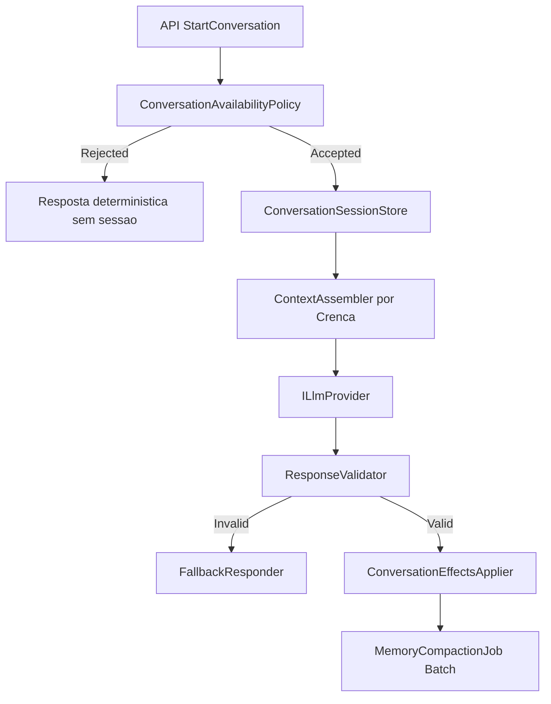

# Fase 11 (Interacao com LLM) Design
**Spec**: `.specs/features/phase-11-llm/spec.md`  
**Status**: Draft (abordagem confirmada: modelo oportunista com recusa/aceite)

## Architecture Overview
Abordagens consideradas (Large/Complex):
| Opção | Como funciona | Trade-off |
| --- | --- | --- |
| Interrupção total | NPC sempre para ao aceitar conversa | Simples, mas artificial e quebra OBS2 |
| Agendamento puro | Quase toda conversa vira "volte depois" | Realista, mas frustra UX |
| **Oportunista (escolhida)** | NPC pode recusar; se aceitar, continua ação compatível e só pausa ação incompatível | Equilíbrio entre realismo e jogabilidade |



## Code Reuse Analysis
| Reuso | Local | Uso no design |
| --- | --- | --- |
| `ILlmProvider`/`FakeLlmProvider`/`NullLlmProvider` | `src/LivingWorld.AI/*.cs` | Mantém fronteira de leitura; provider real entra sem quebrar testes |
| `BehaviorDecisionSystem` | `src/LivingWorld.Simulation/Behavior/BehaviorDecisionSystem.cs` | Fonte de ação corrente para decidir se conversar é compatível |
| `EventScheduler`/`TickContext.ScheduleEvent` | `src/LivingWorld.Simulation/EventScheduler.cs`, `TickContext.cs` | Timeout, retry e expiração de sessão sem varredura por tick |
| `NpcInspectionQuery` pattern | `src/LivingWorld.Simulation/Cities/NpcInspectionQuery.cs` | Query dedicada para Crença (não misturar com Verdade) |

## Components
1. `ConversationAvailabilityPolicy` (`src/LivingWorld.Simulation/Llm/`)  
   Decide `Accepted/Rejected` com motivo determinístico usando ação atual, necessidades urgentes e relação.
2. `ConversationSession` + `ConversationSessionStore` (`src/LivingWorld.Simulation/Llm/`)  
   Sessão por `SessionId`, `NpcId`, `OpenedAtTick`, `Status`, `LastTurn`, com expiração por scheduler.
3. `NpcBeliefQuery` (`src/LivingWorld.Simulation/History/`)  
   Consulta apenas crença do NPC/família/cultura para montar contexto.
4. `LlmContextAssembler` (`src/LivingWorld.Simulation/Llm/`)  
   Constrói contexto com memória operacional/episódica/semântica/social/cultural + relatos distorcidos.
5. `LlmResponseValidator` (`src/LivingWorld.Simulation/Llm/`)  
   Pipeline único: parse DTO -> schema -> `proposedActions subset of AllowedActions(npc,ctx)`.
6. `ConversationEffectsApplier` + `FallbackResponder` (`src/LivingWorld.Simulation/Llm/`)  
   Aplica apenas efeitos válidos; fallback nunca grava fato canônico novo.
7. `MemoryCompactionJob` (`src/LivingWorld.Simulation/Llm/`)  
   Job batch periódico fora do tick crítico para compactar memória de baixa importância.

## Data Models
```csharp
public enum ConversationStartDecision { Accepted, RejectedBusy, RejectedHostile, RejectedUnavailable }
public enum ConversationCompatibility { Compatible, RequiresPause, Forbidden }
public sealed record ConversationSession(Guid SessionId, NpcId NpcId, long OpenedAtTick, long LastTurnTick, bool IsActive);
public sealed record AllowedActionsContext(IReadOnlyList<string> AllowedActions, ConversationCompatibility Compatibility);
public sealed record ValidatedLlmTurn(string Dialogue, string Emotion, string Intent, IReadOnlyList<string> ProposedActions, IReadOnlyList<MemoryCandidate> MemoryCandidates);
```

## Error Handling Strategy
| Scenario | Handling | Player impact |
| --- | --- | --- |
| NPC indisponível para conversar | Rejeita com motivo determinístico | Feedback imediato |
| Timeout/erro/provider down | `FallbackResponder` determinístico | Conversa continua degradada |
| DTO inválido/ação proibida | Rejeição total + log + fallback | Sem corrupção de mundo |
| Sessão expirada/morta | Encerrar sessão e bloquear turnos | Reabrir com novo NPC/tentativa |

## Risks & Concerns
| Concern | Location | Impact | Mitigation |
| --- | --- | --- | --- |
| API atual usa mundo efêmero (`seed:1`) | `src/LivingWorld.Api/Program.cs:15` | Conversa não persiste entre processos | Fase 11 cria query/handlers sobre estado hospedado real e sessão explícita |
| Contexto LLM atual é mínimo (`summary+utterance+intents`) | `src/LivingWorld.AI/ILlmProvider.cs:5` | Não suporta crença/memória/ações permitidas | Expandir `LlmContext` sem quebrar contrato de leitura |
| Decisão de ação é fortemente orientada a necessidades | `src/LivingWorld.Simulation/Behavior/BehaviorDecisionSystem.cs:47` | Conversa pode parecer "teleporte social" | Política oportunista usa compatibilidade com ação corrente e pode recusar |
| Lacuna de testes de fronteira Verdade vs Crença em jogo | `.specs/features/phase-11-llm/spec.md` | Risco de onisciência | Teste por reflexão + par de mutação obrigatórios |

## Tech Decisions
| Decision | Choice | Rationale |
| --- | --- | --- |
| Política padrão de início de conversa | Oportunista com recusa/aceite | Atende realismo (OBS2) sem matar UX |
| Tratamento de ação corrente durante conversa | Continuar ação compatível; pausar só incompatível | Atende OBS1 sem congelar NPC por padrão |
| Governança da LLM | LLM nunca escreve mundo; motor valida e aplica | Mantém determinismo e segurança de domínio |
