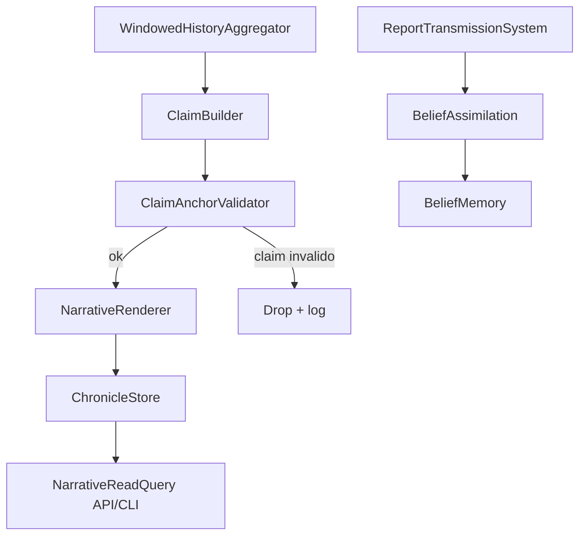

# Fase 12 (Narrativa) Design
**Spec**: `.specs/features/phase-12-narrative/spec.md`  
**Status**: Draft

## Contexto carregado
- `STATE.md` (handoff + decisões ativas): manter determinismo, separar Verdade vs Crença, respeitar append-only (ADR-0006).
- `.specs/features/phase-10-history/design.md`: relato estruturado (`ReportState`) e distorção são do motor.
- `rules/llm-boundary.md` + `docs/domain/llm-contract.md`: LLM só narra; não escolhe fatos, distorções ou efeitos no mundo.

## Architecture Overview
Abordagens avaliadas para geração de narrativa:

| Opção | Como funciona | Trade-off |
| --- | --- | --- |
| Template-only | Sempre renderiza texto com templates determinísticos | Mais barato e seguro, mas baixa qualidade textual |
| LLM-only | LLM gera tudo direto dos eventos | Quebra fronteira de ancoragem e aumenta risco/custo |
| **Estruturada + renderização (recomendada)** | Motor gera `claims[]` ancorados; template/LLM só verbaliza | Equilibra veracidade, determinismo e legibilidade |



## Code Reuse Analysis
| Reuso | Local | Uso no design |
| --- | --- | --- |
| `ILlmProvider` + `NullLlmProvider` | `src/LivingWorld.AI/` | Renderer com fallback determinístico obrigatório |
| `WorldEvent`/event log | `src/LivingWorld.Simulation/WorldEvent.cs` | Fonte de fatos para agregação por período |
| `EventScheduler` | `src/LivingWorld.Simulation/EventScheduler.cs` | Job periódico de crônica fora do tick diário |
| Padrão query única API/CLI | `NpcInspectionQuery` | Endpoints narrativos e leitura CLI sem duplicação de regra |
| Contrato Verdade/Crença da fase 10 | `.specs/features/phase-10-history/` | Narrativa só consome crença em jogo; verdade fica restrita ao motor |

## Components
1. `WindowedHistoryAggregator` (`src/LivingWorld.Simulation/Narrative/`)  
   Seleciona eventos por `(local, período)` e ordena por significância para NARR-05..07.
2. `ClaimBuilder` (`src/LivingWorld.Simulation/Narrative/`)  
   Gera `Claim[]` estruturado com `EventIds` obrigatórios a partir do agregado.
3. `ClaimAnchorValidator` (`src/LivingWorld.Simulation/Narrative/`)  
   Reprova claim sem ancoragem e bloqueia numeral/nome próprio sem origem em evento ancorado.
4. `NarrativeRenderer` (`src/LivingWorld.Simulation/Narrative/`)  
   Renderiza prosa por template (default) ou LLM (opcional) preservando exatamente os claims aprovados.
5. `NpcBiographyQuery` (`src/LivingWorld.Simulation/Narrative/`)  
   Monta linha do tempo de NPC por ordem cronológica e corta no tick de morte.
6. `NarrativeReadQuery` (`src/LivingWorld.Simulation/Narrative/`)  
   Serve crônicas, biografias e relatos em circulação para API/CLI.

## Data Models
```csharp
public sealed record NarrativeClaim(string Text, IReadOnlyList<long> EventIds);
public sealed record NarrativeDraft(
    CityId? Location, long PeriodStartTick, long PeriodEndTick, IReadOnlyList<NarrativeClaim> Claims);
public sealed record NarrativeDocument(
    NarrativeId Id, NarrativeType Type, string Prose, IReadOnlyList<NarrativeClaim> Claims);
```

## Error Handling Strategy
| Error Scenario | Handling | User Impact |
| --- | --- | --- |
| Claim sem `EventIds` | Descartar claim + log estruturado | Documento sai sem trecho inválido |
| LLM timeout/erro/saída inválida | Fallback template para o mesmo `NarrativeDraft` | Narrativa continua disponível |
| Evento não encontrado no quente | Resolver via índice/arquivo frio antes de falhar | Evita falso negativo de ancoragem |
| Pedido de biografia de NPC inexistente | `Result.Fail`/404 | Erro explícito, sem silêncio |

## Risks & Concerns
| Concern | Location | Impact | Mitigation |
| --- | --- | --- | --- |
| Fase 10 ainda não executada no código | `src/**/History/*.cs` (ausente) | Narrativa sem fonte estruturada real | Task inicial da fase 12 valida prereqs (Fact/ReportState/BeliefQuery) antes de implementar renderer |
| API atual usa `ScenarioRunner.Create(seed:1)` efêmero | `src/LivingWorld.Api/Program.cs:15` | Endpoints narrativos não persistem entre processos | Integrar repositório/snapshot real antes de abrir endpoints finais |
| Sem testes atuais para “nome/número órfão” | `tests/LivingWorld.Tests/` (lacuna) | Texto pode parecer ancorado sem ser | Gate dedicado de ancoragem estrutural + sensor de mutação no validador |

## Tech Decisions
| Decision | Choice | Rationale |
| --- | --- | --- |
| Unidade de publicação narrativa | `NarrativeClaim[]` obrigatório antes da prosa | Cumpre NARR-01..04 e evita extração frágil de texto livre |
| Caminho padrão de renderização | Template determinístico; LLM opcional | Determinismo e disponibilidade por padrão |
| Frequência do sistema narrativo | `Monthly` (ou menos frequente), fora do diário | Alinhado ao critério de custo da fase |
| Fronteira de dados | Jogo lê crença; verdade só no motor | Conformidade com fase 10 + `llm-boundary` |
