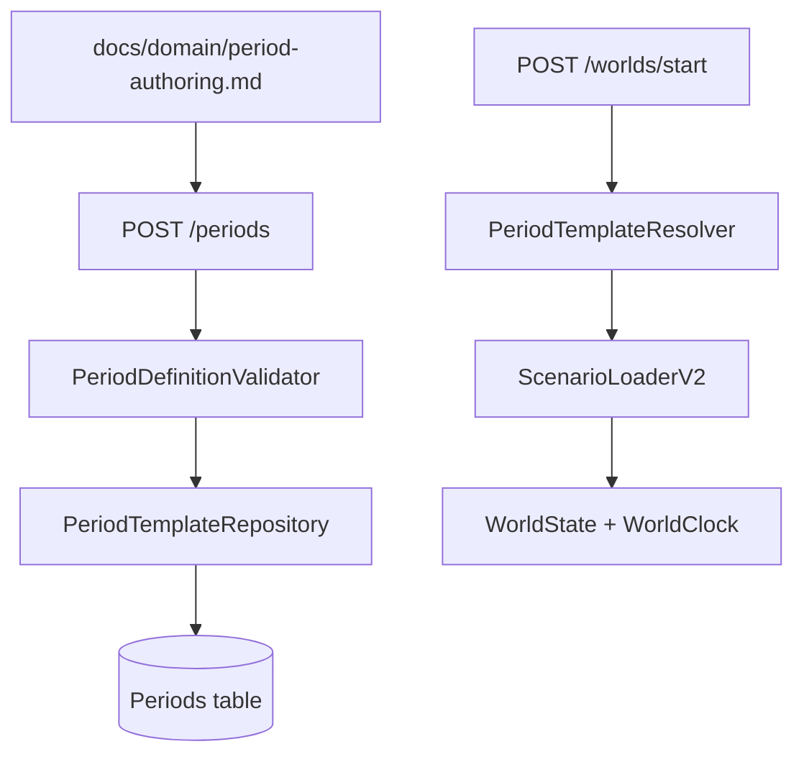

# Fase 13 (Multiplos periodos) Design
**Spec**: `.specs/features/phase-13-periods/spec.md`  
**Status**: Draft

## Contexto carregado
- `STATE.md` + `docs/roadmap/phase-13-periods.md` + spec da fase 13.
- Loaders atuais: `MapScenarioLoader`, `PopulationScenarioLoader`, `BehaviorScenarioLoader`, `EconomyScenarioLoader`, `CityScenarioLoader`.
- Integração atual: `ScenarioLoader` ainda pluga só mapa+população e cai em defaults (`src/LivingWorld.Simulation/ScenarioLoader.cs:22`).

## Architecture Overview
Opções avaliadas:

| Opção | Como funciona | Trade-off |
| --- | --- | --- |
| JSON solto por período sem cadastro | arquivo/manual fora da API | simples, mas sem governança e sem validação central |
| Cadastro em memória só no processo API | `POST /periods` sem persistência | rápido, mas perde template ao reiniciar |
| **Cadastro persistido + validador composto (recomendada)** | rota valida+persiste `periodDefinition`; criação de mundo usa template registrado | mais trabalho inicial, mas fecha requisito de template oficial |



## Code Reuse Analysis
| Reuso | Local | Uso no design |
| --- | --- | --- |
| Parse defensivo + erros por campo | `src/LivingWorld.Simulation/*ScenarioLoader.cs` | manter padrão de validação determinística |
| `Result<T>` em vez de exceção de domínio | `src/LivingWorld.Domain/` + loaders | retorno explícito na rota de cadastro |
| Persistência EF existente | `src/LivingWorld.Infrastructure/WorldDbContext.cs` | adicionar tabela de templates sem provider lock-in |
| Cenários versionados em arquivo | `scenarios/default.json`, `scenarios/test-scifi.json` | templates base da fase e exemplos da documentação |

## Components
1. `PeriodDefinitionValidator` (`src/LivingWorld.Simulation/Periods/`)  
   Encadeia loaders existentes + `PeriodDynamicsLoader` (novo) + checks referenciais entre catálogos e regras de evolução.
2. `PeriodDynamicsLoader` (`src/LivingWorld.Simulation/Periods/`)  
   Parseia bloco de vieses/startpoint e regras de transformação (nascimento/fusão/divisão/remoção).
3. `PeriodTemplateRecord` + `IPeriodTemplateRepository` (`src/LivingWorld.Infrastructure/`)  
   Persistência de template oficial: `PeriodId`, `Version`, `PayloadJson`, `CreatedAt`, `Source`.
4. `PeriodsEndpoints` (`src/LivingWorld.Api/`)  
   `POST /periods` (cadastro), `GET /periods` (catálogo), `GET /periods/{id}` (detalhe).
5. `WorldStartEndpoints` (`src/LivingWorld.Api/`)  
   `POST /worlds/start` aceita `periodId` (obrigatório) + `seed`; resolve template e cria mundo pelo mesmo pipeline.
6. `docs/domain/period-authoring.md`  
   Guia para IA externa: contrato, exemplos válidos/inválidos, checklist de validação, fluxo de envio para `POST /periods`.

## Data Models
```csharp
public sealed record PeriodTemplateRecord(
    string PeriodId, int Version, string PayloadJson, DateTime CreatedAtUtc, string Source);

public sealed record CreatePeriodRequest(string PeriodId, int Version, JsonElement PeriodDefinition, string Source);
public sealed record StartWorldRequest(string PeriodId, ulong Seed);
```

## Error Handling Strategy
| Scenario | Handling | Impacto |
| --- | --- | --- |
| `periodDefinition` inválido | `400` com `fieldPath` + motivo determinístico | corrige payload sem tentativa cega |
| `PeriodId` já existe com mesma versão | `409 Conflict` | evita sobrescrita silenciosa |
| `PeriodId` inexistente no start | `404 Not Found` | falha explícita antes de criar mundo |
| regra de evolução referencia id ausente | rejeição no validador | impede mundo inconsistente |

## Risks & Concerns
| Concern | Location | Impact | Mitigation |
| --- | --- | --- | --- |
| API hoje usa mundo efêmero fixo | `src/LivingWorld.Api/Program.cs:15` | template cadastrado não entra em uso real | introduzir `POST /worlds/start` com resolução por `periodId` |
| Loader integrado incompleto | `src/LivingWorld.Simulation/ScenarioLoader.cs:22` | parte do período ignorada no runtime | criar `ScenarioLoaderV2` plugando todos os loaders |
| Validação duplicada em loaders separados | `src/LivingWorld.Simulation/*ScenarioLoader.cs` | drift de regra por área | `PeriodDefinitionValidator` orquestra validação única por contrato |
| Lacuna de governança de versões | sem tabela de períodos hoje | mudanças quebram reprodutibilidade | versionamento explícito `PeriodId+Version` no repositório |

## Tech Decisions
| Decision | Choice | Rationale |
| --- | --- | --- |
| Forma do template | payload JSON canônico versionado | compatível com padrão atual de cenário-como-dado |
| Persistência de período | tabela própria no `WorldDbContext` | mantém templates oficiais após restart |
| Origem de autoria | IA externa via documentação, sem runtime IA interno | alinha escopo confirmado para a fase 13 |
