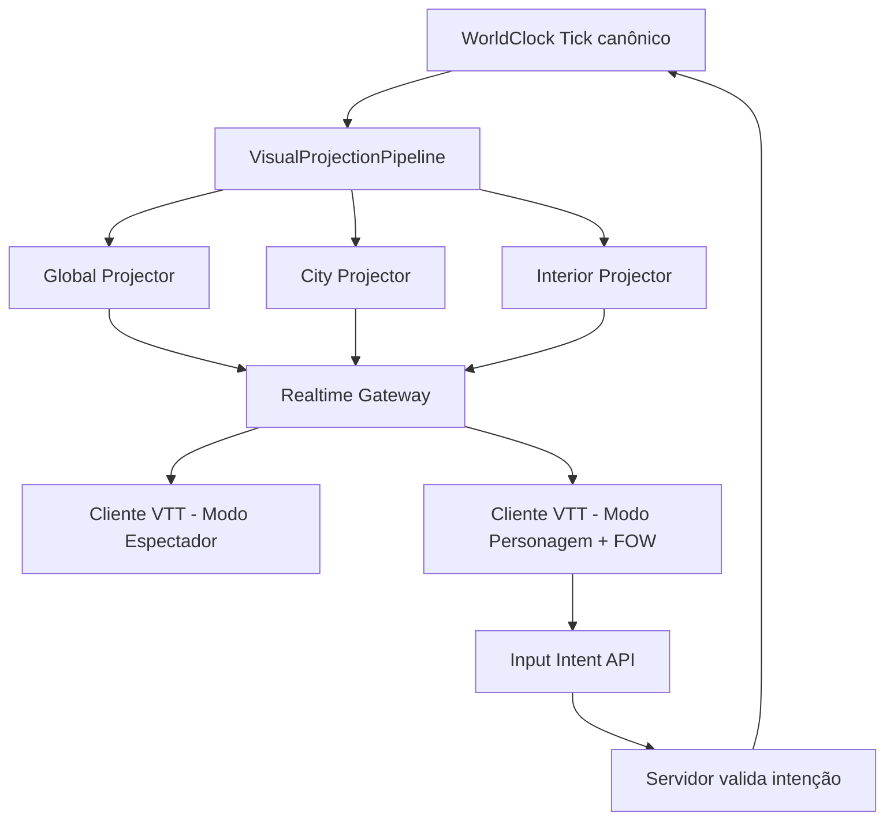

# Fase 15 (Mapa visual VTT 2D) Design
**Spec**: `.specs/features/phase-15-map-visual/spec.md`  
**Status**: Draft

## Architecture Overview
Abordagens avaliadas:

| Opção | Como funciona | Trade-off |
| --- | --- | --- |
| Simulação por câmera no motor canônico | Câmera liga/desliga sistemas e materialização canônica | Alto risco de quebrar determinismo e acoplar UX ao estado do mundo |
| Snapshot polling REST | Cliente pergunta estado por intervalo | Simples, mas perde fluidez e gera custo alto de payload |
| **Realtime por escopo de foco (recomendada)** | Tick global canônico contínuo + stream de projeções por foco (global/cidade/interior) e por camada derivada | Maior trabalho de orquestração, melhor equilíbrio imersão/performance |



## Code Reuse Analysis
| Reuso | Local | Uso no design |
| --- | --- | --- |
| Tick determinístico + host | `src/LivingWorld.Simulation/WorldClock.cs`, `SimulationHost.cs` | Clock canônico único; visual não dirige simulação de domínio |
| Consultas de cidade/NPC já existentes | `src/LivingWorld.Simulation/Cities/CityPopulationQuery.cs`, `NpcInspectionQuery.cs` | Base para projectors e drill-down |
| LOD e materialização atuais | `src/LivingWorld.Simulation/Cities/MaterializationSystem.cs` | Reusar conceitos de agregado vs detalhado, sem acoplar foco de câmera ao canônico |
| Persist/replay de snapshot | `src/LivingWorld.Infrastructure/PersistentWorldRunner.cs` | Snapshot inicial + replay determinístico para reconexão |
| Hash/invariantes | `src/LivingWorld.Simulation/WorldSnapshot.cs` + padrão de testes `tests/LivingWorld.Tests/Cities/*` | Garantir que canal visual não escreve no mundo |

## Components
1. **VisualScopeCoordinator** (`src/LivingWorld.Api/Visual/`)  
   - **Purpose**: manter assinaturas por escopo (`world`, `city:{id}`, `interior:{id}`) e modo (`spectator`, `player`).
   - **Interfaces**: `Subscribe(scope, viewer)`, `Unsubscribe(scope, viewer)`, `CurrentScopes(viewerId)`.
2. **VisualProjectionPipeline** (`src/LivingWorld.Api/Visual/`)  
   - **Purpose**: transformar tick canônico em deltas visuais por resolução e por camada.
   - **Interfaces**: `BuildSnapshot(scope, viewer)`, `BuildDelta(scope, tickRange)`.
3. **LayerProjectionCatalog** (`src/LivingWorld.Api/Visual/Layers/`)  
   - **Purpose**: registrar camadas derivadas (terreno, bioma, rios, montanhas, recursos, estradas, fronteiras, reinos, cidades, aldeias, rotas, migrações, conflitos, clima) sobre o mesmo grid.
   - **Interfaces**: `ListLayers()`, `BuildLayer(scope, layerId, world)`.
4. **RealtimeGateway** (`src/LivingWorld.Api/Realtime/`)  
   - **Purpose**: enviar snapshot+deltas por WebSocket (SSE fallback leitura).
   - **Interfaces**: `Connect(viewer)`, `Push(scope, payload)`, `Recover(cursor)`.
5. **PlayerVisibilityService** (`src/LivingWorld.Simulation/Visibility/`)  
   - **Purpose**: aplicar FOW e conhecimento por personagem.
   - **Interfaces**: `CanSee(cell, player)`, `ApplyFog(snapshot, player)`, `AdminOverride(viewerId)`.
6. **NpcTokenComposer** (`src/LivingWorld.Api/Visual/NpcTokens/`)  
   - **Purpose**: compor token 2D determinístico via catálogo de assets versionado.
   - **Interfaces**: `Compose(npc, seed)`, `LayerSetFor(npcState)`.
7. **VisualInputEndpoints** (`src/LivingWorld.Api/Program.cs` + extractions)  
   - **Purpose**: receber intenção de movimento/interação e validar no servidor.
   - **Interfaces**: `POST /visual/player/{id}/move`, `POST /visual/player/{id}/interact`.

## Data Models
```csharp
public enum VisualScopeKind { World, City, Interior }
public enum ViewerMode { Spectator, Player }
public enum VisualLayerId { Terrain, Biome, Rivers, Mountains, Resources, Roads, Borders, Kingdoms, Cities, Villages, Routes, Migrations, Conflicts, Climate }
public sealed record VisualScope(VisualScopeKind Kind, string RefId);
public sealed record VisualCursor(long Tick, string ScopeKey, long Sequence);
public sealed record NpcTokenDescriptor(string AssetPackVersion, string BaseLayer, string HairLayer, string OutfitLayer, string AccessoryLayer, string AccentColor);
public sealed record PlayerMoveIntent(long PlayerNpcId, CellCoord Target, string InputMode); // click | wasd
```

## Error Handling Strategy
| Scenario | Handling | Impacto |
| --- | --- | --- |
| Realtime desconecta | Reconnect com `VisualCursor` + replay de deltas por escopo | Continuidade visual sem reset manual |
| Intent inválida (movimento/interação) | `400` determinístico + motivo explícito; sem mudança de hash | Feedback claro ao jogador |
| Subscribe sem permissão | `403` e sem payload | Evita vazamento de dados |
| Asset layer ausente no catálogo | fallback para camada default versionada + log estruturado | Render não quebra sessão |

## Risks & Concerns
| Concern | Location | Impact | Mitigation |
| --- | --- | --- | --- |
| API atual usa mundo efêmero fixo (`seed:1`) | `src/LivingWorld.Api/Program.cs:15` | Realtime/estado de sessão ficariam fake | Extrair host de mundo persistente compartilhado para API |
| Não há cliente web no repo hoje | `LivingWorld.sln` (sem projeto web) | Fase 15 sem superfície visual executável | Adicionar projeto React+TS e integrar scripts de gate |
| Materialização atual altera estado canônico | `src/LivingWorld.Simulation/Cities/MaterializationSystem.cs:52` | Câmera poderia virar input do hash se acoplada direto | Foco visual controla stream/projeção; não liga/desliga sistemas canônicos |
| Ausência de transporte realtime existente | `src/LivingWorld.Api/Program.cs` | Sem atualização viva, UX quebrada | Introduzir gateway WS/SSE com testes de subscribe/replay |

## Tech Decisions
| Decision | Choice | Rationale |
| --- | --- | --- |
| "Simular o que está vendo" | Resolução por foco de stream/render, mantendo tick global | Imersão sem destruir determinismo |
| Realtime | WebSocket primário + SSE fallback espectador | Balanceia interatividade e robustez |
| Camadas de visualização | Catálogo de projeções derivadas sobre o mesmo grid | Garante rios/clima/etc sem duplicar estado canônico |
| Aparência de NPC | Token 2D composto por camadas versionadas | Entrega rápida e consistente antes do 3D |

## UX Pass 2 (2026-08-06) — grid real / tokens / painel lateral

### Motivação
T8 original entregou o cliente web, mas como listas/botões HTML — nenhum grid 2D de verdade era renderizado (spec.md pedia "VTT 2D", a entrega ficou textual). Usuário pediu correção: grid real, NPCs como token/dot por LOD, seleção por clique com painel lateral, editor de mapa por clique, overlay de mapa por tecla M.

### Novos componentes (cliente, `web/src/`)
1. **`GridCanvas`** (`web/src/components/GridCanvas.tsx`) — canvas genérico reusado por mapa-múndi, cidade e editor de "criar mundo": recebe dimensões, uma função opcional `cellColor(x,y)` (pintura de terreno), uma lista de marcadores `{x,y,color,id,radius}`, nível de zoom e limiar de LOD (abaixo = dot, acima = token com anel), e emite `onMarkerClick(id)`/`onCellClick(x,y)`. Não é o dono do estado — cada view decide o que os marcadores/cores significam.
2. **`colorById.ts`** (`web/src/colorById.ts`) — cor determinística por id inteiro (HSL a partir de um hash simples), usada tanto pra terreno/bioma (sem semântica de "grama"/"deserto" — o domínio só tem ids) quanto pra token de NPC. Reforça a decisão de não fingir arte curada.
3. **`SidePanel`** (`web/src/components/SidePanel.tsx`) — painel deslizante à direita, genérico (título + conteúdo + ação opcional + fechar). Usado por `WorldMapView`/`CityView` ao clicar cidade/NPC.
4. **`MapOverlay`** (`web/src/components/MapOverlay.tsx`) — reusa `WorldMapView`/`GridCanvas` em modo somente-leitura sobre um `<dialog>`/overlay, acionado por tecla M enquanto `focus.kind !== "World"` e `mode === Player`.
5. **Editor de mapa em `CreateWorldForm`**: substitui a autoria de `Cells`/`Settlements` puramente numérica por um `GridCanvas` interativo — clique pinta terreno/bioma (id selecionado num seletor), modo "assentamento" adiciona `SettlementRow`. O formulário ainda monta o mesmo JSON (`scenarioFormToJson`), só a UI de autoria do bloco `Map` muda.

### Mudança de contrato (backend)
`GlobalSnapshot` (`src/LivingWorld.Api/Visual/GlobalProjector.cs`) ganhou `Width`/`Height` (de `world.Map.Width/Height`) — sem isso o cliente não sabia os limites do grid pra desenhar (só tinha a lista de células da camada `Terrain`, que dá pra inferir bounds mas é frágil). Campo puramente de projeção (API), não estado canônico/hash — sem impacto em golden hashes.

### Limitação conhecida: prédios sem posição
`Building` (`src/LivingWorld.Domain/Cities/Building.cs`) não tem `CellCoord` — não há posição real de prédio no domínio. Em vez de adicionar um campo canônico novo (mudaria hash/goldens, escopo maior que esta passada), o cliente calcula um layout (anel ao redor do centro da cidade) só pra fins de exibição, marcado visualmente como aproximado (não é dado do servidor). Se/quando o domínio ganhar posição real de prédio, o layout client-side deve ser removido.

### Limitação conhecida: movimento mundo-múndi
"Andar até a saída" pra trocar de escopo cidade→mundo exigiria um sistema de movimento validado em escala de mapa-múndi (hoje `VisualInputEndpoints`/`RealtimeGateway` só validam movimento dentro do escopo de uma cidade). Não construído nesta passada — mantido o botão/painel de drill-down existente. Registrado em spec.md "Open Questions".
