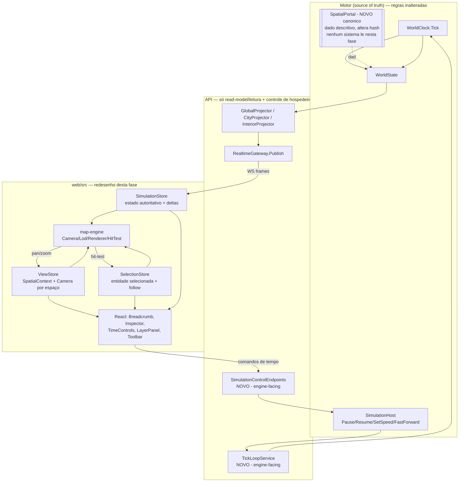

# Fase 15.1 (Redesign do frontend VTT) Design

**Spec**: `.specs/features/phase-15.1-vtt-frontend-redesign/spec.md`
**Context**: `.specs/features/phase-15.1-vtt-frontend-redesign/context.md`
**Status**: Draft — OQ-1..OQ-4 **resolvidas pelo usuário em 2026-08-06** (ver spec.md, "Decisões resolvidas"); pronto para revisão

> **Resumo das quatro decisões e do que cada uma custa:**
>
> | Decisão | Camada tocada | Impacto em hash/goldens |
> | --- | --- | --- |
> | OQ-1 footprint de cidade/prédio | `LivingWorld.Api/Visual` (projeção derivada) | **Nenhum** |
> | OQ-2 `SpatialPortal` | **`LivingWorld.Domain` + `WorldState`** (estado canônico novo) | **Sim — goldens precisam ser regravados** |
> | OQ-3 tick loop + controle de tempo | `LivingWorld.Api` + `SimulationHost` (estado de hospedeiro) | **Nenhum** |
> | OQ-4 remover Player Mode do cliente | `web/src` (só remoção) | **Nenhum** |
>
> OQ-2 é a única que fura a regra geral desta fase ("só read-model/API"). Foi escolha explícita do
> usuário, com fronteira estrita definida em spec.md (dado descritivo apenas).

---

## Decisões de projeto já ativas que este design deve respeitar

Lidas de `.specs/STATE.md` `## Decisions` antes de qualquer escolha arquitetural:

| AD | Conteúdo | Este design |
| --- | --- | --- |
| AD-001 | "Criar mundo" expõe o body de cenário campo a campo, não textarea de JSON cru | **Conforma.** O World Creator continua campo a campo; o que muda é a apresentação (progressive disclosure + edição espacial primeiro), não a exaustividade do formulário. Nenhum campo é removido. |
| AD-002 | Start menu estilo jogo, tema visual deliberadamente atemporal | **Conforma.** Mantém `StartMenu`/`global.css`; o Map Engine herda a paleta. |
| AD-003 | Grid 2D real por cor procedural determinística por id; prédios sem posição real usam layout aproximado marcado na UI | **Conforma na cor procedural, supersede a cláusula de prédios.** OQ-1 foi resolvida como projeção derivada na API: `AD-005` supersede a cláusula "layout de anel aproximado", e o anel client-side de `web/src/components/CityView.tsx:38-50` é deletado. O footprint continua sendo *derivado* (não autorado), e a UI continua obrigada a marcá-lo como tal — via `sizeIsDerived`, mais forte que a nota textual atual (`CityView.tsx:104`). |
| AD-004 | Mapa em tela cheia sem teto de tamanho além do limite técnico de canvas; wizard por abas com templates reais | **Conforma no espírito, supersede um detalhe.** O teto técnico de `MAX_CANVAS_PX = 12000` (`web/src/gridFit.ts:5`) deixa de existir quando a câmera renderiza por viewport: o canvas passa a ter o tamanho da tela, não do mundo. Isso **remove** um limite, não adiciona — mas é mudança de mecanismo e vira `AD-006`. O "wizard por abas" é substituído pelo editor visual (`AD-007`), com aprovação do usuário na spec (story P2 World Creator). |

---

## Approach Exploration (Large/Complex — obrigatório)

Todas as opções entregam o mesmo escopo da spec; diferem em **onde mora o Map Engine** e em **como o estado de simulação chega até o pixel**.

| Opção | Como funciona | Trade-off |
| --- | --- | --- |
| **A. Evoluir `GridCanvas` in-place** | Adicionar `onWheel`/drag/offset de viewport ao componente atual (`web/src/components/GridCanvas.tsx`) e manter cada view montando seus próprios marcadores. | Menor diff imediato. Mas não resolve nada do §30-33: seleção continua duplicada em duas views (`WorldMapView.tsx:23`, `CityView.tsx:29`), câmera continua morrendo na navegação (`CityView.tsx:26`), LOD continua sendo uma prop por view (`GridCanvas.tsx:50`), e o World Creator continua com um `GridCanvas` paralelo (`MapGridEditor.tsx:119-136`). Falha o requisito central de "as mesmas primitivas de mapa". |
| **B. Adotar PixiJS/Phaser** | Trocar o canvas 2D por um scene graph com sprite batching pronto. | Resolve batching/culling de graça e é o caminho natural se o mundo crescer muito. Mas: (i) adiciona ~400kB de dependência que ninguém mediu precisar — o gargalo verificado hoje é o refetch HTTP por delta (`web/src/hooks/useRealtimeSnapshot.ts:45-47`), não o desenho; (ii) reescreve todos os 6 testes de canvas existentes (`web/tests/GridCanvas.test.tsx` etc.) que fazem hit-test por coordenada real; (iii) master prompt §34 pede explicitamente "sem adicionar lib só por adicionar". |
| **C. Map Engine próprio, headless, sobre Canvas 2D (recomendada)** | Extrair um núcleo de mapa **independente de React** (`web/src/map-engine/`): `Camera`, `SpatialContext`, `LodPolicy`, `EntityStore`, `SelectionManager`, `Renderer`. React vira só a casca (HUD, inspector, breadcrumb) e um `<MapView>` fino que instancia o engine e repassa input. Observer Mode e World Creator são dois consumidores do mesmo engine, diferindo por *tools* e por *fonte de entidades*. | Mais trabalho de estrutura na T1-T3, mas é o único caminho que satisfaz §30-33 de uma vez: um lugar para câmera, um para LOD, um para seleção; render fora do ciclo de render do React (resolve "não re-renderizar milhares de NPCs por tick" sem virtualização mágica); e a porta para (B) fica aberta — trocar `Renderer` por um backend Pixi depois é substituir uma classe, não a aplicação. |

**Recomendação: C.** As primitivas nomeadas no master prompt §32 (`MapRenderer`, `Camera`, `LayerManager`, `SelectionManager`, `SpatialContextManager`, `LODManager`, `PortalManager`, `InputManager`, `SimulationPlaybackController`) mapeiam quase 1:1 para módulos de C — mas **consolidadas**: não vou criar 13 classes com uma implementação cada só porque o prompt as nomeou. `LayerManager` e `LODManager` são políticas de dados, não objetos com ciclo de vida; viram funções puras. `PortalManager` também não vira classe no cliente: com OQ-2 resolvida como dado canônico, o portal chega pronto na projeção e o cliente só o **lê** — uma função de lookup em `space.ts` basta.

---

## Architecture Overview



Regras de fluxo que o diagrama codifica:

- **Nenhuma seta sai do cliente para `WorldState`.** O único caminho de escrita do cliente é `SimulationControlEndpoints → SimulationHost`, e `SimulationHost` é explicitamente estado de hospedeiro fora do snapshot/hash (`src/LivingWorld.Simulation/SimulationHost.cs:3-4`).
- `ENG` lê os três stores mas só escreve em `VIEW` (câmera) e `SEL` (hit-test). Nunca em `SIM`.
- Interpolação vive dentro de `ENG`, derivada de `SIM`; nunca é escrita de volta.

---

## Code Reuse Analysis

### Componentes existentes a aproveitar

| Componente | Local | Como usar |
| --- | --- | --- |
| Desenho de célula/marcador em canvas 2D | `web/src/components/GridCanvas.tsx:61-131` | **Extrair** o corpo do `useEffect` para `map-engine/renderer.ts` como função pura `draw(ctx, frame)`. A lógica de fill de célula, grid lines e dot/token é boa; o que sai é o acoplamento a props de React e o dimensionamento do canvas pelo mundo (`GridCanvas.tsx:64-65`). |
| Hit-test por raio | `web/src/components/GridCanvas.tsx:133-157` | **Extrair** para `map-engine/hitTest.ts`, trocando o espaço de coordenadas de "pixel do canvas do mundo inteiro" para "pixel de tela → coordenada de mundo via câmera". |
| `colorById` | `web/src/colorById.ts:4-7` | **Reusar como está.** Ângulo áureo em HSL, determinístico, sem semântica inventada. |
| Leitura de camadas do snapshot | `web/src/worldMapData.ts:7-37` | **Reusar e generalizar** para `map-engine/layers.ts` — `terrainColorLookup` e `riverOverlayPoints` já isolam o formato de payload por camada; o `LayerPanel` passa a escolher quais rodar. |
| Guarda de escopo do envelope | `web/src/App.tsx:52` (`envelope.scope.scopeKey === focusScopeKey(focus)`) | **Reusar** dentro do `SimulationStore` — é a proteção contra renderizar payload de outro espaço; deve sobreviver ao redesenho (edge case da spec). |
| `focusScopeKey` | `web/src/types.ts:136-145` | **Reusar** como serializador de `SpatialContext` para chave de escopo da API — a regra já espelha `VisualScope.ScopeKey` (`src/LivingWorld.Api/Visual/VisualScope.cs:13-19`). |
| `SidePanel` | `web/src/components/SidePanel.tsx:10-25` | **Evoluir** para `EntityInspector`: mantém a casca (título, X, conteúdo), ganha slot de ações, pin e a regra de "não bloquear o mapa". |
| `LayerLegend` | `web/src/components/LayerLegend.tsx:10-27` | **Evoluir** para `LayerPanel` com toggles reais; a distinção `isModeled` já está lá (`LayerLegend.tsx:20-21`) e vira o estado "desabilitado com motivo". |
| Tema visual global | `web/src/styles/global.css` (AD-002) | **Reusar.** Paleta escura + dourado permanece; muda a densidade de HUD, não a paleta. |
| `computeFitZoom` | `web/src/gridFit.ts:14-23` | **Reusar** só como zoom inicial ao entrar num espaço pela primeira vez. `maxSafeZoom`/`MAX_CANVAS_PX` (`gridFit.ts:5-9`) **deixam de existir** — com viewport culling o canvas é do tamanho da tela. |
| `CreateWorldForm` + `scenarioDefaults` | `web/src/components/CreateWorldForm.tsx`, `web/src/scenarioDefaults.ts` (653 linhas) | **Reusar o modelo de dados inteiro** (`ScenarioFormState`, `scenarioFormToJson`, `jsonToScenarioForm`, `buildCells`) e **substituir só a camada de apresentação**. Nenhuma perda de campo (AD-001). |
| `formFields.tsx` (`KeyNumberListEditor`, `ObjectListEditor`) | `web/src/components/formFields.tsx` | **Reusar** como base dos editores de tabela/chips do inspector do creator. |

### Componentes existentes a substituir ou remover

| Componente | Local | Destino |
| --- | --- | --- |
| Zoom por botão `+`/`−` | `web/src/components/GridCanvas.tsx:161-178` | **Removido** — substituído por wheel/pinch na câmera. |
| Dimensionamento do canvas pelo mundo | `web/src/components/GridCanvas.tsx:64-65` | **Removido** — canvas passa a ser do tamanho do container. |
| Zoom local por view | `WorldMapView.tsx:20-22`, `CityView.tsx:26-28`, `MapOverlay.tsx:49`, `MapGridEditor.tsx:128` | **Removido** — câmera é única, por espaço, no `ViewStore`. |
| Seleção local duplicada | `WorldMapView.tsx:23`, `CityView.tsx:29` | **Removido** — `SelectionStore` único. |
| Anel de prédios client-side | `web/src/components/CityView.tsx:38-50` | **Removido** — substituído pela posição derivada de `CityBuildingMarker` (OQ-1). |
| Refetch HTTP completo por delta | `web/src/hooks/useRealtimeSnapshot.ts:45-47` | **Substituído** por aplicação incremental de delta no `SimulationStore`; refetch fica só no caminho de reconexão. |
| Superfície de Player Mode | `App.tsx:85-105,139-141`, `PlayerMoveControls.tsx`, `MapOverlay.tsx`, `App.tsx:28-39` | **Removido do cliente** (OQ-4). Backend (`VisualInputEndpoints`, `PlayerVisibilityService`, `CityVisibilityFilter`) permanece intacto e testado. |

### Integration Points

| Sistema | Método de integração |
| --- | --- |
| `GET /visual/subscribe` | Snapshot inicial por espaço, inalterado (`src/LivingWorld.Api/Realtime/RealtimeEndpoints.cs:21-27`). |
| `GET /visual/ws` | Canal de frames. Hoje o primeiro frame é snapshot e os seguintes são delta de formato heterogêneo (`RealtimeEndpoints.cs:83,90`) — esta fase precisa que o delta de tick seja tipado (ver "Contrato de delta"). |
| `GET /visual/replay` | Reconexão por cursor, inalterado (`RealtimeEndpoints.cs:29-35`). |
| `POST /worlds/create` | Contrato do World Creator, inalterado (`src/LivingWorld.Api/WorldCreateEndpoints.cs`). |
| `GET /periods`, `GET /periods/{id}` | Presets do creator, inalterado (`src/LivingWorld.Api/PeriodsEndpoints.cs`, `DefaultPeriodSeeder.cs`). |
| `GET /npcs/{id}` | Detalhe completo de NPC para o inspector (`src/LivingWorld.Api/Program.cs:103-107` → `NpcInspectionQuery.Inspect`). |
| **NOVO** `POST /simulation/{pause,resume,speed,step}` | Controle de tempo — engine-facing, só toca `SimulationHost`. |
| `vite.config.ts` proxy | Precisa de uma entrada nova para `/simulation` (o mesmo bug que já mordeu duas vezes: `/worlds` e `/periods` — ver STATE.md Handoff). |

---

## Components

### Mock Adapter / Validação offline do frontend

O usuário pediu (2026-08-07) que **todo o frontend seja construído e validado visualmente antes de
qualquer trabalho de backend**, e que a integração venha por último. Para que isso seja possível sem
duplicar código, o cliente ganha um seam de dado — e é ele que torna as tasks do Estágio 3 pequenas.

**O seam é só isto:** cada store/serviço recebe uma implementação de fonte de dado **por argumento de
construtor**. `MockXSource` e `RealXSource` implementam a mesma interface; nada mais no cliente sabe
qual das duas está viva.

```typescript
// web/src/data/sources.ts
export interface SnapshotSource   { load(space: SpaceId): Promise<VisualSnapshotEnvelope<unknown>> }
export interface TickStreamSource { subscribe(space: SpaceId, onDelta: (d: ScopeTickDelta) => void): () => void }
export interface TimeControlSource{ pause(): Promise<void>; resume(): Promise<void>
                                    setSpeed(tps: number): Promise<void>; step(): Promise<void>
                                    status(): Promise<SimulationStatus> }
export interface PortalSource     { portalsOf(space: SpaceId): SpatialPortalDto[] }

// Estágio 1:  new SimulationStore(new MockSnapshotSource(fixtures), new MockTickStreamSource(fixtures))
// Estágio 3:  new SimulationStore(new RealSnapshotSource(api),      new RealTickStreamSource(ws))
```

| Consumidor | Fonte injetada | Mock do Estágio 1 | Real do Estágio 3 |
| --- | --- | --- | --- |
| `SimulationStore` | `SnapshotSource` + `TickStreamSource` | fixtures estáticas + emissor de `ScopeTickDelta` sintético em intervalo configurável | `GET /visual/subscribe` + `GET /visual/ws` |
| `TimeControls` | `TimeControlSource` | pausa/acelera o emissor mock localmente | `POST /simulation/{pause,resume,speed,step}`, `GET /simulation/status` |
| `ViewStore` | `PortalSource` | lista de portais da fixture (≥ 2 para o mesmo par de espaços) | campo `Portals` de `GlobalSnapshot`/`CitySnapshot` |
| `Renderer` / `CityInspector` | campos do snapshot (não é interface própria) | footprint e indicadores de cidade nas fixtures | `Bounds`/`BoundsAreDerived`, `Location`/`LocationIsDerived`, indicadores de `CityPopulationQuery` |

**Regra normativa — fixtures são tipadas contra o contrato real, nunca contra um shape inventado.**
Toda fixture usa os tipos da seção Data Models acima (`ScopeTickDelta`, `NpcPositionDelta`, os shapes
de snapshot, `Portals`, campos de footprint), importados de `web/src/generated/api-types.ts` quando já
existem lá. Nenhum payload é redeclarado à mão. Se a fixture divergir do contrato, `tsc --noEmit`
falha — o drift é pego no gate do Estágio 1, não na integração.

**Consequência (a razão de as tasks do Estágio 3 serem pequenas):** trocar mock por real é escrever a
implementação real da interface e mudar o argumento no composition root (`web/src/main.tsx`). Nenhum
store, nenhum componente e nenhum assert de teste de UI muda — os testes do Estágio 1 rodam
inalterados contra a fonte real, parametrizados pela implementação. Se uma task de Estágio 3 exigir
editar um store, o seam foi violado e o diff deve ser rejeitado.

**Fronteiras:** o composition root é o **único** arquivo autorizado a nomear `Mock*Source`; nenhum
store ou componente importa mock diretamente. Os mocks não são descartados no fim da fase — ficam
como fixtures de teste e como modo de demo offline (`npm --prefix web run dev` sem backend), que é o
que permite validar aparência sem subir o motor.

### `Camera`

- **Purpose**: converter entre coordenadas de mundo e de tela e manter posição/zoom por espaço.
- **Location**: `web/src/map-engine/Camera.ts`
- **Interfaces**:
  - `worldToScreen(p: Vec2): Vec2`
  - `screenToWorld(p: Vec2): Vec2`
  - `zoomAt(screenPoint: Vec2, factor: number): void` — mantém fixa a coordenada de mundo sob o ponto (VTT2-01)
  - `panBy(screenDelta: Vec2): void`
  - `clampTo(bounds: SpaceBounds): void` (VTT2-04)
  - `visibleWorldRect(): Rect` — insumo do culling (VTT2-03)
  - `snapshot(): CameraState` / `restore(s: CameraState): void` — preservação por espaço (VTT2-08)
- **Dependencies**: nenhuma (matemática pura, testável sem DOM).
- **Reuses**: `computeFitZoom` (`web/src/gridFit.ts:14-23`) só para o zoom inicial de um espaço nunca visitado.

### `SpatialContext` / `SpaceStack`

- **Purpose**: modelar a hierarquia WorldSpace > CitySpace > BuildingSpace e as transformações entre escalas.
- **Location**: `web/src/map-engine/space.ts`
- **Interfaces**:
  - `type SpaceId = { kind: "World" } | { kind: "City"; cityId: string } | { kind: "Building"; buildingId: string; cityId: string }`
  - `toScopeKey(s: SpaceId): string` — **reusa** `focusScopeKey` (`web/src/types.ts:136-145`)
  - `localToParent(space: SpaceId, local: Vec2): Vec2` / `parentToLocal(...)` (master prompt §9)
  - `SCALE: { worldTilesPerCityTile: number; cityTilesPerBuildingTile: number }` — constante única (master prompt §10; a spec registra que o motor não fornece nenhuma escala física de onde derivar isso)
  - `ancestors(s: SpaceId): SpaceId[]` — insumo do breadcrumb (VTT2-07)
- **Dependencies**: nenhuma.
- **Reuses**: `focusScopeKey`; substitui `FocusScope` (`web/src/types.ts:128-131`), que é a mesma ideia sem transformações.

### `Renderer`

- **Purpose**: desenhar um frame (células, camadas, entidades por LOD, highlight de seleção) num `CanvasRenderingContext2D`, por viewport.
- **Location**: `web/src/map-engine/renderer.ts`
- **Interfaces**:
  - `draw(ctx: CanvasRenderingContext2D, frame: RenderFrame): void`
  - `RenderFrame = { camera: CameraState; cells: CellSource; layers: ActiveLayer[]; entities: RenderEntity[]; highlightId?: string }`
- **Dependencies**: `Camera` (só o `CameraState`), `LodPolicy`.
- **Reuses**: corpo de `GridCanvas.tsx:70-130` (fill de célula, grid lines, dot vs token com anel), `colorById`.

### `LodPolicy`

- **Purpose**: decidir o nível de representação por zoom, com limiares configuráveis (master prompt §4).
- **Location**: `web/src/map-engine/lod.ts`
- **Interfaces**:
  - `type LodLevel = "aggregate" | "dot" | "token" | "token-detail"`
  - `levelFor(zoom: number, thresholds: LodThresholds): LodLevel`
  - `aggregate(entities: RenderEntity[], cellSize: number): ClusterCell[]` — densidade por bucket espacial (VTT2-37)
- **Dependencies**: nenhuma (função pura).
- **Reuses**: generaliza o binário `isToken = zoom >= lodTokenThreshold` (`web/src/components/GridCanvas.tsx:59`) para 4 níveis.

### `InterpolationBuffer`

- **Purpose**: guardar, por entidade, `{ from, to, startedAt }` e produzir a posição visual do frame — descartando estados intermediários em vez de enfileirar (master prompt §5/§21).
- **Location**: `web/src/map-engine/interpolation.ts`
- **Interfaces**:
  - `observe(entityId: string, authoritative: Vec2, atMs: number): void` — se já havia uma animação em curso, ela é **substituída** a partir da posição visual corrente (nunca empilhada) (VTT2-14)
  - `visualPositionOf(entityId: string, nowMs: number): Vec2`
  - `authoritativePositionOf(entityId: string): Vec2` — é esta que hit-test e inspector consultam (VTT2-13)
- **Dependencies**: nenhuma.
- **Reuses**: nada — não existe interpolação alguma hoje.
- **Nota de risco**: a duração da interpolação deve ser derivada do intervalo real observado entre atualizações, não de uma constante; a 8x o intervalo encolhe e uma constante fixa produziria exatamente o atraso acumulado que o §21 proíbe.

### `SimulationStore`

- **Purpose**: único dono do estado autoritativo do espaço observado; aplica snapshot e deltas.
- **Location**: `web/src/state/simulationStore.ts`
- **Interfaces**:
  - `applySnapshot(envelope: VisualSnapshotEnvelope<unknown>): void` — descarta envelope de escopo diferente do observado (reusa a guarda de `App.tsx:52`)
  - `applyDelta(delta: VisualDeltaEnvelope<unknown>): void`
  - `entitiesOf(space: SpaceId): AuthoritativeEntity[]`
  - `subscribe(listener): unsubscribe` — assinatura fora do ciclo de render do React, para o canvas atualizar sem re-render de componente (VTT2-32)
- **Dependencies**: `SnapshotSource` + `TickStreamSource` injetadas (ver "Mock Adapter / Validação offline do frontend"); o transporte (`api.ts`, WebSocket) vive na fonte, não no store.
- **Reuses**: `buildWebSocketUrl`/`fetchSnapshot` (`web/src/api.ts:32-54`); substitui `useRealtimeSnapshot` (`web/src/hooks/useRealtimeSnapshot.ts`), cujo refetch-por-delta (`:45-47`) é o antipadrão de backlog.

### `ViewStore`

- **Purpose**: espaço observado + câmera por espaço + camadas ativas + estado de follow.
- **Location**: `web/src/state/viewStore.ts`
- **Interfaces**: `enter(space: SpaceId)`, `goToAncestor(space: SpaceId)`, `cameraFor(space): CameraState`, `setLayerActive(id, on)`, `startFollow(entityRef)`, `stopFollow(reason)`
- **Dependencies**: `SpatialContext`, `Camera`, `PortalSource` injetada (mock no Estágio 1, projeção real no Estágio 3).
- **Reuses**: substitui `focus` (`web/src/App.tsx:22`) e os `zoom` locais das views.

### `SelectionStore`

- **Purpose**: o que está selecionado, independente de espaço e de câmera.
- **Location**: `web/src/state/selectionStore.ts`
- **Interfaces**: `select(ref: EntityRef)`, `clear()`, `current(): EntityRef | null`, `pin(on: boolean)`
- **Dependencies**: nenhuma.
- **Reuses**: substitui os dois `Selection` locais (`WorldMapView.tsx:14,23`, `CityView.tsx:18,29`).

### `MapView` (casca React)

- **Purpose**: montar o canvas, ligar input (wheel/drag/click/dblclick/Esc) ao engine e rodar o loop de animação.
- **Location**: `web/src/components/MapView.tsx`
- **Interfaces**: `<MapView space={SpaceId} tools?={EditorTool[]} />`
- **Dependencies**: os três stores, `Camera`, `Renderer`, `InterpolationBuffer`.
- **Reuses**: substitui `GridCanvas` como ponto de montagem; `WorldMapView`/`CityView`/`InteriorView` viram configurações de `MapView`, não componentes de mapa próprios.

### `EntityInspector`

- **Purpose**: painel flutuante contextual à direita, um só para toda a aplicação (master prompt §30).
- **Location**: `web/src/components/inspector/EntityInspector.tsx` + `CityInspector.tsx`, `NpcInspector.tsx`, `BuildingInspector.tsx`, `WorldInspector.tsx`
- **Interfaces**: `<EntityInspector selection={EntityRef|null} mode="observer"|"editor" />`; cada inspector concreto declara `fields` e `actions`, e uma ação só é renderizada se a capacidade correspondente existir (VTT2-20).
- **Dependencies**: `SelectionStore`, `SimulationStore`, `api.ts`.
- **Reuses**: casca de `SidePanel` (`web/src/components/SidePanel.tsx:10-25`).

### `TimeControls` + `SimulationPlaybackController`

- **Purpose**: HUD de Pause / velocidade / +1 tick e o cliente HTTP correspondente.
- **Location**: `web/src/components/TimeControls.tsx`, `web/src/api.ts` (funções novas)
- **Interfaces**: `pause()`, `resume()`, `setSpeed(ticksPerSecond)`, `step()`, `status(): { paused, ticksPerSecond, tick }`
- **Dependencies**: `TimeControlSource` injetada — `MockTimeControlSource` no Estágio 1 (pausa/acelera o emissor mock), `RealTimeControlSource` sobre os endpoints novos de `/simulation` no Estágio 3.
- **Reuses**: padrão de chamada HTTP de `moveNpc`/`createWorld` (`web/src/api.ts:62-78`).

### `TickLoopService` — **Engine-facing (read-model/API only)**

- **Purpose**: avançar o mundo em tempo real e publicar o delta do escopo observado — a peça que hoje não existe e sem a qual nada se move.
- **Location**: `src/LivingWorld.Api/Simulation/TickLoopService.cs` (`IHostedService`)
- **Interfaces**: laço `while (!paused) { host.Clock.Tick(host.Current); publishProjectedDelta(); await Delay(1000/ticksPerSecond); }`
- **Dependencies**: `WorldHost` (`src/LivingWorld.Simulation/WorldHost.cs:8-18`), `SimulationHost` (`SimulationHost.cs:5-23`), `RealtimeGateway` (`src/LivingWorld.Api/Realtime/RealtimeGateway.cs:57-71`).
- **Reuses**: `WorldClock.Tick` (`src/LivingWorld.Simulation/WorldClock.cs:21-46`) — chamado, nunca modificado.
- **Fronteira**: não altera nenhuma regra de simulação. Só decide *quando* chamar `Tick`, que é exatamente o papel declarado de `SimulationHost` ("Nada aqui é estado do mundo — por isso não aparece em `WorldState` nem no snapshot", `SimulationHost.cs:3-4`).

### `SimulationControlEndpoints` — **Engine-facing (read-model/API only)**

- **Purpose**: expor por HTTP o que `SimulationHost` já sabe fazer.
- **Location**: `src/LivingWorld.Api/Simulation/SimulationControlEndpoints.cs`
- **Interfaces**: `POST /simulation/pause`, `POST /simulation/resume`, `POST /simulation/speed { ticksPerSecond }`, `POST /simulation/step`, `GET /simulation/status`
- **Dependencies**: `SimulationHost`.
- **Reuses**: `SimulationHost.Pause/Resume/SetSpeed/FastForward` (`SimulationHost.cs:10-22`) — nenhuma lógica nova de controle; validação de `ticksPerSecond > 0` já existe (`SimulationHost.cs:15-17`).

### `CityFootprintProjection` — **Engine-facing (read-model/API only)** · OQ-1 resolvida

- **Purpose**: expor bounds de cidade e posição de prédio como projeção derivada, sem tocar o domínio.
- **Location**: `src/LivingWorld.Api/Visual/GlobalProjector.cs` (campo novo em `GlobalCityMarker`), `src/LivingWorld.Api/Visual/CityProjector.cs` (campo novo em `CityBuildingMarker`)
- **Interfaces**: `GlobalCityMarker(CityId Id, CellCoord Location, long Population, CellBounds Bounds, bool BoundsAreDerived)`; `CityBuildingMarker(BuildingId Id, int BuildingTypeId, CellCoord Location, bool LocationIsDerived)`
- **Derivação**: bounds da cidade a partir de `CityPopulationQuery.Population` (`src/LivingWorld.Simulation/Cities/CityPopulationQuery.cs:16-17`) contra um limiar declarado; posição de prédio determinística por `BuildingId` — ordem estável, não o índice de iteração que o anel client-side usa hoje (`web/src/components/CityView.tsx:41`).
- **Precedente**: `GlobalSnapshot.Width/Height` foi adicionado exatamente assim na Fase 15 — campo de projeção API, sem impacto em hash/goldens (`GlobalProjector.cs:20-26`, registrado em `phase-15/design.md` "Mudança de contrato").
- **Fronteira**: `LivingWorld.Domain` não é tocado. `City.Location` e `Building` permanecem como estão.

### `SpatialPortal` — **Engine-facing (DOMAIN — ALTERA HASH/GOLDENS)** · OQ-2 resolvida

- **Purpose**: entradas/saídas nomeadas de um espaço como dado canônico, para que transições referenciem portais em vez de coordenada hardcoded.
- **Location**: `src/LivingWorld.Domain/Geography/SpatialPortal.cs` (novo), `src/LivingWorld.Simulation/WorldState.cs` (coleção `[Canonical]` nova), `src/LivingWorld.Simulation/ScenarioLoaderV2.cs` (autoria por cenário)
- **Interfaces**:
  - `readonly record struct PortalId(long Value)`
  - `sealed record SpatialPortal(PortalId Id, string Label, PortalEndpoint From, PortalEndpoint To)`
  - `sealed record PortalEndpoint(PortalSpaceKind Space, string RefId, CellCoord Cell)`
  - `enum PortalSpaceKind { World, City, Building }`
  - `WorldState.Portals` → `[Canonical] IReadOnlyList<SpatialPortal>`
- **Dependencies**: `CellCoord` (`src/LivingWorld.Domain/Geography/GeographyIds.cs:5`).
- **Reuses**: molde de value object declarativo de `SettlementAnchor` (`src/LivingWorld.Domain/Geography/MapCell.cs:16-18`) — âncora nomeada para uma célula do grid é literalmente o mesmo formato, e é o precedente de "dado de cenário, sem comportamento"; padrão de coleção canônica de `WorldState.Cities`/`Buildings` (`src/LivingWorld.Simulation/WorldState.cs:238-241`).

**Fronteira estrita (por que isto ainda não é mudança de regra do motor):**

O portal é **descritivo**. Nenhum sistema de simulação passa a ler `world.Portals` nesta fase. Em
particular, `MigrationSystem` **não é alterado**: ele troca só `Npc.City` e `Household.City` via
`JoinCity` (`src/LivingWorld.Simulation/Cities/MigrationSystem.cs:58,60`;
`src/LivingWorld.Domain/Population/Npc.cs:310`) e **nunca toca `CurrentLocation`**.

Vale dizer isto sem rodeio, porque contraria a formulação original da decisão: **não existe "lógica
de transição espacial hardcoded" para rerotear**. Grep por `portal|entrance|gateway|doorway|transition`
em `src/LivingWorld.Domain` e `src/LivingWorld.Simulation` devolve zero, e nenhum sistema compara
coordenadas para decidir entrada em espaço. Fazer a migração "chegar pelo portão" mudaria posição de
NPC — comportamento novo, não wiring. O portal entra, portanto, como **dado canônico à frente do seu
consumidor de motor**: nesta fase quem o consome são a projeção da API e a navegação do cliente; o
consumidor de simulação chega na fase dona do movimento inter-espaço.

Essa antecipação é deliberada e tem um custo real, declarado na tabela de riscos: estado canônico
que ainda não influencia nenhuma decisão é estado que o hash carrega sem pagar.

### `SpatialPortalProjection` — **Engine-facing (read-model/API only)**

- **Purpose**: expor os portais do escopo para o cliente navegar por eles.
- **Location**: `src/LivingWorld.Api/Visual/GlobalProjector.cs`, `src/LivingWorld.Api/Visual/CityProjector.cs`
- **Interfaces**: campo `Portals` em `GlobalSnapshot` e `CitySnapshot`, listando os portais cuja origem pertence ao escopo.
- **Reuses**: mesmo padrão de campo de projeção de `CityFootprintProjection` acima.

---

## Data Models

```typescript
// web/src/map-engine/types.ts
export type SpaceId =
  | { kind: "World" }
  | { kind: "City"; cityId: string }
  | { kind: "Building"; buildingId: string; cityId: string }

export interface CameraState {
  /** centro do viewport em coordenadas de mundo do espaço atual */
  center: { x: number; y: number }
  /** pixels de tela por tile de mundo */
  scale: number
}

export interface EntityRef {
  kind: "npc" | "city" | "building" | "cell"
  id: string
  space: SpaceId
}

/** posição autoritativa vinda do motor — nunca escrita pelo cliente */
export interface AuthoritativeEntity {
  ref: EntityRef
  position: { x: number; y: number }
  /** footprint em tiles do espaço; vem de `Bounds` da projeção (OQ-1), 1x1 quando ausente */
  size: { w: number; h: number }
  /** true quando `size` é derivado/aproximado e não autorado no domínio */
  sizeIsDerived: boolean
  color: string
}
```

```csharp
// src/LivingWorld.Domain/Geography/SpatialPortal.cs — CANÔNICO (entra no hash, OQ-2)
// Mesmo molde declarativo de SettlementAnchor (MapCell.cs:16-18): âncora nomeada para uma célula,
// sem nenhum comportamento. Nenhum sistema de simulação lê isto nesta fase.
public readonly record struct PortalId(long Value);
public enum PortalSpaceKind { World, City, Building }
public sealed record PortalEndpoint(PortalSpaceKind Space, string RefId, CellCoord Cell);
public sealed record SpatialPortal(PortalId Id, string Label, PortalEndpoint From, PortalEndpoint To);

// src/LivingWorld.Simulation/WorldState.cs — coleção nova
// O atributo NÃO é opcional: propriedade pública sem [Canonical] nem [Volatile] não entra em hash
// nenhum e o teste de cobertura reprova (WorldSnapshot.cs:12-16).
[Canonical] public IReadOnlyList<SpatialPortal> Portals => _portals;
```

```csharp
// src/LivingWorld.Api/Simulation/ — engine-facing, read-model/host apenas
public sealed record SimulationStatus(bool IsPaused, double TicksPerSecond, long Tick);
public sealed record SetSpeedRequest(double TicksPerSecond);

// Delta tipado de tick, para o cliente aplicar incrementalmente em vez de refazer o snapshot.
// Hoje o payload publicado é anônimo (`new { NpcId, Location }`, VisualInputEndpoints.cs:32) e o
// cliente reage com um refetch completo (useRealtimeSnapshot.ts:45-47).
public sealed record NpcPositionDelta(long NpcId, CellCoord Location);
public sealed record ScopeTickDelta(long Tick, IReadOnlyList<NpcPositionDelta> Moved, IReadOnlyList<long> Removed);
```

**Relationships**: `ScopeTickDelta` é publicado por `TickLoopService` via `RealtimeGateway.Publish` para cada `VisualScope` com assinantes; o `SimulationStore` do cliente o aplica sobre o snapshot corrente. `VisualDeltaEnvelope<T>` (`src/LivingWorld.Api/Visual/VisualSnapshotEnvelope.cs:17-21`) já é o invólucro — só o `TPayload` passa a ser tipado.

---

## Contrato de delta — mudança necessária e por quê

Hoje o cliente trata **qualquer** frame após o primeiro como "aconteceu algo, vou refazer tudo" (`web/src/hooks/useRealtimeSnapshot.ts:39-48`). Com um tick loop rodando a 8x isso viraria 8 refetches HTTP por segundo do snapshot inteiro do escopo, cada um recomputando todas as camadas (`GlobalProjector.cs:45-46` monta 9 camadas, incluindo Terrain = uma entrada por célula do mapa). Isso é precisamente o backlog que o master prompt §21 proíbe, só que no transporte em vez de na animação. Por isso o delta tipado não é conveniência: é requisito de VTT2-11/VTT2-14.

---

## Error Handling Strategy

| Error Scenario | Handling | User Impact |
| --- | --- | --- |
| WebSocket cai | `SimulationStore` marca `disconnected`, tenta reconectar com backoff e reidrata por `GET /visual/subscribe`; câmera e seleção preservadas no `ViewStore`/`SelectionStore` | Badge "reconectando…", mapa congela na última posição autoritativa, sem saltos falsos |
| Envelope de escopo diferente do observado | Descartado no `applySnapshot` (guarda de `App.tsx:52`) | Nenhum — evita renderizar cidade errada por uma frame |
| Entidade selecionada some do snapshot | `SelectionStore.clear()` + nota no inspector | "Esta entidade não existe mais neste espaço" |
| `POST /simulation/speed` com valor inválido | `SimulationHost.SetSpeed` já lança em `<= 0` (`SimulationHost.cs:15-17`); endpoint traduz para 400 sem tocar o host | Erro explícito, velocidade anterior mantida |
| `+1 tick` durante loop rodando | Endpoint responde 409 (step só faz sentido pausado, VTT2-29) | Botão desabilitado quando não pausado |
| Espaço inexistente (cidade/prédio removido) | Projector já devolve `Payload` nulo em vez de 404 (`RealtimeEndpoints.cs:101-119`); cliente volta ao ancestral mais próximo | Breadcrumb recua um nível com aviso |
| Camada `NotYetModeled` | Toggle desabilitado com o motivo (`LayerBuildResult.IsModeled`, já no payload) | Usuário entende que é ausência de dado, não bug |
| Canvas sem contexto 2D (jsdom/teste) | `Renderer.draw` retorna cedo | Testes de lógica rodam sem canvas real (padrão já existente em `web/tests/setup.ts`) |

---

## Risks & Concerns

| Concern | Location (file:line) | Impact | Mitigation |
| --- | --- | --- | --- |
| **⚠️ OQ-2 adiciona estado canônico: goldens quebram.** `WorldState.Portals` entra no hash canônico por construção — o hash é montado por reflexão sobre as propriedades públicas marcadas `[Canonical]` | `src/LivingWorld.Simulation/WorldSnapshot.cs:29-38`; goldens em `tests/golden/world-hashes.json`, 3 entradas | **Todos os hashes golden mudam.** Além disso, qualquer teste de determinismo/round-trip que compare hash entre versões falha até a regravação | Regravar em **commit separado e explícito**, via `dotnet test --filter ZZZ_record_golden_hashes` (`tests/LivingWorld.Tests/GoldenHashesTests.cs:19-29`) — o próprio doc-comment do arquivo (`:6-8`) exige que a atualização do baseline seja commit explícito, "nunca efeito colateral do gate". A task que regrava deve provar antes que a mudança de hash vem **só** da coleção nova (mundo sem nenhum portal declarado ⇒ hash inalterado) |
| **⚠️ Estado canônico sem consumidor de motor** — `world.Portals` entra no hash mas nenhum sistema de simulação o lê nesta fase | `src/LivingWorld.Simulation/WorldState.cs` (coleção nova) | Custo permanente no hash e no snapshot por dado que ainda não influencia decisão nenhuma; se o modelo estiver errado, descobrir isso depois custa outra regravação de goldens | Aceito como decisão explícita do usuário (OQ-2). Mitigação: manter o modelo mínimo (id, rótulo, 2 endpoints) e validá-lo contra um caso real de duas entradas antes de fechar a fase (AC3 de VTT2-64) |
| **A API nunca avança o tick** — o "mundo vivo" é estático no browser hoje | `src/LivingWorld.Api/Program.cs:52-54` | Nenhum critério de "NPCs se movimentam" (VTT2-11..15) é atingível; a fase inteira fica indemonstrável | Resolvido por OQ-3: `TickLoopService` é task de fundação, marcada Engine-facing (read-model/API only) |
| **Refetch HTTP completo por delta** | `web/src/hooks/useRealtimeSnapshot.ts:45-47` | Com tick loop ativo vira DoS auto-infligido; recomputa todas as camadas por frame | Delta tipado + aplicação incremental no `SimulationStore` (T de contrato) |
| **`RealtimeGateway._log` cresce sem limite** | `src/LivingWorld.Api/Realtime/RealtimeGateway.cs:14,61-65` | Hoje inofensivo (Publish só em movimento manual); com tick loop, um `List` por escopo cresce por tick para sempre → vazamento de memória | Janela de retenção por escopo (descartar entradas abaixo do menor cursor de assinante ativo). É correção obrigatória junto com o tick loop, não opcional |
| **Canvas dimensionado pelo mundo** | `web/src/components/GridCanvas.tsx:64-65`, `web/src/gridFit.ts:5` | Mapa grande = canvas gigante = memória; o teto de 12000px é um curativo | Câmera + viewport culling: canvas = tamanho do container; o teto some |
| **Redraw total do grid a cada mudança** | `web/src/components/GridCanvas.tsx:61-131` (deps incluem `markers`, recriado a cada snapshot) | O(W×H) por frame independentemente do zoom | `Renderer` desenha só `camera.visibleWorldRect()` |
| **Prédios em posição fictícia apresentada como mapa** | `web/src/components/CityView.tsx:38-50` | O usuário lê o anel como informação espacial real; a nota textual (`CityView.tsx:104`) é fraca demais | OQ-1 troca o anel por posição derivada **estável por `BuildingId`** (o anel atual reordena a cada snapshot, porque usa o índice de iteração — `CityView.tsx:41`). Continua derivada, então `AuthoritativeEntity.sizeIsDerived` obriga o renderer a distingui-la visualmente do autorado |
| **Seleção e câmera morrem na navegação** | `WorldMapView.tsx:23`, `CityView.tsx:26,29` | Sensação de "troca de página administrativa" que o master prompt §8 quer eliminar | Stores globais de View/Selection |
| **Proxy do Vite esquecido em endpoint novo** | `web/vite.config.ts:9-13` | Mesmo bug já cometido duas vezes (`/worlds`, `/periods` — `.specs/STATE.md` Handoff) | Adicionar `/simulation` no mesmo commit do endpoint; a task de tempo lista isso no Done-when |
| **`GET /npcs/{id}` materializa sob demanda** | `src/LivingWorld.Simulation/Cities/NpcInspectionQuery.cs:17` (`MaterializationSystem.EnsureMaterialized`) | Inspecionar um NPC agregado **altera o mundo** (materializa). Abrir o inspector, portanto, não é uma leitura pura — em tensão direta com "zoom e câmera não alteram a simulação" (§43.6) | Inspector de NPC deve usar os campos já presentes no snapshot do escopo por padrão, e só chamar `GET /npcs/{id}` sob ação explícita ("Ver detalhes"), com a materialização documentada. **Não** disparar no hover nem no clique simples |
| **Sem cobertura de teste para câmera/interpolação** | `web/tests/*` — nenhum teste de pan/zoom/interpolação existe | Regressão silenciosa em matemática de coordenadas | `Camera`, `LodPolicy` e `InterpolationBuffer` são funções/classes puras sem DOM: teste unitário direto, sem jsdom |
| **Suíte .NET leva ~25 min** | `.specs/STATE.md` Handoff (1178 testes, ~25 min) | Rodar o regressivo por task inviabiliza o ritmo | Cadência de gate desta fase: por task só testes novos + vitest; `scripts/verify.sh` e Scenario só no fechamento (ver `tasks.md`) |

---

## Tech Decisions

| Decision | Choice | Rationale |
| --- | --- | --- |
| Onde mora o Map Engine | Módulo headless em `web/src/map-engine/`, independente de React | Render fora do ciclo de render do React resolve §33 ("não re-renderizar milhares de NPCs por tick") sem virtualização; e mantém `Camera`/`Lod`/`Interpolation` testáveis sem jsdom |
| Tecnologia de render | Canvas 2D (mantido) | Gargalo verificado é transporte, não desenho; §34 pede avaliar antes de adicionar lib. `Renderer` é uma classe trocável se a medição mudar |
| Gerência de estado | Três stores explícitos com `subscribe` próprio, sem Redux/Zustand | Três objetos com listeners resolvem o requisito; adicionar lib de estado para 3 stores é complexidade não paga |
| Classes nomeadas no master prompt §32 | Consolidadas: `LayerManager`/`LODManager`/`PortalManager` viram funções puras | Interface com uma implementação só é boilerplate. Com OQ-2 resolvida como dado canônico, o portal chega pronto na projeção e o cliente só faz lookup — não há ciclo de vida para uma classe gerenciar |
| Modelo do `SpatialPortal` | Mínimo: id, rótulo, endpoint de origem, endpoint de destino. Sem `requirements`, sem custo, sem direção condicional | O master prompt §11 sugere `requirements?` — mas não existe nenhuma regra de requisito no motor para popular esse campo, e campo canônico vazio é hash pago à toa. Adicionar quando houver a primeira regra real |
| Onde a autoria de portal entra | Cenário (`ScenarioLoaderV2`), como `SettlementAnchor` | Portal é dado autorado, não derivado. Gerar portões proceduralmente por tamanho de cidade seria regra nova (ver Out of Scope) |
| Interpolação | Substituição de alvo, nunca fila; duração derivada do intervalo observado entre updates | §5/§21 proíbem backlog; duração constante produz atraso acumulado em 8x |
| Eixo Z | Não existe. Hierarquia de espaços 2D substitui | `CellCoord` é `(X,Y)` (`src/LivingWorld.Domain/Geography/GeographyIds.cs:5`); inventar Z seria inventar dado |
| Controle de tempo | Endpoints finos sobre `SimulationHost`, zero lógica nova | `SimulationHost` já é declaradamente estado de hospedeiro fora do hash (`SimulationHost.cs:3-4`) — é o lugar certo por design existente, não por conveniência |
| Player Mode | Removido do cliente, preservado no servidor (OQ-4 resolvida) | §12 exclui; apagar servidor testado destruiria trabalho que a Fase 25 usa |

> **Decisões de nível de projeto:** ao aprovar este design, registrar em `.specs/STATE.md` `## Decisions`:
> - `AD-005` — footprint de cidade/prédio é projeção derivada na API, não campo de domínio; supersede a cláusula de prédios de AD-003.
> - `AD-006` — câmera por viewport supersede o teto de canvas de AD-004.
> - `AD-007` — World Creator visual supersede o wizard por abas de AD-004.
> - `AD-008` — tick loop e endpoints de controle de tempo vivem no hospedeiro, fora do snapshot/hash.
> - `AD-009` — `SpatialPortal` é conceito canônico de `LivingWorld.Domain`, **descritivo apenas**; nenhum sistema de simulação o lê enquanto não existir a fase dona do movimento inter-espaço. Trade-off registrado: estado canônico sem consumidor de motor, e regravação de `tests/golden/world-hashes.json` em commit explícito.
> - `AD-010` — a superfície de Player Mode sai do cliente nesta fase; o backend (`VisualInputEndpoints`, `PlayerVisibilityService`, `CityVisibilityFilter`) fica intocado e testado, reservado para a Fase 25.
