# Fase 16.1 — Design

**Spec**: `.specs/features/phase-16-1-power-engine/spec.md` (97 requisitos, PWR-01..122)
**Context**: `.specs/features/phase-16-1-power-engine/context.md`
**Scope**: Complex (novo domínio: gravidade/temperatura/fauna/flora/memória; risco arquitetural em instanciação/possessão/vínculo/dimensional)

---

## Architecture Overview

Arquitetura já confirmada com o usuário durante Specify (não é uma escolha em aberto neste
Design): **registro C# tipado**, `IExtraordinaryMechanic` por namespace de token
(`npc.`, `transfer.`, `luck.`, `mind.`, `attribute.`, `gravity.`, `environment.`, `fauna.`,
`flora.`, `combat.`, `skill.`, `matter.`, `control.`, `bond.`, `soul.`, `dimension.`,
`foresight.`, `area:`), registrado no composition root — não um DSL/script interpretado
(AD-008). Alternativa descartada (config-loader data-driven sem tipo): rejeitada porque
reintroduz o mesmo risco de determinismo que o registro tipado evita, sem ganho real (poder
específico já é dado de cenário nos dois casos — só a MECÂNICA é C#).

```mermaid
flowchart TD
    Descriptor[PowerDescriptor: effects/costs CSV] --> Engine[ExtraordinaryInvocationEngine]
    Engine --> Registry[IExtraordinaryMechanicRegistry]
    Registry -->|prefixo do token| M1[NpcStatMechanic]
    Registry --> M2[TransferMechanic]
    Registry --> M3[AreaSelector]
    Registry --> M4[LuckMechanic]
    Registry --> M5[MindMechanic]
    Registry --> M6[AttributeMechanic strength/perception/reaction/fertility]
    Registry --> M7[GravityMechanic]
    Registry --> M8[EnvironmentTemperatureMechanic]
    Registry --> M9[FaunaMechanic]
    Registry --> M10[FloraMechanic]
    Registry --> M11[CombatMechanic]
    Registry --> M12[MatterTransmuteMechanic]
    Registry --> M13[SkillMechanic]
    Registry --> M14[NpcInstantiationMechanic]
    Registry --> M15[ControlMechanic]
    Registry --> M16[BondMechanic]
    Registry --> M17[SoulMechanic]
    Registry --> M18[DimensionMechanic]
    Registry --> M19[ForesightMechanic]

    M7 --> Locomotion[ExtraordinaryLocomotion.Resolve]
    M6 --> BehaviorDecisionSystem
    M11 --> Resolver[Resolver.Resolve]
    M12 --> Facts[WorldEventKind.Minted/Destroyed]
    M5 --> Authoring[WorldAuthoringCommands.RewritePersonality]
    M14 --> NpcFactory[novo Npc / NpcDeath.Apply]

    PassiveTick[ExtraordinaryPassiveTickSystem] -->|Hourly, Mode=Passive| Engine
```



Cada mecânica nova = 1 classe registrada. Nenhuma edição em `Invoke`/`Prepare` do engine em
si (PWR-02) — o loop despacha por prefixo do token pro registro, nunca por `switch`.

---

## Code Reuse Analysis

| Mecânica/conceito nova | Reusa | Novo |
| --- | --- | --- |
| Registro (`IExtraordinaryMechanic`) | `ExtraordinaryInvocationEngine.PrepareEffects/PrepareCosts` (loop existente, agora despachando por prefixo) | Interface + composition root registration |
| Seletor de área | `WorldState.Map`/footprint de colisão já usado em `construct.create`/`npc.teleport` | `AreaTargetResolver` (raio/região → lista `NpcId` ordenada) |
| Transferência | `ClampNeed` já usado em custos | `TransferMechanic` genérico por atributo |
| Senescência | `PowerDescriptor.SenescenceRateMultiplier`/`ExtraordinaryCarrierState` (já existem, nunca lidos) | Consumidor em `MortalityPlanner.RollDeathAge` |
| Sorte | `Resolver.Resolve` (já seedado) | Parâmetro de bônus/penalidade alimentado por poder ativo |
| Mente | `WorldAuthoringCommands.RewritePersonality`/`BreakRelationships` | Campo de "valor pré-alteração" em `ExtraordinaryCarrierState` |
| Transferência de vida | `MortalitySystem.SchedulePlannedDeath` (reagendamento) | — |
| Transmutação | `WorldEventKind.Minted/Destroyed` (canal já auditado) | `MatterTransmuteMechanic` |
| Força/carga | `Npc.CarriedResourceId/CarriedQuantity` (hoje binário) | `CarryCapacity` (novo campo/derivado) |
| Coleta/construção por força | `ProductionSystem`/`SkillPracticeSystem`/`ConstructionSystem` (multiplicador de skill já existe) | Segundo multiplicador combinado |
| Percepção | `BehaviorDecisionSystem` (decisão de fuga/abordagem já existe, só considera adjacência) | Raio de detecção por-portador |
| Reação | `BehaviorDecisionSystem`/scheduler de decisão | Cadência de reavaliação multiplicada |
| Combate | `Resolver.Resolve` (mesma família de `ResolveDeclaredOutcome`), `npc.health` negativo (caminho já existente) | `WorldEventKind.CombatResolved` |
| Gravidade | `ExtraordinaryLocomotion.Resolve`/`ExtraordinaryLocomotionProfile` (padrão de referência) | `gravity.self`/`gravity.target`, migração de `movement.flight`/`movement.speed-multiplier` |
| Temperatura | `MapGenerator` (bioma/altitude já gerados) | Campo `Temperature` por célula, derivado |
| Fauna/Flora | Infra de posição/movimento já validada pra `Npc` (sem duplicar pathfinding) | Tipos `Animal`/`Plant` mínimos |
| Memória | `Fact`/`WorldEventKind` (log causal imutável já existente) | Lista de "esquecidos" por NPC (metadado, nunca muta `Fact`) |
| Ciclo passivo | `ExtraordinaryStateSystem` (cadência `Hourly` já existente) | `ExtraordinaryPassiveTickSystem` |
| Vulnerabilidade | `intrinsicVulnerabilities`/`carrier.health:` (único caso já mecânico) | Casamento tipo-a-tipo genérico |
| Skill | `Npc.Skills`/`SkillPracticeSystem` (já real) | Efeito `skill.copy`/`skill.learn-rate` |
| Fertilidade | `NatalitySystem` (taxa já existente) | Multiplicador por poder |
| Instanciação de NPC | `NatalitySystem`/`NpcDeath.Apply` (pontos de criação/morte já existentes) | `npc.clone`/`split-on-death`/`reincarnate` + `WorldEventKind` novo |
| Identidade/controle | `BehaviorDecisionSystem` (decisão já existe, delega em vez de substituir) | `control.possess`/`body-swap`/`appearance.impersonate` |
| Vínculo | Ciclo passivo (acima) | `bond.share`/`bond.oath` sobre par |
| Alma/fantasma | `Npc.IsAlive` (terminal hoje) | `IsGhost` opt-in |
| Dimensional | Mecânica de teleporte já existente (`npc.teleport`) | `dimension.pocket-store`/`portal` |
| Precognição | `Resolver.Resolve`/sistemas existentes, em modo leitura | `ForesightMechanic` (sem mutação de `WorldState`) |

---

## Components / Interfaces

```csharp
public interface IExtraordinaryMechanic
{
    string Prefix { get; } // ex.: "transfer.", "gravity.", "combat."
    MechanicOutcome Prepare(ExtraordinaryInvocationContext ctx, string token, string[] args);
}

public interface IExtraordinaryMechanicRegistry
{
    IExtraordinaryMechanic Resolve(string token); // maior prefixo específico match; ambiguidade = falha de config
}
```

`ExtraordinaryInvocationEngine.PrepareEffects`/`PrepareCosts` trocam o `switch` central por
`registry.Resolve(token).Prepare(ctx, token, args)`. As duas mecânicas já implementadas nesta
sessão (`npc.teleport`, `npc.force-action`) e as pré-existentes (`npc.*` stats,
`movement.*`, `construct.create`) migram pro registro como as PRIMEIRAS classes registradas —
migração invisível, mesma assinatura de contrato de falha (PWR-03).

| Componente | Responsabilidade | Novo estado persistente? |
| --- | --- | --- |
| `AreaTargetResolver` | `area:radius:<n>` / `area:region:<id>` → `IReadOnlyList<NpcId>` ordenado, recalculado por invocação | Não |
| `TransferMechanic` | débito/crédito atômico entre 2 partes, clamp no teto | Não |
| `LuckMechanic` | bônus/penalidade de `capacity` alimentando `Resolver.Resolve` | Janela de maldição (ticks) — `ExtraordinaryCarrierState` |
| `MindMechanic` | leitura de campos públicos + `mind.alter-trait` via `RewritePersonality` | Valor pré-alteração — `ExtraordinaryCarrierState.PreAlterationTraits` (novo campo, decisão de Design confirmada abaixo) |
| `AttributeMechanic` | `strength`/`perception`/`reaction-speed`/`fertility` — todos "segundo multiplicador" sobre sistema existente | Não (recalculado por tick, padrão `ExtraordinaryLocomotion`) |
| `GravityMechanic` | deriva `ExtraordinaryLocomotionProfile` de `gravity.self`/`gravity.target`; migra `movement.*` como sinônimo | Não |
| `EnvironmentTemperatureMechanic` | campo `Temperature` por célula + ajuste regional temporário | `MapCell.Temperature` (base, gerado 1x) + registro de ajuste ativo (expira) |
| `FaunaMechanic` / `FloraMechanic` | `Animal`/`Plant` mínimos + domínio/crescimento | Novas coleções em `WorldState` |
| `CombatMechanic` | resolve confronto via `Resolver.Resolve`, aplica dano, loga `CombatResolved` | Não |
| `MatterTransmuteMechanic` | débito/crédito via `Minted`/`Destroyed` | Não |
| `SkillMechanic` | copia/acelera `Skill` | Não |
| `NpcInstantiationMechanic` | `clone`/`split-on-death`/`reincarnate` | Cria `Npc` novo / consome no `NpcDeath.Apply` |
| `ControlMechanic` | `possess`/`body-swap`/`impersonate` | Estado de delegação/troca — `ExtraordinaryCarrierState` |
| `BondMechanic` | vínculo persistente entre par, via ciclo passivo | Registro de par vinculado |
| `SoulMechanic` | `IsGhost` opt-in | `Npc.IsGhost` (novo campo, default false) |
| `DimensionMechanic` | bolso + portal bidirecional | Registro de portal ativo + bolso por portador |
| `ForesightMechanic` | roda resolução em modo leitura, nunca commita `WorldState`/`Fact` | Não |
| `ExtraordinaryPassiveTickSystem` | reinvoca poderes `Mode=Passive` a cada tick `Hourly` elegível | Não (varre portadores ativos) |

**Decisão de Design (arbitrada, ver spec "Agent's Discretion")**: valor de personalidade
pré-alteração vive em `ExtraordinaryCarrierState` (menor blast radius — `Npc` não ganha
campo novo pra isso), confirmando a preferência já registrada na spec.

---

## Data Models (novos, incrementais — nenhum contrato existente quebra)

```csharp
// Domain — novo campo em Npc (blast radius avaliado: default value, nenhum call site do
// construtor precisa mudar — mesmo padrão de HungerZeroSinceTick)
public bool IsGhost { get; private set; } = false;

// Domain — MapCell ganha campo derivado, gerado 1x em MapGenerator a partir de bioma/altitude
public float Temperature { get; init; }

// Domain — novos tipos mínimos (mesma pasta de Npc, não herdam de Npc)
public sealed record Animal(AnimalId Id, string Species, CellCoord Position, bool IsAlive);
public sealed record Plant(PlantId Id, string Species, CellCoord Position, int GrowthStage);

// Domain — WorldState ganha 2 coleções novas (mesmo padrão de Buildings/ExtraordinaryConstructs)
IReadOnlyList<Animal> Fauna { get; }
IReadOnlyList<Plant> Flora { get; }

// Domain — ExtraordinaryCarrierState ganha campos novos (aditivo, nenhum existente remove)
IReadOnlyDictionary<string, double>? PreAlterationTraits { get; init; } // mind.alter-trait revert
IReadOnlySet<FactId>? ForgottenFactIds { get; init; }                  // mind.erase-memory
NpcId? BondPartnerId { get; init; }                                    // bond.share/oath

// Domain — WorldEventKind ganha entradas novas (aditivo ao enum existente)
CombatResolved, NpcInstantiated, IdentityChanged
```

Nenhum campo existente muda de tipo/significado. `movement.flight`/`movement.speed-multiplier`
continuam aceitos como tokens (sinônimo de `gravity.self`, PWR-72) — dado de cenário salvo
não quebra.

---

## Error Handling Strategy

| Cenário | Comportamento |
| --- | --- |
| Token com prefixo não registrado | Mesma mensagem de contrato de hoje (`"Effects: alvo não suportado '<chave>'"`) — nenhuma regressão de segurança (PWR-03) |
| Dois registros colidem no mesmo prefixo | Falha explícita no composition root (erro de configuração de cenário, não de invocação — ver Edge Cases da spec) |
| Transferência/transmutação com saldo insuficiente | Falha atômica, nenhum crédito parcial (mesma regra de custo já vigente) |
| `Extraordinary.Enabled == false` | Toda mecânica nova SHALL ser inatingível — mesmo teste zero-state repetido por mecânica (não é uma checagem central única; cada mecânica testa isoladamente, pra pegar regressão futura que adicione um caminho de bypass) |
| Poder passivo sem saldo de custo no tick | Reinvocação daquele tick pulada silenciosamente (log causal), poder não é revogado (PWR-91) |
| `npc.clone`/`split-on-death`/`reincarnate` | Sempre loga `WorldEventKind` dedicado — nunca "efeito genérico" disfarçando mutação de população |

---

## Risks & Concerns

| Risco | Mitigação |
| --- | --- |
| Blast radius de construtor (`Npc.IsGhost`) | Campo com default `false`, mesmo padrão já usado por `HungerZeroSinceTick` — nenhum call site do construtor precisa passar valor novo |
| `NpcInstantiationMechanic` mexe em identidade/população — maior risco arquitetural do lote | Ordem de implementação deliberadamente por último entre as mecânicas de risco (depois de Força/Percepção/Combate, que já são a sequência combinada); evento causal dedicado obrigatório desde o AC (auditável desde o dia 1, não um "fast follow") |
| `ControlMechanic.possess` pode conflitar com `BehaviorDecisionSystem` normal do alvo possuído | Delegação explícita (o alvo possuído não decide sozinho enquanto manifestado) — mesma disciplina de "estado resolvido do zero a cada tick" de `ExtraordinaryLocomotion`, nunca dois sistemas escrevendo a mesma decisão |
| `MatterTransmuteMechanic` pode abrir brecha de conservação econômica se mal implementado | Canal obrigatoriamente via `Minted`/`Destroyed` (já auditado pelos testes de conservação da Fase 16 original) — nenhum caminho alternativo de crédito/débito é aceito no design |
| `ForesightMechanic` pode vazar mutação real se um mecanismo interno não for puramente de leitura | AC exige reuso do MESMO `Resolver.Resolve`/sistemas em modo leitura, nunca um caminho de cálculo duplicado — teste dedicado confirma zero `Fact` novo após uma prévia |
| Volume da fase (27 histórias P1+P2) | Tasks.md quebra em fases sequenciais pela ordem de risco/dependência já combinada com o usuário (carga→coleta→percepção→reação→combate; mecânicas de risco por último) — Execute vai oferecer delegação por fase (>3 fases, gatilho já previsto pela skill) |

---

## Tech Decisions

| Decisão | Nível | Registro |
| --- | --- | --- |
| Registro C# tipado (`IExtraordinaryMechanic`), não DSL/script | Projeto (cross-cutting) | Já registrado como `AD-008` em `.specs/STATE.md` (2026-08-23) — reconfirmado aqui, nenhuma mudança |
| Valor de personalidade pré-alteração vive em `ExtraordinaryCarrierState`, não em `Npc` | Feature (16.1) | Registrado nesta seção — menor blast radius, decisão do agente conforme discrição já dada pela spec |
| `movement.flight`/`movement.speed-multiplier` viram sinônimos de `gravity.self`, nunca removidos | Feature (16.1) | Compatibilidade retroativa obrigatória (PWR-72) |
| Fauna/Flora são tipos novos, não subtipos de `Npc` | Feature (16.1) | Evita herdar toda a IA comportamental (personalidade/profissão/família) que animal/planta não precisam |
