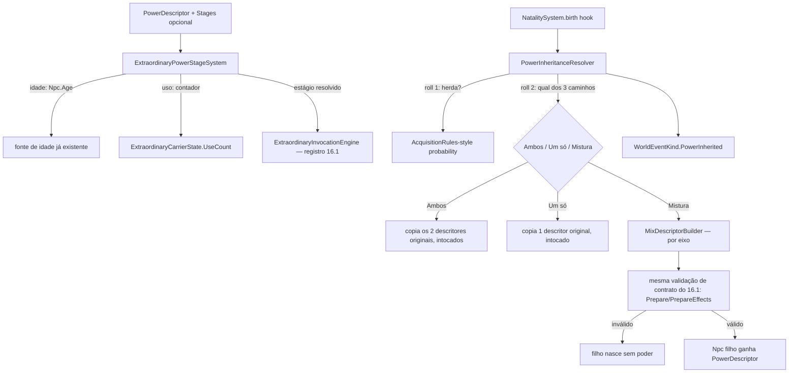

# Fase 16.2 — Design

**Spec**: `.specs/features/phase-16-2-power-evolution/spec.md` (15 requisitos, EVO-01..22)
**Context**: `.specs/features/phase-16-2-power-evolution/context.md`
**Scope**: Large (2 subsistemas novos sobre um domínio já desenhado — 16.1 — sem mecânica de
efeito/custo nova, mas com um algoritmo de decisão de 3 caminhos genuinamente novo)

---

## Architecture Overview

Dois subsistemas independentes, ambos data-driven sobre o `PowerDescriptor` já existente (16.1)
— nenhum dos dois precisa conhecer semântica de mecânica específica (attribute/gravity/mind/
etc.), só a FORMA do descritor (5 eixos: fonte/efeito/custo/condição/aquisição, cada um uma
lista de tokens `<mecânica>.<chave>:<args>`), o que já entrega a "Cobertura completa" (EVO-20..22)
de graça — o motor nunca precisa de um `case` por categoria de mecânica.



Nenhuma edição no registro de mecânicas do 16.1 — este design só produz/seleciona
`PowerDescriptor`s, nunca interpreta os tokens deles (isso já é trabalho do 16.1).

---

## Code Reuse Analysis

| Peça | Reusa | Novo |
| --- | --- | --- |
| Idade como gatilho de estágio | `MortalityPlanner`/idade biológica já lida (mesma fonte da 16.1 `PWR-20`) | — |
| Uso como gatilho de estágio | Log causal já usado por `UseFailed`/`EffectApplied` (só conta sucesso) | Contador `UseCount` — novo campo |
| Determinismo de escolha (herança) | Mesmo padrão de RNG seedado já usado por `Resolver.Resolve`/mecânica de Sorte (16.1) — nunca `Random` não semeado | Função de hash determinística (seed+`NpcId`+salt) |
| Ponto de gancho de nascimento | `NatalitySystem` (já é o ponto de criação de `Npc` — mesmo usado por `npc.reincarnate` na 16.1) | Hook de herança de poder |
| Validação de descritor gerado | `ExtraordinaryInvocationEngine.Prepare`/`PrepareEffects` (16.1, já valida qualquer descritor, autorado ou não) | — |
| Auditoria causal | `WorldEventKind` (aditivo, mesmo padrão de `NpcInstantiated` da 16.1) | `PowerInherited` (novo valor) |
| Reversão/estado por poder | `ExtraordinaryCarrierState` (16.1, já é onde estado por-poder vive — `PreAlterationTraits`, etc.) | `UseCount`, `CurrentStageIndex` |

---

## Components / Interfaces

```csharp
// Domain — aditivo em PowerDescriptor (16.1), nunca quebra descritores existentes
public sealed record PowerEvolutionStage(
    int? AgeThreshold,        // anos — null = eixo não usado neste estágio
    int? UseCountThreshold,   // nº invocações bem-sucedidas — null = eixo não usado
    IReadOnlyList<string> EffectTokens); // mesma forma de token que PowerDescriptor.Effects

IReadOnlyList<PowerEvolutionStage>? Stages { get; init; } // null = sem evolução, comportamento hoje

// Domain — aditivo em ExtraordinaryCarrierState (16.1)
int UseCount { get; init; }         // incrementado a cada invocação bem-sucedida
int CurrentStageIndex { get; init; } // cache do último estágio resolvido (auditoria/debug, recalculado sempre — nunca fonte de verdade)
```

| Componente | Responsabilidade |
| --- | --- |
| `ExtraordinaryPowerStageSystem` | A cada reavaliação de manifestação (mesma cadência de `ExtraordinaryStateSystem`), resolve o estágio mais alto cujo(s) limiar(es) declarado(s) (AND quando os dois eixos estão presentes) o portador atingiu, e troca o `EffectTokens` efetivo lido por `PrepareEffects` — sem estado gravado alheio ao `CurrentStageIndex` de cache (recalculado do zero, mesmo padrão `ExtraordinaryLocomotion`) |
| `PowerUseCounter` | Incrementa `ExtraordinaryCarrierState.UseCount` uma vez por invocação bem-sucedida (hook no mesmo ponto que já loga `EffectApplied`) |
| `PowerInheritanceResolver` | No hook de nascimento do `NatalitySystem`: roll 1 (ocorre herança?), roll 2 (qual dos 3 caminhos), delega pro caminho escolhido |
| `MixDescriptorBuilder` | Implementa o caminho "mistura": por eixo (fonte/efeito/custo/condição/aquisição), token-a-token — mesma chave de mecânica presente nos dois pais agrega magnitude (soma, sem teto); chave presente em só um pai é escolhida por hash determinístico se o eixo colide, ou simplesmente incluída se não colide (CSV já suporta múltiplos tokens por eixo) |
| `DeterministicChoice` | Utilitário puro: `hash(seed, npcId, salt) → double [0,1)` reproduzível — usado pros 2 rolls de herança e pra qualquer escolha dentro de `MixDescriptorBuilder` |

**Pesos default** (Agent's Discretion, ver context.md): sem declaração explícita em regra de
cenário, os 3 caminhos usam peso uniforme (1/3 cada) — documentado como default, sempre
sobrescrevível por cenário.

---

## Data Models

```csharp
// WorldEventKind (16.1, aditivo)
PowerInherited // atacante n/a; campos: childId, parentAId, parentBId, outcome (Both/OneOf/Mixed), resultingDescriptorIds

// Regra de cenário nova (mesmo arquivo de regras já usado por AcquisitionRules/FamilyRules)
public sealed record PowerInheritanceRules(
    double InheritanceChance,     // roll 1 — default do cenário, nunca hardcoded no motor
    double BothWeight,
    double OneOfWeight,
    double MixedWeight);
```

Nenhum campo existente de `PowerDescriptor`/`ExtraordinaryCarrierState`/`WorldEventKind` muda de
tipo ou significado — tudo aditivo, mesma disciplina da 16.1.

---

## Error Handling Strategy

| Cenário | Comportamento |
| --- | --- |
| `PowerDescriptor` resultante de "mistura" falha validação de contrato (`Prepare`) | Descartado — filho nasce sem poder (falha segura, nunca aplica descritor inválido) |
| Só um pai é portador de poder (ou nenhum) | Nenhuma herança ocorre — roll 1/2 nem executam |
| Estágio declara idade E uso, portador só atinge um dos dois | Estágio não conta como alcançado (AND estrito) — permanece no estágio anterior válido |
| Cenário não declara `PowerInheritanceRules` | Usa defaults documentados (peso uniforme 1/3, `InheritanceChance` herdando o mesmo default já usado por `AcquisitionRules` genéricas) — nunca falha por regra ausente |
| Eixo do "mistura" com mesma chave de mecânica nos dois pais mas tipos de argumento incompatíveis (ex.: um declara `attribute.strength:2` outro `attribute.strength:abc`) | Trata como erro de configuração de cenário (mesma classe de erro que a 16.1 já usa pra token malformado) — nunca tenta "adivinhar" um valor |

## Risks & Concerns

| Risco | Mitigação |
| --- | --- |
| "Cobertura completa" (EVO-20..22) esconder um caso não testado numa mecânica de alto risco da 16.1 (ex.: `control.possess` herdado por "ambos" — dois portadores possuindo simultaneamente?) | Matriz de teste da Tasks phase cobre explicitamente cada categoria de mecânica, incluindo as de risco — `control.possess` herdado é só outro `PowerDescriptor` manifestando normalmente, a mesma disciplina de "delegação recalculada a cada tick" da 16.1 já evita conflito entre dois portadores |
| Magnitude sem teto (decisão do usuário) pode produzir poder "quebrado" em N gerações | Aceito explicitamente pelo usuário — fora do escopo desta fase resolver balanceamento; registrado como Out of Scope, não bug |
| `UseCount` é estado genuinamente acumulado (não recalculado do zero por tick) — foge do padrão "sem estado gravado" da 16.1 | Aceitável e necessário (não dá pra derivar "quantas vezes já foi usado" sem histórico) — isolado em `ExtraordinaryCarrierState` (já é o lugar de estado por-poder), nunca em `Npc` direto |
| Hook em `NatalitySystem` (ponto de alto tráfego — todo nascimento passa por ali) | Custo extra só quando os dois pais são portadores de poder (checagem O(1) antes de qualquer roll) — nascimento sem poder nos pais é idêntico ao custo de hoje |

## Tech Decisions

| Decisão | Nível | Registro |
| --- | --- | --- |
| Mistura é puramente estrutural (por eixo/token), nunca interpreta semântica de mecânica | Feature (16.2) | Preserva a garantia "Cobertura completa" sem precisar de código por categoria |
| `UseCount`/`CurrentStageIndex` vivem em `ExtraordinaryCarrierState`, não em `Npc` | Feature (16.2) | Mesmo padrão de menor blast radius já usado na 16.1 pro estado por-poder |
| Pesos dos 3 caminhos de herança são regra de cenário, nunca constante no motor | Feature (16.2) | Mesma disciplina "poder é dado de cenário, motor é genérico" do `ADR-0010`/16.1 |
| Sem teto anti-inflação | Feature (16.2) | Decisão explícita do usuário — registrada em Out of Scope da spec |
