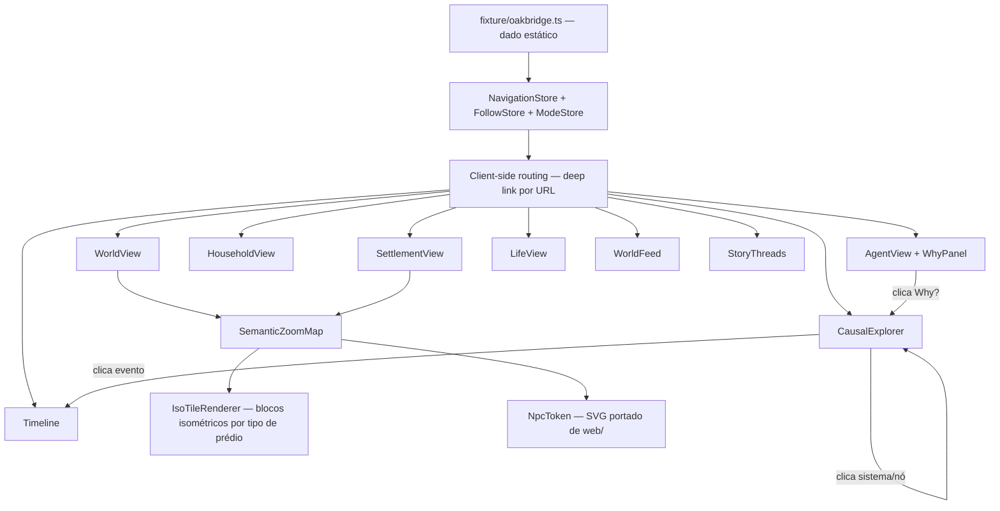

# Fase 16.3-web — World Explorer UX Demo Design

**Spec**: `.specs/features/phase-16-3-web/spec.md`
**Status**: Draft

Approach de visual pra prédios/cidades/tiles confirmada com o usuário: **isométrico simplificado** (blocos pseudo-3D flat-shaded, sem textura de telhado/parede do estilo atual). Token de NPC é o único elemento visual portado literalmente do cliente `web/` atual.

---

## Architecture Overview

Projeto novo e isolado (`web-demo/`), sem import cruzado com `web/src/**`. Roda 100% client-side sobre um fixture estático (`fixture/oakbridge.ts`) — zero rede.



**Princípio de navegação**: um único `NavigationStore` (pilha de breadcrumb + estado atual) é a fonte de verdade de "onde estou" — toda view lê dele, nenhuma view guarda estado de navegação próprio. URL sincroniza com o topo da pilha pra permitir deep-link (Edge Case da spec).

---

## Code Reuse Analysis

### Existing Components to Leverage

| Component | Location | How to Use |
| --- | --- | --- |
| `npcAppearance.ts` (fenótipo procedural skin/hair/clothing) | `web/src/npcAppearance.ts` | REUSE — **copiado literalmente** (não importado — projetos isolados) pra `web-demo/src/npc/appearance.ts`, zero alteração de lógica |
| `NpcTokenSvg.tsx` | `web/src/components/NpcTokenSvg.tsx` | REUSE — copiado literalmente pra `web-demo/src/npc/NpcToken.tsx` |
| Vite + React + TS scaffold (`vite.config.ts`, `tsconfig.json`, estrutura de `package.json`) | `web/vite.config.ts`, `web/tsconfig.json`, `web/package.json` | REFERENCE — mesmo padrão de setup, projeto/dependências independentes (não workspace compartilhado, é descartável) |
| `Camera.ts` (padrão de pan/zoom por transform, não redimensiona canvas) | `web/src/map-engine/Camera.ts` | REFERENCE — mesmo princípio de pan/zoom via transform aplicado ao novo `SemanticZoomMap`, implementação nova (SVG/CSS transform em vez de canvas 2D imperativo) |
| `gridFit.ts` (matemática de grid) | `web/src/gridFit.ts` | REFERENCE — pode informar a conversão grid↔pixel antes da projeção isométrica, sem copiar código (projeção iso é matemática nova) |

### O que NÃO é reusado (redesenho confirmado)

| Component antigo | Motivo de não reusar |
| --- | --- |
| `architectureAppearance.ts` (paleta roof/wall/trim rústica) | Estilo explicitamente rejeitado pelo usuário — paleta/formas novas em `web-demo/src/map/isoPalette.ts` |
| `renderer.ts` (canvas 2D imperativo, `draw(ctx, frame)`) | Demo usa SVG declarativo (React-idiomático, hit-testing nativo por elemento, mais simples pra zoom semântico com 3 densidades de informação distintas — ver Tech Decisions) |
| `buildingFootprint.ts`/`cityBuildingPlacement.ts`/`citySizing.ts`/`worldCityMarkers.ts` | Lógica de posicionamento acoplada ao estilo antigo e a um `WorldState` real; fixture estático não precisa de simulação de posicionamento — posições vêm hardcoded no fixture |
| `global.css` (tokens de tema geral) | Correção do usuário: só o token de NPC é fixo; tema geral é redesenhado em `web-demo/src/styles/tokens.css` |

### Integration Points

| System | Integration Method |
| --- | --- |
| Fixture (`fixture/oakbridge.ts`) | Único ponto de dado — todas as views leem daqui, nunca hardcode disperso em componente |
| URL/roteamento | Deep-link básico (Edge Case da spec) — rota reflete o topo do `NavigationStore`, sem framework de roteamento pesado (ver Tech Decisions) |
| Futuro backend (`phase-16-3-world-cohesion`) | Fora de escopo integrar agora, mas os tipos do fixture (`WorldEventFixture` etc.) espelham de propósito os nomes de campo do design daquela spec (`EventId`/`CauseEventId`/`SourceSystem`, `WakeReason`/`TopPressures` no Why) — troca futura de fixture por API real fica mais barata, sem forçar isso agora |

---

## Components

### 1. `web-demo/` — scaffold do projeto

- **Purpose**: Projeto novo, isolado, buildável independente.
- **Location**: `web-demo/` (sibling de `web/`)
- **Interfaces**: `package.json` próprio, `vite.config.ts`, `tsconfig.json` — mesmo padrão de `web/`, dependências próprias (React, Vite, TS; sem dependência do `web/` existente)
- **Dependencies**: Node/npm já usados pelo `web/` (mesma versão, sem exigir toolchain novo)
- **Reuses**: padrão de config de `web/vite.config.ts`/`tsconfig.json`

### 2. `fixture/oakbridge.ts` — dado estático

- **Purpose**: Única fonte de verdade de dado pra toda a demo — literalmente o exemplo do doc (Oakbridge/Mira Valen/household Valen/cadeia causal de grão).
- **Location**: `web-demo/src/fixture/oakbridge.ts`
- **Interfaces**: exporta `WORLD_FIXTURE: WorldFixture` (ver Data Models)
- **Dependencies**: nenhuma
- **Reuses**: nenhum — dado novo, mas fiel ao texto do doc#108-130

### 3. `npc/appearance.ts` + `npc/NpcToken.tsx`

- **Purpose**: Renderizar o pawn de cada Agent de forma visualmente idêntica ao cliente `web/` atual.
- **Location**: `web-demo/src/npc/appearance.ts`, `web-demo/src/npc/NpcToken.tsx`
- **Interfaces**: `appearanceForNpc(id: string): NpcAppearance`, `<NpcToken id={string} size={number} />`
- **Dependencies**: nenhuma
- **Reuses**: código copiado literalmente de `web/src/npcAppearance.ts`/`NpcTokenSvg.tsx`

### 4. `map/IsoProjection.ts`

- **Purpose**: Matemática de projeção isométrica 2:1 (grid coord → screen coord) — puro, sem side-effect, testável.
- **Location**: `web-demo/src/map/IsoProjection.ts`
- **Interfaces**: `toScreen(gridX: number, gridY: number, tileWidth: number, tileHeight: number): { x: number; y: number }`, `toGrid(screenX, screenY, ...): { x: number; y: number }` (inverso, pra hit-test/click)
- **Dependencies**: nenhuma
- **Reuses**: princípio de `gridFit.ts` (grid↔pixel), matemática de projeção isométrica é nova

### 5. `map/isoPalette.ts`

- **Purpose**: Paleta nova pra blocos isométricos por categoria de prédio (residência/agricultura/forja/genérico — mesmas categorias de `BuildingAppearanceKind` hoje, cores novas), settlement, terreno.
- **Location**: `web-demo/src/map/isoPalette.ts`
- **Interfaces**: `paletteForBuildingKind(kind: BuildingKind): IsoPalette` (`{ top, left, right }` — 3 faces do bloco iso, sombreamento flat fixo por face, não gradiente)
- **Dependencies**: nenhuma
- **Reuses**: nenhum (redesenho confirmado)

### 6. `map/IsoTileRenderer.tsx`

- **Purpose**: Desenha um bloco isométrico (prédio, terreno, ícone de cidade) como `<polygon>` SVG com 3 faces sombreadas — flat-shaded, sem textura.
- **Location**: `web-demo/src/map/IsoTileRenderer.tsx`
- **Interfaces**: `<IsoTile gridX={n} gridY={n} height={n} kind={BuildingKind} onClick={...} />`
- **Dependencies**: `IsoProjection`, `isoPalette`
- **Reuses**: nenhum

### 7. `map/SemanticZoomMap.tsx`

- **Purpose**: Componente de mapa com 3 níveis de zoom (mundo/distrito/agente) — cada nível troca DENSIDADE de informação renderizada, não só escala (spec P1b AC1-3).
- **Location**: `web-demo/src/map/SemanticZoomMap.tsx`
- **Interfaces**: `<SemanticZoomMap fixture={WorldFixture} onSelectSettlement={...} onSelectNpc={...} />`; estado interno `zoomLevel: "world" | "district" | "agent"`
- **Dependencies**: `IsoTileRenderer`, `NpcToken`, `IsoProjection`
- **Reuses**: princípio de pan/zoom-por-transform de `Camera.ts` (implementação nova, SVG `viewBox`/CSS transform em vez de canvas)

### 8. `nav/NavigationStore.ts`

- **Purpose**: Pilha de navegação (breadcrumb) + estado "onde estou agora" — fonte única de verdade, sincronizada com a URL.
- **Location**: `web-demo/src/nav/NavigationStore.ts`
- **Interfaces**: `push(route: Route)`, `back()`, `current(): Route`, `breadcrumb(): Route[]` — `Route` é um union type (`{kind:"world"} | {kind:"settlement", id} | {kind:"household", id} | {kind:"agent", id} | {kind:"causal", eventId} | {kind:"timeline", scope} | ...`)
- **Dependencies**: URL API do browser (`history.pushState`/`popstate`) pra deep-link (Edge Case)
- **Reuses**: nenhum — estado de navegação é específico desta demo

### 9. Views (`views/WorldView.tsx`, `SettlementView.tsx`, `HouseholdView.tsx`, `AgentView.tsx`, `WhyPanel.tsx`, `CausalExplorer.tsx`, `Timeline.tsx`, `LifeView.tsx`, `WorldFeed.tsx`, `StoryThreads.tsx`)

- **Purpose**: Uma view por tela do fluxo (spec P1/P1b/P2/P3), consumindo `NavigationStore` + fixture.
- **Location**: `web-demo/src/views/*.tsx`
- **Interfaces**: cada view é um componente React puro `({ fixture, nav }) => JSX`, sem lógica de negócio própria (deriva tudo do fixture)
- **Dependencies**: `NavigationStore`, `fixture`, `FollowStore` (view Agent/Household/Settlement/Thread), `ModeStore` (Agent view, Experience/Debug)
- **Reuses**: `NpcToken` (Agent/Household views), `SemanticZoomMap` (World/Settlement views)

### 10. `state/followStore.ts` + `state/modeStore.ts`

- **Purpose**: `followStore` — toggle de "seguir" persistido só na sessão (doc#128, nunca altera fixture); `modeStore` — Experience ↔ Debug (doc#116).
- **Location**: `web-demo/src/state/followStore.ts`, `web-demo/src/state/modeStore.ts`
- **Interfaces**: `toggleFollow(entityId: string)`, `isFollowed(entityId: string): boolean`; `mode: "experience" | "debug"`, `toggleMode()`
- **Dependencies**: nenhuma (estado em memória, `useSyncExternalStore` como o padrão já usado em `web/src/state/*Store.ts`)
- **Reuses**: padrão de store já usado em `web/src/state/simulationStore.ts`/`viewStore.ts`/`selectionStore.ts` (mesmo idioma `useSyncExternalStore`, implementação própria)

### 11. `search/SearchIndex.ts`

- **Purpose**: Busca client-side simples sobre o fixture, agrupada por People/Places/Households/Events/Threads (doc#138).
- **Location**: `web-demo/src/search/SearchIndex.ts`
- **Interfaces**: `search(query: string, fixture: WorldFixture): SearchResults` (`{ people, places, households, events, threads }`)
- **Dependencies**: `fixture`
- **Reuses**: nenhum — fixture é pequeno o bastante pra filtro linear simples, sem indexação

---

## Data Models

### `WorldFixture` (raiz do dado estático)

```typescript
interface WorldFixture {
  world: { name: string; summary: string };
  settlements: SettlementFixture[];
  households: HouseholdFixture[];
  agents: AgentFixture[];
  events: WorldEventFixture[]; // ordem cronológica
  storyThreads: StoryThreadFixture[];
}

interface SettlementFixture {
  id: string;
  name: string;
  gridPosition: { x: number; y: number }; // posição no mapa "mundo"
  population: number;
  populationTrend: "up" | "down" | "stable";
  food: "abundant" | "stable" | "scarce";
  employment: "stable" | "declining";
  migration: "arriving" | "stable" | "leaving";
  construction: number; // projetos ativos
  buildings: BuildingFixture[]; // pra zoom "distrito"
}

interface BuildingFixture {
  id: string;
  kind: "residence" | "agriculture" | "forge" | "generic";
  gridPosition: { x: number; y: number }; // relativo ao settlement, zoom "distrito"
  height: number; // nº de "andares" isométricos
}

interface HouseholdFixture {
  id: string;
  name: string; // "Valen Household"
  settlementId: string;
  memberIds: string[]; // NpcId
  headId: string;
  stock: Record<string, number>; // recurso → quantidade
}

interface AgentFixture {
  id: string;
  name: string;
  age: number;
  profession: string;
  settlementId: string;
  householdId: string | null;
  gridPosition: { x: number; y: number }; // zoom "agente"
  currentIntent: string; // "Looking for affordable grain"
  condition: string[]; // ["Healthy", "Tired", "Hungry"]
  bodySummary: { build: string }; // "Average height · Strong"
  relationships: { withAgentId: string; label: string }[]; // "Rowan · trusted"
  recentLifeEvents: string[];
  lifeMilestones: { label: string; approxDate: string }[]; // pra Life View
  whyFactors: { text: string; linkedEventId?: string }[]; // painel Why?
}

interface WorldEventFixture {
  eventId: string;
  tick: string; // rótulo temporal legível ("Year 312 · Spring · 09")
  kind: string; // "GrainPriceIncreased", "PurchaseFailed", ...
  summary: string; // texto humano
  causeEventId: string | null; // proveniência causal
  sourceSystem: string; // "Agriculture" | "Economy" | "Household" | "Needs" | "Decision" | "Employment"
  affectedAgentIds: string[];
  affectedHouseholdIds: string[];
  settlementId: string;
}

interface StoryThreadFixture {
  id: string;
  title: string; // "The Oakbridge Food Crisis"
  eventIds: string[];
  householdIds: string[];
  agentIds: string[];
  systemsTouched: string[];
}
```

**Relationships**: `WorldEventFixture.causeEventId` forma a cadeia que o Causal Explorer percorre (mesmo princípio de `CauseEventId`/`RootCauseEventId` do design de `phase-16-3-world-cohesion` — nomes de campo intencionalmente alinhados pra facilitar troca futura por dado real, sem integrar agora).

### `Route` (estado de navegação)

```typescript
type Route =
  | { kind: "world" }
  | { kind: "settlement"; id: string }
  | { kind: "household"; id: string }
  | { kind: "agent"; id: string }
  | { kind: "causal"; eventId: string }
  | { kind: "timeline"; scope: { type: "world" | "settlement" | "household" | "agent"; id?: string } }
  | { kind: "life"; agentId: string }
  | { kind: "feed" }
  | { kind: "threads" }
  | { kind: "thread"; id: string };
```

---

## Error Handling Strategy

| Error Scenario | Handling | User Impact |
| --- | --- | --- |
| Deep-link pra id inexistente no fixture (ex.: `/agent/nao-existe`) | `NavigationStore` detecta e redireciona pra World View com aviso discreto | Usuário cai numa tela válida, não numa tela quebrada |
| Causal Explorer chega em evento sem `causeEventId` | Mostra nó "sem causa anterior conhecida" (Edge Case da spec) | Comunica claramente que é raiz, não bug |
| Busca sem resultado | Estado vazio explícito por categoria | Nunca lista `undefined`/quebrada |
| Resize abaixo do breakpoint desktop | Layout não quebra (painéis colapsam, sem exigir suporte mobile completo) | Legível mesmo fora do breakpoint alvo |

---

## Risks & Concerns

| Concern | Location | Impact | Mitigation |
| --- | --- | --- | --- |
| Projeção isométrica é matemática nova (sem precedente no repo) — risco de bug de hit-test (clicar não seleciona o prédio certo) | `map/IsoProjection.ts` | Zoom "distrito"/"agente" ficam frustrantes de usar se hit-test errar | Task dedicada de teste unitário pra `toScreen`/`toGrid` com casos de borda (canto do grid, sobreposição de altura de bloco) antes de plugar em qualquer view |
| Isométrico é a opção com mais esforço de implementação das 3 propostas — pode estourar o escopo "demo rápida" | `map/IsoTileRenderer.tsx`, `SemanticZoomMap.tsx` | Risco de a demo não terminar a tempo de validar UX | Escopo do design mantém iso SIMPLES (blocos flat 3-faces, sem sombra suave/gradiente/animação) — complexidade fica só na projeção matemática, não no estilo visual |
| `useSyncExternalStore` + `history.pushState` juntos (deep-link) podem dessincronizar se não implementados com cuidado (voltar do browser vs. `NavigationStore.back()`) | `nav/NavigationStore.ts` | Botão voltar do navegador pode não bater com breadcrumb interno | `NavigationStore` escuta `popstate` e sincroniza a pilha interna a partir da URL, nunca os dois lados escrevendo independente |
| Fixture é grande o bastante (vários NPCs/eventos/relações) pra digitar manualmente com erro de referência (`agentId` que não existe em `households`) | `fixture/oakbridge.ts` | Tela quebrada silenciosamente se referência furar | Teste de integridade do fixture (todo `id` referenciado existe) roda no build/CI da demo |

> Nenhum risco de segurança/dados sensíveis — demo local, sem rede, sem dado real de usuário.

---

## Tech Decisions

| Decision | Choice | Rationale |
| --- | --- | --- |
| Renderização do mapa | SVG declarativo (não canvas 2D imperativo como `web/`) | Zoom semântico troca conteúdo renderizado por nível (não só escala) — mais natural em SVG/React (troca de árvore de componentes) que reimplementar um loop de `draw(ctx, frame)`; hit-test de clique é nativo por elemento SVG, sem reimplementar `hitTest.ts` |
| Projeção do mapa | Isométrico 2:1 simplificado (blocos flat-shaded, 3 faces sombreadas fixas) | Escolha explícita do usuário; mantido simples (sem textura/gradiente/animação) pra caber no escopo de demo |
| Paleta de prédio/tile/cidade | Nova, definida em `isoPalette.ts` — neutra/atmosférica (doc#136), não rústica/medieval como `architectureAppearance.ts` atual | Correção explícita do usuário + doc já recomenda evitar esse estilo |
| Roteamento | `history.pushState`/`popstate` nativo + `NavigationStore` próprio, sem React Router | Fixture pequeno, poucas rotas (10 tipos de `Route`) — biblioteca de roteamento seria peso desnecessário pra uma demo descartável (REUSE/menor esforço > CREATE de dependência nova) |
| Stack do projeto | React + Vite + TypeScript, config própria (não workspace/monorepo com `web/`) | Familiaridade com o stack já usado no repo, mas isolamento total (demo é descartável, não deve acoplar ao cliente de produção) |
| Nomenclatura de campos do fixture (`EventId`/`CauseEventId`/`SourceSystem`) | Alinhada de propósito com o design de `phase-16-3-world-cohesion` (WorldEvent) | Não é integração agora, mas reduz o custo de trocar fixture por API real no futuro — mesmo vocabulário nos dois lados |

> Nenhuma decisão de projeto-level nova pra `.specs/STATE.md` — todas as escolhas aqui são locais a esta demo isolada (`web-demo/`), não convenção que outra feature do backend precise seguir.

---
