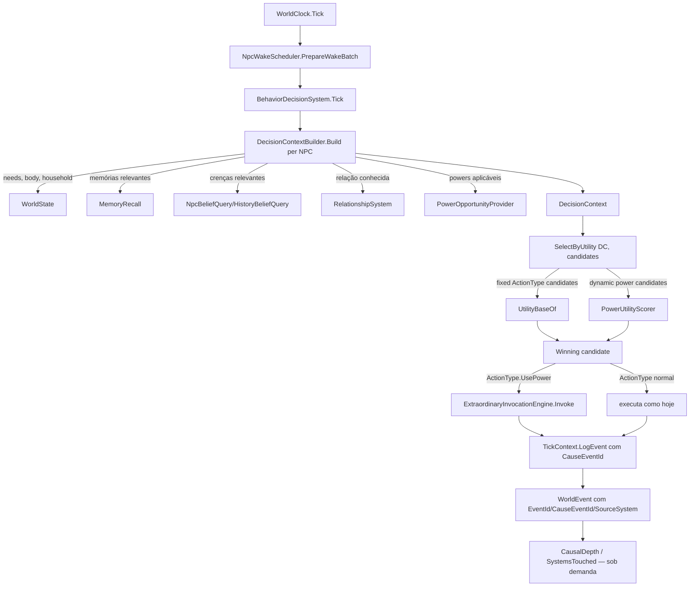

# Fase 16.3 — Living World Cohesion Design

**Spec**: `.specs/features/phase-16-3-world-cohesion/spec.md`
**Status**: Draft

Grounded em survey de arquitetura (2026-08-25, 4 agentes paralelos) + `.specs/STATE.md` `## Decisions` (AD-001..071) + fechamento da Fase 16.2 (2026-08-25, stages/inheritance/use-counters, ver `phase-16-2-power-evolution/validation.md`).

---

## Architecture Overview

Hoje: `BehaviorDecisionSystem.SelectByUtility(WorldState world, Npc npc, ...)` acessa `world`/`npc` diretamente (needs, household, personality, `EconomyRules`) — omnisciente por construção, mesmo que hoje só toque um subconjunto pequeno. Memory/Belief/Relationships existem mas nunca são chamados a partir daqui. Powers rodam em `ExtraordinaryInvocationEngine`, um pipeline paralelo — a única ponte com decisão autônoma é `ControlMechanic.TryDelegatedAction` (possessão). Eventos (`WorldEvent`) não têm cadeia causal.

Depois desta fase:



Princípio: `DecisionContext` é construído **on-demand a cada wake** (não cacheado entre ticks, não faz parte do golden hash) — P1b entrega a versão "sempre reconstrói tudo"; P2a (Attention Router + `DecisionContextCache`, componente 12) adiciona dirty-flag **por categoria** por cima, sem mudar o shape do `DecisionContext`. Esse é o princípio Dwarf Fortress do doc (#19/#60/#74-76): alta complexidade de estado por NPC não exige recalcular tudo a cada wake — só as categorias marcadas dirty desde o último wake são reconstruídas (`Needs`/`Location` mudam quase todo wake; `Body`/`Household`/`Relationships` raramente; `Memory`/`Beliefs` só por evento discreto); o resto é lido do cache por-NPC do wake anterior. Reusa o MESMO mecanismo de "touch-on-mutate" que a Fase 9 já validou para hashing incremental (`TouchCanonical`/`IncrementalHasher`), não um sistema de invalidação novo.

---

## Approach Confirmado (sem pausa adicional — dentro do julgamento técnico já delegado)

Duas escolhas arquiteturais de maior risco, decididas aqui (não são decisão de produto — são "como implementar" dentro do que o usuário já aprovou no spec):

1. **`DecisionContext` substitui o parâmetro `WorldState` em `SelectByUtility`/`UtilityBaseOf`** (refactor in-place, não uma camada paralela de sombra). Uma camada paralela ("constrói DecisionContext só pra auditoria, mas a decisão continua lendo `WorldState` direto") não cumpriria COH-13/14 (memória/relação precisam poder mudar o resultado) — seria complexidade aparente (doc#9). Superfície de mudança é pequena: o survey mostrou que `SelectByUtility`+`UtilityBaseOf` já tocam um conjunto estreito (`npc.Personality`, needs, `world.EconomyRules`, `world.FindHousehold`) — não é um `Score(agent, world)` selvagem, é quase um `DecisionContext` disfarçado de `WorldState`.
2. **Powers entram como `ActionType.UsePower` único (não 27 valores novos no enum)**, com uma lista dinâmica de candidatos (`PowerOpportunity`) gerada por um novo `PowerOpportunityProvider` e comparada por utility ao lado dos `ActionType` fixos. Adicionar 27 valores ao enum explodiria todo switch existente sobre `ActionType` (`PersonalityWeighting.TraitValueOf`, `ActionCatalog`, `NpcWakeScheduler`) por um fator de 4x, e semanticamente `ActionType` é categoria de ação, não "qual poder específico" — o mesmo padrão que `Buy`/`Travel` já usam (uma categoria, resolvida em detalhe por outro dado ao lado).

---

## Code Reuse Analysis

### Existing Components to Leverage

| Component | Location | How to Use |
| --- | --- | --- |
| `WorldEvent` record + `IWorldEventSink`/`TickContext.LogEvent` | `src/LivingWorld.Simulation/WorldEvent.cs`, `TickContext.cs:13` | EXTEND: novos campos opcionais no record; `LogEvent` ganha overload com `CauseEventId?` |
| `EventLogRecord` + `SqliteWorldRepository` sequence assignment | `src/LivingWorld.Infrastructure/EventLogRecord.cs`, `SqliteWorldRepository.cs:50-64` | EXTEND: colunas novas nullable, migração EF |
| `WorldState` monotonic id pattern (`_nextEventId`/`NextEventIdAndAdvance`) | `WorldState.cs:17,21,579` | REFERENCE (não reusar o campo — colisão de nome com `ScheduledEvent.Id`); espelhar o padrão com `_nextHistoryEventId`/`NextHistoryEventIdAndAdvance` |
| `TickBudgetExceededException` + `NeedsRules.MaxActionSelectionSteps` | `TickBudgetExceededException.cs`, `NeedsRules.cs:12` | REUSE do padrão exato para o guard de ciclo causal (nova exceção irmã, novo campo `*Rules.MaxCauseChainDepth`) |
| `MemoryRecall.Recall` | `src/LivingWorld.Simulation/Llm/MemoryRecall.cs:12` | REUSE direto — `DecisionContextBuilder` chama com uma query derivada do contexto (ex.: pressão ativa) |
| `NpcBeliefQuery.BeliefsOf` / `HistoryBeliefQuery.BeliefOf` | `src/LivingWorld.Simulation/History/` | REUSE direto |
| `RelationshipSystem` + `world.Relationships` (dict lazy, `RelationshipKey`) | `WorldState.cs:197,204`, `RelationshipSystem.cs` | REUSE direto — lookup read-only, nunca criar entrada nova a partir da decisão |
| `Household`/`world.FindHousehold` | `Household.cs`, `WorldState.cs:675` | REUSE direto — já é o que `BehaviorDecisionSystem` lê hoje |
| `AttributeMechanic` (padrão de multiplier puro `WorldState × Npc → double`, neutro=1.0) | `src/LivingWorld.Simulation/Extraordinary/AttributeMechanic.cs:44-89` | REUSE do padrão exato para `BodyMechanic.WorkCapacityMultiplier`/`MovementCostMultiplier` |
| `HeredityService.RollInitial`/`InheritVitality` + stream-seeded RNG (`WorldRngRegistry.StableHash`, `ctx.StreamFor`) | `HeredityService.cs:15-39`, `PopulationGenerator.cs:53-56`, `NatalitySystem.cs:92-95` | REUSE do padrão exato para gerar `Height`/`Weight`/`MuscleMass` |
| `FamilyRules`/`NeedsRules` (`*Rules` cenário-driven, `Result<T>` validator, `Default` factory) | `FamilyRules.cs`, `NeedsRules.cs` | REUSE do padrão exato para `BodyRules` e `PowerUtilityRules` |
| `ProductionSystem.StrengthMultiplierOf` (média de multiplier sobre `presentWorkers`) | `src/LivingWorld.Simulation/Economy/ProductionSystem.cs:109-118` | EXTEND: `WorkCapacityMultiplier` entra como 4º fator ao lado de `skillMultiplier`/`strengthMultiplier` na linha 79 |
| `TravelResolution.TicksBetween`/`MovementCost.Between` | `src/LivingWorld.Domain/Geography/TravelResolution.cs:9-15`, `MovementCost.cs:8-21` | EXTEND: novo overload aceitando `Npc`/multiplier — hoje é puramente mapa/terreno, zero input de NPC |
| `IExtraordinaryMechanic` + `ExtraordinaryMechanicRegistry.Resolve` + `PowerDescriptor` (`Costs`, `Reliability`, `Stages`, `FailureModes`) | `IExtraordinaryMechanic.cs`, `ExtraordinaryMechanicRegistry.cs:33-42`, `PowerDescriptor.cs` | EXTEND: registry ganha método novo "candidatos aplicáveis a este NPC/contexto"; nenhum mechanic existente muda de contrato |
| `ExtraordinaryInvocationEngine.Invoke` | `ExtraordinaryInvocationEngine.cs:52-87` | REUSE direto — `BehaviorDecisionSystem` passa a chamá-lo quando `ActionType.UsePower` vence, em vez de só `ControlMechanic` |
| `ControlMechanic.TryDelegatedAction` (possessão) | `ControlMechanic.cs:38-39` | MANTÉM intocado — possessão é outro Decision Source (doc#61's "quem fornece a decisão"), não uma Opportunity comum; migração não sobrepõe esse caminho |
| `NpcWakeScheduler` (wake esparso, `ComputeNextWakeTick`, `NpcWakeBatch`) | `NpcWakeScheduler.cs` | EXTEND (P2a): novos gatilhos de wake (evento roteado); estrutura de dedupe (`WorldState.ReplaceNpcWake`) já existe e é reusada sem mudança |
| `Personality` (10 traços 0-100) + `PersonalityWeighting.WeightOf` (switch, não reflection) | `Personality.cs`, `PersonalityWeighting.cs:43,61-74` | REUSE direto — `EmotionalStability` já usado por AD-071 (possessão); Pressure `ProtectHousehold` etc. podem ler os mesmos traços |
| `d3fc36b` deterministic hash-based choice (Extraordinary) | `src/LivingWorld.Simulation/Extraordinary/` | REUSE para desempate determinístico em ordenação causal do mesmo tick (Edge Case da spec) |
| PERF-12 `TouchCanonical`/`IncrementalHasher.MatchesCanonical` (cache de fragmento JSON por NPC, Fase 9) | `WorldState`/`Npc` mutadores, ver `STATE.md` handoff | REUSE do mesmo mecanismo touch-on-mutate para `DecisionContextCache.MarkDirty` — granular por categoria, não um segundo sistema de invalidação |
| `AggregatePopulationPool`/`MaterializationSystem` (LOD agregado↔materializado, Fase 8/9) | `src/LivingWorld.Domain/Cities/AggregatePopulationPool.cs`, `src/LivingWorld.Simulation/Cities/MaterializationSystem.cs` | REFERENCE — decide QUEM entra em `SelectByUtility`; `DecisionContextCache` decide QUANTO recalcular pra quem já entrou (LOD e dirty-cache são fronteiras diferentes, não se sobrepõem) |

### Integration Points

| System | Integration Method |
| --- | --- |
| `TickContext` | Ganha campo ambiente opcional "evento-causa atual" + overload de `LogEvent` recebendo `CauseEventId?` explícito; sistemas que já chamam `ctx.LogEvent` não quebram (parâmetro novo é opcional) |
| `WorldState` | Novo campo canônico `_nextHistoryEventId` (contador irmão, não reaproveita `_nextEventId`); novos multipliers/`BodyRules`/`PowerUtilityRules` como propriedades `[Canonical]` de configuração, mesmo padrão de `EconomyRules`/`FamilyRules` |
| `EF migration` (SQLite/Infrastructure) | Colunas nullable novas em `EventLogRecord` (`EventId`, `CauseEventId`, `SourceSystem`) — migração aditiva, sem quebrar leitores antigos (AD-029 mantido) |
| `ScenarioRunner`/`BehaviorScenarioLoader` | Novos parâmetros opcionais `bodyRules`/`powerUtilityRules` (mesmo padrão AD-047/AD-059 — variação de harness de teste, não sistema de produção novo) |
| `tests/golden/world-hashes.json` | Regravado quando `WorldState` ganha os novos campos canônicos (mesmo procedimento AD-065/AD-069) — AD novo documentando o porquê |

---

## Components

### 1. `DecisionContext` (P1b)

- **Purpose**: Snapshot escopado e auditável do que um NPC especificamente sabe/tem no momento de decidir — substitui acesso direto a `WorldState` em `SelectByUtility`.
- **Location**: `src/LivingWorld.Simulation/Behavior/DecisionContext.cs` (novo)
- **Interfaces**:
  - `record DecisionContext(NpcId NpcId, long Tick, NeedsSnapshot Needs, BodySnapshot Body, HouseholdSnapshot? Household, IReadOnlyList<NpcMemory> RelevantMemories, IReadOnlyList<string> RelevantBeliefs, IReadOnlyList<RelationshipFact> KnownRelationships, IReadOnlyList<PowerOpportunity> PowerOpportunities, Personality Personality, ActionType? CurrentAction)` — todos os campos de coleção podem ser vazios, nunca `null`.
- **Dependencies**: `NeedsSnapshot`/`BodySnapshot`/`RelationshipFact` (novos DTOs simples, não persistidos)
- **Reuses**: espelha exatamente os campos que `SelectByUtility`/`UtilityBaseOf` já leem hoje (needs, household, personality) + adiciona memory/belief/relationship/power como novos campos opcionais/vazios.

### 2. `DecisionContextBuilder` (P1b)

- **Purpose**: Constrói `DecisionContext` para um NPC, chamando os sistemas existentes (Memory/Belief/Relationship/Body/Powers) — nenhum acesso a `world.Npcs` global.
- **Location**: `src/LivingWorld.Simulation/Behavior/DecisionContextBuilder.cs` (novo)
- **Interfaces**:
  - `static DecisionContext Build(WorldState world, Npc npc, long tick, DecisionContextRules rules)` — chamado uma vez por NPC por wake, dentro de `BehaviorDecisionSystem.Tick`, antes de `SelectByUtility`.
- **Dependencies**: `MemoryRecall`, `NpcBeliefQuery`, `RelationshipSystem`/`world.Relationships`, `world.FindHousehold`, `BodyMechanic`, `PowerOpportunityProvider`.
- **Reuses**: 100% sistemas existentes — este componente é só orquestração/mapeamento, zero lógica de decisão nova.
- **Nota de custo**: query de `MemoryRecall`/belief roda 1x por NPC por WAKE (não por tick — `NpcWakeBatch` já limita), aceitável para P1b; P2a adiciona dirty-flag por cima se o profiling (fase K) mostrar necessidade.

### 3. `SelectByUtility` / `UtilityBaseOf` (P1b — refactor)

- **Purpose**: Mesma responsabilidade de hoje, mas assinatura migra de `(WorldState world, Npc npc, ...)` para `(DecisionContext ctx, ...)`.
- **Location**: `src/LivingWorld.Simulation/Behavior/BehaviorDecisionSystem.cs:296,355` (arquivo existente, refactor in-place)
- **Interfaces**:
  - `private static ActionType SelectByUtility(DecisionContext ctx, NeedsRules rules, ActionType? continuityAction)` — `WorldState`/`Npc`/`tick` somem da assinatura (já estão embutidos no `ctx`).
  - `private static double UtilityBaseOf(DecisionContext ctx, ActionType action)`
  - Novo: `private static double PowerOpportunityUtility(PowerOpportunity opp, DecisionContext ctx, PowerUtilityRules rules)` — scoring dos candidatos dinâmicos de poder.
- **Dependencies**: `DecisionContext`, `PowerUtilityRules`.
- **Reuses**: lógica de scoring de Eat/Sleep/Work/etc não muda — só a fonte dos dados lidos muda de `world.X`/`npc.X` para `ctx.X`.

### 4. `BodyMechanic` (P1c)

- **Purpose**: Funções puras `WorldState × Npc → double`, mesmo shape de `AttributeMechanic`, para capacidade física derivada de `Height`/`Weight`/`MuscleMass`.
- **Location**: `src/LivingWorld.Simulation/Behavior/BodyMechanic.cs` (novo — perto de `BehaviorDecisionSystem`, não em `Extraordinary`, porque é corpo BASE, não poder)
- **Interfaces**:
  - `static double WorkCapacityMultiplier(WorldState world, Npc npc)` — combina `MuscleMass` (normalizado) com `Skills`; neutro 1.0 se `BodyRules` desabilitado/ausente.
  - `static double MovementCostMultiplier(WorldState world, Npc npc)` — combina `Weight`/`Height`; neutro 1.0 por padrão.
  - `static void ApplyWorkHardening(WorldState world, Npc npc, long tick)` — chamado por um novo sistema `Daily` (categoria SLOW, doc#19) que incrementa `MuscleMass` lentamente após trabalho físico pesado sustentado.
- **Dependencies**: `BodyRules` (novo `*Rules`, mesmo template de `FamilyRules`).
- **Reuses**: shape idêntico a `AttributeMechanic.ProductMultiplier`.

### 5. `Npc` — campos novos (P1c)

- **Purpose**: Corpo mínimo causal.
- **Location**: `src/LivingWorld.Domain/Population/Npc.cs` (extend, campos canônicos novos no ctor `[JsonConstructor]`)
- **Novos campos**: `double Height`, `double Weight`, `double MuscleMass` (unidades: metros, kg, kg — documentado em XML doc).
- **Geração**: `PopulationGenerator` (seed) via `rng.Derive(WorldRngRegistry.StableHash($"height-{npcId.Value}"))` (e streams irmãos `weight-`, `musclemass-`) — clamp em faixa fisiológica plausível declarada em `BodyRules` (Edge Case da spec). Nascimento runtime: `NatalitySystem` usa `ctx.StreamFor("height", babyId.Value)` etc., com herança leve (blend mãe/pai + mutação, mesmo formato de `InheritVitality`) OU sorteio independente por cenário-flag — decisão de detalhe fica em Tasks (não muda a interface pública).

### 6. `PowerOpportunityProvider` (P1d)

- **Purpose**: Preenche o gap "MISSING — nenhum método existe hoje para achar mechanics aplicáveis a um NPC/contexto"; gera candidatos dinâmicos de poder para o loop de utility.
- **Location**: `src/LivingWorld.Simulation/Extraordinary/PowerOpportunityProvider.cs` (novo)
- **Interfaces**:
  - `static IReadOnlyList<PowerOpportunity> ApplicableTo(WorldState world, Npc npc, long tick)` — itera `ExtraordinaryCarrierState` do NPC (se manifestado), filtra por `Mode` (`IsAvailable`, já existe) **e** por `CurrentStageIndex` (novo da 16.2 — mechanic só entra se a stage atual libera; usa `PowerDescriptor.Stages`), devolve um `PowerOpportunity` por mechanic aplicável.
  - `record PowerOpportunity(string MechanicToken, NpcId? SuggestedTarget, decimal EstimatedCost, double EstimatedRisk, ExtraordinaryReliability Reliability)` — custo/risco estimados a partir de `PowerDescriptor.Costs`/`Reliability`/`FailureModes` (heurística declarada, não simulação econômica completa — ver Risks & Concerns).
- **Dependencies**: `ExtraordinaryMechanicRegistry`, `PowerDescriptor`, `ExtraordinaryCarrierState`.
- **Reuses**: `IsAvailable` (`ExtraordinaryInvocationEngine.cs:357-365`) já existente para o filtro de Mode.
- **Nota de staleness aceita**: `ExtraordinaryStateSystem`/`PassiveTick`/`Stage` rodam DEPOIS de `BehaviorDecisionSystem` na mesma tick (ordem confirmada no survey) — candidatos usam estado do fim da tick anterior. Sem requisito de spec pedindo frescor no mesmo tick; documentado como aceito.

### 7. `PowerUtilityRules` (P1d)

- **Purpose**: Pesos cenário-driven pra converter `PowerOpportunity` em utility comparável (R3 — nenhum literal em C#).
- **Location**: `src/LivingWorld.Domain/Extraordinary/PowerUtilityRules.cs` (novo, mesmo template de `PowerInheritanceRules`/`FamilyRules`)
- **Interfaces**:
  - `record PowerUtilityRules(double CostWeight, double RiskWeight, double ReliabilityWeight, double UrgencyWeight)`, `static Result<PowerUtilityRules> Create(...)`, `static PowerUtilityRules Default`.
- **Dependencies**: nenhuma.
- **Reuses**: template `PowerInheritanceRules`.

### 8. `ActionType.UsePower` (P1d)

- **Purpose**: Único valor novo no enum fechado, representando "usar um poder" como categoria — o poder específico/target vem do `PowerOpportunity` vencedor, carregado fora do enum.
- **Location**: `src/LivingWorld.Domain/Behavior/ActionType.cs` (extend: `UsePower = 7`)
- **Consequência de execução**: quando `UsePower` vence, `BehaviorDecisionSystem` precisa lembrar QUAL `PowerOpportunity` venceu (não cabe no enum sozinho) — novo campo volátil (não canônico, tipo `[JsonIgnore]`, mesmo padrão AD-026) `Npc.PendingPowerInvocation` (`PowerOpportunity?`) setado no momento da escolha, consumido e limpo quando a ação executa (chama `ExtraordinaryInvocationEngine.Invoke`).
- **Dependencies**: `ActionCatalog` precisa de uma entrada de duração pra `UsePower` (mesma proteção estática que já existe — AD-040 menciona `ActionCatalog.Create` reprovar estaticamente ação sem duração).

### 9. `EventId` / `CauseEventId` / `RootCauseEventId` (P1a)

- **Purpose**: Proveniência causal em `WorldEvent`.
- **Location**: `src/LivingWorld.Simulation/WorldEvent.cs` (extend record), `WorldState.cs` (novo contador), `TickContext.cs` (novo overload de `LogEvent`).
- **Interfaces**:
  - `record WorldEvent(long EventId, long Tick, WorldEventKind Kind, string Payload, long? CauseEventId, string SourceSystem)` — `EventId` e `SourceSystem` obrigatórios (nunca null; `SourceSystem = "Unknown"` aceito pro caso legado não migrado, Edge Case da spec); `CauseEventId` nullable.
  - `TickContext.LogEvent(WorldEventKind kind, string payload, string sourceSystem, long? causeEventId = null)` — overload novo; assinatura antiga (`LogEvent(kind, payload)`) é preservada como wrapper que chama a nova com `sourceSystem: "Unknown"`, `causeEventId: null` — nenhum dos ~57 call sites quebra; migração incremental (chamadas críticas ganham `sourceSystem`/`causeEventId` explícitos primeiro, resto migra conforme a auditoria P3 for encontrando).
  - `static long? ResolveRootCauseEventId(IReadOnlyList<WorldEvent> events, long eventId, int maxDepth)` — função pura, percorre `CauseEventId` até achar raiz ou `maxDepth` (novo `CausalRules.MaxCauseChainDepth`, mesmo padrão `NeedsRules.MaxActionSelectionSteps`), lança `CausalChainTooDeepException` (nova, mesmo shape de `TickBudgetExceededException`) se estourar.
- **Dependencies**: `WorldState._nextHistoryEventId`/`NextHistoryEventIdAndAdvance()` (novo contador, não reaproveita `_nextEventId` — colisão de nome identificada no survey).
- **Reuses**: `TickBudgetExceededException` pattern, `WorldState` monotonic-counter pattern.

### 10. `Pressure`/`Opportunity` derivation (P2b)

- **Purpose**: Camada derivada e explicável sobre `DecisionContext` — sem novo estado canônico.
- **Location**: `src/LivingWorld.Simulation/Behavior/PressureModel.cs`, `OpportunityModel.cs` (novos, puramente funções sobre `DecisionContext`)
- **Interfaces**:
  - `static IReadOnlyList<Pressure> DerivePressures(DecisionContext ctx)`
  - `static IReadOnlyList<Opportunity> DeriveOpportunities(DecisionContext ctx)`
  - `record DecisionTrace(WakeReason WakeReason, ActionType? PreviousIntent, IReadOnlyList<Pressure> TopPressures, IReadOnlyList<Opportunity> KnownOpportunities, ActionType Winner, double WinningUtility)` — volátil, não persistido (doc#84).
- **Dependencies**: `DecisionContext`.
- **Reuses**: nenhum estado novo — deriva de `DecisionContext` já construído.

### 11. `CurrentIntent` + `AttentionRouter` (P2a)

- **Purpose**: Reduz redecisão; roteia wake só para NPCs relevantes a um evento.
- **Location**: `src/LivingWorld.Domain/Behavior/Intent.cs` (novo — `IntentId`? não, reusa granularidade de `ActionType` + target), extend `Npc.cs` (`CurrentIntent`, `IntentStartedTick`, `IntentTarget`, `IntentStatus`), `src/LivingWorld.Simulation/Behavior/AttentionRouter.cs` (novo).
- **Interfaces**:
  - `static IReadOnlySet<NpcId> RouteRelevantNpcs(WorldState world, WorldEvent evt, AttentionRules rules)` — critérios doc#59 (localização, household, relação, dependência de intent, conhecimento, dependência econômica, condição física, magnitude, urgência, ameaça, interação de capacidade); resultado alimenta `NpcWakeScheduler` (novo motivo de wake, ao lado dos existentes).
- **Dependencies**: `NpcWakeScheduler.ComputeNextWakeTick` (extend, não substitui).
- **Reuses**: `NpcWakeBatch`/`WorldState.ReplaceNpcWake` (dedupe já existe).

### 12. `DecisionContextCache` — recarrega só o que mudou (P2a)

- **Purpose**: A resposta de engenharia ao doc#19/#60/#74-76 (espírito Dwarf Fortress): "alta complexidade de estado não exige alta frequência de processamento". `DecisionContextBuilder` (componente 2) constrói fresh a cada wake em P1b — este componente é a otimização de cima, por CATEGORIA, sem mudar o shape de `DecisionContext`: cada wake só reconstrói as categorias que de fato mudaram desde o último wake do NPC; o resto é lido de um cache por-NPC.
- **Location**: `src/LivingWorld.Simulation/Behavior/DecisionContextCache.cs` (novo)
- **Categorias rastreadas** (mesmo agrupamento do doc#60, cada uma com sua própria dirty flag): `Needs`, `Body`, `Location`, `Economy`, `Household`, `Relationships`, `Knowledge`, `Beliefs`, `Memory`, `Threat`, `Capabilities/Extraordinary`. Cada categoria já tem uma cadência natural própria (doc#19): `Body`/`Household.Members`/`Relationships` são SLOW (raramente mudam por tick), `Needs`/`Location` são MEDIUM/FAST, `Memory`/`Beliefs` mudam por evento discreto (crossing/novo fato), não por tick.
- **Interfaces**:
  - `enum DecisionContextCategory { Needs, Body, Location, Economy, Household, Relationships, Knowledge, Beliefs, Memory, Threat, Capabilities }` (flags)
  - `static void MarkDirty(WorldState world, NpcId npcId, DecisionContextCategory category)` — chamado nos pontos de mutação relevantes (ex.: `Household.Deposit/Withdraw` marca `Economy`+`Household` dirty para todo membro; `RelationshipSystem` marca `Relationships` dirty para o par; `NatalitySystem`/morte marca `Household` dirty para os afetados).
  - `static DecisionContext BuildIncremental(WorldState world, Npc npc, long tick, DecisionContextRules rules)` — para cada categoria dirty, chama o builder daquela categoria (reusa os métodos de `DecisionContextBuilder`, agora quebrados por categoria); para categoria limpa, copia do cache anterior do NPC sem tocar `MemoryRecall`/`NpcBeliefQuery`/`RelationshipSystem` de novo.
- **Dependencies**: `DecisionContextBuilder` (componente 2, agora exposto por categoria em vez de monolítico).
- **Reuses (achado importante, não estava no survey original)**: `WorldState`/`Npc` já têm exatamente este padrão de "touch-on-mutate" implementado para outro propósito — **PERF-12** (Fase 9, handoff `STATE.md`: *"cache de fragmentos JSON canônicos por NPC + propriedades estáticas; `TouchCanonical` nos mutadores de `Npc`; `IncrementalHasher.MatchesCanonical`"*). `MarkDirty` desta fase é o MESMO mecanismo de `TouchCanonical` (chamado nos mesmos mutadores, ou logo ao lado), só que granular por categoria de decisão em vez de "o NPC inteiro mudou" — evita inventar um segundo sistema de invalidação paralelo ao que a Fase 9 já validou e mediu.
- **Fronteira com LOD**: um NPC em LOD agregado (`AggregatePopulationPool`, `MaterializationSystem` — Fase 8/9, `CAUSAL` no survey) nem entra em `NpcWakeBatch`/`SelectByUtility` — o cache de categoria só existe para NPCs materializados. Zoom/LOD já decide QUEM roda a decisão fina; este componente decide, para quem já roda, QUANTO dela precisa ser recalculado. Consistente com doc#75: "a câmera pode alterar resolução, nunca existência" — aqui, o análogo é "o evento pode alterar o que recalcula, nunca o que existe no NPC".

### 13. Diagnostics (P3)

- **Purpose**: `CausalDepth`, `SystemsTouchedByCausalChain`, métricas doc#85.
- **Location**: `src/LivingWorld.Simulation/History/CausalDiagnostics.cs` (novo, ou `LivingWorld.Workers` CLI subcomando — mesmo padrão AD-020/AD-068 de reusar `Workers` em vez de projeto novo)
- **Interfaces**:
  - `static int CausalDepth(IReadOnlyList<WorldEvent> events, long eventId)`
  - `static IReadOnlySet<string> SystemsTouchedByCausalChain(IReadOnlyList<WorldEvent> events, long eventId)` — usa `SourceSystem` de cada evento na cadeia.
- **Dependencies**: proveniência causal (P1a) já implementada.
- **Reuses**: mesmo `maxDepth` guard de `ResolveRootCauseEventId`.

---

## Data Models

### `DecisionContext` (volátil, não persistido, não `[Canonical]`)

```csharp
public sealed record DecisionContext(
    NpcId NpcId,
    long Tick,
    NeedsSnapshot Needs,
    BodySnapshot Body,
    HouseholdSnapshot? Household,
    IReadOnlyList<NpcMemory> RelevantMemories,
    IReadOnlyList<string> RelevantBeliefs,
    IReadOnlyList<RelationshipFact> KnownRelationships,
    IReadOnlyList<PowerOpportunity> PowerOpportunities,
    Personality Personality,
    ActionType? CurrentAction);

public readonly record struct NeedsSnapshot(int Hunger, int Thirst, int Sleep, int Social);
public readonly record struct BodySnapshot(double Height, double Weight, double MuscleMass, double WorkCapacityMultiplier, double MovementCostMultiplier);
public sealed record HouseholdSnapshot(HouseholdId Id, IReadOnlyDictionary<ResourceType, long> Stock, IReadOnlyList<NpcId> Members);
public readonly record struct RelationshipFact(NpcId With, int Trust, int Affection, int Respect, int Familiarity); // 4 eixos já existentes em Relationship
```

**Relationships**: `DecisionContext` é 1:1 efêmero por (NpcId, wake) — nunca persistido, reconstruído a cada wake por `DecisionContextBuilder`.

### `WorldEvent` (canônico — muda schema, exige golden novo)

```csharp
public sealed record WorldEvent(
    long EventId,
    long Tick,
    WorldEventKind Kind,
    string Payload,
    long? CauseEventId,
    string SourceSystem);
```

**Relationships**: `CauseEventId` aponta para outro `WorldEvent.EventId` na mesma run/branch; `RootCauseEventId` é calculado, não armazenado.

### `PowerOpportunity` (volátil)

```csharp
public sealed record PowerOpportunity(
    string MechanicToken,
    NpcId? SuggestedTarget,
    decimal EstimatedCost,
    double EstimatedRisk,
    ExtraordinaryReliability Reliability);
```

### `BodyRules` / `PowerUtilityRules` / `CausalRules` / `AttentionRules` (cenário-driven, `[Canonical]` na config, mesmo template de `FamilyRules`)

```csharp
public sealed record BodyRules(double HeightMean, double HeightStdDev, double WeightMean, double WeightStdDev,
    double MuscleMassMean, double MuscleMassStdDev, double MuscleMassMin, double MuscleMassMax, /* clamps */
    bool Enabled);
public sealed record PowerUtilityRules(double CostWeight, double RiskWeight, double ReliabilityWeight, double UrgencyWeight);
public sealed record CausalRules(int MaxCauseChainDepth);
public sealed record AttentionRules(/* limiares de magnitude/relevância por critério doc#59 */);
```

---

## Error Handling Strategy

| Error Scenario | Handling | Impact |
| --- | --- | --- |
| `CauseEventId` chain forma ciclo ou excede `MaxCauseChainDepth` | `ResolveRootCauseEventId` lança `CausalChainTooDeepException` (mesmo shape `TickBudgetExceededException`) | Resolução aborta determinística; evento raiz reportado como indefinido, não trava a tick |
| `IExtraordinaryMechanic` migrado lança exceção ao ser avaliado como candidato em `PowerOpportunityProvider` | `try/catch` isola o candidato — não entra na lista, resto do NPC continua avaliando normalmente | Um mechanic com bug não derruba a decisão do NPC inteiro |
| `SourceSystem` não migrado (código legado chamando overload antigo de `LogEvent`) | Aceita `"Unknown"` explícito | Evento continua sendo publicado; relatório de auditoria (P3) lista para migração futura |
| `Height`/`Weight`/`MuscleMass` fora de faixa plausível (bug de RNG/config) | Clamp em `BodyRules.Min/Max` na geração | Nunca propaga valor absurdo pra `WorkCapacityMultiplier` |
| Evento causal storm (A→B→A→B ciclo real de produção, não só cadeia de causa) | Reusa `TickBudgetExceededException`/`MaxActionSelectionSteps` já existente por outro ângulo (loop de decisão), mais o `MaxCauseChainDepth` novo pro grafo causal | Abort determinístico nomeando sistema culpado (mesma UX de erro já validada) |

---

## Risks & Concerns

| Concern | Location | Impact | Mitigation |
| --- | --- | --- | --- |
| `PowerOpportunity.EstimatedCost`/`EstimatedRisk` não têm fonte numérica hoje (`PowerDescriptor` só tem `Costs` string / `Reliability` string / `FailureModes`) | `PowerDescriptor.cs:7-22` | Heurística de conversão string→número pode ficar arbitrária/pouco calibrada no início | P1d entrega uma heurística simples e documentada (ex.: `Reliability="Guaranteed"` → risco baixo fixo; `Costs.Count` → custo proporcional); calibração fina fica candidata a iteração futura, não bloqueia P1d fechar |
| `BehaviorDecisionSystem`/`SelectByUtility` é hot path medido (AD-038: 22.7% de ganho medido ao trocar reflection por switch) | `BehaviorDecisionSystem.cs:296,355` | Introduzir `DecisionContextBuilder` com chamadas a `MemoryRecall`/belief a cada wake pode regredir performance | `NpcWakeBatch` já limita a frequência (não é por tick); medir antes/depois (fase K do doc) e documentar regressão com AD se necessário — nunca aceitar silenciosamente (doc#99/#162) |
| Migração de 27 `IExtraordinaryMechanic` para full utility integration é grande superfície — golden hashes de cenários com powers podem divergir | `src/LivingWorld.Simulation/Extraordinary/*.cs` (27 arquivos) | Risco de regressão silenciosa em comportamento já validado na 16.1/16.2 | Cada migração individual roda golden antes/depois; divergência exige AD explícito (mesmo padrão AD-065/069) — nunca "corrige o golden sem explicar" |
| `Height`/`Weight`/`MuscleMass` não têm herança genética real (assumption do spec) enquanto `Vitality`/`Upbringing` têm | `HeredityService.cs` | Inconsistência conceitual: por que só alguns atributos herdam? | Documentado explicitamente como escolha de escopo no spec (Assumptions); Body herda "levemente" via blend simples ou sorteio independente — detalhe decidido em Tasks, sem bloquear Design |
| Nenhum teste de coverage-por-switch existe hoje para `ActionType` (survey não confirmou um `AllActions`-coverage-test tipo o de `Personality.AllTraitNames`) | `BehaviorDecisionSystem.cs` (usa `AllActions` estático) | Adicionar `UsePower` pode deixar algum switch existente (`ActionCatalog`, `PersonalityWeighting.TraitValueOf`) sem entrada e falhar silenciosamente em runtime em vez de estático | Tasks deve confirmar se existe proteção estática equivalente a AD-040 (`ActionCatalog.Create` reprova ação sem duração) — se não existir p/ `PersonalityWeighting`, uma task adiciona esse teste de cobertura antes de introduzir `UsePower` |

> Nenhum outro risco de segurança/dados sensíveis identificado — simulação local, sem input externo não confiável introduzido por esta fase.

---

## Tech Decisions

| Decision | Choice | Rationale |
| --- | --- | --- |
| `DecisionContext` shape | Record imutável, construído fresh a cada wake, não cacheado/canônico | Simplicidade correta primeiro (P1b); dirty-flag fica P2a — evita otimizar antes de medir (doc#18/#99) |
| Powers no loop de utility | 1 `ActionType.UsePower` + `PowerOpportunity` dinâmico, não 27 enum values | Evita explodir todo switch fechado sobre `ActionType`; mantém `ActionType` como categoria, não como "poder específico" |
| `EventId`/`CauseEventId` | Campos no `WorldEvent` record; `RootCauseEventId` calculado sob demanda, nunca armazenado | doc#29 pede explicitamente "sem persistir grafo global completo"; evita duplicar dado |
| Contador de `EventId` | Campo canônico novo e separado (`_nextHistoryEventId`), não reaproveita `_nextEventId` (já usado por `ScheduledEvent`) | Survey identificou risco de colisão de nome/semântica — `_nextEventId` já tem dono |
| `BodyMechanic` fica em `Behavior/`, não em `Extraordinary/` | Local próprio, não dentro do namespace de Powers | Corpo é atributo BASE de todo NPC (mesmo sem powers), não uma mecânica extraordinária — mistura os dois namespaces confundiria "capacidade normal" com "capacidade de poder" |
| Migração de `LogEvent` | Overload aditivo (assinatura antiga vira wrapper), não breaking change nos ~57 call sites | Migração incremental sem quebrar 25 arquivos de uma vez; auditoria P3 decide ordem de prioridade |

> **Project-level decisions a registrar em `.specs/STATE.md` como AD-072+ quando o Design for aprovado**: (1) `DecisionContext` substitui `WorldState` bruto como assinatura padrão de scoring de decisão daqui pra frente — toda feature futura que adicionar um novo fator de decisão passa por `DecisionContextBuilder`, nunca lê `world`/`npc` direto dentro de `SelectByUtility`; (2) Powers entram em loops de decisão autônoma via `ActionType.UsePower` + candidato dinâmico, nunca um valor de enum por poder específico; (3) contador de `EventId` de proveniência causal é campo canônico próprio, nunca reaproveita `_nextEventId` de `ScheduledEvent`.
