# Fase 16.4 — World Realism Design

**Spec**: `.specs/features/phase-16-4-world-realism/spec.md`
**Status**: Draft

---

## Architecture Overview

Cada eixo (fauna, flora, temperatura, combate, instanciação, foresight, possessão) já tem um
ponto de entrada existente (mecânica de poder ou sistema Hourly). O design não cria motor
novo: promove cada stub a **sistema autônomo `WorldTick`** que roda todo tick independente de
poder, com a mecânica de poder existente virando só um **modificador opcional** sobre o
resultado de base — mesmo padrão já usado por Temperatura (`EffectiveTemperature = base +
delta de poder, lido, nunca escrito`).

```mermaid
graph TD
    subgraph "Já existe (16.1)"
        MC[MapCell.Temperature base]
        AN[Animal: id/espécie/posição/vivo]
        PL[Plant: id/espécie/posição/estágio]
        CS[CombatMechanic.Strike — stateless]
        NC[NpcClone/Split/Reincarnate — stubs]
        FS[ForesightMechanic.PreviewResolve — não mutação]
        CM[ControlMechanic.Possess — sem resistência]
    end
    subgraph "Novo (16.4)"
        TS[TemperatureSeasonSystem] -->|escreve delta sazonal| MC
        FaunaSys[FaunaLifecycleSystem: fome/reprodução/predação] -->|LazyNeed por animal| AN
        FloraSys[FloraLifecycleSystem: ciclo dirigido por temp] --> PL
        FloraSys -->|produção| CB[CropBatch/workplace.Deposit]
        CombatState[CombatEncounter em WorldState] -->|rounds| CS
        InstSkill[InheritSkill — reusa padrão RateGene] --> NC
        ForesightHook[hook em BehaviorDecisionSystem.SelectByUtility] --> FS
        PossessResist[PossessionState.ResistRoll] --> CM
    end
```



---

## Code Reuse Analysis

### Existing Components to Leverage

| Component | Location | How to Use |
| --- | --- | --- |
| `EnvironmentTemperatureMechanic.EffectiveTemperature` (base + delta lido, nunca escrito) | `src/LivingWorld.Simulation/Extraordinary/EnvironmentTemperatureMechanic.cs:49` | Padrão de composição herdado: `TemperatureSeasonSystem` escreve um delta sazonal na MESMA lista de overlay (`EnvironmentTemperatureAdjustments`, sem `UntilTick`/perpétuo por estação) em vez de mutar `MapCell.Temperature`; poder continua somando por cima. |
| `LazyNeed` (materializa só em `ValueAt`, nunca escreve por tick) | `src/LivingWorld.Domain/.../LazyNeed.cs:5-25` (mesmo tipo usado por `Npc.HungerNeed`/`ThirstNeed`) | Fauna usa `LazyNeed` pra energia do animal — nasce/morre calculado sob demanda, não grava toda hora; mantém o teto de custo por NPC-tick (Fase 9) porque o custo vira O(eventos), não O(ticks × animais). |
| `RateGene.Inherit` / `HeredityService.InheritVitality` (blend ponderado + mutação RNG + clamp) | `src/LivingWorld.Domain/.../RateGene.cs:33-38`, `HeredityService.cs:34-38` | Mesma fórmula pra herança de skill em clone/split/reincarnate — evita inventar uma segunda regra de mistura genética divergente da já usada em `NatalitySystem`. |
| `Resolver.Resolve` + `DamageOf` (cálculo de dano de `CombatMechanic.Strike`) | `src/LivingWorld.Simulation/Extraordinary/CombatMechanic.cs:39-54` | Cada round do combate multi-turno chama a MESMA função de resolução por round — só o laço em volta (estado persistente, decisão de continuar/fugir) é novo. |
| `SkillSet.WithGain` | `src/LivingWorld.Domain/.../Npc.cs:53`, `SkillSet.cs:16` | Ponto de mutação existente pra aplicar skill herdada no clone/split/reincarnate — não precisa de setter novo. |
| `BehaviorDecisionSystem.SelectByUtility` (score = `UtilityBaseOf * PersonalityWeighting.WeightOf`) | `src/LivingWorld.Simulation/.../BehaviorDecisionSystem.cs:324` | Foresight passa a multiplicar/somar no MESMO score antes do `bestScore`, dentro da função existente — não precisa de sistema de decisão paralelo. |
| `ExtraordinaryCarrierState.PossessedBy` / `RevertIfCeased` | `src/LivingWorld.Simulation/Extraordinary/ControlMechanic.cs:29-108` | Resistência é um campo novo no MESMO record (`ResistWindowTick`/contador), reagindo antes de `RevertIfCeased` — não substitui o mecanismo de reversão já existente. |
| `CropBatch`/`workplace.Deposit` + `ReadCellTemperature` (já lê `EffectiveTemperature`) | `src/LivingWorld.Simulation/Economy/CropSystem.cs` | Flora produzindo recurso deposita no MESMO `CropBatch`/`workplace` — nunca cria um segundo estoque keyed por `Plant` (já documentado como proibido no comentário de `Plant.cs`). |
| Sweep de integridade referencial genérico por reflexão (Fase 3) | já cobre qualquer `record` com campo de ID | `Animal`/`Plant`/`CombatEncounter` ganham cobertura automática — nenhum código de integridade novo necessário, só os tipos precisam existir. |
| `PerfRules`/`ScaleScenarioSensorTests` (Fase 9) | `src/.../PerfRules.cs`, `tests/.../ScaleScenarioSensorTests.cs` | Reusa o MESMO sensor pra provar que fauna/flora em massa não fura `MaxMicrosPerAliveNpcTick` — não cria um sensor de escala paralelo só pra fauna. |

### Integration Points

| Sistema | Método de integração |
| --- | --- |
| `WorldTick` scheduler (Hourly/Daily) | `FaunaLifecycleSystem`, `FloraLifecycleSystem`, `TemperatureSeasonSystem` entram como novos sistemas `Hourly`/`Daily`, na mesma lista já usada por `FaunaDominateSystem`/`FloraGrowthSystem`/`CropSystem` — ordem fixa fauna→flora→temperatura→combate→instanciação (AD já registrado no spec). |
| `Fact`/log causal (Fase 3/10) | Todo evento novo (nascimento/morte de animal, estágio de flora, round de combate, clone/split/reincarnate, entrada/saída de possessão) grava `Fact` pelo MESMO mecanismo já usado por `NpcDeath`/`CombatResolved` — sem novo pipeline de telemetria. |
| `WorldEventKind` (catálogo de eventos visuais, `LivingEventPresentationCatalog.cs`) | Novos valores de enum (`AnimalBorn`, `AnimalDied`, `PlantMatured`, `CombatRoundResolved`, `NpcCloned`, `NpcSplit`, `NpcReincarnated`, `PossessionResisted`) — mesma lista, sem endpoint novo. |
| Arquivo frio de mortos (Fase 9) | Animal/planta morta arquivada pelo MESMO mecanismo já usado por NPC morto — dimensão "Data lifecycle" do spec (REALISM-21). |

---

## Components

### `TemperatureSeasonSystem`

- **Purpose**: Ajusta a temperatura base de cada célula conforme a curva sazonal do bioma, a cada mudança de estação.
- **Location**: `src/LivingWorld.Simulation/Geography/TemperatureSeasonSystem.cs`
- **Interfaces**:
  - `Apply(WorldState world, TickContext tick): void` — roda no `Daily` tick em que a estação muda; escreve um `EnvironmentTemperatureAdjustment` perpétuo-por-estação (substituído na próxima mudança) por região/bioma.
- **Dependencies**: `Calendar`/estação atual (já existe, Fase 1), `MapCell.Biome` (já existe, Fase 2).
- **Reuses**: `EnvironmentTemperatureAdjustments` (overlay já existente), `EnvironmentTemperatureMechanic.EffectiveTemperature` (leitura combinada).

### `FaunaLifecycleSystem`

- **Purpose**: Fome, reprodução e predação de `Animal` — roda todo tick independente de poder.
- **Location**: `src/LivingWorld.Simulation/Ecology/FaunaLifecycleSystem.cs`
- **Interfaces**:
  - `ApplyHunger(WorldState world, TickContext tick): void` — decai `LazyNeed` de energia por espécie.
  - `TryReproduce(WorldState world, TickContext tick): void` — par na mesma espécie, raio + limiar de energia, RNG determinística por seed.
  - `TryPredate(WorldState world, TickContext tick): void` — par predador/presa declarado em cenário.
- **Dependencies**: `AnimalSpeciesRules` (novo, ver Data Models), `world.Rng(stream)` (já existe, determinismo garantido).
- **Reuses**: `LazyNeed`, `Fact`/log causal, sweep de integridade referencial (Fase 3).

### `FloraLifecycleSystem`

- **Purpose**: Estágio de vida de `Plant` dirigido por temperatura/estação; produção alimenta `CropBatch`.
- **Location**: `src/LivingWorld.Simulation/Ecology/FloraLifecycleSystem.cs`
- **Interfaces**:
  - `AdvanceStage(WorldState world, TickContext tick): void` — usa `EffectiveTemperature` da célula da planta; taxa cai/reverte fora da faixa de tolerância da espécie.
  - `TryReproduce(WorldState world, TickContext tick): void` — mesmo padrão de Fauna, sem predação.
- **Dependencies**: `PlantSpeciesRules` (novo), `EnvironmentTemperatureMechanic.EffectiveTemperature` (existente).
- **Reuses**: `CropBatch`/`workplace.Deposit` (produção), `FloraMechanic.GrowthIncrement` (multiplicador de poder já existente, agora aplicado sobre a taxa de base em vez de substituí-la).

### `CombatEncounterSystem`

- **Purpose**: Resolve combate em rounds com estado persistente (dano acumulado, esquiva/bloqueio, fuga).
- **Location**: `src/LivingWorld.Simulation/Extraordinary/CombatEncounterSystem.cs` (ao lado de `CombatMechanic.cs`)
- **Interfaces**:
  - `StartEncounter(WorldState world, NpcId attacker, NpcId defender, TickContext tick): CombatEncounterId`
  - `ProcessRound(WorldState world, CombatEncounterId id, TickContext tick): CombatRoundOutcome` (`Continuing | Fled | Resolved`)
- **Dependencies**: `CombatEncounter` (novo record em `WorldState`), teto de rounds (config de cenário, mesmo padrão de teto de iterações do motor de tempo).
- **Reuses**: `Resolver.Resolve`/`DamageOf` (`CombatMechanic.cs:39-54`, chamado por round), `target.SetHealth`.

### `NpcInstantiationMechanic` (extensão, não componente novo)

- **Purpose**: `npc.split-on-death`/`npc.reincarnate` deixam de retornar `PreparedMutation? = null`; os três (`clone` incluso) passam a herdar skill/vínculos reais.
- **Location**: `src/LivingWorld.Simulation/Extraordinary/NpcCloneSplitReincarnateStubs.cs` (renomear arquivo ao sair do estado de stub — decisão de Tasks)
- **Interfaces**:
  - `InheritSkills(SkillSet source, double weight, IRandomSource rng): SkillSet` — reusa a fórmula de `RateGene.Inherit`.
  - `TransferBonds(WorldState world, Npc source, IReadOnlyList<NpcId> targets, BondTransferMode mode): void` — `mode` = `Copy` (clone) | `Preserve` (split) | `None` (reincarnate).
- **Dependencies**: `HeredityService`/`RateGene` (existentes), `world.Relationships` (já existe, Fase 7).
- **Reuses**: `SkillSet.WithGain`, `RateGene.Inherit`.

### `ForesightUtilityHook` (extensão de `BehaviorDecisionSystem`)

- **Purpose**: Preview de `foresight.preview` entra no score de utility AI do portador.
- **Location**: `src/LivingWorld.Simulation/.../BehaviorDecisionSystem.cs` (edição, não arquivo novo)
- **Interfaces**:
  - Novo parâmetro opcional em `SelectByUtility`: `IReadOnlyDictionary<ActionType, ResolutionResult>? foresightPreviews` — se a ação tem preview disponível, score multiplica por um fator derivado do `ResolutionResult` (sucesso alto → fator > 1; falha prevista → fator < 1).
- **Dependencies**: `ForesightMechanic.PreviewResolve` (existente, só passa a persistir o resultado no tick em vez de descartar).
- **Reuses**: `UtilityBaseOf`/`PersonalityWeighting.WeightOf` (cálculo existente, só ganha um fator a mais).

### `PossessionResistance` (extensão de `ControlMechanic`)

- **Purpose**: Hospedeiro sob `control.possess` tem chance por tick de retomar controle.
- **Location**: `src/LivingWorld.Simulation/Extraordinary/ControlMechanic.cs` (edição)
- **Interfaces**:
  - `TryResist(WorldState world, ExtraordinaryCarrierState state, Npc host, TickContext tick): bool` — chamada antes de `RevertIfCeased`; roll determinístico modulado por um atributo de vontade do hospedeiro (reusa `Npc.Vitality`/atributo já existente — sem atributo novo, ver Assumption no spec se precisar de um dedicado).
- **Dependencies**: `world.Rng(stream)`.
- **Reuses**: `RevertIfCeased` (mecanismo de reversão já existente, resistência só antecipa a mesma saída).

---

## Data Models

### `Animal` (extensão do record existente)

```csharp
// Antes (16.1): Animal(AnimalId Id, string Species, CellCoord Position, bool IsAlive, string? VectorDisease)
public sealed record Animal(
    AnimalId Id, string Species, CellCoord Position, bool IsAlive,
    string? VectorDisease,
    LazyNeed Energy);              // novo — fome materializada sob demanda, nunca escrita por tick
```

### `AnimalSpeciesRules` (novo, por cenário)

```csharp
public sealed record AnimalSpeciesRules(
    string Species, double HungerDecayPerTick, double ReproduceEnergyThreshold,
    double ReproduceRadius, double ReproduceProbability,
    string? PredatorOf, double PredationProbability);
```

**Relationships**: consumido só por `FaunaLifecycleSystem`; nenhuma outra parte do motor lê.

### `Plant` (sem campo novo — estágio já cobre o ciclo; `PlantSpeciesRules` é o novo)

```csharp
public sealed record PlantSpeciesRules(
    string Species, float MinToleratedTemp, float MaxToleratedTemp,
    int MaturityStage, int CropResourceId, double YieldPerMaturePlant,
    double ReproduceRadius, double ReproduceProbability);
```

### `CombatEncounter` (novo, vive em `WorldState`)

```csharp
public sealed record CombatEncounter(
    CombatEncounterId Id, NpcId Attacker, NpcId Defender,
    int RoundsElapsed, CombatEncounterStatus Status); // Active | Fled | Resolved
```

### `EnvironmentTemperatureAdjustment` (sem mudança de shape — `TemperatureSeasonSystem` só passa a escrever nele além do poder já escrever)

---

## Error Handling Strategy

| Cenário de erro | Tratamento | Impacto |
| --- | --- | --- |
| Fauna/flora ultrapassa teto de custo por NPC-tick | Decaimento preguiçoso (mesmo padrão `LazyNeed`/Fase 9) — nunca aborta o tick | Sem impacto visível; sensor de escala (Fase 9) sinaliza no CI, não em runtime |
| Combate ultrapassa teto de rounds | Resolução forçada (empate por exaustão ou fuga automática) | Combate sempre termina; nunca trava o tick |
| `npc.split-on-death` produziria mais NPCs que o teto de população viva | Limitado a N (mesmo teto já usado em reprodução normal) | Sem estouro de memória; alguns "splits" potenciais são descartados silenciosamente no log (`Fact` registra o corte) |
| Espécie de animal sem par predador/presa declarado | `PredatorOf` nulo — `TryPredate` no-op pra essa espécie | Reprodução/fome continuam normalmente |
| Planta nunca entra na faixa de tolerância | Estágio nunca avança além do inicial; morre no teto de idade da espécie | Nunca trava em "crescimento eterno" |

---

## Risks & Concerns

| Concern | Location (file:line) | Impact | Mitigation |
| --- | --- | --- | --- |
| `Animal`/`Plant` são hoje `sealed record` minúsculos sem `LazyNeed`; qualquer campo novo é breaking change de shape (snapshot/testes de reflexão da Fase 1) | `src/LivingWorld.Domain/.../Animal.cs:9-14`, `Plant.cs:9-13` | Teste de reflexão de canônico/volátil (Fase 1) vai pedir classificação do campo novo — esperado, não é bug, mas precisa de task dedicada pra não quebrar o gate | Task explícita "classificar `Animal.Energy` no hasher" antes de qualquer outra task de Fauna |
| `CombatMechanic.Strike` é hoje stateless e chamado direto por invocação de poder — introduzir `CombatEncounter` com estado muda o contrato de quem chama `combat.strike` | `CombatMechanic.cs:20-54` | Poder que hoje declara `combat.strike:<alvo>` pode passar a iniciar um encontro multi-round em vez de resolver na hora — muda comportamento observável de poderes já existentes em mundos salvos | Task de Design decide se `combat.strike` inicia `CombatEncounter` ou se um novo token (`combat.engage:`) é introduzido preservando `combat.strike` como resolução imediata (compat) — **decisão de Tasks, não travada aqui** |
| `SelectByUtility` é hot path (chamado por NPC por tick de decisão) — adicionar parâmetro de foresight pode custar alocação por chamada mesmo quando ninguém tem o poder | `BehaviorDecisionSystem.cs:324` | Regressão de performance no teto da Fase 9 se o dicionário de preview for alocado sempre | Parâmetro default `null`/`IReadOnlyDictionary` vazio compartilhado (singleton) quando não há foresight ativo — sem alocação no caminho comum |
| Nenhum atributo de "vontade/resistência" existe hoje em `Npc` pra `PossessionResistance` | (busca não encontrou campo equivalente) | Escolher um atributo existente errado (ex.: `Vitality`) acopla resistência a algo semanticamente distante | Task de Design escolhe explicitamente qual atributo existente reusar (ou confirma com o usuário se precisa de um novo) antes de implementar — flagged, não decidido aqui |

---

## Tech Decisions (only non-obvious ones)

| Decision | Choice | Rationale |
| --- | --- | --- |
| Fauna/flora usam `LazyNeed` em vez de decremento por tick | `LazyNeed` (materializa sob demanda) | Único jeito de manter fauna/flora potencialmente numerosos dentro do teto de custo por NPC-tick já fixado (Fase 9) — mesmo padrão que já resolve isso pra NPCs |
| Herança de skill em clone/split/reincarnate reusa a fórmula de `RateGene`/`HeredityService` | Blend ponderado + mutação RNG + clamp | Evita uma segunda regra de "genética" divergente da já auditável (`w_gene`) usada em nascimento normal — mesmo espírito do risco já mapeado no `STATE.md` ("genética virar destino") |
| Temperatura sazonal escreve no MESMO overlay (`EnvironmentTemperatureAdjustments`) que poder já usa, em vez de um campo sazonal separado | Overlay único, camada sazonal substituída a cada mudança de estação | `EffectiveTemperature` já soma "base + overlay" — introduzir uma terceira camada duplicaria a lógica de composição sem necessidade |
| Combate: decisão sobre `combat.strike` virar multi-round ou não fica pra Tasks (ver Risks) | Adiada | Risco de quebrar comportamento de poderes existentes é real o suficiente pra merecer uma escolha explícita com trade-off documentado no Tasks, não decidida por inércia aqui |

> **Nenhuma decisão aqui supera um `AD-NNN` ativo do `STATE.md`** — todas conformam aos riscos já mapeados (custo por NPC-tick, genética não virar destino, determinismo por seed).

---

## Tips

(seção de referência do template — não aplicável ao conteúdo desta feature)
