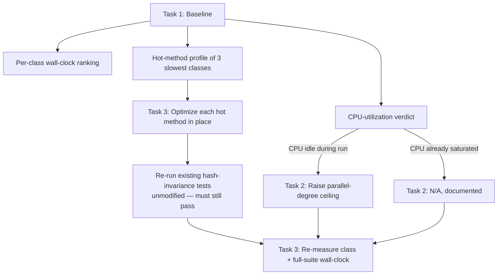

# Test Suite Performance Design

**Spec**: `.specs/features/phase-16-perf-test-suite/spec.md`
**Status**: Draft

---

## Constraints confirmed with user (this session)

> "Nao quero que afete o motor como ele funciona, quero ter o maximo possivel
> do mesmo resultado em menos tempo."

> "Um item que nao estou disposto e carregar Gigabites de dados em cache.
> Isso inviavel. Quero somente alternativas de otimização das simulações."

Both rule out anything that avoids re-computing simulated state (caching,
snapshotting, fast-forwarding). Only genuine compute-speed work remains:

- **No caching/snapshotting/persistence of world state, anywhere, in any
  form** — the earlier checkpoint-cache design (in-memory or disk) is fully
  withdrawn.
- **Zero change to what the simulation computes** — every optimization must
  keep passing the existing hash-invariance/monotonic-field tests unmodified.
  Only *how fast* the same computation runs may change.
- Two levers remain: (1) use the hardware better (parallelism tuning), (2) do
  less/cheaper work per tick (profiling-guided hot-path optimization).

---

## Research findings (Knowledge Verification Chain, step 1 — codebase)

Carried over from the prior design pass — still accurate, cache-specific
findings dropped:

| # | Finding | Source |
| --- | --- | --- |
| 1 | `WorldClock` is stateless (systems list + config only); all simulated state lives on `WorldState`. Tick-stepping is `WorldClock.Run(world, ticks)` / `.Tick(world)`. | `src/LivingWorld.Simulation/WorldClock.cs:9,16,22` |
| 2 | No `xunit.runner.json`/`.runsettings` exists; no `[Collection(...)]` anywhere in `tests/`. **xUnit's default already runs every test class as its own parallel collection.** Only shared state found is a one-time `[ModuleInitializer]` env-var reset (`TestEnvironmentSetup.cs:17-21`), not mutated per-test — safe under parallelism as-is. | repo search, `TestEnvironmentSetup.cs:17-21` |
| 3 | Existing closed-form/parallel optimization patterns already in the codebase: `LazyNeed.ValueAt` (closed-form decay instead of per-tick mutation) and `NpcWakeScheduler.RescheduleBatchParallel` (parallelized need rescheduling, hash-verified against sequential). These are the *template* for P3 — extend the same style of optimization to whatever else profiling flags, not invent a new style. | `Performance/LazyNeedTests.cs`, `Performance/ParallelDecayTests.cs:21` |
| 4 | `scripts/test.sh` runs `dotnet test LivingWorld.sln` with no `-m`/parallelism flags — default VSTest/xUnit settings apply throughout. | `scripts/test.sh:14-19` |
| 5 | STATE.md (Handoff, Round 4) already recorded a concrete data point: at least one test in the "Population" pattern takes 12+ minutes alone — a strong candidate for Task 1's profiler to target first. | `.specs/STATE.md:90` |

**Implication for P2 (parallelism):** same as before — parallelism is not
actually off today. P2 is "measure whether cores are idle, and if so raise
the ceiling," not "turn something on."

---

## Architecture Overview

There is no new production component. The "architecture" here is a
three-stage measurement-then-optimize loop, entirely inside `tests/` and
build/run configuration:

`WorldClock`, `WorldState`, and every `ISimulationSystem` keep their current
public shape. Task 3's edits are internal-implementation-only (method bodies
inside existing systems), never signature or behavior changes.

---

## Code Reuse Analysis

### Existing Components to Leverage

| Component | Location | How to Use |
| --- | --- | --- |
| `LazyNeed.ValueAt` closed-form pattern | referenced in `Performance/LazyNeedTests.cs` | Template for turning any other profiled "recompute every tick" field into "compute on demand from elapsed time," if Task 1 finds a similar candidate. |
| `NpcWakeScheduler.RescheduleBatchParallel` | referenced in `Performance/ParallelDecayTests.cs:21` | Template for parallelizing a per-NPC batch operation, with the existing hash-verified-against-sequential pattern reused as the correctness proof for any new parallel hot path. |
| Existing hash-invariance tests (`TickLoopHashInvarianceTests.cs`, `ZeroRoundTripsTests.cs`, `MaterializationRoundTripTests.cs`) | `tests/LivingWorld.Tests/Simulation/`, `tests/LivingWorld.Tests/Cities/` | Reused unmodified as the correctness gate for every Task 3 optimization — no new correctness-checking machinery invented. |
| .NET built-in profiler (`dotnet-trace`) | .NET SDK tool | Reused for Task 1's hot-method profile — no third-party profiling dependency added. |
| xUnit's own parallel-degree configuration (`xunit.runner.json` / `-- XUnit.MaxParallelThreads`) | framework feature | Reused for Task 2 — no custom test-scheduling code written. |

### Integration Points

| System | Integration Method |
| --- | --- |
| `dotnet-trace` / `dotnet test` duration logger | Run manually (or via a small `scripts/` helper) against the current test binaries — no source change required to produce the baseline. |
| Whatever system(s) Task 1 flags as hot | Direct in-place edits inside `src/LivingWorld.Simulation/**`, scoped to the specific method(s) profiled — the actual list is intentionally left open until Task 1 has data (see spec.md's open item). |

---

## Data Models

None. No new persisted or in-memory structures — this feature only changes
timing, not data shape.

---

## Error Handling Strategy

Not applicable in the traditional sense (no new user-facing or runtime error
paths). The one operational risk is regression: an optimization that changes
output. That risk is handled structurally, not by error handling — see
"Correctness gate" below.

| Error Scenario | Handling | Impact |
| --- | --- | --- |
| A Task 3 optimization breaks a hash-invariance test | The task is not done — per the skill's execution contract, tests are never weakened to pass; the optimization is revised or reverted | No behavior-changing optimization ever ships |
| Parallel-degree tuning (Task 2) destabilizes a test that assumed sequential execution | Caught by the mandated 3× consecutive full-suite run (PERF-05) before the tuning is considered done | Flaky-under-parallelism tests are found and fixed (or the offending test is isolated into its own collection) before merging |

---

## Risks & Concerns

| Concern | Location | Impact | Mitigation |
| --- | --- | --- | --- |
| Task 3's scope is unknown until Task 1 runs | n/a — deliberate | Can't size the engine-optimization work yet | Spec's Requirement Traceability and this design both explicitly defer "which methods" to post-baseline; Tasks phase should not enumerate specific hot-path fixes until Task 1's `baseline-timings.md` exists |
| Parallelizing a previously-sequential per-NPC loop could change iteration order in a way some test implicitly depends on (spec.md Edge Cases) | Any future hot-path candidate touching per-NPC iteration | A test could start failing intermittently, or worse, pass while quietly checking a different case than intended | `NpcWakeScheduler.RescheduleBatchParallel`'s existing pattern (hash-compare parallel vs. sequential output) is the required template for any new parallel hot path — order-independence must be proven, not assumed |
| 12+ minute "Population"-pattern test noted in STATE.md may not be a simulation-compute problem at all (e.g. could be I/O, xUnit fixture overhead, or an accidentally-quadratic test-side assertion rather than the engine) | `.specs/STATE.md:90` | Optimizing the engine wouldn't help if the real cost is test-side | Task 1's profiler run against this specific test first, before assuming it's an engine hot path |
| No CI to catch a future regression back above 1 hour | Explicitly out of scope (spec.md) | The <1h result could silently erode over time as more scenario tests are added | Documented as a known gap in Success Criteria's baseline doc, left for a future/separate CI decision — not this feature's job |

---

## Tech Decisions

| Decision | Choice | Rationale |
| --- | --- | --- |
| Profiling tool | `dotnet-trace` (in-box .NET SDK tool) | No new dependency; already the standard tool for .NET CPU/alloc profiling |
| Parallelism control mechanism | xUnit's native `xunit.runner.json` (`parallelizeAssembly`, `maxParallelThreads`) or `-- XUnit.MaxParallelThreads=<N>` CLI override | Native framework feature — no custom scheduler |
| Which hot paths to optimize | Deliberately left open, decided by Task 1's data, not pre-guessed | Prevents speculative optimization of code that isn't actually the bottleneck (STATE.md's own history shows the actual root causes in this codebase are often surprising — e.g. the tick-loop-never-ran bug found live, not by inspection) |
| Correctness gate for every optimization | Must pass all existing hash-invariance tests unmodified; no new "looser" comparison introduced | Directly satisfies the user's "mesmo resultado" constraint without inventing a new correctness standard |

This design introduces no new project-level convention, so nothing is
appended to `.specs/STATE.md` `## Decisions`.

---

## Open item for Tasks phase

Tasks breakdown should stop at three concrete, sequenceable tasks for P1+P2
(baseline, profile, tune parallelism), and treat P3 as **one task per hot
method Task 1 actually finds** — the exact count and target methods can't be
enumerated before that data exists.
