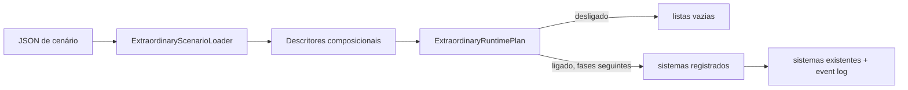

# Phase 16 — Potência: Design

**Spec**: `.specs/features/phase-16-powers/spec.md`  
**Status**: Aprovado pelo pedido de início da fase

## Arquitetura

Descritores puros vivem em `Domain`; JSON é validado por um loader em `Simulation`. Um plano
runtime explícito impede ativação parcial. Depois, sistemas de aquisição/manifestação/aplicação
consomem os mesmos descritores e comunicam apenas por eventos.

## Componentes e reuso

| Componente | Local | Responsabilidade | Reuso |
|---|---|---|---|
| `ExtraordinaryScenarioData` | `Domain/Extraordinary` | flag + descritores imutáveis | records de regras |
| `PowerDescriptor` | `Domain/Extraordinary` | eixos genéricos, sem poder nominal | strings de catálogo |
| `ExtraordinaryScenarioLoader` | `Simulation/Extraordinary` | parse/validação na borda | `Result<T>`, `JsonNode` |
| `ExtraordinaryRuntimePlan` | `Simulation/Extraordinary` | gate único do caminho runtime | listas ordenadas |
| `ExtraordinaryCarrierState` | `Domain/Extraordinary` | estado consultável por projeções | `NpcId` tipado |
| `ExtraordinaryInvocationEngine` | `Simulation/Extraordinary` | custo, resolução e efeito atômicos | `Result<T>`, event log |

## Modelo inicial

`PowerDescriptor` contém os eixos originais e, opcionalmente, `Appearance` (escala/tom/trilha),
`NeedSubstitution` (necessidade/recurso/unidades), `SenescenceRateMultiplier` e
`ManifestationCondition`. `ExtraordinaryCarrierState` resolve manifestação e aparência corrente
para API/web sem interpretar nomes. Efeito continua `target:magnitude`.

## Validação e falhas

| Entrada | Resultado |
|---|---|
| bloco ausente | `Disabled`, sem runtime |
| bloco presente sem `Enabled` | `Failure` nomeando o campo |
| id/eixo obrigatório vazio | `Failure` nomeando o eixo |
| ids duplicados | `Failure` nomeando o id |
| falha com confiabilidade diferente de `ResolutionCheck` | `Failure` |
| escala/unidades inválidas ou senescência negativa | `Failure` nomeando o campo |
| ligado | registra somente `ExtraordinaryStateSystem` |

Falha nunca deixa plano parcial. Configuração e estado resolvido entram no hash/snapshot; apresentação
é canônica porque manifestação pode alimentar percepção e decisão social.

## Determinismo

O loader não usa RNG. Coleções preservam ordem autorada e ids duplicados são rejeitados. Sistemas
futuros iteram por id e usam streams do mundo/portador/região conforme materialização. Invocação
`Guaranteed` não toca RNG; `ResolutionCheck` só aceita resultado produzido pelo `Resolver`.
Aquisição `rate:<probabilidade>:event:<gatilho>` multiplica a taxa-base por `Npc.RateGene` e usa
stream estável do NPC/evento. `event:<gatilho>` continua garantida; natalidade herda o gene sem
copiar `ExtraordinaryCarrierState`.

Locomoção extraordinária estende a progressão de rota existente: velocidade define passos reais
por hora; voo troca custo/caminhabilidade de terreno, nunca colisão estrutural ou escopo interior.
Construtos são ocupantes temporários canônicos com footprint, durabilidade e expiração; criação e
remoção são eventos conservativos, sem `Building` ou recurso econômico sintético.

## Riscos & Concerns

| Risco | Impacto | Mitigação |
|---|---|---|
| formulário web precisa acompanhar campos (`AD-001`) | drift de autoria | tarefa de integração inclui UI/teste |
| estado ainda não tem aquisição | coleção começa vazia | T4 será o único autor causal |
| tags livres podem ter semântica inválida | erro tardio | catálogos semânticos entram com cada sistema-alvo |

## Decisões

Detalhe de resolução, modos e LOD: [design-closeout.md](design-closeout.md).

- Um descritor unificado (ADR-0010), não herança por arquétipo.
- Sem enum de poderes, fontes, manifestações ou aquisições; modos operacionais continuam dados.
- Cenário legado ausente equivale a desligado; bloco declarado é validado estritamente.
