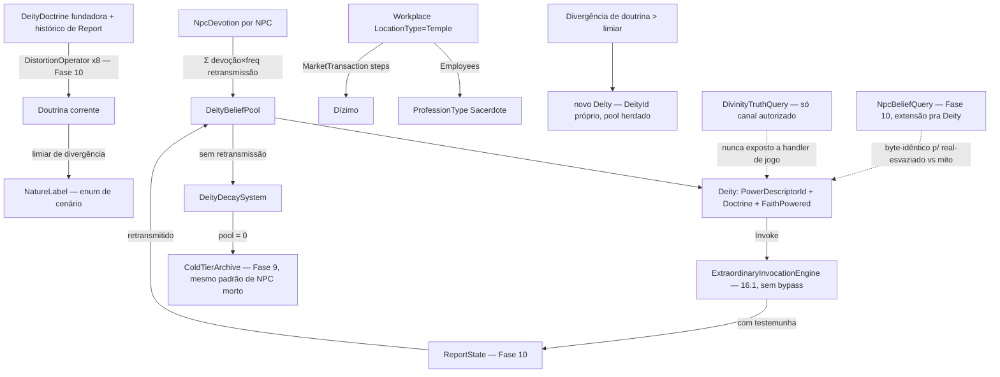

# Fase 17 — Design

**Spec**: `.specs/features/phase-17-divinity/spec.md` (31 requisitos, DIV-01..73)
**Scope**: Complex (domínio novo — `Deity` — mas 100% composição de 4 engines já fechados: Fase
5 economia, Fase 8 cidades, Fase 9 arquivo frio, Fase 10 história/crença)

---

## Architecture Overview

`Deity` não é um novo tipo de entidade paralelo a `Npc` — é um portador de `PowerDescriptor`
(16.1) com um pool derivado de devoção, e todo o resto (templo, sacerdote, dízimo, doutrina,
verdade) é reuso direto de tipos que já existem. O design não adiciona nenhum motor de
distorção/economia/coleta novo — só os pontos de acoplamento.



Nenhuma edição no registro de mecânicas do 16.1, no `DistortionEngine` da Fase 10, no
`MarketTransaction` da Fase 5, ou no `ColdTierArchive` da Fase 9 — este design só produz pontos
de acoplamento (novos records + 2-3 sistemas), nunca reimplementa os 4 motores consumidos.

---

## Code Reuse Analysis

| Peça | Reusa | Novo |
| --- | --- | --- |
| Poder do deus | `PowerDescriptor`/`ExtraordinaryInvocationEngine`/`ExtraordinaryCarrierState` (16.1), sem bypass | `Deity` referencia `PowerDescriptor.Id` — nenhum campo de poder duplicado |
| Relato de manifestação | `ReportState`/`DistortionEngine`/`CanonSlotManager` (Fase 10) — mesmo pipeline de qualquer relato | Gatilho: manifestação de `Deity` com testemunha gera `ReportState` como qualquer outro fato |
| Distorção da doutrina | Os 8 `DistortionOperator` já existentes (Fase 10) — reusa `Moralization`, `CausalLoss`, `AttributionSwap`, `CharacterMerge` (mapeados 1:1 pros 4 citados no domínio) | `DoctrineDeriver` — aplica os operadores sobre o histórico de `Report` da doutrina, nunca reimplementa a probabilidade/lógica de cada operador |
| Verdade | `HistoryTruthQuery` (Fase 10) como padrão de canal único não exposto a handler de jogo | `DivinityTruthQuery` — mesmo padrão isolado, próprio arquivo, próprio guard de mutação |
| Crença/culto (view de jogo) | `NpcBeliefQuery` (Fase 10) como padrão de view que nunca resolve verdade | Extensão: consulta de crença sobre `Deity` devolve só pool/natureza observável, nunca `PowerDescriptor` real |
| Templo | `Workplace` (Fase 5, AD-043) — `LocationType` novo no catálogo de cenário (`Temple`), `Employees`, `Treasury`, `Stock` | Nenhum campo C# novo em `Workplace` — só um `LocationType` de catálogo |
| Sacerdote | `ProfessionType` (Fase 5/6) — id de catálogo, `Npc.SwitchProfession` | Nenhum tipo novo — só um `ProfessionType` de catálogo |
| Dízimo | `MarketTransaction`/`TransactionContext`/`Steps` (Fase 5) — mesma composição all-or-nothing | `TithePaymentSteps` — sequência de `TransactionStep` reusando o mesmo shape (débito NPC → crédito `Workplace.Treasury` do templo) |
| Coleta de deus esvaziado | `ColdTierArchive` (Fase 9) — mesmo padrão de `TryArchive`/`NpcSummary` | `DeitySummary` (equivalente a `NpcSummary`) + `ColdTierArchive.TryArchiveDeity` (overload, mesma classe) |
| Determinismo | `WorldRng.Stream("<nome>")` + `Resolver.Resolve` (ADR-0011) — nunca `Random`/`Guid` soltos | Stream nomeada `"deity-schism"`/`"deity-mix"` conforme necessário (mesmo padrão de `"city-founding"`) |
| Auditoria causal | `WorldEventKind` (Fase 10/16.1, aditivo) | Novos valores: `DeityManifested`, `DeityDecayed`, `DeityArchived`, `DeitySchismed`, `DoctrineNatureShifted` |

---

## Components / Interfaces

```csharp
// Domain — src/LivingWorld.Domain/Divinity/Deity.cs (novo arquivo/namespace)
public sealed record Deity(
    DeityId Id,
    string PowerDescriptorId,     // referencia PowerDescriptor.Id existente (16.1) — nunca duplica poder
    string FoundingDoctrineId,    // doutrina fundadora — imutável, ponto de referência pra divergência
    bool FaithPowered,            // liga/desliga o vínculo mecânico fiéis→poder — independente de Worshipped
    CityId? FoundingCity);

// Domain — pool é DERIVADO, nunca armazenado como campo mutável direto
public static class DeityBeliefPool
{
    public static double Compute(
        WorldState world, DeityId deityId); // Σ devoção_i × freq_retransmissão_i sobre fiéis correntes
}

// Domain — devoção por NPC, conservada (soma ≤ 1 entre deuses + sem-fé)
public sealed record NpcDevotion(
    NpcId NpcId,
    IReadOnlyDictionary<DeityId, double> DevotionByDeity, // soma + FaithlessShare == 1 (epsilon)
    double FaithlessShare);

// Domain — natureza é enum de cenário, nunca campo fixo
public readonly record struct NatureLabel(int Id); // id em DeityCatalog, mesmo padrão de ProfessionType/LocationType

// Domain — regra de cenário (mesmo arquivo/padrão de HistoryRules/PerfRules)
public sealed record DivinityRules(
    double NatureDivergenceThreshold,  // limiar pra trocar rótulo de natureza
    double SchismDivergenceThreshold,  // limiar pra spawnar novo Deity
    long DecayEvaluationWindowTicks);  // janela sem retransmissão antes de decair
```

| Componente | Responsabilidade |
| --- | --- |
| `DeityBeliefPool.Compute` | Função pura: soma devoção×retransmissão sobre fiéis correntes — chamada a cada reavaliação, nunca cacheada como fonte de verdade (mesmo espírito de `CurrentStageIndex` recalculado na 16.2) |
| `DevotionLedger` | Sistema que garante `Σ devoção_por_NPC + FaithlessShare == 1`; conversão/perseguição realoca share entre entradas do mesmo dicionário, nunca cria devoção do nada |
| `DeityDecaySystem` | A cada tick de reavaliação (mesma cadência de `ExtraordinaryStateSystem`), se `Deity.FaithPowered` e não há retransmissão na janela (`DivinityRules.DecayEvaluationWindowTicks`), aplica decaimento monotônico; ao pool cruzar 0, delega pra `ColdTierArchive.TryArchiveDeity` |
| `DoctrineDeriver` | Aplica os 8 `DistortionOperator` (Fase 10, via `DistortionEngine`) sobre o histórico de `ReportState` ligado à doutrina fundadora do `Deity`; retorna a doutrina corrente (função pura, recalculada, nunca armazenada) |
| `NatureResolver` | A partir da doutrina corrente + `DivinityRules.NatureDivergenceThreshold`, resolve o `NatureLabel` corrente (enum de cenário); dispara `WorldEventKind.DoctrineNatureShifted` só na troca observável |
| `SchismResolver` | Quando uma sub-comunidade de fiéis diverge da doutrina corrente além de `SchismDivergenceThreshold`, cria `Deity` novo (`WorldRng.Stream("deity-schism")` pro `DeityId` determinístico) e realoca `DevotionByDeity` dos fiéis migrantes — original mantém os remanescentes |
| `DivineIntervention` | Wrapper fino sobre `ExtraordinaryInvocationEngine.InvokeAuthored`/`Invoke` — mesmo `Reliability`/`Resolution` do `PowerDescriptor` do deus; custo debitado do `DeityBeliefPool` (via redução de devoção efetiva ou ledger de gasto — ver Data Models) independente de testemunha; testemunha presente gera `ReportState` (Fase 10), ausência não gera relato mas custo/efeito ocorrem normalmente |
| `TithePaymentSteps` | Composição de `TransactionStep` (mesmo shape de `MarketTransaction`) — débito no `Npc`/wallet do fiel, crédito no `Workplace.Treasury` do templo (`LocationType=Temple`) |
| `DivinityTruthQuery` | Único canal que resolve se um `Deity` tem `PowerDescriptor` real por trás (real/esvaziado) vs. não (falso/mito) — mesmo padrão isolado de `HistoryTruthQuery`, nunca referenciado por handler de jogo |
| `DeityBeliefQuery` (extensão de `NpcBeliefQuery`) | View de jogo: pool observável + `NatureLabel` corrente — nunca resolve `PowerDescriptor` real; garante resposta byte-idêntica entre deus esvaziado e mito em ascensão no mesmo pool/manifestação |

---

## Data Models

```csharp
// WorldEventKind (Fase 10/16.1, aditivo)
DeityManifested        // campos: deityId, powerId, witnessed(bool), reportId?
DeityDecayed            // campos: deityId, poolBefore, poolAfter, tick
DeityArchived           // campos: deityId, finalDoctrine, tick — mesmo padrão de NpcSummary
DeitySchismed           // campos: originDeityId, newDeityId, migratedNpcIds
DoctrineNatureShifted    // campos: deityId, previousNature, currentNature, tick

// Regra de cenário nova (mesmo arquivo/padrão de HistoryRules/PerfRules)
public sealed record DivinityRules(
    double NatureDivergenceThreshold,
    double SchismDivergenceThreshold,
    long DecayEvaluationWindowTicks);

// Fase 9 — overload em ColdTierArchive (mesma classe, novo método, mesmo padrão de NpcSummary)
public sealed record DeitySummary(
    DeityId Id, string PowerDescriptorId, string FinalDoctrineId,
    long FoundedAtTick, long ArchivedAtTick);
// ColdTierArchive.TryArchiveDeity(WorldState, TickContext, Deity, long nowTick, DivinityRules) -> bool
// ColdTierArchive.LookupDeity(DeityId) -> DeitySummary?
```

**Custo de intervenção sem teto de saldo negativo**: mesmo padrão de recusa por recurso
insuficiente já usado em `MarketTransaction.Execute`/16.1 — se o custo declarado excede o pool
corrente, `DivineIntervention` recusa antes de chamar `ExtraordinaryInvocationEngine`, nunca
debita pra negativo.

Nenhum campo existente de `PowerDescriptor`/`ExtraordinaryCarrierState`/`ReportState`/
`DistortionOperator`/`Workplace`/`ColdTierArchive` muda de tipo ou significado — tudo aditivo,
mesma disciplina da 16.1/16.2.

---

## Error Handling Strategy

| Cenário | Comportamento |
| --- | --- |
| Custo de intervenção excede pool corrente | Recusa antes de invocar o engine (mesmo padrão de saldo insuficiente do `MarketTransaction`) — nunca debita negativo |
| `Deity.FaithPowered == false` | `DeityBeliefPool.Compute` nunca é chamado pra esse deus — nenhum sistema de decaimento/intervenção o toca (DIV-61) |
| Doutrina fundadora sem nenhum `ReportState` distorcido no histórico | `DoctrineDeriver` retorna a doutrina fundadora inalterada — `NatureResolver` nunca diverge sem histórico real |
| Cisma calculado mas nenhum fiel de fato migra (divergência no limiar, mas 0 NPCs do lado divergente) | Nenhum `Deity` novo é criado — cisma exige população migrante > 0 |
| Pool cruza 0 mas o `Deity` está no meio de uma invocação em andamento no mesmo tick | Invocação corrente conclui (custo já debitado antes do decaimento daquele tick); coleta ocorre no próximo tick de reavaliação — nunca invalida uma invocação em voo |
| Consulta de crença de jogo (`DeityBeliefQuery`) para `Deity` já coletado (`ColdTierArchive`) | Retorna o mesmo shape observável de "silêncio"/"esquecido" que um deus com pool baixo — nunca erro/exceção só por ter sido arquivado |

## Risks & Concerns

| Risco | Mitigação |
| --- | --- |
| `DivinityTruthQuery`/`DeityBeliefQuery` vazarem verdade por caminho não coberto na enumeração por reflexão (DIV-70) | Mesmo padrão de teste-guard já usado em `HistoryQuerySeparationGuard`/`...MutationTests.cs` (Fase 10) — reusado, não reinventado, com par de mutação desligando a checagem |
| Soma de devoção por NPC drifitar de 1 por erro de ponto flutuante acumulado em muitos ciclos de conversão | `DevotionLedger` normaliza (renormalização defensiva) a cada escrita, não só valida — mesmo espírito de invariante ativamente mantido, não só testado |
| `DoctrineDeriver` ficar caro (recalculado toda leitura, sobre histórico potencialmente longo de `ReportState`) | Mesma disciplina de custo-por-tick da Fase 9 — se medição mostrar custo alto, é candidato a decaimento preguiçoso/cache invalidado por novo `Report`, não bloqueador de design agora (documentado, não implementado preventivamente — YAGNI) |
| Cisma usando `WorldRng.Stream("deity-schism")` colidir determinismo com outros usos da mesma stream nomeada | Nome de stream é único por natureza (`"deity-schism"`, `"deity-mix"`) — mesmo padrão já usado por `"city-founding"`, sem colisão por design |
| Templo (`Workplace` com `LocationType=Temple`) competir por vagas/orçamento com outros tipos de `Workplace` na mesma cidade sem sinalização especial | Fora de escopo — mesma disciplina de balanceamento econômico já delegada a regra de cenário (Fase 5), não a este design |

## Tech Decisions

| Decisão | Nível | Registro |
| --- | --- | --- |
| `Deity` não herda/estende `Npc` — é um agregado próprio referenciando `PowerDescriptor.Id` | Feature (17) | Evita acoplar identidade biológica (idade, morte por senescência) a uma entidade que morre por esquecimento, não por biologia |
| Pool de crença é sempre função pura recalculada (`DeityBeliefPool.Compute`), nunca campo armazenado mutável | Feature (17) | Mesma disciplina "estado recalculado > estado gravado" já usada em `CurrentStageIndex` (16.2) e nas queries de crença (Fase 10) |
| Natureza é `NatureLabel` (enum de cenário, catálogo) — não vetor contínuo | Feature (17) | Decisão confirmada com o usuário — mais simples de testar divergência categórica |
| Cisma cria `Deity` novo com `DeityId` próprio | Feature (17) | Decisão confirmada com o usuário — panteão cresce organicamente |
| Coleta de deus reusa `ColdTierArchive` (Fase 9) como overload, não uma classe paralela | Feature (17) | Mesma disciplina de reuso do resto do design — "arquivo frio" já é o padrão certo pra "entidade morta sai da memória quente" |
| Templo/sacerdote/dízimo não geram nenhum tipo C# novo — só entradas de catálogo (`LocationType=Temple`, `ProfessionType=Sacerdote`) | Feature (17) | `Workplace`/`ProfessionType`/`MarketTransaction` já são genéricos o suficiente — tipo novo aqui seria duplicação, não composição |
