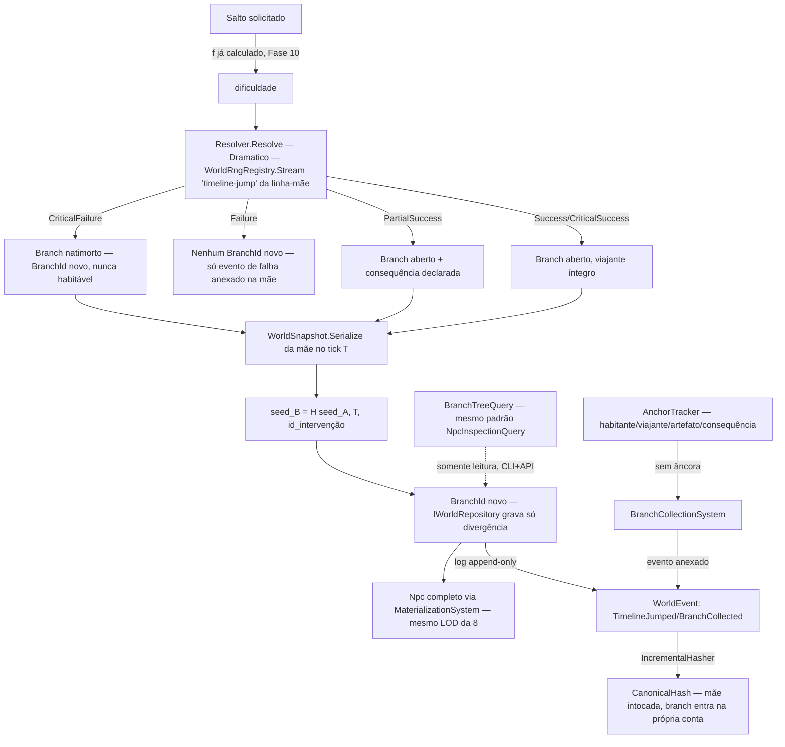

# Fase 18 — Design

**Spec**: `.specs/features/phase-18-timelines/spec.md` (28 requisitos, TML-01..62)
**Scope**: Complex (mecanismo novo — ramificação — mas composição estrita de 5 engines já
fechados: Fase 1 snapshot/replay, Fase 3 `BranchId`/log, ADR-0011 Resolver, Fase 8 materialização
LOD/query CLI+API, Fase 10 inércia histórica)

---

## Architecture Overview

`BranchId` já existe no esquema desde a Fase 3 (`readonly record struct BranchId(long Value)`,
`BranchId.Root = new(0)`) mas nunca foi usado além de `Root` — hoje toda leitura/escrita do
`IWorldRepository` já exige `BranchId` como parâmetro explícito. Esta fase não precisa mudar o
esquema, só passar a construir `BranchId`s além de `Root` e orquestrar snapshot+replay+log+RNG
por linha.



Nenhuma edição em `WorldSnapshot`/`PersistentWorldRunner`/`Resolver`/`WorldRngRegistry`/
`MaterializationSystem` — este design só adiciona o orquestrador de salto, o rastreador de
âncora, o sistema de coleta e a query de árvore, todos consumindo a infraestrutura existente.

---

## Code Reuse Analysis

| Peça | Reusa | Novo |
| --- | --- | --- |
| Identidade de linha | `BranchId` (`Ids.cs`, desde Fase 3/ADR-0009) — já exigido em todo `IWorldRepository` | Construção de `BranchId` além de `Root` — nenhum novo esquema |
| Snapshot da mãe no tick T | `WorldSnapshot.Serialize`/`Deserialize` (Fase 1), `PersistentWorldRunner.LoadAt(tick)` (replay determinístico já provado em `HistorySnapshotReplayTests.cs`) | — |
| Log append-only + hash canônico | `IWorldEventSink.Record(WorldEvent)`, `EventLogRecord` (Id monotônico, nunca `UPDATE`), `WorldSnapshot.CanonicalHash` → `IncrementalHasher.Compute` | 2 `WorldEventKind` novos (`TimelineJumped`, `BranchCollected`) |
| Rolagem do salto | `Resolver.Resolve(difficulty, modifiers, VarianceProfileCatalog.Get("Dramatico"), rng)` — 5 níveis já existentes, sem extensão | Difficulty computation lê o modelo de inércia da Fase 10 (já existe lá) — só o *chamador* é novo aqui |
| RNG da linha-mãe | `WorldRngRegistry.Stream("timeline-jump")` (mesmo padrão de `TickContext.Rng("...")`) | Nome de stream `"timeline-jump"` |
| Seed derivada | `WorldRng.Derive(long streamKey)` (primitivo já existente) | Função `TimelineSeedDerivation.Derive(seedA, tick, interventionId) -> long`, hash puro estável |
| Viajante materializado | `MaterializationSystem`/`HasFormalRole`/`EnsureMaterialized` (Fase 8) — viajante qualifica como papel formal, sem novo conceito de LOD | Predicado adicional em `HasFormalRole` (ou papel dedicado) pra viajante recém-chegado |
| Consulta somente-leitura | Padrão `NpcInspectionQuery` + `MapGet` (API) + verbo CLI em `Workers/Program.cs` (Fase 8) — mesmo seam exato | `BranchTreeQuery.Inspect(WorldState, BranchId?) -> Result<BranchTreeDto>` |
| Coleta por budget | `PerfRules.ColdArchiveAfterYears`/`ColdTierArchive` (Fase 9) como precedente estrutural de "budget com limiar + coleta determinística" | `BranchCollectionSystem` — não reusa a classe (é sobre `Npc`, não `Branch`), mas replica a disciplina |

---

## Components / Interfaces

```csharp
// Domain — src/LivingWorld.Domain/Timelines/TimelineJumpResult.cs (novo)
public enum TimelineJumpOutcome { Stillborn, NoBranch, PartialSuccess, Success, CriticalSuccess }

public sealed record TimelineJumpRequest(
    BranchId OriginBranch, long DivergenceTick, string InterventionId, NpcId TravelerId);

// Domain — seed pura, sem estado
public static class TimelineSeedDerivation
{
    public static long Derive(long seedOrigin, long divergenceTick, string interventionId);
    // H(seedOrigin, divergenceTick, interventionId) — recursivo: chamar de novo com seed_B
    // pra branch de branch, sem tratamento especial de profundidade
}

// Domain — âncora, mesmo espírito de campo aditivo
public enum AnchorKind { Inhabitant, Traveler, Artifact, PendingConsequence }
public sealed record BranchAnchor(BranchId Branch, AnchorKind Kind, string RefId);

// Domain — regra de cenário (mesmo arquivo/padrão de PerfRules/HistoryRules)
public sealed record TimelineRules(
    int MaxLiveBranches,
    long CollectionGraceTicks); // K — ticks sem âncora antes da coleta
```

| Componente | Responsabilidade |
| --- | --- |
| `TimelineJumpOrchestrator` | Ponto de entrada único: calcula dificuldade (delega ao modelo de inércia já existente da Fase 10), chama `Resolver.Resolve` sobre `WorldRngRegistry.Stream("timeline-jump")` da linha de origem, anexa `WorldEventKind.TimelineJumped` (sempre, inclusive falha), e delega criação de branch conforme o `TimelineJumpOutcome` |
| `TimelineSeedDerivation` | Função pura de derivação de seed — usada tanto pra branch-de-raiz quanto branch-de-branch (recursiva, sem teto) |
| `BranchFactory` | Encapsula `PersistentWorldRunner.LoadAt(divergenceTick)` + construção do novo `BranchId` + gravação copy-on-write via `IWorldRepository` (grava só o delta a partir do snapshot reidratado) |
| `AnchorTracker` | Mantém a lista de `BranchAnchor` por `BranchId`; adicionar/remover âncora é operação O(1); nenhuma âncora restante torna o branch elegível pra `BranchCollectionSystem` |
| `BranchCollectionSystem` | `ISimulationSystem` (mesma cadência de sistemas Daily/Hourly já usados, ex. `MaterializationSystem`) — verifica branches sem âncora há `TimelineRules.CollectionGraceTicks`, coleta em ordem determinística (por `BranchId` crescente, nunca "varredura oportunista"), anexa `WorldEventKind.BranchCollected` |
| `BranchTreeQuery` | `Inspect(WorldState, BranchId? root) -> Result<BranchTreeDto>` — somente leitura; percorre a cadeia mãe→filho até a raiz sem limite de profundidade; mesmo seam de `NpcInspectionQuery` (`MapGet` em `Program.cs` + verbo CLI em `Workers/Program.cs`) |
| Predicado de viajante materializado | Extensão em `MaterializationSystem.HasFormalRole` (ou papel dedicado equivalente) — viajante recém-chegado qualifica como formal role até estabilizar, dali em diante é um `Npc` comum sujeito à materialização normal |

---

## Data Models

```csharp
// WorldEventKind (aditivo)
TimelineJumped   // campos: originBranch, targetBranch?, divergenceTick, interventionId, outcome, travelerId
BranchCollected  // campos: branchId, collectedAtTick, lastAnchorKind?

// Regra de cenário nova
public sealed record TimelineRules(int MaxLiveBranches, long CollectionGraceTicks);
```

**Teto de branches vivos atingido**: `BranchFactory` recusa a criação de um branch novo
(mesmo resultado de "recusa por recurso insuficiente" já usado em `MarketTransaction`/16.1) se
`MaxLiveBranches` já está no teto — decisão de Design resolvendo o Edge Case da spec: **recusar o
salto**, nunca coletar um candidato só pra abrir espaço (evita coleta antecipada de branch com
âncora ativa por pressão de outro salto).

**Onde o evento de coleta é anexado**: no log da própria linha coletada (não da mãe) — cada
`BranchId` tem seu próprio log append-only (mesma disciplina de `EventLogRecord.BranchId`), então
o hash canônico de cada linha só inclui os eventos que genuinamente ocorreram nela. O evento de
coleta é o último evento daquele log.

Nenhum campo existente de `WorldEvent`/`EventLogRecord`/`WorldSnapshot`/`Resolver`/
`WorldRngRegistry`/`MaterializationSystem` muda de tipo ou significado — tudo aditivo.

---

## Error Handling Strategy

| Cenário | Comportamento |
| --- | --- |
| Salto solicitado para tick futuro (sem snapshot) | Recusa antes de qualquer rolagem — mesma disciplina de validação prévia já usada no engine 16.1 |
| Teto de branches vivos atingido | `BranchFactory` recusa o salto (nunca coleta antecipada por pressão) |
| `Resolver.Resolve` retorna `CriticalFailure` | `BranchFactory` ainda constrói um `BranchId` (natimorto existe no log — TML-30), mas nunca chama `MaterializationSystem`/`EnsureMaterialized` pro viajante — branch nasce já elegível pra coleta |
| `Resolver.Resolve` retorna `Failure` | Nenhum `BranchId` é construído — só `WorldEventKind.TimelineJumped` com `outcome=NoBranch` é anexado na mãe |
| Dois saltos concorrentes divergem do mesmo tick T | `BranchId`s distintos por construção (monotônico, mesmo padrão de `EventLogRecord.Id`) — nenhuma colisão possível |
| `BranchCollectionSystem` avalia um branch no mesmo tick em que uma invocação/transação está em andamento nele | Coleta só considera branches sem âncora — uma operação em andamento é, por definição, uma `PendingConsequence` (âncora), então nunca é coletado no meio de uma operação |

## Risks & Concerns

| Risco | Mitigação |
| --- | --- |
| Custo de replay (`PersistentWorldRunner.LoadAt`) crescer com a profundidade em cadeias longas de branch-de-branch | Fora de escopo desta fase resolver perf de replay profundo — mesma disciplina "documentado, não implementado preventivamente" (Fase 9 é quem fixa teto de custo; se medição mostrar problema, vira task de otimização lá, não aqui) |
| `BranchTreeQuery` percorrendo cadeia até a raiz ficar caro com muitos branches vivos | Mesmo seam de `NpcInspectionQuery` já paginado/limitado quando necessário — replicar se medição mostrar necessidade, YAGNI por ora |
| Determinismo entre processos (TML-13) exigir que `TimelineSeedDerivation`/`Resolver`/`WorldRngRegistry.Stream` sejam livres de qualquer estado de processo (ex.: `GetHashCode` de string não é estável entre processos/versões do runtime) | `TimelineSeedDerivation.Derive` usa hash estável explícito (mesmo cuidado já documentado pra `WorldRngRegistry.Stream`'s `StableHash`, não `string.GetHashCode`) |
| Coleta determinística por ordem de `BranchId` crescente favorecer sistematicamente branches mais antigos quando o teto é atingido | Aceitável — "determinística e ordenada" é o critério explícito da spec (TML-42), não "justa" |

## Tech Decisions

| Decisão | Nível | Registro |
| --- | --- | --- |
| `TimelineJumpOrchestrator` não modifica `Resolver`/`VarianceProfile` — só é mais um chamador | Feature (18) | Preserva ADR-0011 (primitivo único) sem exceção |
| Evento de coleta vive no log da linha coletada, não no da mãe | Feature (18) | Decisão confirmada com o usuário ("coleta é evento") — cada linha só carrega o que genuinamente ocorreu nela |
| Teto de branches vivos recusa o salto, nunca coleta antecipadamente | Feature (18) | Evita destruir âncora ativa por pressão externa — resolve o Edge Case deixado explícito na spec |
| Viajante reusa `MaterializationSystem`/`HasFormalRole`, sem LOD paralelo | Feature (18) | Decisão confirmada com o usuário — consistência total com Fase 8/9 |
| Sem teto de profundidade de ramificação | Feature (18) | Decisão confirmada com o usuário — `TimelineSeedDerivation` já é recursiva por natureza |
