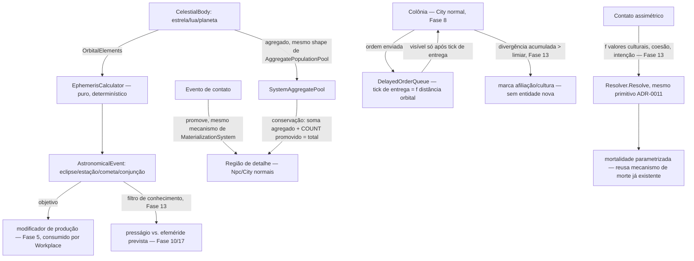

# Fase 19 — Design

**Spec**: `.specs/features/phase-19-cosmos/spec.md` (22 requisitos, COS-01..62)
**Scope**: Complex (dois degraus de LOD novos + calendário determinístico + fila de eventos com
atraso — mas 100% composição de Fase 8/9 LOD e materialização, sem máquina de simulação nova)

> **Nota de dependência aberta**: `CityCulture`/`CityGovernment`/`CityTechnology`
> (`src/LivingWorld.Domain/Cities/CityInstitutions.cs`) são hoje **stubs vazios** (Fase 8,
> SPEC_DEVIATION documentado) — o vocabulário real de cultura/coesão política/nível tecnológico é
> job da Fase 13 (ainda `spec.md` apenas, não implementada). Este design assume a INTERFACE
> provável (um campo/id de "nível tecnológico" e um valor de "coesão política" consultável por
> cultura) sem implementá-la — quando a Fase 13 fechar, os pontos marcados `// Fase 13` abaixo
> precisam reconciliar contra a forma real. Isso é decisão de escopo aceita (fases `spec` podem
> ser desenhadas fora de ordem — ROADMAP.md regra "ativar decisão de escopo").

---

## Architecture Overview

`sistema` e `planeta` entram na MESMA pilha de LOD que `global` já usa — não é uma segunda
hierarquia. `AggregatePopulationPool`/`MaterializationSystem` (Fase 8) já resolvem
agregado↔detalhe pra cidades; este design só estende o *nível acima* delas com o mesmo contrato.



Nenhuma edição em `MaterializationSystem`/`AggregatePopulationPool`/`Resolver`/`WorldSnapshot` —
este design adiciona os degraus de dado (`CelestialBody`, `OrbitalElements`), o calculador puro de
efeméride, a fila de entrega atrasada, e os pontos de consumo em Fase 5/10/17 (via os mesmos
sistemas já existentes lá, aditivos).

---

## Code Reuse Analysis

| Peça | Reusa | Novo |
| --- | --- | --- |
| Materialização/agregação | `MaterializationSystem`/`HasFormalRole`/`EnsureMaterialized` (Fase 8) — mesmo contrato, um nível acima | Predicado de "contato ocorreu" como gatilho de promoção (equivalente a `HasFormalRole`) |
| Conservação na promoção | Mesma invariante já testada em `LodConservationScenarioTests.cs` (Fase 8) | Teste equivalente pro degrau `sistema`/`planeta` |
| Round-trip promover/desmaterializar | `MaterializationRoundTripTests.cs` (Fase 8) como padrão de teste | Teste equivalente pra região de contato |
| Rolagem de desfecho de contato assimétrico | `Resolver.Resolve`/`VarianceProfileCatalog` (ADR-0011) — mesmo primitivo, sem fórmula nova | Dificuldade/modificadores calculados a partir de valores culturais + coesão (via `CityCulture`/Fase 13, quando existir) |
| Fila de entrega atrasada | Mesmo padrão conceitual de "evento anexado com tick alvo" já desenhado pro salto temporal (`TimelineJumpOrchestrator`, Fase 18, spec-only) | `DelayedOrderQueue` — implementação própria desta fase (Fase 18 não expõe API reusável ainda, é spec paralela) |
| Mortalidade parametrizada por contato | Mesmo mecanismo de morte/`MortalityPlanner` já usado pelo resto do motor (Fase 3/4) | Parâmetro de cenário (`ContactMortalityRate`) consumido pelo `MortalityPlanner` existente, sem novo pipeline de morte |
| Cultura/coesão política/nível tecnológico | `CityCulture`/`CityGovernment`/`CityTechnology` (Fase 8, hoje stub) — **assume a interface que a Fase 13 vai preencher** | Nenhum tipo novo aqui — é a mesma dependência aberta documentada acima |
| Produção agrícola modificada | `Workplace`/produção (Fase 5) — modificador multiplicativo aditivo sobre o cálculo existente | `AstronomicalProductionModifier` — função pura que o sistema de produção já existente consulta |

---

## Components / Interfaces

```csharp
// Domain — src/LivingWorld.Domain/Cosmos/CelestialBody.cs (novo namespace)
public readonly record struct CelestialBodyId(long Value);

public sealed record OrbitalElements(
    double SemiMajorAxis, double Eccentricity, double Inclination,
    double OrbitalPeriodDays, double Epoch); // elementos clássicos, suficientes pra efeméride determinística

public sealed record CelestialBody(
    CelestialBodyId Id, string Name, CelestialBodyKind Kind, // Star/Moon/Planet
    OrbitalElements? Orbit, // null só pra estrela central
    SystemAggregatePool Aggregate); // população/tecnologia/expansão em estatística

// Domain — mesmo shape de AggregatePopulationPool (Fase 8), um nível acima
public readonly record struct SystemAggregatePool(long PopulationCount, double TechnologyIndex, double ExpansionRate);

// Domain — cálculo puro, sem estado
public static class EphemerisCalculator
{
    public static IReadOnlyList<AstronomicalEvent> ComputeWindow(
        IReadOnlyList<CelestialBody> bodies, long fromTick, long toTick);
}

public sealed record AstronomicalEvent(
    AstronomicalEventKind Kind, // Solstice/Equinox/Eclipse/Comet/Conjunction
    long Tick, IReadOnlyList<CelestialBodyId> InvolvedBodies, double Magnitude);
```

| Componente | Responsabilidade |
| --- | --- |
| `EphemerisCalculator` | Função pura: elementos orbitais → lista de `AstronomicalEvent` numa janela de ticks. Determinístico, sem RNG (mecânica celeste é cálculo, não sorteio) |
| `AstronomicalProductionModifier` | Consultado pelo sistema de produção agrícola existente (Fase 5): dado um `AstronomicalEvent` ativo na janela de colheita, retorna o multiplicador objetivo — sempre aplicado, independente de conhecimento cultural |
| `AstronomicalBeliefFilter` | Consultado pela camada de crença (Fase 10/17): dado o mesmo `AstronomicalEvent` + o nível de conhecimento astronômico da cultura observadora (**Fase 13, interface assumida**), retorna presságio (sem conhecimento) ou efeméride prevista (com conhecimento) — nunca recalcula o fenômeno |
| `CosmosMaterializationBridge` | Extensão do gatilho de `MaterializationSystem` (Fase 8): evento de contato promove a região correspondente do agregado do sistema, herdando `SystemAggregatePool` proporcionalmente — mesma disciplina "move, nunca cria" |
| `DelayedOrderQueue` | Fila de `DelayedOrder(ColonyId, IssuedAtTick, DeliveryTick, Payload)` — ordem só é visível à consulta da colônia quando `currentTick >= DeliveryTick`; `DeliveryTick` calculado por distância orbital declarada |
| `ContactOutcomeResolver` | Calcula dificuldade/modificadores de `Resolver.Resolve` a partir de valores culturais + coesão política (**Fase 13, interface assumida**) + parâmetros de intenção da civilização contatante declarados no cenário; resultado mapeia pra um dos desfechos do domínio (colapso/culto de carga/conquista/tutela/extermínio/adaptação) |
| `ColonyDivergenceTracker` | Acumula divergência cultural de uma colônia (função de tempo desde último contato + atraso médio); ao ultrapassar limiar de cenário, marca `IsIndependent=true` na `City` existente — nenhuma entidade nova |

---

## Data Models

```csharp
// WorldEventKind (aditivo)
CelestialContactEstablished  // campos: bodyId, promotedCityId, tick
AstronomicalEventOccurred    // campos: eventKind, tick, involvedBodies, magnitude
OrderDelivered               // campos: colonyId, deliveryTick, orderPayloadId
ColonyMarkedIndependent      // campos: colonyId, tick, divergenceScore

// Regra de cenário nova
public sealed record CosmosRules(
    double ContactMortalityRate,       // 0 = desfecho de doença desligado
    double ColonyIndependenceThreshold, // limiar de divergência acumulada
    double OrbitalDistanceToTickFactor); // converte distância orbital em ticks de atraso

public sealed record DelayedOrder(
    long ColonyId, long IssuedAtTick, long DeliveryTick, string PayloadId);
```

**Onde `IsIndependent` vive**: campo aditivo em `City` (Fase 8) — nunca uma entidade política
paralela, conforme decisão confirmada com o usuário.

Nenhum campo existente de `City`/`AggregatePopulationPool`/`MaterializationSystem`/`Workplace`/
`WorldEventKind` muda de tipo ou significado — tudo aditivo.

---

## Error Handling Strategy

| Cenário | Comportamento |
| --- | --- |
| `CosmosRules.ContactMortalityRate == 0` | `MortalityPlanner` nunca recebe modificador de contato — mesmo comportamento de hoje, sem desfecho de doença |
| Ordem consultada pela colônia antes de `DeliveryTick` | `DelayedOrderQueue` retorna "nenhuma ordem pendente visível" — nunca expõe o payload antecipadamente |
| Corpo celeste sem `OrbitalElements` (só a estrela central) | `EphemerisCalculator` trata como referencial fixo, nunca calcula órbita própria pra ele |
| Dois eventos de contato na mesma região no mesmo tick | Resolvido por ordem determinística (mesmo padrão de `Sequence` em `EventLogRecord`) — nunca condição de corrida |
| `ContactOutcomeResolver` chamado antes da Fase 13 preencher `CityCulture`/`CityTechnology` reais (hoje stub `Empty`) | Usa defaults documentados neutros (nem favorece nem penaliza nenhum desfecho) — comportamento reconciliado quando Fase 13 fechar, não bloqueia esta fase |

## Risks & Concerns

| Risco | Mitigação |
| --- | --- |
| Interface de cultura/coesão/tecnologia (Fase 13) mudar de forma real quando implementada, invalidando `ContactOutcomeResolver`/`AstronomicalBeliefFilter` | Aceito e documentado — mesmo espírito de "fase spec pode ser desenhada fora de ordem" do ROADMAP.md; ponto de reconciliação isolado nos 2 componentes marcados, resto do design não depende da forma exata |
| `EphemerisCalculator` ficar caro se a janela de consulta for grande (muitos corpos × muitos ticks) | Função pura e cacheável por natureza (mesmos elementos orbitais sempre produzem os mesmos eventos) — cache é otimização futura se medição mostrar necessidade, YAGNI por ora |
| `DelayedOrderQueue` vazar informação futura por bug de comparação de tick (off-by-one) | Mesma família de teste da Fase 11 (par com/sem ordem enviada, resultado byte-idêntico até o tick de entrega) cobre isso diretamente — não é um risco novo de design, é o próprio critério de verificação |
| Round-trip de contato (COS-32) exigir que `SystemAggregatePool` seja recalculável exatamente na desmaterialização, incluindo produção acumulada durante o período de detalhe | Mesma disciplina já resolvida pelo round-trip de Fase 8 (`MaterializationRoundTripTests.cs`) — reusa o mecanismo, só estende os campos agregados (`TechnologyIndex`/`ExpansionRate` além de população) |

## Tech Decisions

| Decisão | Nível | Registro |
| --- | --- | --- |
| `sistema`/`planeta` são degraus na MESMA pilha de LOD, nunca uma segunda hierarquia | Feature (19) | Preserva a regra "resolução agregada/detalhada/máxima valem igual" do domínio |
| Efeméride é sempre calculada (fenômeno objetivo); interpretação cultural é filtro por cima | Feature (19) | Decisão confirmada com o usuário — mesmo dado, dois usos, sem duplicar sistema |
| Civilização distante existe agregada desde tick 0 | Feature (19) | Decisão confirmada com o usuário — preserva conservação (contato promove, nunca cria) |
| Atraso de comunicação é fila de eventos com tick de entrega explícito | Feature (19) | Decisão confirmada com o usuário — mesma família de "conhecimento limitado" já usada na Fase 11 |
| Colapso por doença é mortalidade parametrizada, nunca epidemiologia | Feature (19) | Decisão confirmada com o usuário — fora do escopo do roadmap em qualquer fase |
| Colônia independente não cria entidade nova — só marca a `City` existente | Feature (19) | Decisão confirmada com o usuário — evita inflar contagem de cidades/culturas artificialmente |
| Dependência de interface da Fase 13 é assumida, não bloqueante | Feature (19) | Registrado explicitamente no topo do design — decisão de escopo aceita conforme regra do ROADMAP.md |
