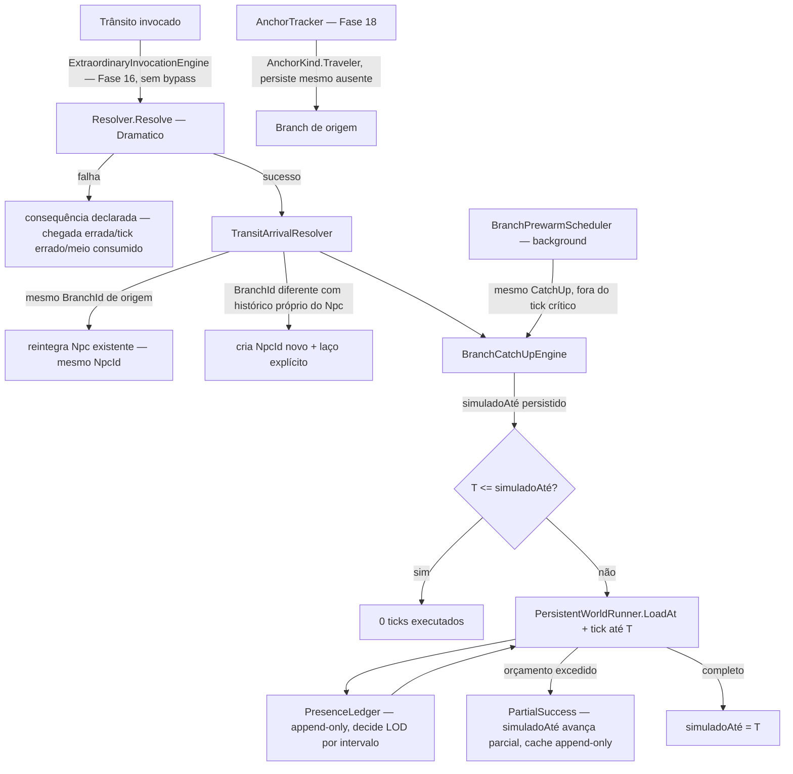

# Fase 20 — Design

**Spec**: `.specs/features/phase-20-interdimensional/spec.md` (23 requisitos, ITD-01..72)
**Scope**: Complex (mecanismo novo — catch-up preguiçoso — mas composição estrita da Fase 18
recém-desenhada: `BranchId`, `BranchFactory`, `AnchorTracker`, `BranchCollectionSystem`,
`TimelineSeedDerivation`, além de `PersistentWorldRunner`/`WorldSnapshot` da Fase 1/3 e
`Resolver`/ADR-0011)

> **Nota de dependência**: esta fase consome diretamente os componentes desenhados em
> `.specs/features/phase-18-timelines/design.md` (ainda não implementados — spec-only, mesma
> situação da Fase 18 em si). O ROADMAP.md já declara "não comece esta fase antes da Fase 18
> fechar" — este design assume a forma exata já registrada na 18, sem reinventar.

---

## Architecture Overview

Catch-up não é um sistema de simulação paralelo — é literalmente `PersistentWorldRunner`
(replay determinístico, Fase 1/3) aplicado a um branch específico até um tick alvo, com o
resultado cacheado de forma append-only. `LOD(branch, tick)` decide a fidelidade desse replay a
partir de um registro de presença que também é append-only.



Nenhuma edição em `PersistentWorldRunner`/`WorldSnapshot`/`Resolver`/`ExtraordinaryInvocationEngine`
/`AnchorTracker`/`BranchCollectionSystem` (Fase 1/3/16/18) — este design adiciona o motor de
catch-up, o ledger de presença, o resolvedor de chegada/identidade e o agendador de
pré-aquecimento, todos consumindo a infraestrutura já desenhada.

---

## Code Reuse Analysis

| Peça | Reusa | Novo |
| --- | --- | --- |
| Replay até um tick | `PersistentWorldRunner.LoadAt(tick)` + `WorldClock` (Fase 1/3) — mesmo replay determinístico já provado | `BranchCatchUpEngine` orquestra a chamada com orçamento e cache |
| Identidade de linha | `BranchId` (Fase 3/ADR-0009), `BranchFactory`/linhagem de `TimelineSeedDerivation` (Fase 18, spec) | Consulta de linhagem: "este `BranchId` é o mesmo de onde o `NpcId` partiu?" |
| Âncora do viajante ausente | `AnchorTracker`/`BranchAnchor`/`AnchorKind.Traveler` (Fase 18, spec) — já cobre exatamente "consequência pendente"/viajante | Nenhuma modificação — só uso do `AnchorKind.Traveler` já existente no enum |
| Coleta de branch sem âncora | `BranchCollectionSystem` (Fase 18, spec) — não tocado, já respeita âncora | — |
| Rolagem do trânsito | `ExtraordinaryInvocationEngine`/`Resolver.Resolve`/`VarianceProfileCatalog.Get("Dramatico")` (Fase 16/ADR-0011) | Nenhuma rolagem paralela — trânsito é só mais um `PowerDescriptor` com `Reliability="ResolutionCheck"` |
| Log append-only + hash | `IWorldEventSink`/`EventLogRecord`/`WorldSnapshot.CanonicalHash` (Fase 1/3) | 2-3 `WorldEventKind` novos (catch-up concluído/parcial, trânsito) |
| Enumeração por reflexão de handlers | Mesmo padrão de guard já usado em `HistoryQuerySeparationGuard`/`DivinityQuerySeparationGuard` (Fase 10/17) | `TemporalQuerySeparationGuardTests` — extensão do mesmo padrão pra "nenhuma consulta mistura linhas" |
| Determinismo cross-process | Mesma disciplina de `CrossProcessBranchHashTests` (Fase 18, spec) | Extensão pro par eager-vs-2-lances (`test-catchup`) |

---

## Components / Interfaces

```csharp
// Domain — src/LivingWorld.Domain/Timelines/PresenceLedger.cs (novo, mesmo namespace da Fase 18)
public sealed record PresenceRecord(
    BranchId Branch, long FromTick, long ToTick, LodResolution Resolution, long RecordedAtTick);
// append-only: cada intervalo observado é UMA entrada nova, nunca sobrescrita

public enum LodResolution { Aggregate, Detailed, Maximum } // mesma escala já usada pela Fase 8/9

// Domain — pura, consulta o ledger
public static class BranchLodResolver
{
    public static LodResolution Resolve(IReadOnlyList<PresenceRecord> ledger, BranchId branch, long tick);
    // função pura do registro — NUNCA recebe um parâmetro "resolução desejada" do chamador
}

// Domain — orçamento de catch-up
public sealed record InterdimensionalRules(
    long CatchUpWorkBudgetTicks, // teto de trabalho por chamada
    bool CounterpartRequiresIndependentHistory); // sempre true — documentado, não configurável (ver Tech Decisions)

// Domain — resultado de catch-up
public enum CatchUpOutcome { NoOp, Completed, PartialSuccess }
public sealed record CatchUpResult(BranchId Branch, long SimulatedUntilBefore, long SimulatedUntilAfter,
    long TicksExecuted, CatchUpOutcome Outcome);
```

| Componente | Responsabilidade |
| --- | --- |
| `BranchCatchUpEngine` | Ponto de entrada único: consulta `simuladoAté` corrente; se `T <= simuladoAté`, retorna `NoOp` sem tocar `PersistentWorldRunner`; senão, chama `LoadAt(simuladoAté)` e tica até `T` ou até o orçamento (`InterdimensionalRules.CatchUpWorkBudgetTicks`) esgotar, o que vier primeiro — resultado `Completed` ou `PartialSuccess`, `simuladoAté` persistido append-only em ambos os casos |
| `PresenceLedger` | Registra `PresenceRecord` append-only sempre que um branch é observado (materialização de qualquer entidade nele); é a ÚNICA fonte de `LOD(branch, tick)` |
| `BranchLodResolver` | Função pura: dado o ledger e um tick, retorna a resolução em que aquele intervalo *foi de fato simulado* — nunca aceita um pedido de fidelidade maior pra um intervalo já coberto (isso é a garantia de "resolução é definitiva") |
| `BranchPrewarmScheduler` | Job de background (fora do caminho crítico do tick corrente) que chama `BranchCatchUpEngine` pra branches com `AnchorKind` ativo — mesmo motor, resultado bit-idêntico ao sob-demanda por construção (não existe segundo caminho de cálculo) |
| `TransitArrivalResolver` | Após rolagem de sucesso: decide entre "reintegrar `NpcId` existente" (mesmo `BranchId` de origem — o viajante estava ausente, não duplicado) ou "criar `NpcId` novo com laço" (branch de destino tem histórico próprio e independente contendo aquele `NpcId` de origem em algum ponto — caso "viajou pro passado onde já existia") — decisão puramente por linhagem de `BranchId`, nunca heurística |
| `TravelerAnchorBinding` | No momento da partida: registra `BranchAnchor(originBranch, AnchorKind.Traveler, npcId)` via `AnchorTracker` (Fase 18) — removido só na morte permanente do viajante, nunca por "tempo ausente" |

---

## Data Models

```csharp
// WorldEventKind (aditivo)
CatchUpCompleted     // campos: branchId, fromTick, toTick, ticksExecuted
CatchUpPartial        // campos: branchId, fromTick, reachedTick, requestedTick, ticksExecuted
TransitArrived         // campos: travelerNpcId, originBranch, destinationBranch, outcome, counterpartNpcId?

// Regra de cenário nova
public sealed record InterdimensionalRules(long CatchUpWorkBudgetTicks, bool CounterpartRequiresIndependentHistory);
```

**Onde o laço de contraparte vive**: campo aditivo em `Npc` (ou registro auxiliar dedicado,
decisão de implementação) — `CounterpartNpcId? LinkedCounterpart` — nunca implica destino ou
efeito compartilhado entre os dois (Edge Case da spec: morte de um não afeta o outro).

**Progresso consultável (ITD-42)**: `BranchCatchUpEngine` expõe um `CatchUpProgress(branchId) ->
(ticksProcessed, ticksEstimatedTotal)` de leitura, mesmo padrão de somente-leitura de
`BranchTreeQuery` (Fase 18) — nunca efeito colateral.

Nenhum campo existente de `Npc`/`BranchId`/`WorldEvent`/`AnchorTracker`/`PersistentWorldRunner`
muda de tipo ou significado — tudo aditivo.

---

## Error Handling Strategy

| Cenário | Comportamento |
| --- | --- |
| `T <= simuladoAté` | `BranchCatchUpEngine` retorna `NoOp` imediatamente, nunca chama `PersistentWorldRunner.LoadAt` |
| Orçamento esgota no meio do catch-up | `PartialSuccess`; `simuladoAté` avança até onde deu, persistido append-only; próxima chamada retoma dali (nunca refaz) |
| Tentativa de re-simular intervalo já coberto em fidelidade maior | `BranchLodResolver`/`BranchCatchUpEngine` retornam `Failure` explícito — mundo permanece byte-idêntico |
| Branch de destino nunca observado antes (sem `PresenceRecord`) | `BranchLodResolver` retorna a resolução mínima do cenário — nunca erro por ausência de registro |
| Trânsito falha (`CriticalFailure`/`Failure` do `Resolver`) | Consequência declarada aplicada (chegada errada/tick errado/meio consumido) — nenhum catch-up é disparado se o trânsito nem chega a um branch válido |
| Viajante com laço morre | `LinkedCounterpart` da contraparte original é limpo (referência morta removida), mas a contraparte SHALL continuar existindo — laço nunca implica destino compartilhado |

## Risks & Concerns

| Risco | Mitigação |
| --- | --- |
| `BranchCatchUpEngine` replay custar caro em branches com histórico muito longo antes mesmo do orçamento entrar em jogo (custo de `LoadAt`) | Mesmo risco já documentado no design da Fase 18 (custo de replay profundo) — fora de escopo resolver aqui, YAGNI até medição mostrar necessidade |
| `PresenceLedger` crescer sem limite (append-only, nunca compactado) | Aceitável — mesma disciplina do log de eventos (ADR-0006), que também é append-only; compactação/arquivamento é preocupação de Fase 9 se necessário, não bloqueador de design |
| `TransitArrivalResolver` decidir errado entre "retorno" e "contraparte" por bug de comparação de `BranchId`/linhagem | Coberto diretamente pelos ACs ITD-60..63 com teste de conservação de população como oráculo — divergência de contagem é o sinal de decisão errada |
| Pré-aquecimento em background competir por recursos com o tick principal | "Fora do caminho crítico" é requisito explícito (ITD-30) — implementação deve rodar em thread/worker separado com prioridade menor, não é responsabilidade deste design especificar o mecanismo de scheduling exato (infraestrutura) |
| Enumeração por reflexão (ITD "nenhuma consulta mistura linhas") não cobrir um handler novo introduzido por engano no futuro | Mesmo padrão de falha explícita já usado nos guards de Fase 10/17 — handler sem cobertura reprova o teste, força atualização do guard |

## Tech Decisions

| Decisão | Nível | Registro |
| --- | --- | --- |
| Catch-up é `PersistentWorldRunner.LoadAt` + tick, nunca um segundo motor de replay | Feature (20) | Preserva ADR-0012 — "mesmo mundo, mais barato" só é verdade se for literalmente o mesmo replay |
| `LOD(branch, tick)` nunca aceita um parâmetro de fidelidade desejada do chamador | Feature (20) | ADR-0012 explícito — resolução é definição do mundo, não escolha do chamador |
| `CounterpartRequiresIndependentHistory` é sempre `true`, documentado mas não configurável por cenário | Feature (20) | Decisão do usuário foi uma REGRA de identidade (linhagem de `BranchId`), não um parâmetro de balanceamento — tornar configurável abriria inconsistência com o Edge Case já fechado na spec |
| Âncora do viajante usa o `AnchorKind.Traveler` já existente na Fase 18, sem novo tipo de âncora | Feature (20) | Reuso direto — a Fase 18 já previu exatamente este caso no enum |
| Progresso de catch-up é consulta somente-leitura, mesmo padrão de `BranchTreeQuery` | Feature (20) | Consistência com o resto do design de consultas da Fase 18 |
