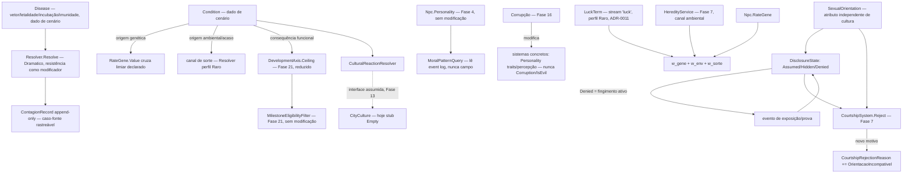

# Fase 22 — Design

**Spec**: `.specs/features/phase-22-imperfection/spec.md` (31 requisitos, IMP-01..73)
**Scope**: Complex (condição/doença/sorte/orientação são domínio novo, mas composição estrita de
`Resolver`/ADR-0011, `RateGene` (Fase 6/21), `DevelopmentAxis`/`Ceiling` (Fase 21, spec),
`Personality`/`PersonalityWeighting` (Fase 4), `CourtshipSystem` (Fase 7))

> **Nota de dependência aberta**: `CityCulture` (`src/LivingWorld.Domain/Cities/CityInstitutions.cs`)
> é hoje um stub vazio — vocabulário real de igualitarismo/tradição/religiosidade/valorização da
> ciência é job da Fase 13 (ainda não implementada). Mesma situação já documentada no design da
> Fase 19: este design assume a interface provável (um score consultável por valor cultural) sem
> implementá-la — reconciliação futura isolada no `CulturalReactionResolver`.

---

## Architecture Overview

Nenhum subsistema paralelo de "personalidade moral" — moralidade lê `Personality` (Fase 4)
+ `MemoryEvent`s (event log) já existentes. Sorte é um termo adicional consumido onde `w_gene`/
`w_env` já são calculados. Condição/doença são dado de catálogo consumidos por
`DevelopmentAxis.Ceiling` (Fase 21) e por `Resolver`, nunca sistemas de simulação próprios.



Nenhuma edição em `Resolver`/`Personality`/`PersonalityWeighting`/`RateGene`/`HeredityService`/
`CourtshipSystem` (lógica de pontuação) — este design adiciona dado de catálogo (condição/
doença), o termo de sorte, a query de padrão moral, o estado de orientação/divulgação, e um novo
valor de `CourtshipRejectionReason`, tudo aditivo.

---

## Code Reuse Analysis

| Peça | Reusa | Novo |
| --- | --- | --- |
| Predisposição/condição genética | `Npc.RateGene`/`RateGene.Value` (Fase 6/21) — mesmo campo literal | `ConditionThresholdRule` — limiar declarado no cenário que classifica `RateGene.Value` extremo como condição nomeada (não existe padrão de "limiar→condição" no código, confirmado pela pesquisa — esta fase introduz o primeiro) |
| Consequência funcional de deficiência | `DevelopmentAxis`/`Ceiling`/`MilestoneEligibilityFilter` (Fase 21, spec) — sem modificação | Só o valor de redução declarado na condição, aplicado ao `Ceiling` existente |
| Rolagem de doença/sorte | `Resolver.Resolve`/`VarianceProfile.Raro` (ADR-0011) — `Raro` confirmado: 4% de tail event (`tailDraw < 0.02 || > 0.98`), resultado bypassa a régua normal de margem (`CriticalSuccess`/`CriticalFailure` direto) — exatamente o mecanismo pra "improvável, raro, auditável" | Nenhuma modificação no `Resolver` — só novos chamadores |
| Stream de RNG nomeada | `WorldRngRegistry.Stream(key)` (mesmo padrão de `"city-founding"`/`"deity-schism"`) | Stream `"luck"` dedicada, nunca compartilhada |
| Moralidade emergente | `Npc.Personality` (`Agreeableness`, `EmotionalStability`, `Altruism`, `Impulsivity` — sem campos `empathy`/`aggressiveness`/`paranoia` nativos, mapeados nos mais próximos existentes) + event log (`WorldEventKind`) | `MoralPatternQuery` — função de leitura pura sobre `Personality` + histórico de eventos, nunca um campo armazenado |
| Cobertura de reflexão | `PersonalityWeighting.AllTraitNames`/`HasInfluenceEntry` (Fase 4) — exato padrão de "todo trait precisa de entrada declarada" | `ConditionCoverageGuardTests` — clone do padrão pra condições declaradas vs. consequências mapeadas |
| Imutabilidade por reflexão | `FactTests.Fact_exposes_no_mutation_methods_or_setters` (Fase 10) — reflete `GetProperties()` verificando init-only | Guard equivalente sobre `Npc`: nenhuma propriedade de alinhamento/karma/bondade, e toda propriedade nova classificada |
| Rejeição de cortejo com motivo | `CourtshipRejectionReason` enum (`Incesto, ForaDaFaixaEtaria, SemAfinidade`, ordem de prioridade fixa em `CourtshipSystem.Reject`) | Novo valor `OrientacaoIncompativel`, inserido na mesma ordem de prioridade (antes de `SemAfinidade`, mesmo espírito de `Incesto`/`ForaDaFaixaEtaria` como veto duro) |
| Canal ambiental (cópia de crença/traço na infância) | `HeredityService.DeriveUpbringing` (Fase 7) — sem modificação, só mais conteúdo transmitido | — |
| Reação cultural | `CityCulture` (Fase 8, hoje stub `Empty`) — interface assumida, mesma disciplina de dependência aberta já registrada na Fase 19 | `CulturalReactionResolver` — usa defaults neutros até Fase 13 preencher valores reais |

---

## Components / Interfaces

```csharp
// Domain — src/LivingWorld.Domain/Imperfection/Condition.cs (novo namespace)
public enum ConditionOrigin { Genetic, Environmental, Chance }
public enum ConditionCourse { Congenital, Acquired, Chronic, Progressive, Remissive }

public sealed record Condition(
    string Id, ConditionOrigin Origin, ConditionCourse Course,
    double? GeneticThreshold,               // só quando Origin=Genetic — limiar sobre RateGene.Value
    IReadOnlyDictionary<DevelopmentAxis, double>? FunctionalConsequence); // reduções de Ceiling, Fase 21

// Domain — doença
public enum TransmissionVector { Contact, Water, Air, Wound, Vertical }
public enum ImmunityKind { None, Temporary, Permanent }

public sealed record Disease(
    string Id, TransmissionVector Vector, double Lethality,
    int IncubationTicks, ImmunityKind Immunity);

public sealed record ContagionRecord(
    NpcId Case, NpcId SourceCase, string DiseaseId, long ExposedAtTick, long IncubationEndsAtTick);
// append-only — todo caso novo referencia SourceCase, nunca criado sem cadeia

// Domain — sorte
public static class LuckTerm
{
    public static double Compute(WorldState world, NpcId npc, double weight); // consome Stream("luck"), perfil Raro
}

// Domain — orientação/divulgação
public enum SexualOrientation { /* dado de cenário — catálogo, não enum fechado de código, ver Tech Decisions */ }
public enum DisclosureState { Assumed, Hidden, Denied }

public sealed record DisclosureRecord(
    NpcId Npc, DisclosureState State, IReadOnlyList<NpcId> KnownBy, long LastChangedAtTick);
```

| Componente | Responsabilidade |
| --- | --- |
| `ConditionThresholdRule` | Classifica `RateGene.Value` extremo (abaixo/acima do `GeneticThreshold` declarado) como condição nomeada — primeiro uso do padrão "limiar→condição" no código, documentado como tal |
| `ConditionCeilingApplier` | Aplica `FunctionalConsequence` ao `DevelopmentAxis.Ceiling` do NPC (Fase 21) — múltiplas condições no mesmo eixo resolvidas por regra declarada (mínimo entre reduções, decisão de Design abaixo) |
| `DiseaseTransmissionSystem` | Avalia exposição por `TransmissionVector` dentro do alcance de contágio; rola `Resolver.Resolve` (perfil `Dramatico`, resistência do NPC como modificador) pro curso individual; grava `ContagionRecord` sempre com `SourceCase` |
| `LuckTerm` | Função pura: consome `world.Rng.Stream("luck")`, rola via `Resolver.Resolve` com `VarianceProfile.Raro`; resultado alimenta o termo `w_sorte` do modelo moral — nunca compartilha stream com `DiseaseTransmissionSystem` ou qualquer outro sistema |
| `MoralPatternQuery` | Função de leitura pura: combina `Personality` (traits existentes) + histórico de `WorldEventKind` relevantes num "padrão" consultável — nunca escreve um campo, nunca cacheia como fonte de verdade |
| `CorruptionEffectApplier` | Corrupção por artefato/entidade (Fase 16) modifica diretamente `Personality`/percepção — mesmo padrão de modificador já usado por outros efeitos extraordinários, nunca um campo `Corruption`/`IsEvil` |
| `CulturalReactionResolver` | Calcula reação (acolher/esconder/excluir/descartar) a partir de `CityCulture` (interface assumida da Fase 13) — defaults neutros documentados até lá |
| `DisclosureTransitionSystem` | Transiciona `DisclosureState` por tolerância local (via `CulturalReactionResolver`), vínculo de quem sabe (`KnownBy`), e eventos de exposição — `Denied` é estado ativo de fingimento, nunca crença de incerteza |
| `CourtshipSystem.Reject` (modificado) | Ganha checagem de `OrientacaoIncompativel` na mesma ordem de prioridade de `Incesto`/`ForaDaFaixaEtaria` — veto duro antes de qualquer cálculo de afinidade |

---

## Data Models

```csharp
// WorldEventKind (aditivo)
ConditionDiagnosed      // campos: npcId, conditionId, origin, tick
DiseaseContracted        // campos: npcId, diseaseId, sourceCaseNpcId, tick
DisclosureChanged        // campos: npcId, previousState, newState, causeEventId, tick
CourtshipRejectedOrientation // campos: npcAId, npcBId, tick (mesma família de eventos de Incesto)

// CourtshipRejectionReason (Fase 7, aditivo)
enum CourtshipRejectionReason { Incesto, ForaDaFaixaEtaria, OrientacaoIncompativel, SemAfinidade }
// inserido na mesma ordem de prioridade de veto duro, antes de SemAfinidade

// Regra de cenário nova
public sealed record ImperfectionRules(
    double LuckWeightDefault,      // w_sorte — default documentado, calibrado contra baseline Fase 7
    IReadOnlyList<Condition> Conditions,
    IReadOnlyList<Disease> Diseases);
```

**`w_gene`/`w_env`/`w_sorte` consultáveis separadamente**: os 3 termos vivem como propriedades
distintas de um `MoralOutcomeBreakdown` (novo record), nunca somados direto num escalar opaco —
a soma final é derivada, os termos individuais permanecem consultáveis pra auditoria/teste.

Nenhum campo existente de `Personality`/`RateGene`/`DevelopmentAxis`/`CourtshipRejectionReason`/
`HeredityService` muda de tipo ou significado — tudo aditivo.

---

## Error Handling Strategy

| Cenário | Comportamento |
| --- | --- |
| Múltiplas condições reduzindo o mesmo `DevelopmentAxis.Ceiling` | `ConditionCeilingApplier` usa o MÍNIMO entre as reduções declaradas (não soma) — decisão de Design pro Edge Case da spec, evita teto negativo/ambíguo por acúmulo |
| Janela fecha no mesmo tick que a exposição mínima é atingida (herdado da Fase 21) | Já resolvido no design da Fase 21 — sem reabertura aqui |
| Doença com incubação e NPC morre de outra causa durante a incubação | `ContagionRecord` marcado como `Resolved=NeverDeveloped` — nunca conta como caso letal daquela doença |
| Condição de origem "acaso" sem `LuckTerm` disponível (cenário não declara stream) | Erro de configuração explícito na carga do cenário — nunca silenciosamente ignorado |
| `Disease` referenciada num evento mas fora do catálogo carregado | Erro de configuração — garante IMP-13 (subconjunto do catálogo) por construção, nunca em runtime |
| `CulturalReactionResolver` chamado antes da Fase 13 preencher `CityCulture` real | Retorna reação neutra default documentada — mesmo padrão já aceito na Fase 19 |

## Risks & Concerns

| Risco | Mitigação |
| --- | --- |
| `w_sorte` default calibrado incorretamente (contradições fora da faixa de baseline) | Calibração é trabalho explícito de uma task em Tasks (rodar contra `tests/baselines/`, ajustar até a faixa fechar) — não é resolvido só pela arquitetura, documentado como tal |
| `LuckTerm` e `DiseaseTransmissionSystem` ambos usarem `Resolver` mas com streams diferentes colidirem por nome | Nomes de stream são literais únicos por design (`"luck"` vs. stream por doença, ex. `$"disease-{diseaseId}"`) — mesma disciplina já usada em outras fases |
| `MoralPatternQuery` ficar caro se histórico de eventos for longo | Função de leitura pura, sob demanda — mesma disciplina "documentado, não otimizado preventivamente" (YAGNI) até medição mostrar necessidade |
| Guard de reflexão sobre `Npc` (IMP-40) ter falso positivo em campos legítimos não-morais | Mesmo padrão de `PersonalityWeighting.HasInfluenceEntry`/`FactTests` — cada campo precisa de classificação EXPLÍCITA (moral ou não-moral), nunca inferida, elimina ambiguidade |
| `CulturalReactionResolver` reconciliar mal quando Fase 13 chegar | Mesmo risco já aceito e documentado na Fase 19 — decisão de escopo consciente, não descuido |

## Tech Decisions

| Decisão | Nível | Registro |
| --- | --- | --- |
| Condição de origem genética é `RateGene.Value` cruzando limiar — nenhum campo genético paralelo | Feature (22) | Decisão confirmada com o usuário — "um dos dois deve sumir", `RateGene` venceu por já existir |
| `SexualOrientation` é catálogo de cenário (não `enum` C# fechado) | Feature (22) | Mesma regra já imposta a condição/profissão/recurso — nunca fixar vocabulário cultural no motor |
| `OrientacaoIncompativel` inserido em `CourtshipRejectionReason` na mesma ordem de prioridade de `Incesto` | Feature (22) | Veto duro, mesmo padrão — nunca um score de afinidade "vence" incompatibilidade de orientação |
| Múltiplas condições no mesmo eixo usam MÍNIMO das reduções, não soma | Feature (22) | Resolve o Edge Case deixado explícito na spec — evita teto negativo |
| `LuckTerm` é stream nomeada `"luck"` dedicada, nunca compartilhada | Feature (22) | Preserva "canal nomeado, auditável, desligável" — misturar streams quebraria a garantia de "zerar w_sorte muda só o que sorte afeta" |
| Nenhum campo de moralidade — `MoralPatternQuery` é sempre leitura derivada | Feature (22) | Garantia central da fase, reforçada por guard de reflexão clonado de `PersonalityWeighting`/`FactTests` |
