# Fase 23 — Design

**Spec**: `.specs/features/phase-23-intrigue/spec.md` (37 requisitos, INT-01..B3)
**Scope**: Complex (maior fase do conjunto — mas quase tudo composição de Fase 4/7/8/10/16 já
existentes; só a pilha de humor, persona/identidade e publicação são domínio genuinamente novo)

---

## Architecture Overview

Segredo é `Fact` (Fase 10) com atributos extras. Traição reusa `RelationshipEventType.Betrayal`
já existente. Fofoca reusa `DistortionEngine`/`DistortionOperator` já existentes. Reputação é um
cache dirty-flagged no mesmo padrão de `CanonicalHashCache`. Persona e humor são os únicos
domínios genuinamente novos.

```mermaid
flowchart TD
    Fact[Fact — Fase 10] -->|+ SecretPropagation| Secret[SecretAttributes: owners, accomplices, knownBy, leakRisk]
    Secret -->|despejado do cânone| Irrevealable[fato irrevelável — nunca apagado, ADR-0007]

    MotiveOpportunityFilter[MotiveOpportunityFilter] -->|antes de SelectByUtility, Fase 4| HostileActions[ActionType: Blackmail/Betray/Brawl/Gossip]
    MaterializationSystem[MaterializationSystem.HasFormalRole — Fase 8] -->|oportunidade: testemunha| MotiveOpportunityFilter

    Blackmail[Chantagem] -->|consulta| NpcBeliefQuery[NpcBeliefQuery — Fase 10, nunca HistoryTruthQuery]
    Betray[Traição] -->|RelationshipEventType.Betrayal já existente| Relationship[Relationship.Trust — Fase 7]
    Betray --> NpcMemory[NpcMemory Episodic — testemunha, alta importância]

    MoodStack[MoodStack — novo, fonte+magnitude+decaimento] -->|peso| PersonalityWeighting[PersonalityWeighting/SelectByUtility — Fase 4]

    Grudge[Grudge individual — NpcMemory + decaimento] -->|prescreve| Zero[rancor→0]
    LineageFeud[LineageFeud — entidade nova, prazo próprio] -->|agrega| Grudge

    Brawl[Briga] --> Resolver1[Resolver.Resolve Dramatico — mesmo padrão CombatMechanic.DamageOf]
    Resolver1 -->|PartialSuccess| Witness[testemunha + consequência, nunca ignorado]

    Gossip[Fofoca] --> DistortionEngine[DistortionEngine — Fase 10, sem pipeline paralelo]
    Relationship -->|modula probabilidade| DistortionEngine

    ReputationCache[ReputationCache — dirty-flag, padrão CanonicalHashCache] -->|invalidado por evento de crença relevante| NpcBeliefQuery

    Faction[Faction] -->|objetivo oculto = Secret multi-dono| Secret

    PersonaDescriptor[PersonaDescriptor — verdade, novo] -->|associação| IdentityAttributionBelief[IdentityAttributionBelief — crença por observador, novo]
    IdentityAttributionBelief -->|gradual| ExposureStage[testemunha→grupo→rumor→comunidade]

    Journalist[Jornalista] -->|decide| PublicationEvent[PublicationEvent — dado, nunca texto]
    Journalist --> ReputationCache
```



Nenhuma edição em `Relationship`/`NpcMemory`/`DistortionEngine`/`CanonSlotManager`/
`HistoryTruthQuery`/`NpcBeliefQuery`/`MaterializationSystem`/`Resolver` — este design só adiciona
atributos aditivos, novos `ActionType`, e os componentes genuinamente novos (humor, rancor de
linhagem, persona, publicação).

---

## Code Reuse Analysis

| Peça | Reusa | Novo |
| --- | --- | --- |
| Segredo | `Fact` (Fase 10) — mesmo esqueleto de fato | `SecretAttributes` — aditivo: owners, accomplices, knownBy, leakRisk |
| Cânone limitado | `CanonSlotManager` (Fase 10) — sem modificação | Nenhum — despejo do cânone já existe, esta fase só interpreta o resultado como "irrevelável" |
| Chantagem | `NpcBeliefQuery` (Fase 10) — canal de crença, nunca `HistoryTruthQuery` | `BlackmailAction` consumindo a query existente |
| Traição | `RelationshipEventType.Betrayal` **já existe** (`Relationship.cs`) — confirmado pela pesquisa, sem valor de enum novo | Só o gatilho/consequência (`NpcMemory` de testemunha, correlação com densidade de segredo) |
| Confiança | `Relationship.Trust`/`Relationship.ApplyEvent` (Fase 7) — sem modificação | — |
| Memória episódica | `NpcMemory`/`MemoryCategory.Episodic`/`Social` (Fase 11/LLM) — sem modificação | Nenhum tipo novo — traição/rancor usam `NpcMemory` literal |
| Rancor individual | `NpcMemory` + decaimento por importância (mesmo padrão de compactação já existente) | `GrudgeDecaySystem` — prescrição no prazo do cenário |
| Filtro motivo+oportunidade | Mesmo padrão de filtro-antes-da-utility já usado em `MilestoneEligibilityFilter` (Fase 21) | `MotiveOpportunityFilter` |
| Oportunidade/testemunha | `MaterializationSystem.HasFormalRole` (Fase 8) — região agregada nunca qualifica | — |
| Briga | `Resolver.Resolve`/`VarianceProfile.Dramatico` (ADR-0011) — mesmo padrão de `CombatMechanic.DamageOf` (Success=cheio, PartialSuccess=degradado, mapeamento direto por `ResolutionResult`) | `BrawlResolver` — reusa o padrão, adiciona efeito de testemunha no branch `PartialSuccess` |
| Fofoca | `DistortionEngine`/`DistortionOperator` (8 valores fechados, Fase 10) — mesmo pipeline | Modulação de probabilidade por `Relationship` — camada nova SOBRE `HistoryRules.OperatorProbability` (que hoje é só por-operador, confirmado pela pesquisa, sem termo de relação) |
| Reputação | Mesmo padrão dirty-flag de `CanonicalHashCache` (`MarkXDirty` + version counter, lazy recompute on read) — não é o mesmo componente, mas o mesmo padrão arquitetural | `ReputationCache` — cache por (comunidade, NPC), invalidado quando uma crença relevante daquela comunidade muda |
| Facção | `SecretAttributes` multi-dono (reuso direto do segredo desta fase) | `Faction` — organização + objetivo oculto referenciando o segredo |
| Ação hostil | `ActionType` (Fase 4, enum fechado — confirmado que é "o próprio modelo de decisão", não conteúdo de cenário) | Novos valores: `Blackmail`, `Betray`, `Brawl`, `Gossip`, `Publish` |
| Persona/identidade | `PowerDescriptor`/`ExtraordinaryCarrierState` (Fase 16) — persona referencia o portador existente | `PersonaDescriptor`, `IdentityAttributionBelief` — confirmado que NÃO existem ainda em código, domínio 100% novo desta fase |
| Humor | `PersonalityWeighting`/`SelectByUtility` (Fase 4) como consumidor do peso | `MoodStack` — confirmado que não existe nenhum conceito de humor/pilha no código, domínio novo |

---

## Components / Interfaces

```csharp
// Domain — src/LivingWorld.Domain/Intrigue/Secret.cs (novo namespace)
public sealed record SecretAttributes(
    FactId FactId, IReadOnlyList<NpcId> Owners, IReadOnlyList<NpcId> Accomplices,
    IReadOnlyList<NpcId> KnownBy, double LeakRisk, bool DespejadoDoCanone);
// FactId referencia o Fact já existente (Fase 10) — nunca duplica o fato

// Domain — humor, pilha inspecionável
public sealed record MoodModifier(string Source, double Magnitude, double DecayPerTick, long AppliedAtTick);
public sealed record MoodStack(NpcId Owner, IReadOnlyList<MoodModifier> Modifiers)
{
    public double CurrentMood => Modifiers.Sum(m => /* magnitude decaída até o tick corrente */ 0);
    // sempre derivado — nunca campo Mood armazenado
}

// Domain — rancor de linhagem
public sealed record LineageFeud(
    LineageFeudId Id, string LineageA, string LineageB,
    long FoundedAtTick, double AggregatedGrudge, long PrescriptionTicks); // prazo PRÓPRIO, mais longo

// Domain — persona (verdade) e crença de atribuição (por observador)
public sealed record PersonaDescriptor(string PersonaId, NpcId Owner, IReadOnlyDictionary<string, string> NamesByCulture);
public sealed record IdentityAttributionBelief(
    NpcId Observer, NpcId Candidate, double Confidence, IReadOnlyList<string> Evidence, ExposureStage Stage);
public enum ExposureStage { Witness, Group, Rumor, Community }

// Domain — publicação
public sealed record PublicationEvent(
    NpcId Journalist, string SubjectFactId, PublicationDecision Decision, long Tick);
public enum PublicationDecision { Ignore, Investigate, Publish, Suppress }
```

| Componente | Responsabilidade |
| --- | --- |
| `MotiveOpportunityFilter` | Filtra `ActionType` hostis (`Blackmail`/`Betray`/`Brawl`) do conjunto candidato ANTES de `SelectByUtility` — exige motivo (necessidade/rancor/ganho/ordem de facção) E oportunidade (`MaterializationSystem.HasFormalRole`-equivalente + ausência de testemunha), mesmo padrão de `MilestoneEligibilityFilter` (Fase 21) |
| `BlackmailAction` | Consulta `NpcBeliefQuery` (nunca `HistoryTruthQuery`) pro segredo nas crenças do chantagista naquele tick; recusa se ausente |
| `BetrayalHandler` | Dispara `Relationship.ApplyEvent(RelationshipEventType.Betrayal, rules)` (já existente) quando confiança acima do limiar é violada por ganho mensurável; grava `NpcMemory` (`Episodic`, alta `Importance`) em toda testemunha materializada |
| `MoodStackSystem` | Empilha `MoodModifier` por evento de fonte declarada; `CurrentMood` sempre recalculado (soma de magnitudes decaídas); alimenta `PersonalityWeighting`/utility como peso adicional |
| `GrudgeDecaySystem` | Decai rancor individual (`NpcMemory` de categoria `Social` negativa) até zero no prazo do cenário; reacende com evento novo do mesmo alvo |
| `LineageFeudAggregator` | Agrega rancor individual de múltiplos membros da mesma linhagem contra linhagem-alvo; `PrescriptionTicks` próprio, mais longo, independente do prazo individual |
| `BrawlResolver` | Uma rolagem `Resolver.Resolve` (`Dramatico`); mapeia resultado no mesmo padrão de `CombatMechanic.DamageOf` — `PartialSuccess` sempre dispara efeito de testemunha (nunca ignorado) |
| `GossipDistortionModulator` | Camada sobre `HistoryRules.OperatorProbability` (hoje só por-operador): ajusta a probabilidade efetiva por `Relationship` entre contador/alvo e contador/ouvinte antes de chamar `DistortionEngine` — nunca reimplementa os operadores |
| `ReputationCache` | Cache por (comunidade, NPC), dirty-flag + version counter (mesmo padrão de `CanonicalHashCache.MarkXDirty`), invalidado só quando uma crença relevante daquela comunidade muda |
| `Faction` + `FactionRecruiter` | Organização referenciando `SecretAttributes` multi-dono; recrutamento pondera afinidade + rancor comum (mesma disciplina de motivo) |
| `IdentityAttributionResolver` | Forma `IdentityAttributionBelief` só a partir de evidência observável (nunca de "ver o efeito"); avança `ExposureStage` gradualmente |
| `JournalistDecisionSystem` | Avalia risco/interesse/ganho + crença própria; produz `PublicationEvent` (dado) — zero geração de texto |

---

## Data Models

```csharp
// WorldEventKind (aditivo)
SecretLeaked            // campos: factId, fromNpcId, toNpcId, tick
BlackmailExecuted         // campos: blackmailerId, targetId, secretFactId, tick
BetrayalOccurred           // campos: betrayerId, victimId, trustBefore, trustAfter, witnessIds, tick
BrawlResolved                // campos: initiatorId, targetId, resolution, witnessIds, tick
FactionExposed                 // campos: factionId, tick, consequence
IdentityChanged                  // campos: personaId, observerId, previousStage, newStage, tick
PublicationDecided                 // campos: journalistId, subjectFactId, decision, tick

// ActionType (Fase 4, aditivo — enum fechado, valores novos)
Blackmail, Betray, Brawl, Gossip, Publish

// Regra de cenário nova
public sealed record IntrigueRules(
    double TrustBetrayalThreshold, long GrudgePrescriptionTicks, long LineageFeudPrescriptionTicks,
    double GossipRelationshipModulationStrength);
```

**Onde reputação vive**: `ReputationCache` NÃO é canônica (não entra no hash) — é derivada,
reconstruível a qualquer momento a partir das crenças correntes da comunidade, mesmo padrão de
"resample determinístico" já usado noutras fases. Isso resolve a questão em aberto original: o
cache é otimização de leitura, nunca fonte de verdade.

Nenhum campo existente de `Fact`/`Relationship`/`NpcMemory`/`DistortionOperator`/`HistoryRules`/
`ActionType`/`PowerDescriptor` muda de tipo ou significado — tudo aditivo.

---

## Error Handling Strategy

| Cenário | Comportamento |
| --- | --- |
| Chantagem sem o segredo nas crenças do chantagista | `BlackmailAction` recusa antes de qualquer efeito — nunca chantagem "funciona por acaso" |
| Ação hostil com alvo em região agregada | `MotiveOpportunityFilter` remove do conjunto candidato — nunca força materialização como efeito colateral |
| Segredo despejado do cânone consultado por NPC novo | `NpcBeliefQuery` retorna "não sabe" — fato existe (`Fact` nunca apagado), mas sem canal de aprendizado ativo |
| `LineageFeudAggregator` com apenas 1 membro vivo da linhagem | Rixa continua existindo (mesma regra "origem esquecida ainda existe como crença") — não exige população mínima |
| `JournalistDecisionSystem` sem informação suficiente pra avaliar risco/ganho | Decisão default é `Ignore` — nunca publica por falta de dado |
| `IdentityAttributionResolver` recebe evidência fraca (ex.: só rumor de terceiros) | `Confidence` baixa, `Stage` permanece em estágio anterior — nunca salta direto pra `Community` sem evidência progressiva |

## Risks & Concerns

| Risco | Mitigação |
| --- | --- |
| `GossipDistortionModulator` divergir da probabilidade base de `HistoryRules` de forma não auditável | Modulação é multiplicador documentado sobre a probabilidade base, nunca substituição — testável isoladamente (mesma probabilidade base + modulador=1 reproduz o comportamento sem esta fase) |
| `ReputationCache` invalidar em cascata demais (toda crença de comunidade grande invalida tudo) | Invalidação é por (comunidade, NPC) específico, nunca global — mesma granularidade fina de `CanonicalHashCache.MarkNpcDirty` |
| `MoodStack` virar fator dominante na utility, afogando necessidade/personalidade | Peso do humor é aditivo declarado em `IntrigueRules`, nunca multiplicativo sem teto — calibração é trabalho de Tasks (mesmo espírito da calibração de `w_sorte` na Fase 22) |
| Enumeração por reflexão de "ninguém sabe sem caminho" (INT-04) não cobrir um handler novo introduzido no futuro por engano | Mesmo padrão de guard já usado em Fase 10/17/20 — handler sem cobertura reprova, força atualização |
| `Faction`/`LineageFeud` serem entidades de vida longa sem coleta — crescimento sem limite | Fora de escopo desta fase resolver — mesma disciplina "documentado, não implementado preventivamente" até medição mostrar necessidade (YAGNI) |

## Tech Decisions

| Decisão | Nível | Registro |
| --- | --- | --- |
| Traição reusa `RelationshipEventType.Betrayal` já existente — nenhum valor de enum novo | Feature (23) | Pesquisa confirmou que o valor já existe desde a Fase 7, só nunca foi disparado por um sistema — esta fase é o primeiro consumidor real |
| Rancor individual e rixa de linhagem são ENTIDADES separadas com prazos independentes | Feature (23) | Decisão confirmada com o usuário — sustenta rixa multi-geracional sem rancor individual imortal |
| `ReputationCache` é derivada/reconstruível, nunca canônica | Feature (23) | Resolve a questão em aberto original sem comprometer o hash canônico — cache pode ser invalidado/reconstruído sem afetar determinismo |
| Intriga (chantagem/traição/briga com testemunha) exige materialização | Feature (23) | Decisão confirmada com o usuário — reusa `MaterializationSystem.HasFormalRole` sem estender LOD agregado |
| Segredo despejado do cânone vira "fato irrevelável", nunca apagado | Feature (23) | Decisão confirmada com o usuário — consistente com ADR-0007 |
| Humor e Persona são os dois únicos domínios genuinamente novos (sem precedente de reuso) | Feature (23) | Confirmado pela pesquisa — declarado explicitamente pra não subestimar o esforço de Tasks nesses dois componentes |
