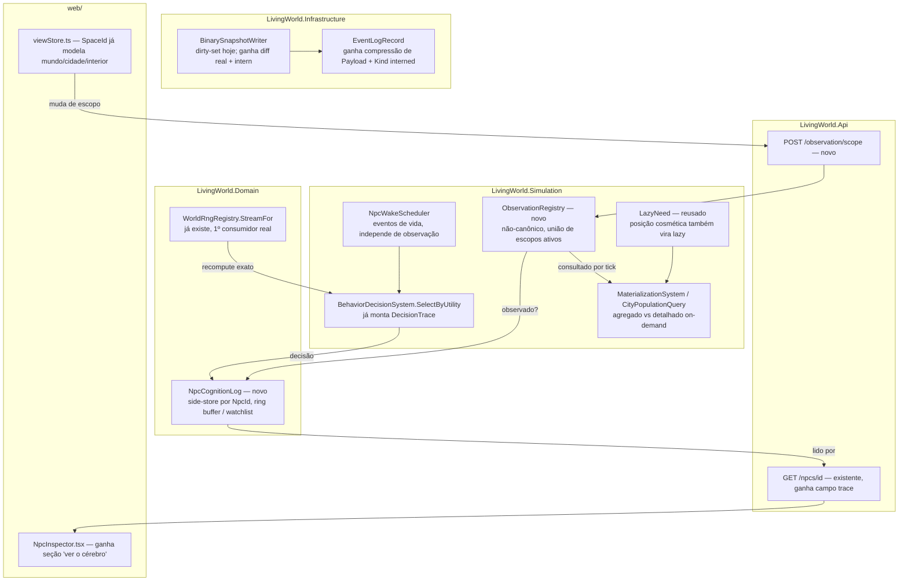

# Fase 28 — Cognição e LOD observacional — Design

**Spec**: `.specs/features/phase-28-cognition/spec.md`
**Status**: Draft

---

## Architecture Overview

Três eixos, cada um estendendo infraestrutura que já existe — nenhum motor novo.



**Princípio que atravessa tudo**: `NpcWakeScheduler` já acorda todo NPC por evento/necessidade,
**independente de quem observa** — isso já é verdade hoje (Fase 9). Esta fase nunca toca esse
caminho; só adiciona uma camada cosmética por cima (posição exata, rastro) que liga/desliga
conforme `ObservationRegistry`.

---

## Code Reuse Analysis

### Existing Components to Leverage

| Component | Location | How to Use |
| --- | --- | --- |
| `DecisionTrace` | `src/LivingWorld.Simulation/Behavior/DecisionTrace.cs:19-29` | Já é o formato do rastro (US1) — hoje montado e descartado em `BehaviorDecisionSystem.SelectByUtility` (linha ~531). Só falta persistir a instância existente, não redesenhar o shape. |
| `BehaviorDecisionSystem.Tick` | `Behavior/BehaviorDecisionSystem.cs:92-118` | Ponto único onde `UtilityDecision.Trace` é descartado hoje — vira o ponto de gravação em `NpcCognitionLog` (US1). |
| `LazyNeed` | `src/LivingWorld.Domain/Population/LazyNeed.cs` | Molde exato (`ValueAtLastEvent, TickOfLastEvent, DecayRatePerTick` + `ValueAt(tick)`) a reusar para posição cosmética lazy (US4/US5) — mesma família, campo novo análogo em vez de tipo novo. |
| `CityPopulationQuery` / `MaterializationSystem` | `Simulation/Cities/CityPopulationQuery.cs`, `MaterializationSystem.cs` | Já é o LOD agregado-vs-detalhado on-demand (AD-068) — os 3 escopos observacionais (US4) entram como uma segunda dimensão *sobre* NPC já detalhado, não uma reimplementação deste. |
| `WorldRngRegistry.StreamFor(purpose, id)` | `src/LivingWorld.Domain/WorldRngRegistry.cs:33-34` | Stream reproduzível `(seed, purpose, id)` sem persistir — exatamente o mecanismo de recompute exato (US5). Primeiro consumidor real fora dos testes do próprio registry. |
| `NpcInspector.tsx` | `web/src/components/inspector/NpcInspector.tsx` | Painel de NPC já existe (identidade, biografia, relações, follow) — "ver o cérebro" (US2) entra como nova seção aqui, não painel novo. |
| `viewStore.ts` / `SpaceId` | `web/src/state/viewStore.ts`, `web/src/map-engine/types.ts:26-36` | `SpaceId` já é `World \| City{cityId} \| Building{buildingId,cityId}` — os 3 escopos do LOD observacional já existem como conceito no cliente; só falta emitir a mudança para a API (US4). |
| `GET /npcs/{id}` | `src/LivingWorld.Api/Program.cs:124-127` → `NpcInspectionQuery.Inspect` | Ponto de leitura existente a estender com o campo de rastro (US2), em vez de endpoint novo. |
| `BinarySnapshotWriter` | `Simulation/Snapshot/BinarySnapshotWriter.cs` | Ponto de escrita a estender para US7 — ver Risks & Concerns: o "delta" atual é filtro de inclusão (dirty-set), não diff real, então US7 estende o formato, não só "liga compressão". |
| `EventLogRecord` | `src/LivingWorld.Infrastructure/EventLogRecord.cs` | `Kind`/`Payload` são as duas colunas candidatas a interning/compressão (US7). |

### Integration Points

| Sistema | Método de integração |
| --- | --- |
| Web (viewStore) → API | Novo `POST /observation/scope` no momento em que `ViewStore.enter(target)` muda `SpaceId` — payload é o `SpaceId` já existente, nenhum tipo novo no cliente. |
| API → Simulation | `ObservationRegistry` (novo, não-canônico) fica em `WorldState` ao lado de outros campos voláteis (mesma categoria de `RealtimeEndpoints`); `MaterializationSystem`/novo `CosmeticDetailSystem` leem por tick. |
| Simulation → Infrastructure | `WorldSnapshotRecord.CanonicalHash`/`VolatileHash` já separam o que entra no hash — compressão (US7) atua **depois** do hash computado, na serialização de I/O, nunca antes (garante que compressão não pode, por construção, mudar determinismo). |

---

## Components

### `NpcCognitionLog` (novo)

- **Purpose**: side-store do rastro de decisão por NPC, com política de retenção (janela curta padrão / completo comprimido se watchlisted).
- **Location**: `src/LivingWorld.Domain/Cognition/NpcCognitionLog.cs`
- **Interfaces**:
  - `Record(NpcId id, long tick, DecisionTrace trace): void` — chamado de `BehaviorDecisionSystem.Tick` só quando `ObservationRegistry.IsObserved(npc)`.
  - `RecentEntries(NpcId id, int count): IReadOnlyList<TraceEntry>` — leitura pro painel (US2).
  - `MarkWatchlisted(NpcId id, long fromTick): void` / `Unmark(NpcId id): void` — US3.
- **Dependencies**: `DecisionTrace` (existente), `ObservationRegistry` (novo, abaixo).
- **Reuses**: mesmo padrão de side-store por id de `ColdTierArchive`/`AggregatePopulationPool` (dicionário fora da entidade `Npc`).

### `ObservationRegistry` (novo)

- **Purpose**: união dos escopos de toda fonte de observação ativa — não-canônico (não afeta hash).
- **Location**: `src/LivingWorld.Simulation/Observation/ObservationRegistry.cs`
- **Interfaces**:
  - `SetScope(string sourceId, SpaceScope scope): void` — chamado a partir do endpoint da API.
  - `ClearScope(string sourceId): void` — desconexão/timeout de sessão.
  - `IsObserved(NpcId npc, WorldState world): bool` — resolve se o NPC está em algum prédio/cidade enquadrado por qualquer fonte ativa (união, LOD-04).
- **Dependencies**: nenhuma do domínio de simulação — só geometria/localização já existente (`City`, `Building`/`LocationId`).
- **Reuses**: espelha `SpaceId` do cliente (`World`/`City{cityId}`/`Building{buildingId,cityId}`) — mesmo vocabulário, sem tipo paralelo.

### `CosmeticDetailSystem` (novo, substitui o antigo "LAZY-RECOMPUTE" genérico do rascunho)

- **Purpose**: promove/rebaixa só a camada cosmética (posição exata, micro-ação, permissão de gravar rastro) — nunca eventos de vida.
- **Location**: `src/LivingWorld.Simulation/Behavior/CosmeticDetailSystem.cs`
- **Interfaces**:
  - `ResolvePosition(Npc npc, WorldState world, long tick): Position` — lê `LazyPosition.ValueAt(tick)` se não observado, posição exata se observado.
  - `OnPromoted(Npc npc, long tick)`: dispara `WorldRngRegistry.StreamFor("cosmetic", npc.Id.Value)` se havia micro-ação pendente dependente de RNG.
- **Dependencies**: `ObservationRegistry`, `LazyNeed`-family type para posição (`LazyPosition`, novo, mesmo molde).
- **Reuses**: `LazyNeed.ValueAt` como padrão de fórmula fechada; `WorldRngRegistry.StreamFor`.

### `StringInternPool` (novo)

- **Purpose**: deduplica valores de string repetidos (profissão, traço, `EventLogRecord.Kind`) entre entidades.
- **Location**: `src/LivingWorld.Domain/Interning/StringInternPool.cs`
- **Interfaces**: `Intern(string value): int` (id), `Resolve(int id): string`.
- **Dependencies**: nenhuma.
- **Reuses**: nenhum precedente direto no código — componente genuinamente novo, mas isolado e pequeno.

### `BinarySnapshotWriter` (estendido)

- **Purpose**: hoje escreve JSON completo por NPC "sujo" (filtro de inclusão); ganha diff real campo-a-campo contra o snapshot anterior do mesmo NPC.
- **Location**: `Simulation/Snapshot/BinarySnapshotWriter.cs` (modificar `WriteDelta`/`BuildPartialJson`)
- **Reuses**: mantém o envelope binário (`Magic`, marker byte) — só troca o que vai dentro do marker `1` de "todas as entradas sujas completas" para "diff campo-a-campo contra a última versão conhecida daquele NPC".

---

## Data Models

```csharp
// src/LivingWorld.Domain/Cognition/NpcCognitionLog.cs
public sealed record TraceEntry(long Tick, DecisionTrace Trace);

public sealed class NpcCognitionLog
{
    // ring buffer (default 50) por NpcId; watchlisted vira lista comprimida sem teto
}

// src/LivingWorld.Simulation/Observation/ObservationRegistry.cs
public readonly record struct SpaceScope(ScopeKind Kind, long? CityId, long? BuildingId);
public enum ScopeKind { World, City, Building }

// src/LivingWorld.Domain/Population/LazyPosition.cs (novo, mesmo molde de LazyNeed)
public readonly record struct LazyPosition(Position LastKnown, long TickOfLastEvent, RouteId? PendingRoute)
{
    public Position ValueAt(long tick, WorldState world) { /* fórmula fechada sobre a rota */ }
}
```

**Relacionamentos**: `NpcCognitionLog` é keyed por `NpcId`, populado só quando
`ObservationRegistry.IsObserved` é verdadeiro no tick da decisão (mesmo princípio "lazy" de
`Relationship`, AD-052). `SpaceScope` é o payload enviado pelo cliente e não precisa de
tradução — mesmo shape de `SpaceId`.

---

## Error Handling Strategy

| Cenário | Tratamento | Impacto pro usuário |
| --- | --- | --- |
| Fonte de observação desconecta sem enviar `ClearScope` | Timeout (declarado em config, ex.: 30s sem heartbeat) remove a fonte de `ObservationRegistry` | Lugar volta a cosmético aproximado; nenhum evento de vida afetado |
| Painel consulta NPC sem nenhum rastro gravado | `RecentEntries` retorna lista vazia | Estado vazio explícito no painel (COG-12), nunca inferido |
| `SetScope` chega com `BuildingId` de prédio inexistente | Rejeitado na borda da API (`Failure` nomeando o campo, mesmo padrão de `POW-03`) | Fonte permanece no escopo anterior válido |
| Watchlist marca NPC já morto/arquivado | Rejeitado — watchlist só aceita NPC vivo detalhado | Erro explícito, nenhuma gravação em NPC do arquivo frio |

---

## Risks & Concerns

| Concern | Location | Impact | Mitigation |
| --- | --- | --- | --- |
| "Delta" do `BinarySnapshotWriter` hoje é filtro de inclusão (dirty-set), não diff real campo-a-campo | `Simulation/Snapshot/BinarySnapshotWriter.cs:22-30,85-99` | Compressão real (US7, escopo ambicioso confirmado) exige estender o formato, não só "ligar" algo que já existe — risco de subestimar o esforço da task | Task de Design detalhado (Tasks phase) isola isso como sub-entrega própria com seu próprio spike de formato antes de tocar `WriteDelta` |
| `ColdTierArchive` é só um dict em memória (`NpcSummary`), sem persistência/serialização própria | `Simulation/Population/ColdTierArchive.cs` | "Arquivo frio comprimido" (goal da fase) não tem infraestrutura de disco pra estender — é construção nova, não wrapper | Tasks tratam isso como componente novo (`ColdTierPersistence`), não como extensão de algo existente |
| `EventLogRecord`/`WorldSnapshotRecord` persistem string crua sem compressão hoje | `Infrastructure/EventLogRecord.cs`, `WorldSnapshotRecord.cs` | Ganho de bytes/NPC/ano depende de tocar a camada de EF Core/migração — superfície maior que Simulation pura | Compressão de payload (gzip/Brotli) entra na fronteira de I/O do repositório (`SqliteWorldRepository`), nunca no domínio — hash já é calculado antes, então não há risco de determinismo |
| Nenhum handler hoje consulta `WorldRngRegistry.StreamFor` fora de teste do próprio registry | `WorldRngRegistry.cs:33-34` | Primeiro uso real em produção (US5) — comportamento sob concorrência/reentrância não está validado em uso real | Task dedicada de teste de determinismo cross-processo consumindo `StreamFor` antes de integrar ao `CosmeticDetailSystem` |

---

## Tech Decisions

| Decisão | Escolha | Rationale |
| --- | --- | --- |
| Rastro de decisão | Side-store `NpcCognitionLog`, fora de `Npc` | Confirmado com o usuário — não afeta hash canônico, retenção (ring buffer/watchlist) fica isolada |
| Registro de observação | Não-canônico em `WorldState`, alimentado por push da API | Confirmado com o usuário — espelha `SpaceId` já existente no cliente, evita polling caro |
| Escopo de compressão (US7) | Formato binário/delta completo, incluindo Infrastructure/EF Core | Confirmado com o usuário — maior que o mínimo, mas fecha a dívida real que a Fase 9 deixou aberta (achado: `BinarySnapshotWriter` "delta" hoje não é diff de verdade) |

> **Decisão de projeto**: a descoberta de que a Fase 9 não entregou diff real nem arquivo frio
> persistido/comprimido (apesar do ROADMAP marcar a fase como "fechada") é registrada como
> débito em `STATE.md`, não silenciosamente absorvida aqui.
