# Real Household & Workplace Buildings Design

**Spec**: `.specs/features/real-household-workplace-buildings/spec.md`
**Status**: Draft

---

## Architecture Overview

Three independent creation paths get wired to the SAME placement primitives
`dynamic-city-growth` already shipped (`BuildingPlacementResolver`/`CityOccupancy`/
`OverflowPlacer`, all in `LivingWorld.Simulation/Cities/`). No new placement algorithm — this
feature is entirely "wire the existing thing into 3 places that skipped it."

```mermaid
graph TD
    subgraph Households
        PS[PopulationSeeder.SeedInitial] --> RES1[resolve N house positions via BuildingPlacementResolver, create N Buildings]
        RES1 --> PG[PopulationGenerator.PairIntoHouseholds — now takes resolved locations as input, stays pure/Domain]
    end

    subgraph "Workplaces — default scenario"
        SR[ScenarioRunner.SeedDefaultWorkplaces] --> RES2[resolve position via BuildingPlacementResolver, create Building]
        RES2 --> WP1[new Workplace at resolved position]
    end

    subgraph "Workplaces — authored scenario"
        SL[ScenarioLoaderV2.LoadWorld] --> REORDER[cities created FIRST, then workplaces]
        REORDER --> NEAREST[assign each authored workplace to nearest city by distance]
        NEAREST --> RES3[IsFree at the AUTHORED location first — preserves resource-adjacency intent, e.g. ECON-08 farm-on-arable-cell]
        RES3 -->|free| KEEP[Building authored at that exact position]
        RES3 -->|occupied| FALLBACK[BuildingPlacementResolver: free cell in bounds, else overflow]
    end
```

---

## Approaches Considered (household placement architecture)

| Approach | Trade-off |
| -------- | --------- |
| **A — Simulation layer resolves positions, injects them into a still-pure Domain generator (chosen)** | `PopulationGenerator`/`PairIntoHouseholds` stay in `LivingWorld.Domain`, unaware of `WorldState` — they receive an already-resolved `IReadOnlyList<CellCoord>` (one per household) instead of inventing their own spawn-radius scatter. `PopulationSeeder` (already `Simulation`, already has `WorldState`) resolves each position via `BuildingPlacementResolver` and creates each house `Building` BEFORE calling the generator. Keeps "who pairs into which household" (pure logic) separate from "where do they live" (a `WorldState` mutation) — same separation of concerns the codebase already has elsewhere (`ConstructionSystem` mutates `WorldState`, `BuildingFootprintGenerator` is pure). Small ripple: one new parameter, one existing test file (`PopulationGeneratorTests.cs`) updated to pass locations instead of relying on internal scatter. |
| **B — Move `PopulationGenerator` to `LivingWorld.Simulation`, let it call `BuildingPlacementResolver`/`world.AddBuilding` directly** | Same `SPEC_DEVIATION` precedent as `CityOccupancy`/`OverflowPlacer` in `dynamic-city-growth`. Rejected: conflates "decide household pairing" (a pure computation, easily unit-tested today with zero `WorldState`) with "mutate the world by creating buildings" — would make every existing `PopulationGeneratorTests.cs` test need a full `WorldState`/`City` fixture just to test pairing logic that has nothing to do with placement. |
| **C — Add a mutable setter to `Household.Location`, generate first with a placeholder, backfill after** | Rejected outright: breaks `Household`'s existing immutability guarantee (`Location` is `{ get; }`, no setter, by design) for every OTHER caller that currently relies on it never changing after construction (same reasoning `City`'s own doc comments give for not storing bounds). Would also violate this feature's own "single source of truth, one write" goal — two writes (placeholder then backfill) is the exact drift risk the spec rejects. |

---

## Code Reuse Analysis

### Existing Components to Leverage

| Component | Location | How to Use |
| --------- | -------- | ---------- |
| `BuildingPlacementResolver.Resolve` | `src/LivingWorld.Simulation/Cities/BuildingPlacementResolver.cs` | Called once per household/workplace at creation time, exactly like `ConstructionSystem.CompleteProject` already does for demand-driven workplaces — same nullable-return contract (land-scarce → decline, per `dynamic-city-growth`'s AD-007 machinery). |
| `CityOccupancy.IsFree` | `src/LivingWorld.Simulation/Cities/CityOccupancy.cs` | Reused directly for the "is the authored workplace location still free?" check in `ScenarioLoaderV2`, before falling back to full resolution. |
| `CityOccupancy.ResolveGrownBounds` | same file | Supplies the `CityBounds` argument `Resolve` needs — same call every other placement call site already makes. |
| `BuildingFootprintGenerator` | existing | Unchanged — footprint shape math for houses/workplaces is identical to any other building type. |
| House `BuildingTypeId` | `CityCatalog.BuildingRecipes` (existing) | **Needs confirmation in Tasks**: does a house-type recipe already exist in the catalog (used today only by `ConstructionDemandSystem`'s housing-capacity math), or does one need adding? If one exists, reuse its `BuildingTypeId`; do not invent a second. |

### Integration Points

| System | Integration Method |
| ------ | ------------------- |
| `PopulationSeeder.SeedInitial` (existing, `src/LivingWorld.Simulation/Population/PopulationSeeder.cs`) | Gains the house-resolution loop; passes resolved locations into `PopulationGenerator`. |
| `ScenarioRunner.SeedDefaultWorkplaces` (existing) | Gains a `BuildingPlacementResolver.Resolve` call per default workplace, in place of the current bare `DefaultVillageLocation` assignment. |
| `ScenarioLoaderV2.LoadWorld` (existing) | Reordered: `definition.City.Cities` loop moves BEFORE the `definition.Economy.Workplaces` loop (currently the reverse). Nearest-city assignment + authored-location-preferred resolution added to the workplace loop. |
| `NpcInspectionQuery`, `CityProjector`, visual layer | **No change needed** — they already read `world.Buildings`/`Household.Location`/`Workplace.Location` as-is; this feature just makes those values finally correspond to something real. |

---

## Components

### `PopulationSeeder.SeedInitial` (extended, existing file)

- **Purpose**: Before calling `PopulationGenerator`, resolve and create one house `Building` per
  household the generator is about to produce, then hand the resolved `CellCoord`s to the
  generator instead of letting it invent its own scatter.
- **Interfaces**: `PopulationGenerator.GenerateInitial`/`PairIntoHouseholds` gain a
  `IReadOnlyList<CellCoord> householdLocations` parameter (one per household to be created, in
  the same deterministic order the generator already pairs NPCs) — replaces whatever internal
  `householdSpawnCells`/village-fallback logic currently exists in `PairIntoHouseholds` for
  choosing a raw scatter point.
- **Reuses**: `BuildingPlacementResolver.Resolve`, `CityOccupancy.ResolveGrownBounds`.

### `ScenarioRunner.SeedDefaultWorkplaces` (extended, existing file)

- **Purpose**: Resolve a real position per default workplace instead of the bare
  `DefaultVillageLocation` constant, create its `Building`.
- **Reuses**: Same as above; mirrors `ConstructionSystem.CompleteProject`'s existing correct
  pattern almost verbatim.

### `ScenarioLoaderV2.LoadWorld` (extended, existing file)

- **Purpose**: (1) Reorder so cities exist before workplaces are placed. (2) Assign each authored
  workplace to its nearest city by Euclidean/Chebyshev distance (consistent with every other
  distance metric this codebase already uses — `ChebyshevGap` in `CityBoundsResolver`). (3) Prefer
  the authored `workplace.Location` when it's genuinely free (checked via `CityOccupancy.IsFree`)
  — preserves scenario authors' intent for resource-dependent recipes (a farm authored on/near an
  arable-resource cell, per `ProductionSystem`'s ECON-08 rule, must not get silently relocated away
  from that resource by a generic occupancy scan). (4) Fall back to
  `BuildingPlacementResolver`'s normal in-bounds-then-overflow resolution only when the authored
  location collides with something already placed.
- **Reuses**: `CityOccupancy.IsFree` for the authored-location check, `BuildingPlacementResolver`
  for the fallback path.

---

## Data Models

No new domain types. `Household`/`Workplace` keep their existing `Location: CellCoord` field
shape — only WHO writes to it and WHEN changes (resolved once, at creation, from the same value
written to the new `Building`'s authored `Position`). The new `Building` rows use whatever
existing house/workplace `BuildingTypeId`s the catalog already defines (confirm in Tasks per the
Code Reuse table above).

---

## Error Handling Strategy

| Error Scenario | Handling | User Impact |
| --------------- | -------- | ------------ |
| A household/workplace needs placing and the city is land-scarce (whole map full) | Same `dynamic-city-growth` contract: `Resolve` returns `null`, decline to place this call, no queue. **New for this feature**: since household/workplace creation isn't itself a retryable tick-based system like `ConstructionSystem`, a `null` here means that specific household/workplace creation attempt fails outright for that seeding pass — exact caller-level handling (skip that household? reduce population count by one? retry with a relaxed constraint?) is a Tasks-time decision once the real seeding code is read in full. | Extremely unlikely in practice (a freshly-created world's map is never full) — flagged honestly rather than hand-waved. |
| Authored workplace location collides with something else | `CityOccupancy.IsFree` check fails → falls back to normal resolution (in-bounds free cell, then overflow) — never silently overlaps, per spec Edge Cases. | Workplace still gets placed, just not exactly where authored if that exact cell was taken. |
| Authored workplace has no city within the map at all (degenerate authored scenario with zero cities but nonzero workplaces) | Not handled by this feature — inherits whatever behavior already exists for a cityless world (out of scope; flagged as a Risk below). | n/a today, flagged for Tasks to confirm doesn't crash. |

---

## Risks & Concerns

| Concern | Location | Impact | Mitigation |
| ------- | -------- | ------ | ---------- |
| `PairIntoHouseholds`'s current internal scatter logic is untouched-and-read by this design only at a summary level — its exact current signature/behavior needs a full read before Tasks writes real task definitions | `src/LivingWorld.Domain/Population/PopulationGenerator.cs:91` | Wrong assumption here could make Tasks' first attempt need rework | Tasks phase reads the file in full before writing task definitions — flagged explicitly, not assumed further. |
| Degenerate authored scenario: workplaces declared with zero `City` entries | `ScenarioLoaderV2.cs` | Unclear/undefined behavior — could throw on "nearest city" with an empty city list | Tasks must add an explicit test for zero-city authored scenarios and decide (most likely: fall back to today's pre-feature behavior — bare `Location`, no `Building` — for that degenerate case only, logged as a `// SPEC_DEVIATION` if so). |
| House `BuildingTypeId` existence unconfirmed | `CityCatalog.BuildingRecipes` | If no house-type recipe exists yet, Tasks needs an extra step to add one before placement can reference it | Flagged in Code Reuse table; Tasks confirms first. |

---

## Tech Decisions

| Decision | Choice | Rationale |
| -------- | ------ | --------- |
| Household placement architecture | Simulation layer (`PopulationSeeder`) resolves positions, pure Domain generator (`PopulationGenerator`) consumes them as input | Keeps pairing logic (pure, heavily unit-tested today with zero `WorldState`) separate from placement (a `WorldState` mutation) — Approach A above. |
| Authored workplace locations | Preferred when free (occupancy-checked), fallback to normal resolution only on collision | Protects resource-dependent recipe placement (ECON-08) from being silently broken by a generic occupancy scan — refines spec.md's Edge Case wording ("never trusted blindly") without contradicting it: the location IS checked, just preferred when the check passes. |
| Workplace-city association for authored scenarios | Nearest city by distance, no JSON schema change | User's explicit choice — keeps existing authored scenario files working unmodified. |
